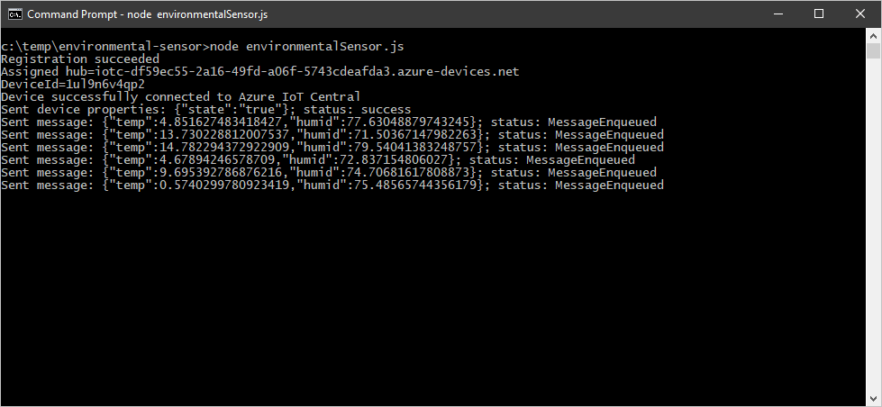
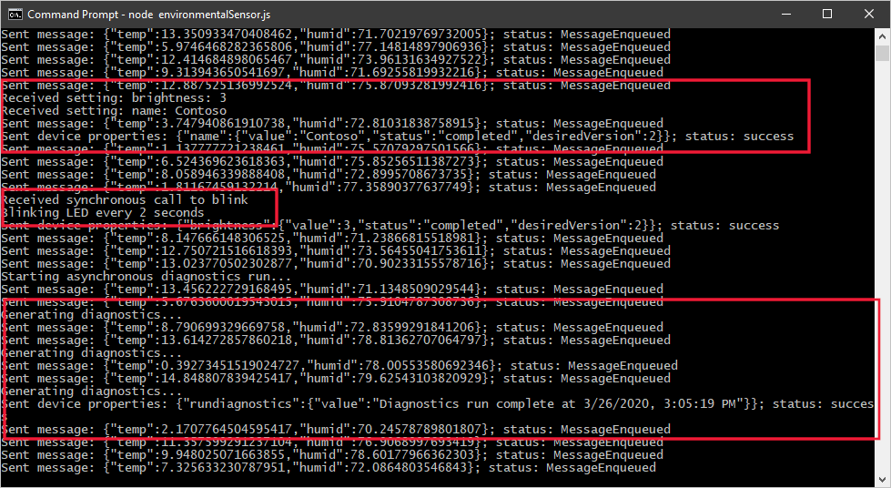

# Tutorial: Create and connect a client application to your Azure IoT Central application (Node.js)

[!INCLUDE [iot-central-selector-tutorial-connect](../../../includes/iot-central-selector-tutorial-connect.md)]

*This article applies to solution builders and device developers.*

This tutorial shows you how, as a device developer, to connect a Node.js client application to your Azure IoT Central application. The Node.js application simulates the behavior of an environmental sensor device. You use a sample _device capability model_ to create a _device template_ in IoT Central. You add views to the device template to enable an operator to interact with a device.

In this tutorial, you learn how to:

> [!div class="checklist"]
> * Import a device capability model to create a device template.
> * Add default and custom views to a device template.
> * Publish a device template and add a real device to your IoT Central application.
> * Create and run the Node.js device code and see it connect to your IoT Central application.
> * View the simulated telemetry sent from the device.
> * Use a view to manage device properties.
> * Call synchronous and asynchronous commands to control the device.

## Prerequisites

To complete the steps in this article, you need the following:

* An Azure IoT Central application created using the **Custom application** template. For more information, see the [create an application quickstart](quick-deploy-iot-central.md).
* A development machine with [Node.js](https://nodejs.org/) version 10.0.0 or later installed. You can run `node --version` in the command line to check your version. The instructions in this tutorial assume you're running the **node** command at the Windows command prompt. However, you can use Node.js on many other operating systems.

[!INCLUDE [iot-central-add-environmental-sensor](../../../includes/iot-central-add-environmental-sensor.md)]

### Create a Node.js application

The following steps show you how to create a Node.js client application that connects to the real device you added to the application. This Node.js application simulates the behavior of a real device.

1. In your command-line environment, navigate to the `environmental-sensor` folder you created previously.

1. To initialize your Node.js project and install the required dependencies, run the following commands - accept all the default options when you run `npm init`:

    ```cmd/sh
    npm init
    npm install azure-iot-device azure-iot-device-mqtt azure-iot-provisioning-device-mqtt azure-iot-security-symmetric-key --save
    ```

1. Create a file called **environmentalSensor.js** in the `environmental-sensor` folder.

1. Add the following `require` statements at the start of the **environmentalSensor.js** file:

    ```javascript
    "use strict";

    // Use the Azure IoT device SDK for devices that connect to Azure IoT Central.
    var iotHubTransport = require('azure-iot-device-mqtt').Mqtt;
    var Client = require('azure-iot-device').Client;
    var Message = require('azure-iot-device').Message;
    var ProvisioningTransport = require('azure-iot-provisioning-device-mqtt').Mqtt;
    var SymmetricKeySecurityClient = require('azure-iot-security-symmetric-key').SymmetricKeySecurityClient;
    var ProvisioningDeviceClient = require('azure-iot-provisioning-device').ProvisioningDeviceClient;
    ```

1. Add the following variable declarations to the file:

    ```javascript
    var provisioningHost = 'global.azure-devices-provisioning.net';
    var idScope = '{your Scope ID}';
    var registrationId = '{your Device ID}';
    var symmetricKey = '{your Primary Key}';
    var provisioningSecurityClient = new SymmetricKeySecurityClient(registrationId, symmetricKey);
    var provisioningClient = ProvisioningDeviceClient.create(provisioningHost, idScope, new ProvisioningTransport(), provisioningSecurityClient);
    var hubClient;

    var targetTemperature = 0;
    var ledOn = true;
    ```

    Update the placeholders `{your Scope ID}`, `{your Device ID}`, and `{your Primary Key}` with the values you made a note of previously. In this sample, you initialize `targetTemperature` to zero, you could use the current reading from the device or a value from the device twin.

1. To send simulated telemetry to your Azure IoT Central application, add the following function to the file:

    ```javascript
    // Send simulated device telemetry.
    function sendTelemetry() {
      var temp = targetTemperature + (Math.random() * 15);
      var humid = 70 + (Math.random() * 10);
      var data = JSON.stringify({
        temp: temp,
        humid: humid,
        });
      var message = new Message(data);
      hubClient.sendEvent(message, (err, res) => console.log(`Sent message: ${message.getData()}` +
        (err ? `; error: ${err.toString()}` : '') +
        (res ? `; status: ${res.constructor.name}` : '')));
    }
    ```

    The names of the telemetry items (`temp` and `humid`) must match the names used in the device template.

1. To send device twin properties to your Azure IoT Central application, add the following function to your file:

    ```javascript
    // Send device twin reported properties.
    function sendDeviceProperties(twin, properties) {
      twin.properties.reported.update(properties, (err) => console.log(`Sent device properties: ${JSON.stringify(properties)}; ` +
        (err ? `error: ${err.toString()}` : `status: success`)));
    }
    ```

    IoT Central uses device twins to synchronize property values between the device and the IoT Central application. Device property values use device twin reported properties. Writeable properties use both device twin reported and desired properties.

1. To define and handle the writeable properties your device responds to, add the following code:

    ```javascript
    // Add any writeable properties your device supports,
    // mapped to a function that's called when the writeable property
    // is updated in the IoT Central application.
    var writeableProperties = {
      'name': (newValue, callback) => {
          setTimeout(() => {
            callback(newValue, 'completed');
          }, 1000);
      },
      'brightness': (newValue, callback) => {
        setTimeout(() => {
            callback(newValue, 'completed');
        }, 5000);
      }
    };

    // Handle writeable property updates that come from IoT Central via the device twin.
    function handleWriteablePropertyUpdates(twin) {
      twin.on('properties.desired', function (desiredChange) {
        for (let setting in desiredChange) {
          if (writeableProperties[setting]) {
            console.log(`Received setting: ${setting}: ${desiredChange[setting].value}`);
            writeableProperties[setting](desiredChange[setting].value, (newValue, status) => {
              var patch = {
                [setting]: {
                  value: newValue,
                  status: status,
                  desiredVersion: desiredChange.$version
                }
              }
              sendDeviceProperties(twin, patch);
            });
          }
        }
      });
    }
    ```

    When the operator sets a writeable property in the IoT Central application, the application uses a device twin desired property to send the value to the device. The device then responds using a device twin reported property. When IoT Central receives the reported property value, it updates the property view with a status of **synced**.

    The names of the properties (`name` and `brightness`) must match the names used in the device template.

1. Add the following code to handle the commands sent from the IoT Central application:

    ```javascript
    // Setup command handlers
    function setupCommandHandlers(twin) {

      // Handle synchronous LED blink command with request and response payload.
      function onBlink(request, response) {
        console.log('Received synchronous call to blink');
        var responsePayload = {
          status: 'Blinking LED every ' + request.payload  + ' seconds'
        }
        response.send(200, responsePayload, (err) => {
          if (err) {
            console.error('Unable to send method response: ' + err.toString());
          } else {
            console.log('Blinking LED every ' + request.payload  + ' seconds');
          }
        });
      }

      // Handle synchronous LED turn on command
      function turnOn(request, response) {
        console.log('Received synchronous call to turn on LED');
        if(!ledOn){
          console.log('Turning on the LED');
          ledOn = true;
        }
        response.send(200, (err) => {
          if (err) {
            console.error('Unable to send method response: ' + err.toString());
          }
        });
      }

      // Handle synchronous LED turn off command
      function turnOff(request, response) {
        console.log('Received synchronous call to turn off LED');
        if(ledOn){
          console.log('Turning off the LED');
          ledOn = false;
        }
        response.send(200, (err) => {
          if (err) {
            console.error('Unable to send method response: ' + err.toString());
          }
        });
      }

      // Handle asynchronous sensor diagnostics command with response payload.
      function diagnostics(request, response) {
        console.log('Starting asynchronous diagnostics run...');
        response.send(202, (err) => {
          if (err) {
            console.error('Unable to send method response: ' + err.toString());
          } else {
            var repetitions = 3;
            var intervalID = setInterval(() => {
              console.log('Generating diagnostics...');
              if (--repetitions === 0) {
                clearInterval(intervalID);
                var properties = {
                  rundiagnostics: {
                    value: 'Diagnostics run complete at ' + new Date().toLocaleString()
                  }
                };
                sendDeviceProperties(twin, properties);
              }
            }, 2000);
          }
        });
      }

      hubClient.onDeviceMethod('blink', onBlink);
      hubClient.onDeviceMethod('turnon', turnOn);
      hubClient.onDeviceMethod('turnoff', turnOff);
      hubClient.onDeviceMethod('rundiagnostics', diagnostics);
    }
    ```

    The names of the commands (`blink`, `turnon`, `turnoff`, and `rundiagnostics`) must match the names used in the device template.

    Currently, IoT Central doesn't use the response schema defined in the device capability model. For a synchronous command, the response payload can be any valid JSON. For an asynchronous command, the device should return a 202 response immediately, followed by reported property update when the work is finished. The format of the reported property update is:

    ```json
    {
      [command name] : {
        value: 'response message'
      }
    }
    ```

    An operator can view the response payload in the command history.

1. Add the following code to complete the connection to Azure IoT Central and hook up the functions in the client code:

    ```javascript
    // Handle device connection to Azure IoT Central.
    var connectCallback = (err) => {
      if (err) {
        console.log(`Device could not connect to Azure IoT Central: ${err.toString()}`);
      } else {
        console.log('Device successfully connected to Azure IoT Central');

        // Send telemetry to Azure IoT Central every 1 second.
        setInterval(sendTelemetry, 1000);

        // Get device twin from Azure IoT Central.
        hubClient.getTwin((err, twin) => {
          if (err) {
            console.log(`Error getting device twin: ${err.toString()}`);
          } else {
            // Send device properties once on device start up.
            var properties = {
              state: 'true'
            };
            sendDeviceProperties(twin, properties);

            handleWriteablePropertyUpdates(twin);

            setupCommandHandlers(twin);
          }
        });
      }
    };

    // Start the device (register and connect to Azure IoT Central).
    provisioningClient.register((err, result) => {
      if (err) {
        console.log('Error registering device: ' + err);
      } else {
        console.log('Registration succeeded');
        console.log('Assigned hub=' + result.assignedHub);
        console.log('DeviceId=' + result.deviceId);
        var connectionString = 'HostName=' + result.assignedHub + ';DeviceId=' + result.deviceId + ';SharedAccessKey=' + symmetricKey;
        hubClient = Client.fromConnectionString(connectionString, iotHubTransport);

        hubClient.open(connectCallback);
      }
    });
    ```

## Run your Node.js application

To start the device client application, run the following command in your command-line environment:

```cmd/sh
node environmentalSensor.js
```

You can see the device connects to your Azure IoT Central application and starts sending telemetry:



[!INCLUDE [iot-central-monitor-environmental-sensor](../../../includes/iot-central-monitor-environmental-sensor.md)]

You can see how the device responds to commands and property updates:



## Next steps

As a device developer, now that you've learned the basics of how to create a device using Node.js, some suggested next steps are to:

* Learn how to connect a real device to IoT Central in the [Connect an MXChip IoT DevKit device to your Azure IoT Central application](./howto-connect-devkit.md) how-to article.
* Read [What are device templates?](./concepts-device-templates.md) to learn more about the role of device templates when you're implementing your device code.
* Read [Get connected to Azure IoT Central](./concepts-get-connected.md) to learn more about how to register devices with IoT Central and how IoT Central secures device connections.

If you'd prefer to continue through the set of IoT Central tutorials and learn more about building an IoT Central solution, see:

> [!div class="nextstepaction"]
> [Create a gateway device template](./tutorial-define-gateway-device-type.md)
