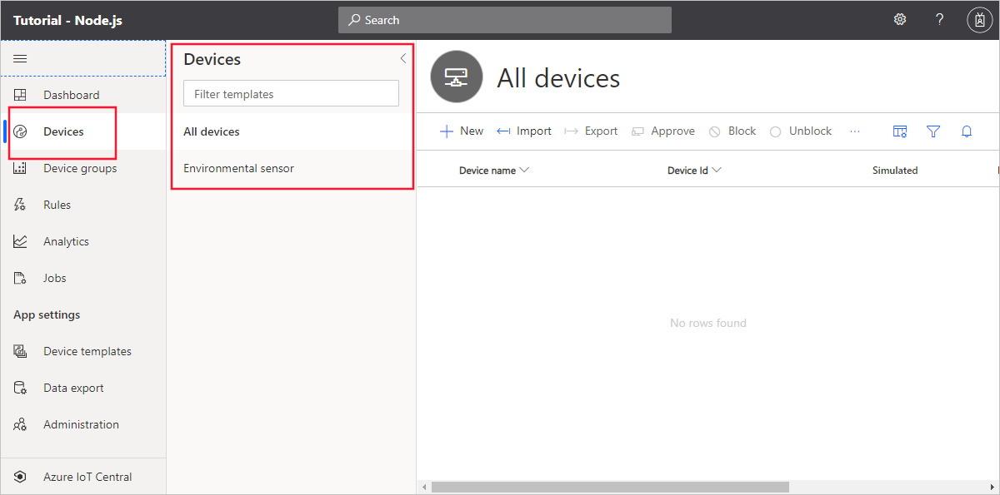
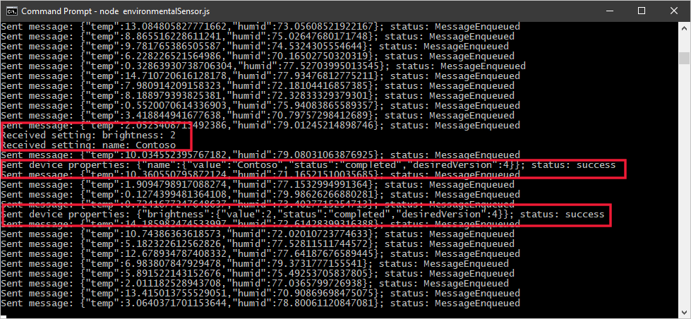
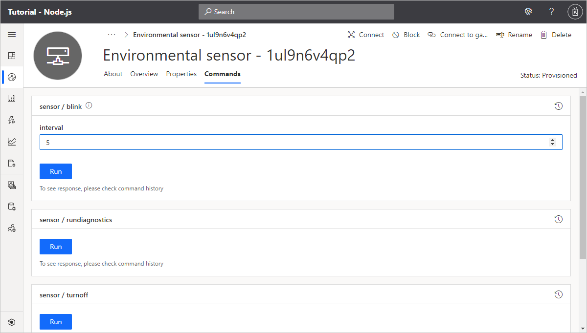
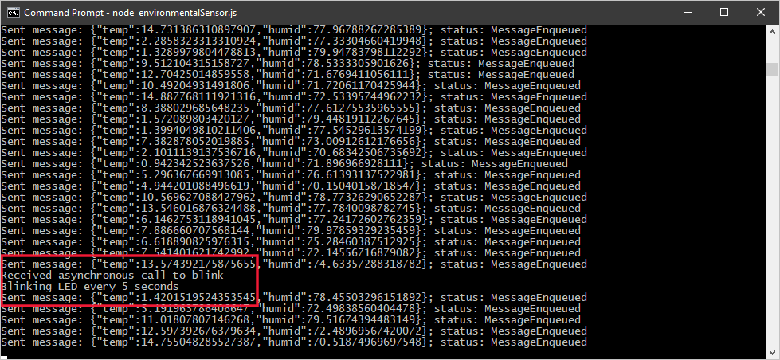

# Tutorial: Create and connect a Node.js client application to your Azure IoT Central application (Node.js)

This tutorial shows you how, as a device developer, to connect a Node.js client application to your Azure IoT Central application. The Node.js application simulates the behavior of a real device. You use a sample _device capability model_ for an environmental sensor device to create a _device template_ in IoT Central. You add views to the device template to let you visualize device telemetry, manage device properties, and use commands to control your devices.

In this tutorial, you learn how to:

> [!div class="checklist"]
> * Import a device capability model to create a device template.
> * Add default and custom views to a device template.
> * Publish a device template and add a real device to your IoT Central application.
> * Create and run the Node.js device code and see it connect to your IoT Central application.
> * View the simulated telemetry the device sends.
> * Use a view to manage device properties.
> * Call commands to control the device.

## Prerequisites

To complete the steps in this article, you need the following:

* An Azure IoT Central application created using the **Custom application **template. For more information, see the [create an application quickstart](quick-deploy-iot-central.md).
* A development machine with [Node.js](https://nodejs.org/) version 10.0.0 or later installed. You can run `node --version` in the command line to check your version. Node.js is available for a wide variety of operating systems. The instructions in this tutorial assume you're running the **node** command at the Windows command prompt. You can use Node.js on a variety of operating systems.

## Create a device template

Create a folder called `environmental-sensor` on your local machine.

Download the [Environmental sensor capability model](https://raw.githubusercontent.com/Azure/IoTPlugandPlay/master/samples/EnvironmentalSensorInline.capabilitymodel.json) JSON file and save it in the `environmental-sensor` folder.

Use a text editor to replace the two instances of `{YOUR_COMPANY_NAME_HERE}` with your company name in the `EnvironmentalSensorInline.capabilitymodel.json` file you downloaded.

In your Azure IoT Central application, create a device template called *Environmental sensor* by importing the `EnvironmentalSensorInline.capabilitymodel.json` device capability model file:


The device capability model includes two interfaces: the standard **Device Information** interface and the custom **Environmental Sensor** interface. The **Environmental Sensor** interface defines the following capabilities:

| Type | Display Name | Description |
| ---- | ------------ | ----------- |
| Property | Device State     | The state of the device. Two states online/offline are available. |
| Property | Customer Name    | The name of the customer currently operating the device. |
| Property | Brightness Level | The brightness level for the light on the device. Can be specified as 1 (high), 2 (medium), 3 (low). |
| Telemetry | Temperature | Current temperature on the device. |
| Telemetry | Humidity    | Current humidity on the device. |
| Command | blink          | Begin blinking the LED for given time interval. |
| Command | turnon         | Turn on the LED light on the device. |
| Command | turnoff        | Turn off the LED light on the device. |
| Command | rundiagnostics | This command starts a diagnostics run. |

To customize how the **Device State** property displays in your IoT Central application, select **Customize** in the device template. Expand the **Device State** entry, enter _Online_ as the **True name** and _Offline_ as the **False name**. Then save the changes:


## Create views

Views let you interact with devices connected to your IoT Central application. For example, you can have views that display telemetry, views that display properties, and views that let you edit writeable and cloud properties. Views are part of a device template.

To add some default views to your **Environmental sensor** device template, navigate to your device template, select **Views**, and select the **Generate Default views** tile. Make sure that **Overview** and **About** are **On**, and then select **Generate default dashboard views**. You now have two default views defined in your template.

The **Environmental Sensor** interface includes two writeable properties - **Customer Name** and **Brightness Level**. To create a view, you can use to edit these properties:

1. Select **Views** and then select the **Editing device and cloud data** tile.

1. Enter _Properties_ as the form name.

1. Select the **Brightness Level** and **Customer Name** properties. Then select **Add section**.

1. Save your changes.


## Publish the template

Before you add a device to your IoT Central application that uses the **Environmental sensor** device template, you need to publish the template.

In the device template, select **Publish**. On the panel that shows the changes to be published, select **Publish**.

To check that the template is ready to use, navigate to the **Devices** page in your IoT Central application. The **Devices** section shows a list of the published devices in the application:



## Add a real device

In your Azure IoT Central application, add a real device to the device template you created in the previous section:

1. On the **Devices** page, select the **Environmental sensor** device template.

1. Select **+ New**.

1. Make sure that **Simulated** is **Off**. Then select **Create**.

Click on the device name, and then select **Connect**. Make a note of the device connection information on the **Device Connection** page - **ID scope**, **Device ID**, and **Primary key**. You need these values when you create your device code:


### Create a Node.js application

The following steps show you how to create a Node.js client application that implements the real device you added to the application. This Node.js application simulates the behavior of a real device.

1. In your command-line environment, navigate to the `environmental-sensor` folder you created previously.

1. To initialize your Node.js project and install the required dependencies, run the following commands - accept all the default options when you run `npm init`:

    ```cmd/sh
    npm init
    npm install azure-iot-device azure-iot-device-mqtt azure-iot-provisioning-device-mqtt azure-iot-security-symmetric-key --save
    ```

1. Create a file called **environmentalSensor.js** in the `environmental-sensor` folder.

1. Add the following `require` statements at the start of the **environmentalSensor.js** file:

    ```javascript
    "use strict";

    // Use the Azure IoT device SDK for devices that connect to Azure IoT Central.
    var iotHubTransport = require('azure-iot-device-mqtt').Mqtt;
    var Client = require('azure-iot-device').Client;
    var Message = require('azure-iot-device').Message;
    var ProvisioningTransport = require('azure-iot-provisioning-device-mqtt').Mqtt;
    var SymmetricKeySecurityClient = require('azure-iot-security-symmetric-key').SymmetricKeySecurityClient;
    var ProvisioningDeviceClient = require('azure-iot-provisioning-device').ProvisioningDeviceClient;
    ```

1. Add the following variable declarations to the file:

    ```javascript
    var provisioningHost = 'global.azure-devices-provisioning.net';
    var idScope = '{your Scope ID}';
    var registrationId = '{your Device ID}';
    var symmetricKey = '{your Primary Key}';
    var provisioningSecurityClient = new SymmetricKeySecurityClient(registrationId, symmetricKey);
    var provisioningClient = ProvisioningDeviceClient.create(provisioningHost, idScope, new ProvisioningTransport(), provisioningSecurityClient);
    var hubClient;
    var targetTemperature = 0;
    var ledOn = true;
    ```

    Update the placeholders `{your Scope ID}`, `{your Device ID}`, and `{your Primary Key}` with the values you made a note of previously. In this sample, you initialize `targetTemperature` to zero, you could use the current reading from the device or a value from the device twin.

1. To send telemetry to your Azure IoT Central application, add the following function to the file:

    ```javascript
    // Send device measurements.
    function sendTelemetry() {
      var temp = targetTemperature + (Math.random() * 15);
      var humid = 70 + (Math.random() * 10);
      var data = JSON.stringify({
        temp: temp,
        humid: humid,
        });
      var message = new Message(data);
      hubClient.sendEvent(message, (err, res) => console.log(`Sent message: ${message.getData()}` +
        (err ? `; error: ${err.toString()}` : '') +
        (res ? `; status: ${res.constructor.name}` : '')));
    }
    ```

1. To send device properties to your Azure IoT Central application, add the following function to your file:

    ```javascript
    // Send device reported properties.
    function sendDeviceProperties(twin, properties) {
      twin.properties.reported.update(properties, (err) => console.log(`Sent device properties: ${JSON.stringify(properties)}; ` +
        (err ? `error: ${err.toString()}` : `status: success`)));
    }
    ```

1. To define and handle the writeable properties your device responds to, add the following code:

    ```javascript
    // Add any writeable properties your device supports,
    // mapped to a function that is called when the setting is changed.
    var settings = {
      'name': (newValue, callback) => {
          setTimeout(() => {
            callback(newValue, 'completed');
          }, 1000);
      },
      'brightness': (newValue, callback) => {
        setTimeout(() => {
            callback(newValue, 'completed');
      }, 5000);
      }
    };

    // Handle writeable property changes that come from Azure IoT Central via the device twin.
    function handleSettings(twin) {
      twin.on('properties.desired', function (desiredChange) {
        for (let setting in desiredChange) {
          if (settings[setting]) {
            console.log(`Received setting: ${setting}: ${desiredChange[setting].value}`);
            settings[setting](desiredChange[setting].value, (newValue, status, message) => {
              var patch = {
                [setting]: {
                  value: newValue,
                  status: status,
                  desiredVersion: desiredChange.$version,
                  message: message
                }
              }
              sendDeviceProperties(twin, patch);
            });
          }
        }
      });
    }
    ```

1. Add the following code to handle the commands sent from the IoT Central application:

    ```javascript
    // Handle blink command
    function onBlink(request, response) {
      console.log('Received asynchronous call to blink');
      response.send(200, (err) => {
        if (err) {
          console.error('Unable to send method response: ' + err.toString());
        } else {
          console.log('Blinking LED every ' + request.payload  + ' seconds');
        }
      });
    }

    // Handle LED turn on command
    function turnOn(request, response) {
      console.log('Received synchronous call to turn on LED');
      if(!ledOn){
        console.log('Turning on the LED');
        ledOn = true;
      }
      response.send(200, (err) => {
        if (err) {
          console.error('Unable to send method response: ' + err.toString());
        }
      });
    }

    // Handle LED turn off command
    function turnOff(request, response) {
      console.log('Received synchronous call to turn off LED');
      if(ledOn){
        console.log('Turning off the LED');
        ledOn = false;
      }
      response.send(200, (err) => {
        if (err) {
          console.error('Unable to send method response: ' + err.toString());
        }
      });
    }

    // Handle sensor diagnostics command
    function diagnostics(request, response) {
      console.log('Received asynchronous call to run diagnostics');
      response.send(200, (err) => {
        if (err) {
          console.error('Unable to send method response: ' + err.toString());
        } else {
          console.log('Running diagnostics...');
        }
      });
    }
    ```

1. Add the following code to complete the connection to Azure IoT Central and hook up the functions in the client code:

    ```javascript
    // Handle device connection to Azure IoT Central.
    var connectCallback = (err) => {
      if (err) {
        console.log(`Device could not connect to Azure IoT Central: ${err.toString()}`);
      } else {
        console.log('Device successfully connected to Azure IoT Central');
        // Create handlers for commands
        hubClient.onDeviceMethod('blink', onBlink);
        hubClient.onDeviceMethod('turnon', turnOn);
        hubClient.onDeviceMethod('turnoff', turnOff);
        hubClient.onDeviceMethod('rundiagnostics', diagnostics);
        // Send telemetry measurements to Azure IoT Central every 1 second.
        setInterval(sendTelemetry, 1000);
        // Get device twin from Azure IoT Central.
        hubClient.getTwin((err, twin) => {
          if (err) {
            console.log(`Error getting device twin: ${err.toString()}`);
          } else {
            // Send Environmental Sensor device properties once on device start up.
            var properties = {
              state: 'true'
            };
            sendDeviceProperties(twin, properties);
            handleSettings(twin);
          }
        });
      }
    };

    // Start the device (register and connect to Azure IoT Central).
    provisioningClient.register((err, result) => {
      if (err) {
        console.log('Error registering device: ' + err);
      } else {
        console.log('Registration succeeded');
        console.log('Assigned hub=' + result.assignedHub);
        console.log('DeviceId=' + result.deviceId);
        var connectionString = 'HostName=' + result.assignedHub + ';DeviceId=' + result.deviceId + ';SharedAccessKey=' + symmetricKey;
        hubClient = Client.fromConnectionString(connectionString, iotHubTransport);
        hubClient.open(connectCallback);
      }
    });
    ```

## Run your Node.js application

To start the device client application, run the following command in your command-line environment:

```cmd/sh
node environmentalSensor.js
```

You can see the device connects to your Azure IoT Central application and starts sending telemetry:


As an operator in your Azure IoT Central application, you can:

* View the telemetry sent by the device on the **Overview** page:

    

* Update writeable property values on the **Properties** page:

    

    

* Call the commands from the **Commands** page:

    

    

* View the device properties on the **About** page:

    

## Next steps

To learn more about device capability models and how to create your own device templates, continue to the how-to guide:

> [!div class="nextstepaction"]
> [Define a new IoT device type](./howto-set-up-template.md)
