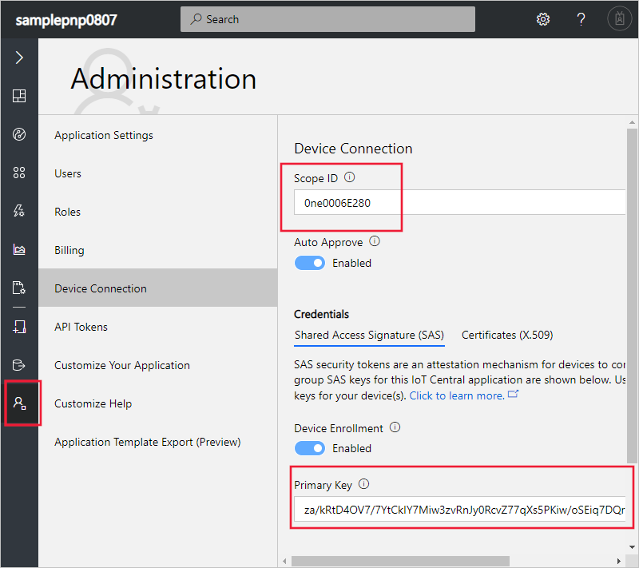

# Tutorial: Use a device capability model to create an IoT Plug and Play device and connect it to your IoT Central application

[!INCLUDE [iot-central-pnp-original](../../../includes/iot-central-pnp-original-note.md)]

A _device capability model_ (DCM) describes the capabilities of an [IoT Plug and Play](../../iot-pnp/overview-iot-plug-and-play.md) device. IoT Central can use a DCM to create a device template and visualizations for a device when the device connects for the first time.

In this tutorial, you learn how to:

> [!div class="checklist"]
> * Use Visual Studio Code to create an IoT Plug and Play device using a DCM.
> * Run the device code in Windows and see it connect to your IoT Central application.
> * View the simulated telemetry the device sends.

## Prerequisites

Complete the [Create an Azure IoT Central application (preview features)](./quick-deploy-iot-central-pnp.md?toc=/azure/iot-central-pnp/toc.json&bc=/azure/iot-central-pnp/breadcrumb/toc.json) quickstart to create an IoT Central application using the **Custom app > Preview application** template.

To complete this tutorial, you need to install the following software on your local machine:

* [Visual Studio (Community, Professional, or Enterprise)](https://visualstudio.microsoft.com/downloads/) - make sure that you include the **NuGet package manager** component and the **Desktop Development with C++** workload when you install Visual Studio.
* [Git](https://git-scm.com/download/).
* [CMake](https://cmake.org/download/) - when you install **CMake**, select the option **Add CMake to the system PATH**.
* [Visual Studio Code](https://code.visualstudio.com/).
* [Node.js](https://nodejs.org/)
* The `dps-keygen` utility:

    ```cmd/sh
    npm i -g dps-keygen
    ```

### Install Azure IoT Tools

Use the following steps to install the Azure IoT Tools extension pack in VS Code:

1. In VS Code, select the **Extensions** tab.
1. Search for **Azure IoT Tools**.
1. Select **Install**.

## Prepare the development environment

### Get Azure IoT device SDK for C

Prepare a development environment you can use to  build the Azure IoT C device SDK.

1. Open a command prompt. Execute the following command to clone the [Azure IoT C SDK](https://github.com/Azure/azure-iot-sdk-c) GitHub repository:

    ```cmd/sh
    git clone https://github.com/Azure/azure-iot-sdk-c --recursive -b public-preview
    ```

    You should expect this operation to take several minutes to complete.

1. Create a `central_app` folder in the root of the local clone of the repository. You use this folder for the device model files and device code stub.

    ```cmd/sh
    cd azure-iot-sdk-c
    mkdir central_app
    ```

## Generate device key

To connect a device to an IoT Central application, you need a device key. To generate a device key:

1. Sign in to the IoT Central application you created using the **Custom app > Preview application** template in the [Create an Azure IoT Central application (preview features)](./quick-deploy-iot-central-pnp.md?toc=/azure/iot-central-pnp/toc.json&bc=/azure/iot-central-pnp/breadcrumb/toc.json) quickstart.

1. Go to the **Administration** page and select **Device Connection**.

1. Make a note of the **ID Scope** and the **Primary Key** you see when you select **View Keys**. You use these values later in this tutorial.

    

1. Open a command prompt and run the following command to generate a device key:

    ```cmd/sh
    dps-keygen  -di:mxchip-01 -mk:{Primary Key from previous step}
    ```

    Make a note of the generated _device key_, you use this value in a later step in this tutorial.

## Download your model

In this tutorial, you use the public DCM for an MxChip IoT DevKit device. You don't need an actual DevKit device to run the code, in this tutorial you compile the code to run on Windows.

1. Open `azure-iot-sdk-c\central_app` folder with VS Code.

1. Use **Ctrl+Shift+P** to open the command palette, enter **IoT Plug and Play**, and select **Open Model Repository**. Select **Public repository**. VS Code shows a list of the DCMs in the public model repository.

1. Select the **MXChip IoT DevKit** DCM with ID `urn:mxchip:mxchip_iot_devkit:1`. Then select **Download**. You now have a copy of the DCM in the `central_app` folder.


> [!NOTE]
> To work with IoT Central, the device capability model must have all the interfaces defined inline in the same file.

## Generate the C code stub

Now you have the **MXChip IoT DevKit** DCM and its associated interfaces, you can generate the device code that implements the model. To generate the C code stub in VS code:

1. With the folder with DCM files open, use **Ctrl+Shift+P** to open the command palette, enter **IoT Plug and Play**, and select **Generate Device Code Stub**.

    > [!NOTE]
    > The first time you use the IoT Plug and Play Code Generator utility, it takes a few seconds to download.

1. Select the **MXChip IoT DevKit** DCM file you just downloaded.

1. Enter the project name **devkit_device**.

1. Choose **ANSI C** as your language.

1. Choose **CMake Project** as your project type. Don't choose **MXChip IoT DevKit Project**, this option is for when you have a real DevKit device.

1. Choose **Via DPS (Device Provisioning Service) symmetric key** as the connection method.

1. VS Code opens a new window with generated device code stub files in the `devkit_device` folder.


## Build the code

You use the device SDK to build the generated device code stub. The application you build simulates an **MXChip IoT DevKit** device and connects to your IoT Central application. The application sends telemetry and properties, and receives commands.

1. In VS Code, open the `CMakeLists.txt` file in the `azure-iot-sdk-c` folder. Make sure you open the `CMakeLists.txt` file in the `azure-iot-sdk-c` folder, not the one in the `devkit_device` folder.

1. Add the line below at the bottom of the `CMakeLists.txt` file to include the device code stub folder when compiling:

    ```txt
    add_subdirectory(central_app/devkit_device)
    ```

1. Create a `cmake` folder in the `azure-iot-sdk-c` folder, and navigate to that folder at a command prompt:

    ```cmd\sh
    mkdir cmake
    cd cmake
    ```

1. Run the following commands to build the device SDK and the generated code stub:

    ```cmd\sh
    cmake .. -Duse_prov_client=ON -Dhsm_type_symm_key:BOOL=ON
    cmake --build . -- /m /p:Configuration=Release
    ```

1. After the build completes successfully, at the same command prompt run your application. Replace `scopeid`, `primarykey` with the values you noted previously :

    ```cmd\sh
    .\central_app\devkit_device\Release\devkit_device.exe scopeid primarykey mxchip-001
    ```

1. The device application starts sending data to your IoT Central application.

## View the device

After your device code connects to your IoT Central, you can view the properties and telemetry it sends:

1. In your IoT Central application, go to the **Devices** page and select the **mxchip-01** device. This device was automatically added when the device code connected:

    

    After a couple of minutes, this page shows charts of the telemetry the device is sending.

1. Select the **About** page to see the property values the device sent.

1. Select the **Commands** page to call commands on the device. You can see the device responding at the command prompt that's running the device code.

1. Go to the **Device templates** page to see the template that IoT Central created from the DCM in the public repository:

    

## Next steps

In this tutorial, you learned how to connect an IoT Plug and Play device that was generated from a DCM in the public model repository.

To learn more about DCMs and how to create your own models, continue to the how-to guide:

> [!div class="nextstepaction"]
> [Create a device group](./tutorial-use-device-groups-pnp.md?toc=/azure/iot-central-pnp/toc.json&bc=/azure/iot-central-pnp/breadcrumb/toc.json)
