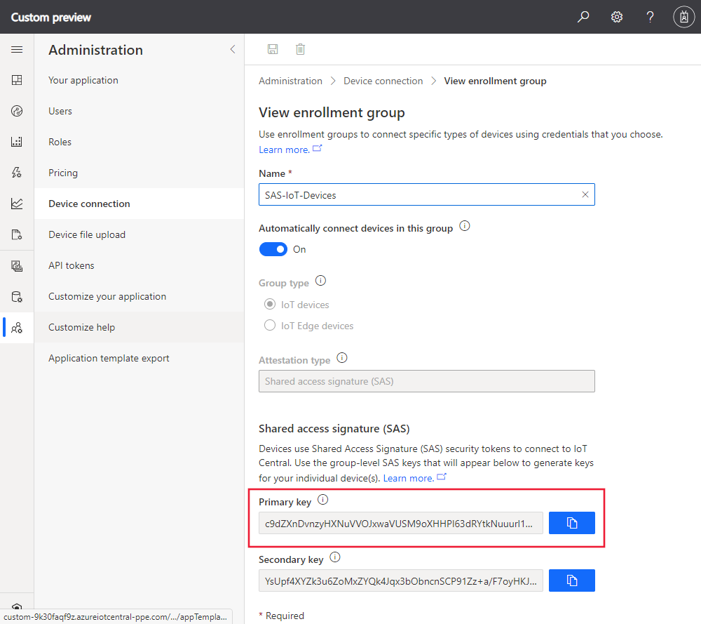
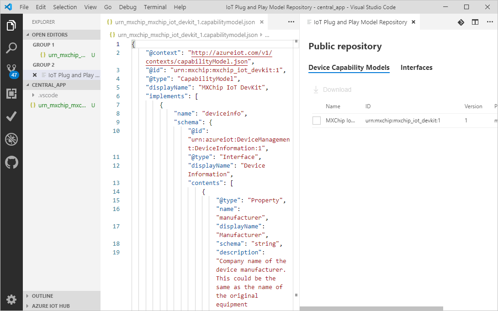
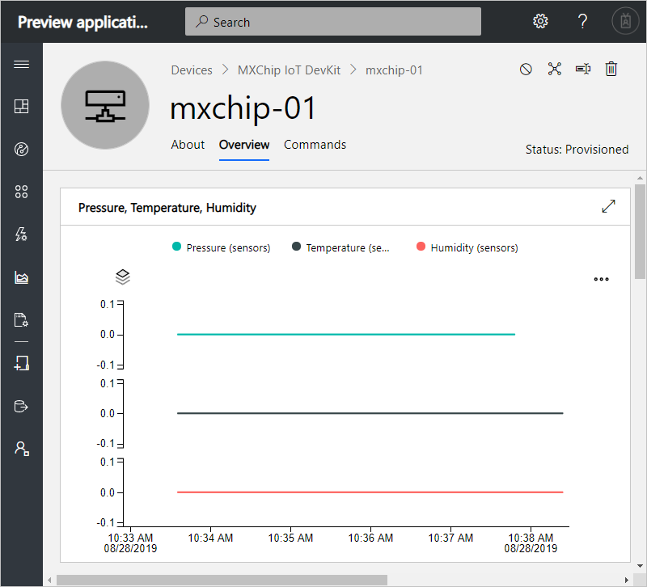

# Tutorial: Use a device capability model to create an IoT Plug and Play (preview) device and connect it to your IoT Central application

A _device capability model_ (DCM) describes the capabilities of an [IoT Plug and Play (preview)](../../iot-pnp/overview-iot-plug-and-play.md) device. IoT Central can use a DCM to create a device template and visualizations for a device when the device connects for the first time.

Support for [IoT Plug and Play](../../iot-pnp/overview-iot-plug-and-play.md) is in preview and is only supported only in selected regions.

In this tutorial, you learn how to:

> [!div class="checklist"]
> * Use Visual Studio Code to create an IoT Plug and Play (preview) device using a DCM.
> * Run the device code in Windows and see it connect to your IoT Central application.
> * View the simulated telemetry the device sends.

## Prerequisites

Complete the [Create an Azure IoT Central application](./quick-deploy-iot-central.md) quickstart to create an IoT Central application using the **Custom app > Custom application** template.

To complete this tutorial, you need to install the following software on your local machine:

* [Build Tools for Visual Studio](https://visualstudio.microsoft.com/thank-you-downloading-visual-studio/?sku=BuildTools&rel=16) with **C++ build tools** and **Nuget package manager component** workloads. Or if you already have [Visual Studio (Community, Professional, or Enterprise)](https://visualstudio.microsoft.com/downloads/) 2019, 2017 or 2015 with same workloads installed.
* [Git](https://git-scm.com/download/).
* [CMake](https://cmake.org/download/) - when you install **CMake**, select the option **Add CMake to the system PATH**.
* [Visual Studio Code](https://code.visualstudio.com/).
* [Node.js](https://nodejs.org/)
* The `dps-keygen` utility:

    ```cmd/sh
    npm i -g dps-keygen
    ```

### Install Azure IoT Tools

Use the following steps to install the Azure IoT Tools extension pack in VS Code:

1. In VS Code, select the **Extensions** tab.
1. Search for **Azure IoT Tools**.
1. Select **Install**.

## Prepare the development environment

In this tutorial, you use the [Vcpkg](https://github.com/microsoft/vcpkg) library manager to install the Azure IoT C device SDK in your development environment.

1. Open a command prompt. Execute the following command to install Vcpkg:

    ```cmd
    git clone https://github.com/Microsoft/vcpkg.git
    cd vcpkg

    .\bootstrap-vcpkg.bat
    ```

    Then, to hook up user-wide [integration](https://github.com/microsoft/vcpkg/blob/master/docs/users/integration.md), run the following command. The first time you run this command it requires administrative rights:

    ```cmd
    .\vcpkg.exe integrate install
    ```

1. Install Azure IoT C device SDK Vcpkg:

    ```cmd
    .\vcpkg.exe install azure-iot-sdk-c[public-preview,use_prov_client]
    ```

## Generate device key

To connect a device to an IoT Central application, you need a device key. To generate a device key:

1. Sign in to the IoT Central application you created using the **Custom application** template in the [Create an Azure IoT Central application](./quick-deploy-iot-central.md) quickstart.

1. Go to the **Administration** page and select **Device Connection**.

1. Make a note of the **ID Scope** and the **Primary Key** you see when you select **View Keys**. You use these values later in this tutorial.

    

1. Open a command prompt and run the following command to generate a device key:

    ```cmd/sh
    dps-keygen -di:mxchip-001 -mk:{Primary Key from previous step}
    ```

    Make a note of the generated _device key_, you use this value in a later step in this tutorial.

## Download your model

In this tutorial, you use the public DCM for an MxChip IoT DevKit device. You don't need an actual DevKit device to run the code, in this tutorial you compile the code to run on Windows.

1. Create a folder called `central_app` and open it in VS Code.

1. Use **Ctrl+Shift+P** to open the command palette, enter **IoT Plug and Play**, and select **Open Model Repository**. Select **Public repository**. VS Code shows a list of the DCMs in the public model repository.

1. Select the **MXChip IoT DevKit** DCM with ID `urn:mxchip:mxchip_iot_devkit:1`. Then select **Download**. You now have a copy of the DCM in the `central_app` folder.



> [!NOTE]
> To work with IoT Central, the device capability model must have all the interfaces defined inline in the same file.

## Generate the C code stub

Now you have the **MXChip IoT DevKit** DCM and its associated interfaces, you can generate the device code that implements the model. To generate the C code stub in VS code:

1. With the folder with DCM files open, use **Ctrl+Shift+P** to open the command palette, enter **IoT Plug and Play**, and select **Generate Device Code Stub**.

    > [!NOTE]
    > The first time you use the IoT Plug and Play Code Generator utility, it takes a few seconds to download.

1. Select the **MXChip IoT DevKit** DCM file you just downloaded.

1. Enter the project name **devkit_device**.

1. Choose **ANSI C** as your language.

1. Choose **Via DPS (Device Provisioning Service) symmetric key** as the connection method.

1. Choose **CMake Project on Windows** as your project type. Don't choose **MXChip IoT DevKit Project**, this option is for when you have a real DevKit device.

1. Choose **Via Vcpkg** as the way to include the SDK.

1. VS Code opens a new window with generated device code stub files in the `devkit_device` folder.


## Build the code

You use the device SDK to build the generated device code stub. The application you build simulates an **MXChip IoT DevKit** device and connects to your IoT Central application. The application sends telemetry and properties, and receives commands.

1. At a command prompt, create a `cmake` subdirectory in the `devkit_device` folder, and navigate to that folder:

    ```cmd
    mkdir cmake
    cd cmake
    ```

1. Run the following commands to build the generated code stub. Replace the `<directory of your Vcpkg repo>` placeholder with the path to your copy of the **Vcpkg** repository:

    ```cmd
    cmake .. -G "Visual Studio 16 2019" -A Win32 -Duse_prov_client=ON -Dhsm_type_symm_key:BOOL=ON -DCMAKE_TOOLCHAIN_FILE="<directory of your Vcpkg repo>\scripts\buildsystems\vcpkg.cmake"

    cmake --build . -- /p:Configuration=Release
    ```

    If you're using Visual Studio 2017 or 2015, you need to specify the CMake generator based on the build tools you're using:

    ```cmd
    # Either
    cmake .. -G "Visual Studio 15 2017" -Duse_prov_client=ON -Dhsm_type_symm_key:BOOL=ON -DCMAKE_TOOLCHAIN_FILE="<directory of your Vcpkg repo>\scripts\buildsystems\vcpkg.cmake"
    # or
    cmake .. -G "Visual Studio 14 2015" -Duse_prov_client=ON -Dhsm_type_symm_key:BOOL=ON -DCMAKE_TOOLCHAIN_FILE="<directory of your Vcpkg repo>\scripts\buildsystems\vcpkg.cmake"
    ```

1. After the build completes successfully, at the same command prompt run your application. Replace `<scopeid>` and `<devicekey>` with the values you noted previously:

    ```cmd
    .\Release\devkit_device.exe mxchip-001 <scopeid> <devicekey>
    ```

1. The device application starts sending data to IoT Hub. Sometimes you see the error `Error registering device for DPS` the first time you run the previous command. If you see this error, retry the command.

## View the device

After your device code connects to your IoT Central, you can view the properties and telemetry it sends:

1. In your IoT Central application, go to the **Devices** page and select the **mxchip-01** device. This device was automatically added when the device code connected:

    

    After a couple of minutes, this page shows charts of the telemetry the device is sending.

1. Select the **About** page to see the property values the device sent.

1. Select the **Commands** page to call commands on the device. You can see the device responding at the command prompt that's running the device code.

1. Go to the **Device templates** page to see the template that IoT Central created from the DCM in the public repository:

    

## Next steps

In this tutorial, you learned how to connect an IoT Plug and Play (preview) device that was generated from a DCM in the public model repository.

To learn more about DCMs and how to create your own models, continue to the how-to guide:

> [!div class="nextstepaction"]
> [Define a new IoT device type](./howto-set-up-template.md)
