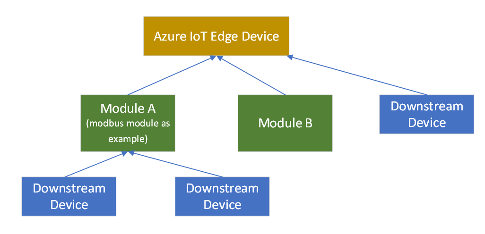
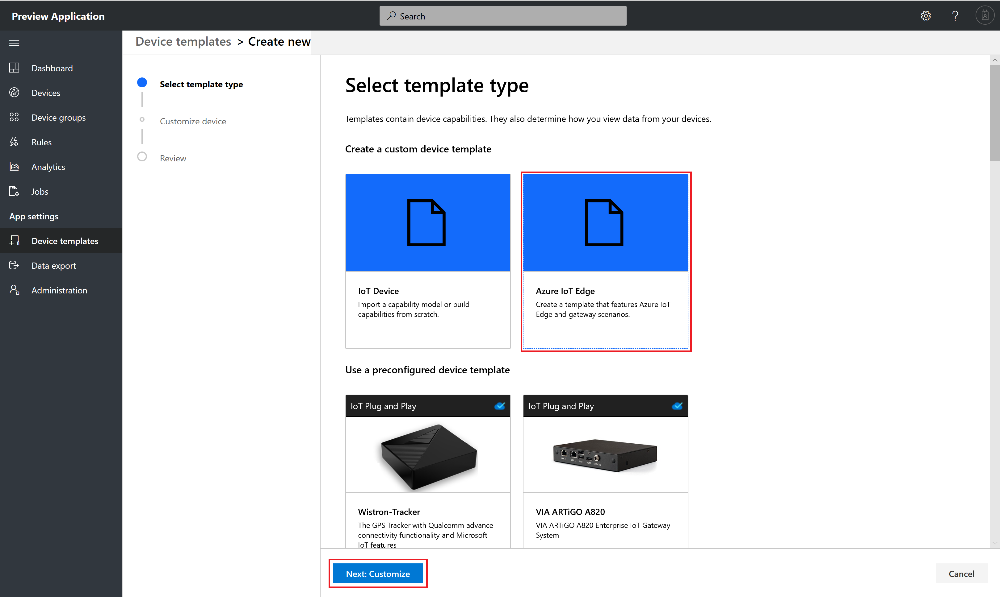
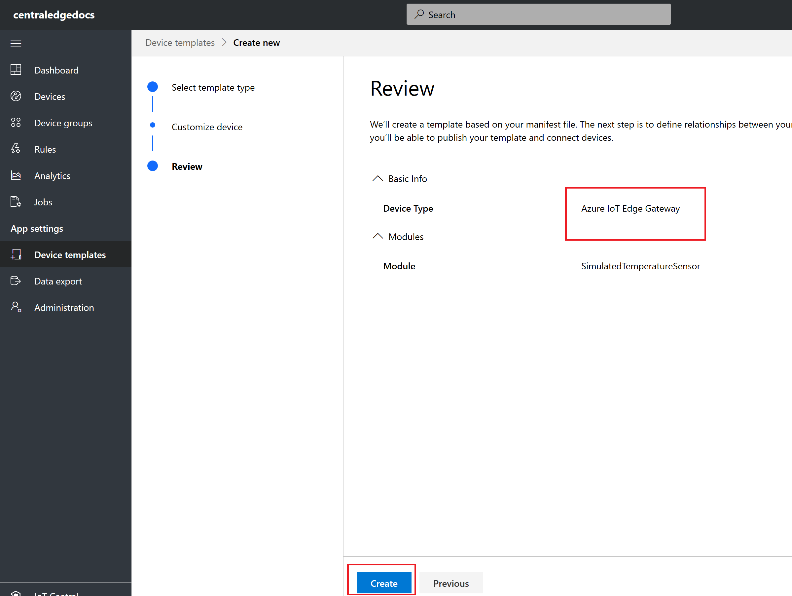
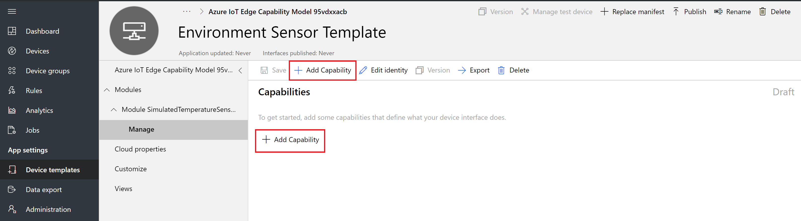
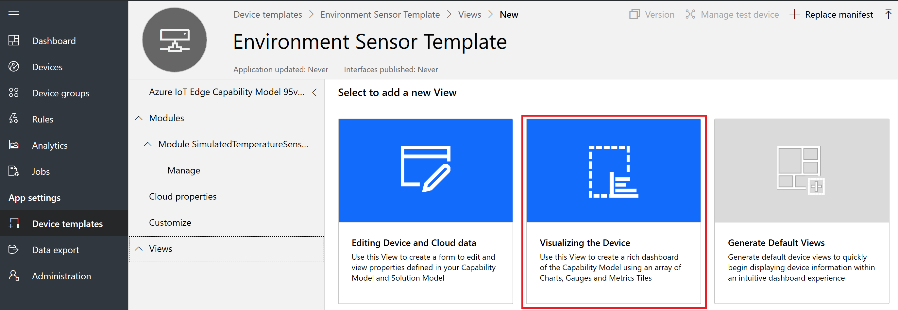

# Tutorial: Define a new Azure IoT Edge device type in your Azure IoT Central application (preview features)

[!INCLUDE [iot-central-pnp-original](../../../includes/iot-central-pnp-original-note.md)]

This tutorial shows you, as a builder, how to use a device template to define a new type of Azure IoT Edge device in your Azure IoT Central application. 

To get an overview of Azure IoT Edge, [refer this article](overview-iot-central-pnp.md). 

Azure IoT Edge is made up of three components:
* **IoT Edge modules** are containers that run Azure services, third-party services, or your own code. Modules are deployed to IoT Edge devices and execute locally on those devices.
* The **IoT Edge runtime** runs on each IoT Edge device and manages the modules deployed to each device.
* A **cloud-based interface** enables you to remotely monitor and manage IoT Edge devices. IoT Central will be the cloud interface.

An **Azure IoT Edge** device can be a gateway device with downstream devices connecting into the Azure IoT Edge device. Downstream device connectivity patterns will be discussed in this tutorial.

A **device template** defines the capabilities of your device & IoT Edge modules. Capabilities include telemetry the module sends, module properties, and the commands a module responds to.

In this tutorial, you create an **Environment Sensor** device template. An environmental sensor device:

* Sends telemetry such as temperature.
* Responds to writeable properties when updated in the cloud such as telemetry send interval.
* Responds to commands such as resetting temperature.

Also in this tutorial, you create an **Environment Gateway** device template. An environmental gateway device:

* Sends telemetry such as temperature.
* Responds to writeable properties when updated in the cloud such as telemetry send interval.
* Responds to commands such as resetting temperature.
* Allows relationships to other device capability models


In this tutorial, you learn how to:

> [!div class="checklist"]
> * Create a new Azure IoT Edge device device template.
> * Upload a deployment manifest.
> * Create capabilities including telemetry, properties and commands for each module
> * Define a visualization for the module telemetry.
> * Add relationships to downstream device templates
> * Publish your device template.

## Prerequisites

To complete this tutorial, you need an Azure IoT Central application. Follow this quickstart to [Create an Azure IoT Central application](quick-deploy-iot-central-pnp.md?toc=/azure/iot-central-pnp/toc.json&bc=/azure/iot-central-pnp/breadcrumb/toc.json).


## Downstream device relationships with gateway & modules

Downstream devices can connect to Azure IoT Edge gateway device through the $edgeHub module. This Azure IoT Edge device becomes a transparent gateway in this scenario


Downstream devices can connect to Azure IoT Edge gateway device through a custom module. In the scenario below downstream devices are connecting through a Modbus custom module and Downstream devices can connect to Azure IoT Edge gateway device through the $edgeHub module.


Downstream devices can connect to Azure IoT Edge gateway device through a custom module. In the scenario below downstream devices are connecting through a Modbus custom module. 



Downstream devices can connect to Azure IoT Edge gateway device through multiple custom modules. In the scenario below downstream devices are connecting through a Modbus custom module, BLE custom module and Downstream devices can connect to Azure IoT Edge gateway device through the $edgeHub module. 


## Create a template

As a builder, you can create and edit Azure IoT Edge device templates in your application. After you publish a device template, you can connect real devices that implement the device template.

### Select device template type 

To add a new device template to your application, go to the **Device Templates** page. To do so select the **Device Templates** tab on the left pane.


Click **+ New** to start creating a new device template.


You will land on device template type selection page. Select **Azure IoT Edge** Tile and click **Next: Customize** button at the bottom



### Customize device template

Azure IoT Edge lets you deploy and manage business logic in the form of modules. **Azure IoT Edge modules** are the smallest unit of computation managed by IoT Edge, and can contain Azure services (such as Azure Stream Analytics) or your own solution-specific code. To understand how modules are developed, deployed, and maintained read [IoT Edge Modules](../../iot-edge/iot-edge-modules.md).

At a high level, a deployment manifest is a list of module twins that are configured with their desired properties. A deployment manifest tells an IoT Edge device (or a group of devices) which modules to install and how to configure them. Deployment manifests include the desired properties for each module twin. IoT Edge devices report back the reported properties for each module.

Use Visual Studio Code to create a deployment manifest. Follow documentation on how to create a [deployment manifest](https://marketplace.visualstudio.com/items?itemName=vsciot-vscode.azure-iot-edge).

Here's a basic deployment manifest with one module as an example to be used for this tutorial. Copy the below JSON and save it as .json file. 

   ```JSON
   {
     "modulesContent": {
       "$edgeAgent": {
         "properties.desired": {
           "schemaVersion": "1.0",
           "runtime": {
             "type": "docker",
             "settings": {
               "minDockerVersion": "v1.25",
               "loggingOptions": "",
               "registryCredentials": {}
             }
           },
           "systemModules": {
             "edgeAgent": {
               "type": "docker",
               "settings": {
                 "image": "mcr.microsoft.com/azureiotedge-agent:1.0",
                 "createOptions": "{}"
               }
             },
             "edgeHub": {
               "type": "docker",
               "status": "running",
               "restartPolicy": "always",
               "settings": {
                 "image": "mcr.microsoft.com/azureiotedge-hub:1.0",
                 "createOptions": "{}"
               }
             }
           },
           "modules": {
             "SimulatedTemperatureSensor": {
               "version": "1.0",
               "type": "docker",
               "status": "running",
               "restartPolicy": "always",
               "settings": {
                 "image": "mcr.microsoft.com/azureiotedge-simulated-temperature-sensor:1.0",
                 "createOptions": "{}"
               }
             }
           }
         }
       },
       "$edgeHub": {
         "properties.desired": {
           "schemaVersion": "1.0",
           "routes": {
               "route": "FROM /* INTO $upstream"
           },
           "storeAndForwardConfiguration": {
             "timeToLiveSecs": 7200
           }
         }
       },
       "SimulatedTemperatureSensor": {
         "properties.desired": {
              "SendData": true,
              "SendInterval": 10
         }
       }
     }
   }
   ```

**Upload an Azure IoT Edge deployment manifest**

Click  **Browse** button 


If you plan to create an Azure IoT Edge Gateway device template make sure to select **Gateway device with downstream devices** checkbox


You will be presented with a file selection dialog. Select the deployment manifest file and click **Open** button.

Deployment Manifest file will be validated against a schema. After successful validation click on **Review** button


Below is the flow of a Deployment Manifest life cycle in IoT Central.


Review page is displayed with details of the deployment manifest. List of modules from the deployment manifest will be displayed on the review page. In this tutorial, you will see SimulatedTemperatureSensor module listed. Click **Create** button.


If you would have selected gateway device you will see this review page




Creating a new device template spinner will be displayed which the device template is being created in IoT Central.

Device template is created with module capability models. In this tutorial, you will see SimulatedTemperatureSensor module capability model create. 

Change title of the device template to Environment Sensor Device Template.


Azure IoT Edge Device Plug n Play modeling is done as follows
* Every Azure IoT Edge device template will have a **Device Capability Model**
* For every custom module listed in the deployment manifest a **Module Capability Model** will be generated
* A **relationship** will be established between each Module Capability Model and a Device Capability Model
* Module capability model implements **module interfaces**
* Each module interface contains
   - Telemetry
   - Properties
   - Commands


**Add capabilities to module capability model**

Here is a sample output from SimulatedTemperatureSensor module
```json
{

	"machine": {

		"temperature": 75.0,
		"pressure": 40.2
	},
	"ambient": {
		"temperature": 23.0,
		"humidity": 30.0
	},
	"timeCreated": ""
}
```

Add capabilities to SimulatedTemperatureSensor module which will reflect the above JSON. 

* Click **Manage** an interface of SimulatedTemperatureSensor module capability model. Click **Add Capability**. 

    
  
* Add machine as an Object type since it's a complex type
  
    

    Click **Define**. In the popup modal change object name to machine and create properties temperature, pressure and click **Apply**
  
    
  
* Add ambient as an Object type since it's a complex type

    Click **Define**. In the popup modal change object name to ambient and create properties temperature, humidity and click **Apply**
  
    

  
* Add timeCreated as a DateTime type and click **Save**
  
    


### Add relationships

If you selected Azure IoT Edge device to be a gateway device you can add downstream relationships to device capability models for devices you will connect to gateway device.
  
  

Relationship can be added at a device or at a module.
  
  


You can select a downstream device capability model or select asterix. 
  
  

  For this tutorial we will select asterix which means any downstream relationship will be allowed. Click **Save**

  


### Add cloud properties

A device template can include cloud properties. Cloud properties only exist in the IoT Central application and are never sent to, or received from, a device.

1. Select **Cloud Properties** and then **+ Add Cloud Property**. Use the information in the following table to add a cloud property to your device template.

    | Display Name      | Semantic Type | Schema |
    | ----------------- | ------------- | ------ |
    | Last Service Date | None          | Date   |
    | Customer name     | None          | String |

2. Select **Save** to save your changes:

  
    

### Add customizations

Use customizations when you need to modify an interface or add IoT Central-specific features to a capability that doesn't require you to version your device capability model. You can customize fields when the capability model is in a draft or published state. You can only customize fields that don't break interface compatibility. For example, you can:

- Customize the display name and units of a capability.
- Add a default color to use when the value appears on a chart.
- Specify initial, minimum, and maximum values for a property.

You can't customize the capability name or capability type. Click **Save**
  


### Create views

As a builder, you can customize the application to display relevant information about the environmental sensor device to an operator. Your customizations enable the operator to manage the environmental sensor devices connected to the application. You can create two types of views for an operator to use to interact with devices:

* Forms to view and edit device and cloud properties.
* Dashboards to visualize devices.

### Configure a view to visualize devices

A device dashboard lets an operator visualize a device using charts and metrics. As a builder, you can define what information displays on a device dashboard. You can define multiple dashboards for devices. To create a dashboard to visualize the environmental sensor telemetry, select **Views** and then **Visualizing the Device**:

  



Ambient Telemetry and Machine Telemetry are complex objects, to create charts do the following

Drag Ambient Telemetry and select line chart. 
  


Click on Configure icon and select temperature and humidity to visualize the data and click **Update configuration** button. 
  


Select **Save** to save your view:

You can add more tiles that show other properties or telemetry values. You can also add static text, links, and images. To move or resize a tile on the dashboard, move the mouse pointer over the tile and drag the tile to a new location or resize it.
  


### Add a device form

A device form lets an operator edit writeable device properties and cloud properties. As a builder, you can define multiple forms and choose which device and cloud properties to show on each form. You can also display read-only device properties on a form.

To create a form to view and edit environmental sensor properties:

Navigate to **Views** in the **Environmental Sensor** template. Select the **Editing Device and Cloud data** tile to add a new view.
  


Enter the form name **Environmental Sensor properties**.

Drag the **Customer name** and **Last service date** cloud properties onto the existing section on the form.
  


Select **Save** to save your view.

### Generate default views

Generate default views functionality is not supported for Azure IoT Edge templates 

## Publish device template

Before you can create a simulated environmental sensor, or connect a real environmental sensor, you need to publish your device template.

To publish a device template:

1. Go to your device template from the **Device Templates** page.

2. Select **Publish**.
  
    

1. On the **Publish a Device Template** dialog, choose **Publish**:
  
    

After a device template is published, it's visible on the **Devices** page and to the operator. In a published device template, you can't edit a device capability model without creating a new version. However, you can make updates to cloud properties, customizations, and views, in a published device template without versioning. After making any changes, select **Publish**  to push those changes out to your operator.
  


## Next steps

In this tutorial, you learned how to:

* Create a new edge as a leaf device template
* Generate Modules from an uploaded deployment manifest
* Add Complex Type Telemetry and properties
* Create cloud properties.
* Create customizations.
* Define a visualization for the device telemetry.
* Publish your edge device template.

Now that you've created a device template in your Azure IoT Central application, here is the suggested next step:

> [!div class="nextstepaction"]
> [Add Edge device](tutorial-add-edge-as-leaf-device.md?toc=/azure/iot-central-pnp/toc.json&bc=/azure/iot-central-pnp/breadcrumb/toc.json)
