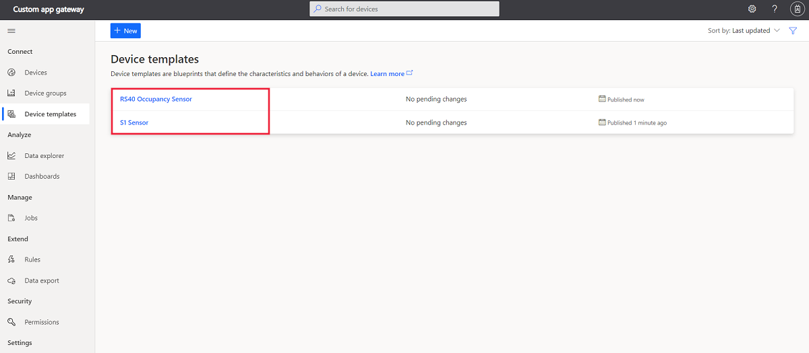
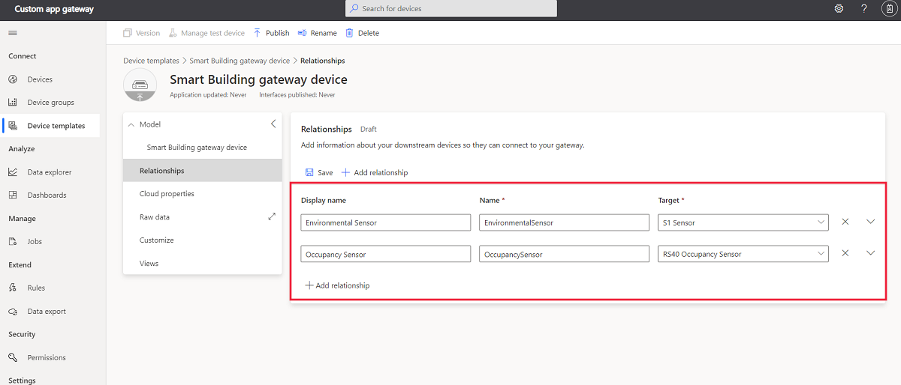
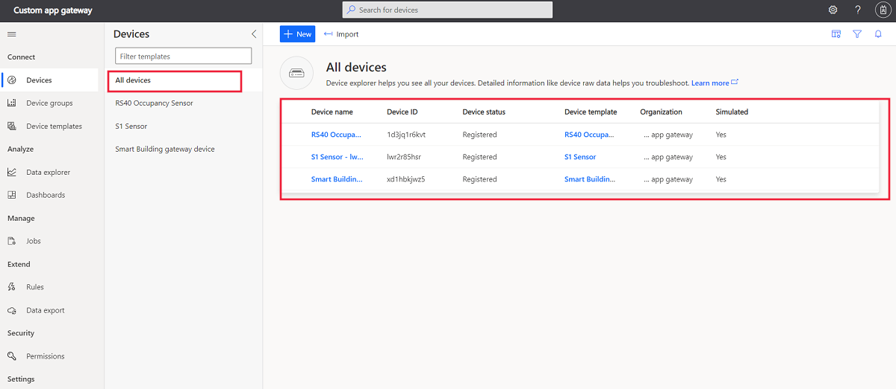
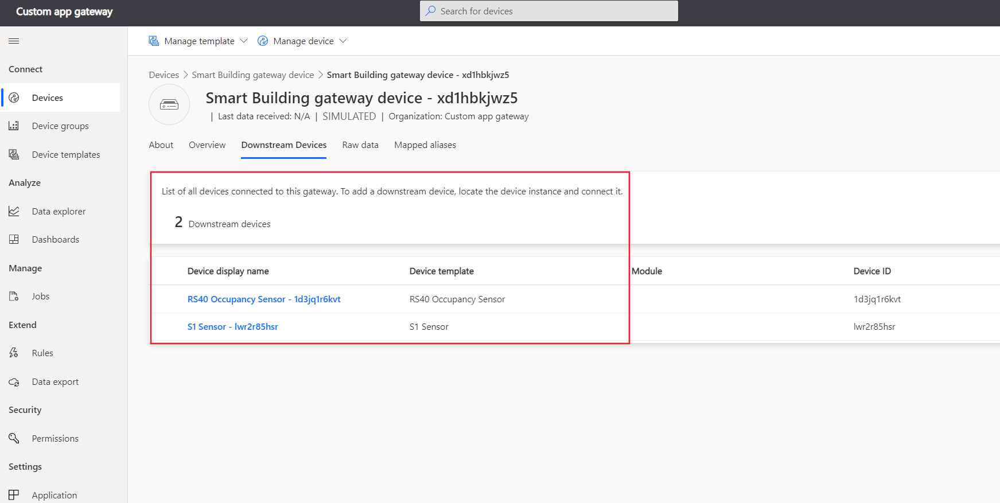

# Define a new IoT gateway device type in your Azure IoT Central application

*This article applies to solution builders and device developers.*

This tutorial shows you, as a solution builder, how to use a gateway device template to define a gateway device in your IoT Central application. You then configure several downstream devices that connect to your IoT Central application through the gateway device. 

In this tutorial, you create a **Smart Building** gateway device template. A **Smart Building** gateway device has relationships with other downstream devices.

As well as enabling downstream devices to communicate with your IoT Central application, a gateway device can also:

* Send its own telemetry, such as temperature.
* Respond to writeable property updates made by an operator. For example, an operator could changes the telemetry send interval.
* Respond to commands, such as rebooting the device.

## Prerequisites

To complete this tutorial, you need to [Create an Azure IoT Central application](./quick-deploy-iot-central.md).

## Create downstream device templates

This tutorial uses device templates for an **S1 Sensor** device and an **RS40 Occupancy Sensor** device to generate simulated downstream devices.

To create a device template for an **S1 Sensor** device:

1. In the left pane, select **Device Templates**. Then select **+** to start adding the template.

1. Scroll down until you can see the tile for the **S1 Sensor** device. Select the tile and then select **Next: Customize**.

1. On the **Review** page, select **Create** to add the device template to your application. 

To create a device template for an ***RS40 Occupancy Sensor** device:

1. In the left pane, select **Device Templates**. Then select **+** to start adding the template.

1. Scroll down until you can see the tile for the ***RS40 Occupancy Sensor** device. Select the tile and then select **Next: Customize**.

1. On the **Review** page, select **Create** to add the device template to your application. 

You now have device templates for the two downstream device types:

## Create a gateway device template

In this tutorial you create a device template for a gateway device from scratch. You use this template later to create a simulated gateway device in your application.

To add a new gateway device template to your application:

1. In the left pane, select **Device Templates**. Then select **+** to start adding the template.

1. On the **Select template type** page, select the **IoT Device** tile, and then select **Next: Customize**.

1. On the **Customize device** page, select the **Gateway device** checkbox.

1. On the **Review** page, select **Create**. 

1. Enter **Smart Building gateway device** as the template name.

1. On the **Create a capability model** page, select the **Custom** tile.

1. Select **+** to add an interface.  Choose the **Device Information** standard interface.

### Add relationships

Next you add relationships to the templates for the downstream device templates:

1. In the **Smart Building gateway device** template, select **Relationships**.

1. Select **+ Add relationship**. Enter **Environmental Sensor** as the display name, and select **S1 Sensor** as the target.

1. Select **+ Add relationship** again. Enter **Occupancy Sensor** as the display name, and select **RS40 Occupancy Sensor** as the target.

1. Select **Save**.

### Add cloud properties

A gateway device template can include cloud properties. Cloud properties only exist in the IoT Central application, and are never sent to, or received from, a device.

To add cloud properties to the **Smart Building gateway device** template.

1. In the **Smart Building gateway device** template, select **Cloud properties**.

1.  Use the information in the following table to add two cloud properties to your gateway device template.

    | Display name      | Semantic type | Schema |
    | ----------------- | ------------- | ------ |
    | Last Service Date | None          | Date   |
    | Customer Name     | None          | String |

2. Select **Save**.

### Create views

As a builder, you can customize the application to display relevant information about the environmental sensor device to an operator. Your customizations enable the operator to manage the environmental sensor devices connected to the application. You can create two types of views for an operator to use to interact with devices:

* Forms to view and edit device and cloud properties.
* Dashboards to visualize devices.

To generate the default views for the **Smart Building gateway device** template:

1. In the **Smart Building gateway device** template, select **Views**.

1. Select **Generate default views** tile and make sure that all the options are selected.

1. Select **Generate default dashboard view(s)**.

## Publish the device template

Before you can create a simulated gateway device, or connect a real gateway device, you need to publish your device template.

To publish the gateway device template:

1. Select the **Smart Building gateway device** template from the **Device templates** page.

2. Select **Publish**.

3. In the **Publish a Device Template** dialog box, choose **Publish**.

After a device template is published, it's visible on the **Devices** page and to the operator. In a published device template, you can't edit a device capability model without creating a new version. However, you can make updates to cloud properties, customizations, and views, in a published device template. These updates don't cause a new version to be created. After making any changes, select **Publish**  to push those changes out to your operator.

## Create the simulated devices

This tutorial uses simulated downstream devices and a simulated gateway device.

To create a simulated gateway device:

1. On the **Devices** page, select **Smart Building gateway device** in the list of device templates.

1. Select **+** to start adding a new device.

1. Keep the generated **Device ID** and **Device name**. Make sure that the **Simulated** switch is **On**. Select **Create**.

To create a simulated downstream devices:

1. On the **Devices** page, select **RS40 Occupancy Sensor** in the list of device templates.

1. Select **+** to start adding a new device.

1. Keep the generated **Device ID** and **Device name**. Make sure that the **Simulated** switch is **On**. Select **Create**.

1. On the **Devices** page, select **S1 Sensor** in the list of device templates.

1. Select **+** to start adding a new device.

1. Keep the generated **Device ID** and **Device name**. Make sure that the **Simulated** switch is **On**. Select **Create**.

### Add downstream device relationships to a gateway device

Now that you have the simulated devices in your application, you can create the relationships between the downstream devices and the gateway device:

1. On the **Devices** page, select **S1 Sensor** in the list of device templates, and then select your simulated **S1 Sensor** device.

1. Select **Connect to gateway**.

1. On the **Connect to a gateway** dialog, select the **Smart Building gateway device** template, and then select the simulated instance you created previously.

1. Select **Join**.

1. On the **Devices** page, select **RS40 Occupancy Sensor** in the list of device templates, and then select your simulated **RS40 Occupancy Sensor** device.

1. Select **Connect to gateway**.

1. On the **Connect to a gateway** dialog, select the **Smart Building gateway device** template, and then select the simulated instance you created previously.

1. Select **Join**.

Both your simulated downstream devices are now connected to your simulated gateway device. If you navigate to the **Downstream Devices** view for your gateway device, you can see the related downstream devices:

Select a gateway device template and gateway device instance, and select **Join**.

## Next steps

In this tutorial, you learned how to:

* Create a new IoT gateway as a device template.
* Create cloud properties.
* Create customizations.
* Define a visualization for the device telemetry.
* Add relationships.
* Publish your device template.

> [!NOTE]
> VS Code based code generation is currently not supported for gateway devices modeled in IoT Central.

Next, as a device developer, you can learn how to:

> [!div class="nextstepaction"]
> [Add an Azure IoT Edge device to your Azure IoT Central application](tutorial-add-edge-as-leaf-device.md)
