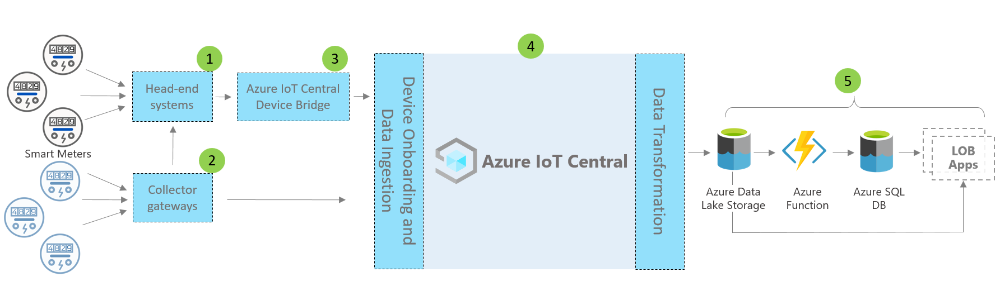

# Azure IoT Central - smart meter app architecture

This article provides an overview of the smart meter monitoring app template architecture. The diagram below shows a commonly used architecture for smart meter app on Azure using IoT Central platform.

> [!div class="mx-imgBorder"]
> 

This architecture consists of the following components. Some solutions may not require every component listed here.

## Smart meters and connectivity 

A smart meter is one of the most important devices among all the energy assets. It records and communicates energy consumption data to utilities for monitoring and other use cases, such as billing and demand response. Based on the meter type, it can connect to IoT Central either using gateways or other intermediate devices or systems, such edge devices and head-end systems. Build IoT Central device bridge to connect devices, which can't be connected directly. The IoT Central device bridge is an open-source solution and you can find the complete details [here](https://docs.microsoft.com/azure/iot-central/core/howto-build-iotc-device-bridge). 

## IoT Central platform

Azure IoT Central is a platform that simplifies building your IoT solution and helps reduce the burden and costs of IoT management, operations, and development. With IoT Central, you can easily connect, monitor, and manage your Internet of Things (IoT) assets at scale. After you connect your smart meters to IoT Central, the app template uses built-in features such as device models, commands, and dashboards. The app template also uses the IoT Central storage for warm path scenarios such as near real-time meter data monitoring, analytics, rules, and visualization. 

## Extensibility options to build with IoT Central
The IoT Central platform provides two extensibility options: Continuous Data Export (CDE) and APIs. The customers and partners can choose between these options based to customize their solutions for specific needs. For example, one of our partners configured CDE with Azure Data Lake Storage (ADLS). They're using ADLS for long-term data retention and other cold path storage scenarios, such batch processing, auditing and reporting purposes. 

## Next steps

* Now that you've learned about the architecture, [create smart meter app for free](https://apps.azureiotcentral.com/build/new/smart-meter-monitoring)
* To learn more about IoT Central, see [IoT Central overview](https://docs.microsoft.com/azure/iot-central/)
