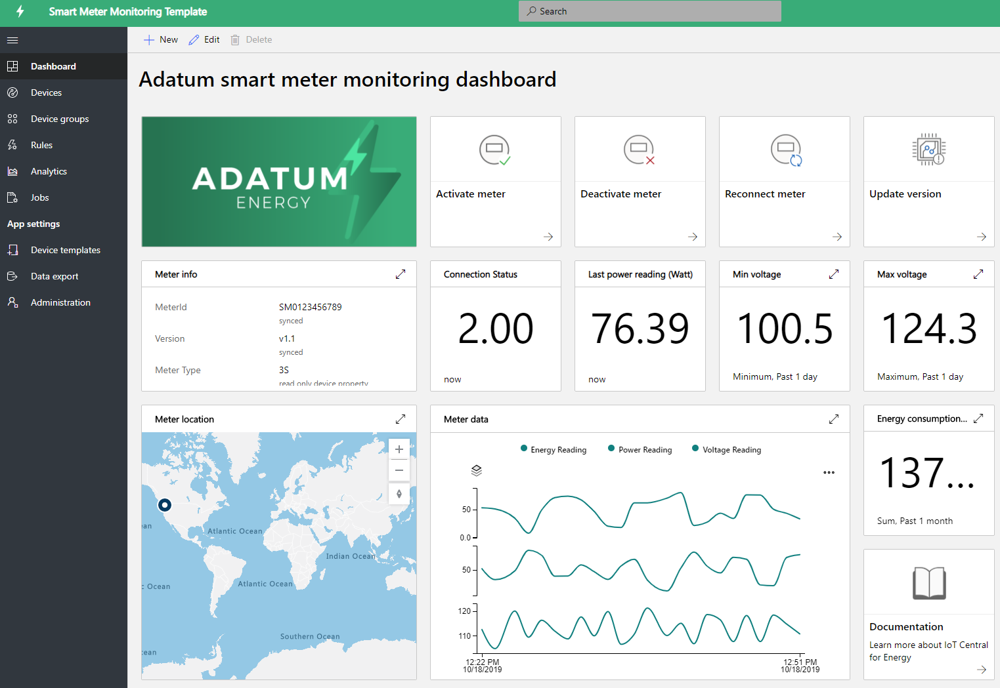
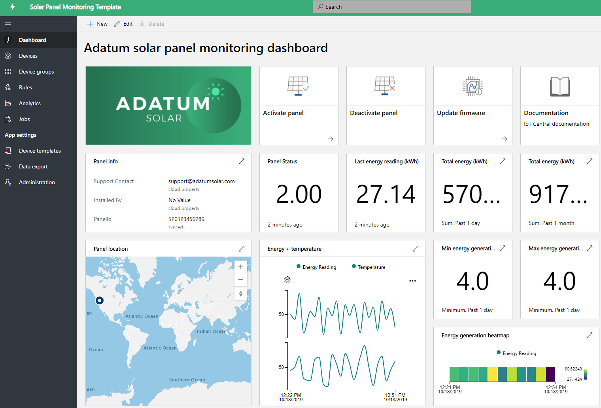

# Build energy solutions with IoT Central 

Smart meters and solar panels are playing an important role in the energy industry transformation. The smart meters give more controls and real-time insights about energy consumptions and solar panels growth is driving breakthrough in renewable energy generation. The smart meter and solar panel monitoring apps are sample templates to show the various capabilities. Partners can leverage these templates to build energy solutions with IoT Central for their specific needs. No new coding and no additional cost are required to deploy and use these applications. Learn more about energy application templates and their capabilities.

## What is the smart meter monitoring application?
 The smart meters not only enable automated billing, but also advanced metering use cases such as real-time readings and bi-directional communication. The smart meter app template enables utilities and partners to monitor smart meters status and data, define alarms and notifications. It provides sample commands, such as disconnect meter and update software. The meter data can be set up to egress to other business applications and to develop custom solutions. 

App's key functionalities: 

* Meter sample device model 
* Meter info and live status 
* Meter readings such as energy, power, and voltages
* Meter command samples 
* Built-in visualization and dashboards
* Extensibility for custom solution development

You can try the [smart meter monitoring app for free](https://apps.azureiotcentral.com/build/new/smart-meter-monitoring) without an Azure subscription, and any commitments.

After you deploy the app, you'll see the simulated meter data on the dashboard, as shown in the figure below. This template is a sample app that you can easily extend and customize for your specific use cases.

> [!div class="mx-imgBorder"]
> 

## What is the solar panel monitoring application?
The solar panel monitoring app enables utilities and partners to monitor solar panels, such as their energy generation and connection status in near real time. It can send notifications based on defined threshold criteria. It provides sample commands, such as update firmware and other properties. The solar panel data can be set up to egress to other business applications and to develop custom solutions. 

App's key functionalities: 

* Solar panel sample device model 
* Solar Panel info and live status
* Solar energy generation and other readings
* Command and control samples
* Built-in visualization and dashboards
* Extensibility for custom solution development

You can try the [solar panel monitoring app for free](https://apps.azureiotcentral.com/build/new/solar-panel-monitoring) without an Azure subscription and any commitments.

After you deploy the app, you'll see the simulated solar panel data within 1-2 minutes, as shown in the dashboard below. This template is a sample app that you can easily extend and customize for your specific use cases. 

> [!div class="mx-imgBorder"]
> 

## Next steps
To get started building an energy solution:
* Create application templates for free: [smart meter app](https://apps.azureiotcentral.com/build/new/smart-meter-monitoring), 
[solar panel app](https://apps.azureiotcentral.com/build/new/solar-panel-monitoring)
* Learn about [smart meter monitoring app concepts](https://docs.microsoft.com/azure/iot-central/energy/concept-iot-central-smart-meter-app)
* Learn about [solar panel monitoring app concepts](https://docs.microsoft.com/azure/iot-central/energy/concept-iot-central-solar-panel-app)
* Learn about [IoT Central platform](https://docs.microsoft.com/azure/iot-central/)
