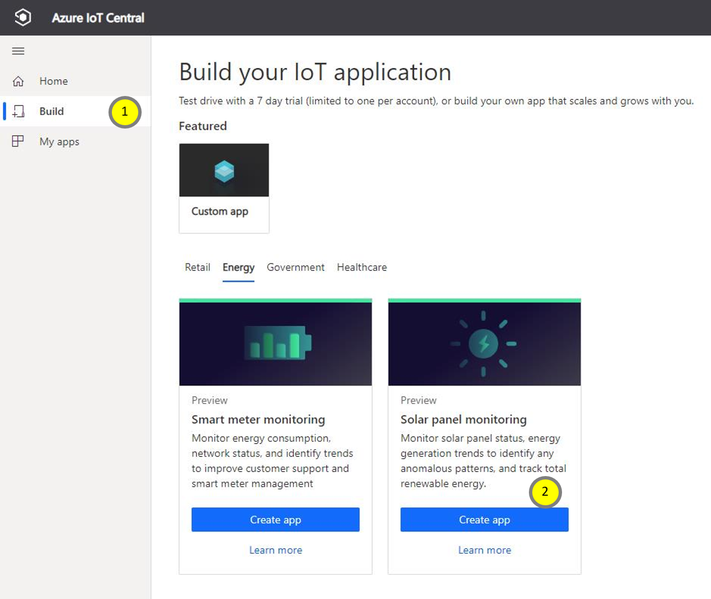
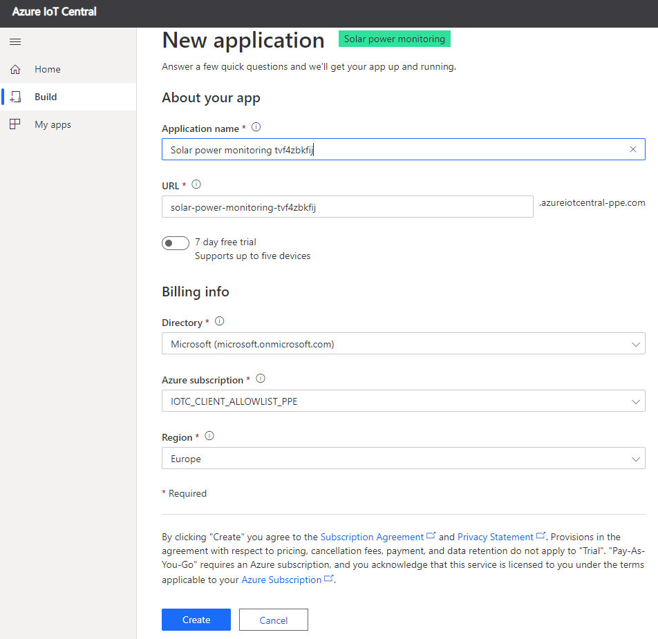
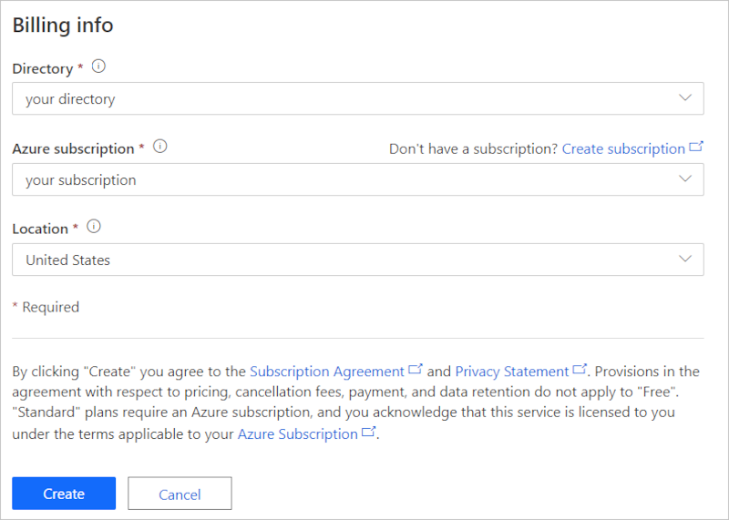
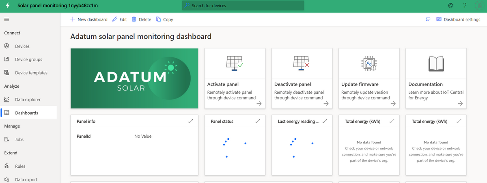
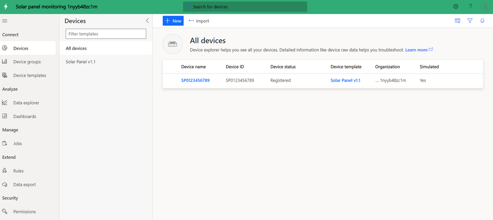
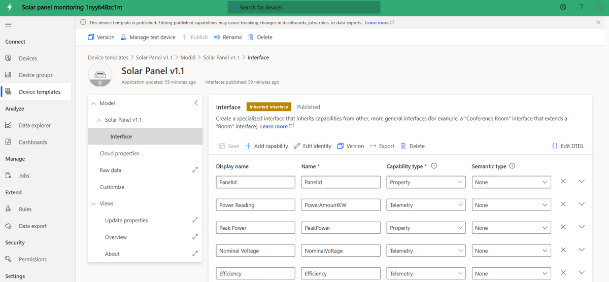
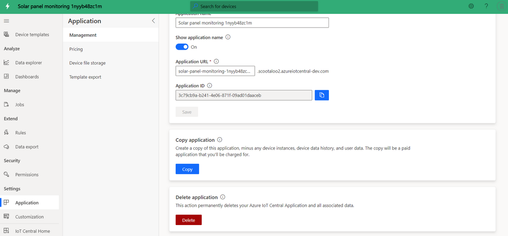

# Tutorial: Create and explore the solar panel monitoring app template 

This tutorial guides you through the process of creating a solar panel monitoring application, which includes a sample device model with simulated data. In this tutorial, you'll learn how to:

> [!div class="checklist"]
> * Create a solar panel app for free
> * Walk through the application
> * Clean up resources

If you don't have a subscription, [create a free trial account](https://azure.microsoft.com/free).

## Prerequisites

There are no prerequisites for completing this tutorial. A subscription to Azure is recommended, but not required.

## Create a solar panel monitoring app 

You can create this application in three simple steps:

1. Go to [Azure IoT Central](https://apps.azureiotcentral.com). To create a new application, select **Build**. 

1. Select the **Energy** tab. Under **Solar panel monitoring**, select **Create app**. 

    > [!div class="mx-imgBorder"]
    > 
  
1. In the **New application** dialog box, fill in the requested details, and then select **Create**:
    * **Application name**: Pick a name for your Azure IoT Central application. 
    * **URL**: Pick an Azure IoT Central URL. The platform verifies its uniqueness.
    * **Pricing plan**: If you already have an Azure subscription, the default setting is recommended. If you don't have an Azure subscription, start with the free trial.
    * **Billing info**: The application itself is free. The directory, Azure subscription, and region details are required to provision the resources for your app.
        
        
        

### Verify the application and simulated data

You can modify your new solar panel app at any time. For now, ensure that the app is deployed and working as expected before you modify it.

To verify the app creation and data simulation, go to the **Dashboard**. If you can see the tiles with some data, then your app deployment was successful. The data simulation can take a few minutes to generate the data. 

## Application walk-through
After you successfully deploy the app template, you'll want to explore the app a bit more. Notice that it comes with sample smart meter device, device model, and dashboard.

Adatum is a fictitious energy company that monitors and manages solar panels. On the solar panel monitoring dashboard, you see solar panel properties, data, and sample commands. This dashboard allows you or your support team to perform the following activities proactively, before any problems require additional support:
* Review the latest panel info and its installed location on the map.
* Check the panel status and connection status.
* Review the energy generation and temperature trends to catch any anomalous patterns.
* Track the total energy generation for planning and billing purposes.
* Activate a panel and update the firmware version, if necessary. In the template, the command buttons show the possible functionalities, and don't send real commands.

> [!div class="mx-imgBorder"]
> 

### Devices
The app comes with a sample solar panel device. To see device details, select **Devices**.

> [!div class="mx-imgBorder"]
> 

Select the sample device, **SP0123456789**. From the **Update Properties** tab, you can update the writable properties of the device and see a visual of the updated values on the dashboard. 

> [!div class="mx-imgBorder"]
> 

### Device template
To see the solar panel device model, select the **Device templates** tab. The model has predefined interfaces for data, properties, commands, and views.

> [!div class="mx-imgBorder"]
> 

## Clean up resources
If you decide not to continue using this application, delete your application with the following steps:

1. From the left pane, select **Administration**.
1. Select **Application settings** > **Delete**. 

    > [!div class="mx-imgBorder"]
    > 

## Next steps
 
> [!div class="nextstepaction"]
> [Azure IoT Central - solar panel app architecture](./concept-iot-central-solar-panel-app.md)

