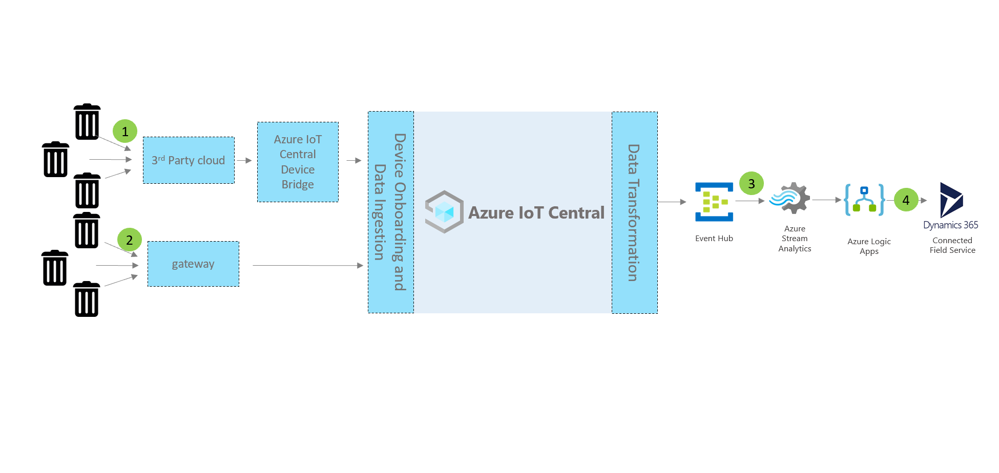

# Connected waste monitoring reference architecture 

A connected waste management solution can be built using the **Azure IoT Central app template** as a kick starter IoT application. This article provides a high-level reference architecture guidance on building an end to end solution. 

Concepts:

1. Devices and connectivity  
1. IoT Central 
2. Extensibility and integrations
3. Business applications

Let's take a look at key components that generally play a part in a water consumption monitoring solution.

## Devices and connectivity 
Devices used in open environments, like waste bins, may be connected through low-power wide area networks (LPWAN), through a third-party network operator. For these types of devices, you can use the [Azure IoT Central Device Bridge](https://docs.microsoft.com/azure/iot-central/core/howto-build-iotc-device-bridge) to send your device data to your IoT application in Azure IoT Central. Alternatively, you may have device gateways that are IP capable and can connect directly to IoT Central.

## IoT Central 
Azure IoT Central is an IoT App platform, which gets you started up and running on your IoT solution quickly. You can brand, customize, and integrate your solution with third-party services.
After you connect your smart water devices to IoT Central, you get device command and control, monitoring and alerting, user interface with built-in RBAC, configurable insights dashboards, and extensibility options. 

## Extensibility and integrations 
You can extend your IoT application in IoT Central and optionally:
* transform and integrate your IoT data for advanced analytics, for example training machine learning models, through continuous data export from IoT Central application. 
* automate workflows in other systems by triggering actions using Microsoft Flow or webhooks from IoT Central application
* programatically access your IoT application in IoT Central through IoT Central APIs.

## Business applications 
The IoT data can be used to power a variety of business applications within a waste utility. To learn how to connect your IoT Central connected waste management application with field services, follow the tutorial on [how to integrate with Dynamics 365 Field Services](./how-to-configure-connected-field-services.md) 

## Next steps
* Learn how to [create a connected waste management](./tutorial-connected-waste-management.md) IoT Central application
* Learn more about [IoT Central government templates](./overview-iot-central-government.md)
* To learn more about IoT Central, see [IoT Central overview](https://docs.microsoft.com/azure/iot-central/core/overview-iot-central)

