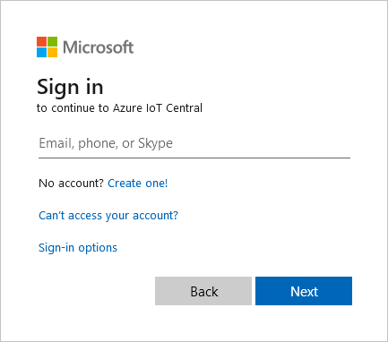
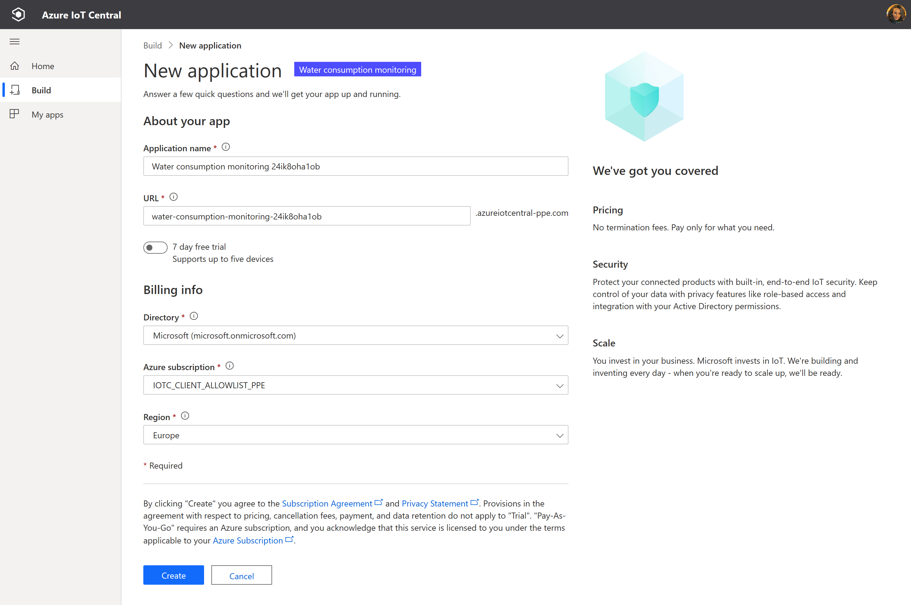
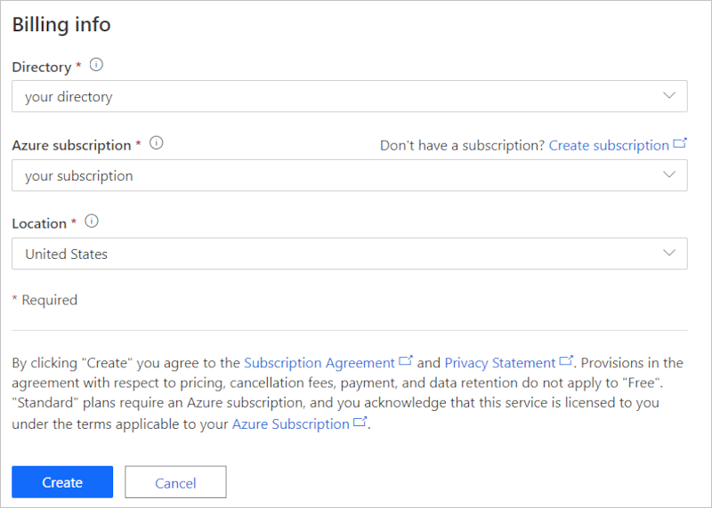
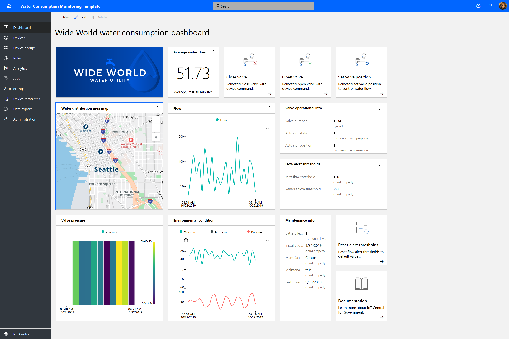
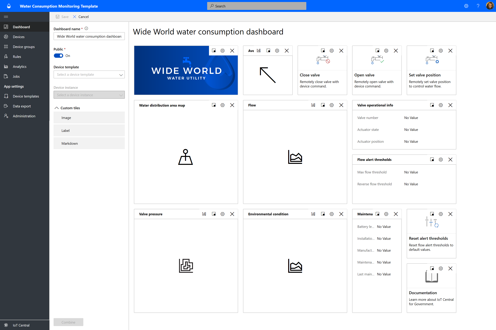
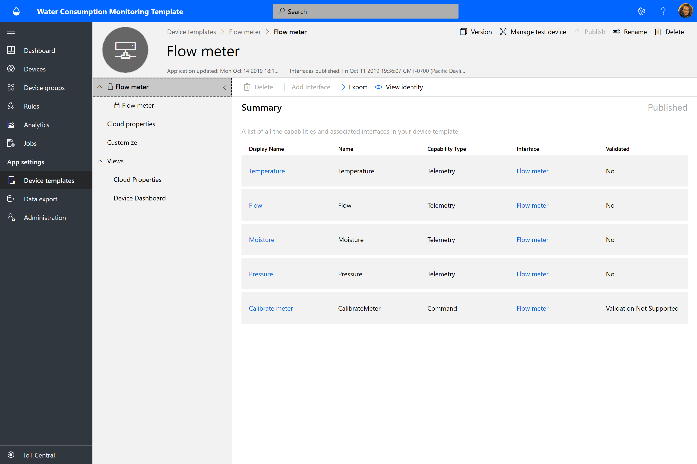
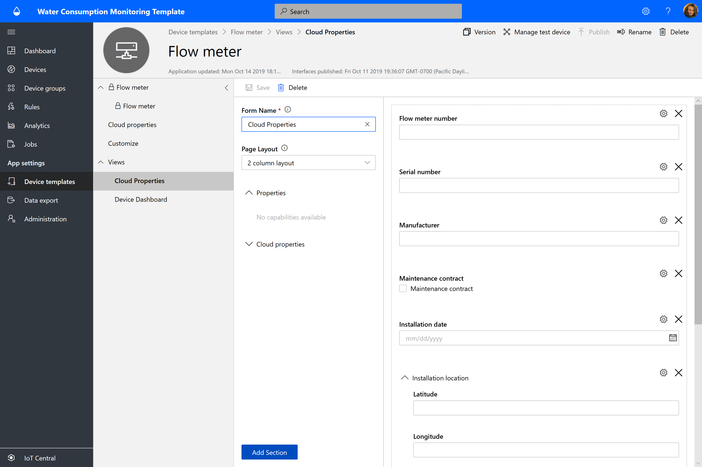
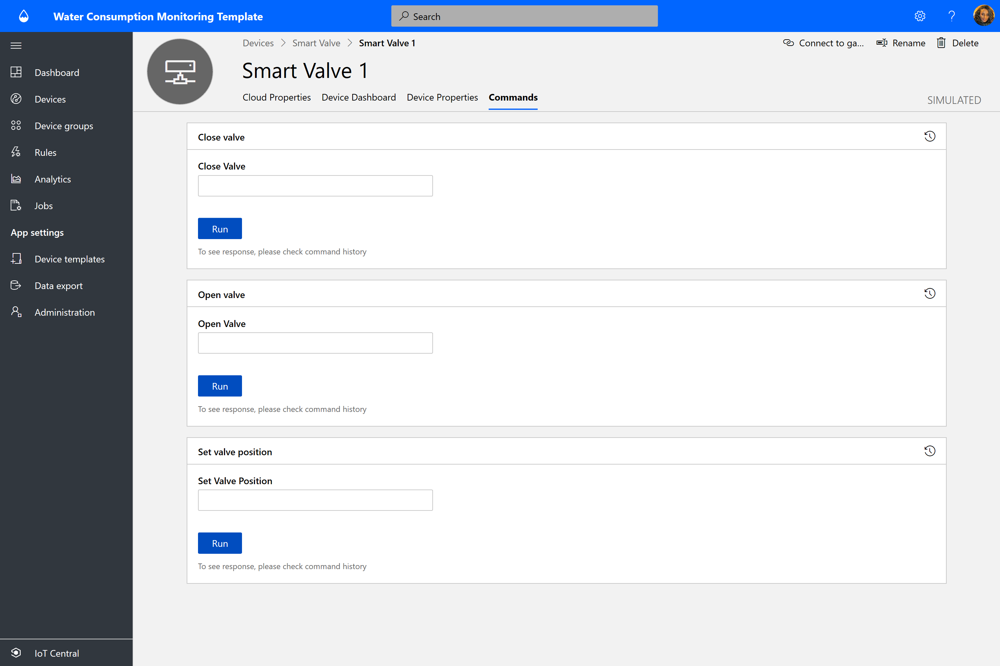
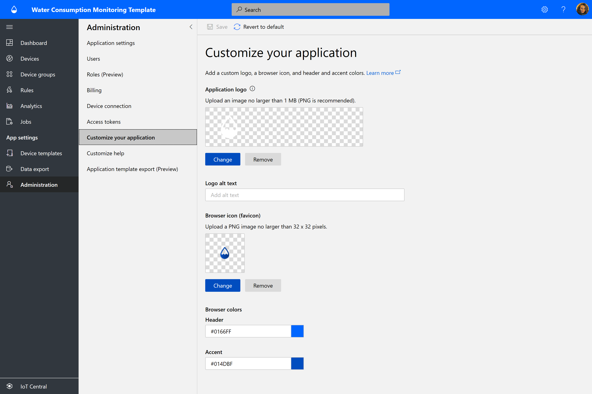

# Tutorial: Create a water consumption monitoring application with Azure IoT Central

This tutorial shows you how to create an Azure IoT Central water consumption monitoring application by using the Azure IoT Central water consumption monitoring application template.

In this tutorial, you will learn how to:

> [!div class="checklist"]
> * Use the Azure IoT Central water consumption monitoring template to create your water consumption monitoring application.
> * Explore and customize the operator dashboard.
> * Explore device templates.
> * Explore simulated devices.
> * Explore and configure rules.
> * Configure jobs.
> * Customize your application branding by using white labeling.

## Prerequisites

To complete this tutorial, you need:

- An Azure subscription. If you don't have an Azure subscription, you can create one on the [Azure sign-up page](https://aka.ms/createazuresubscription).

## Create a water consumption monitoring app with Azure IoT Central

In this section, you use the Azure IoT Central water consumption monitoring template to create your water consumption monitoring application in Azure IoT Central.

To create a new Azure IoT Central water consumption monitoring application:

1. Go to the [Azure IoT Central home page](https://aka.ms/iotcentral) website.

    If you have an Azure subscription, sign in with the credentials you use to access it. Otherwise, sign in by using a Microsoft account.

    

1. Select **Build** on the left pane, and select the **Government** tab. The **Government** page displays several government application templates.

   

1. Select the **Water consumption monitoring** application template.
This template includes a sample water consumption device template, a simulated device, an operator dashboard, and preconfigured monitoring rules.

1. Select **Create app** to open the **New application** creation form with the following fields:
    * **Application name**: By default, the application uses *Water consumption monitoring* followed by a unique ID string that Azure IoT Central generates. Optionally, choose a friendly application name. You can change the application name later, too.
    * **URL**: Azure IoT Central autogenerates a URL based on the application name. You can choose to update the URL to your liking. You can change the URL later, too.
    * If you have an Azure subscription, enter your **Directory**, **Azure subscription**, and **Location** information. If you don't have a subscription, you can select the **7-day free trial** option and complete the required contact information.

    For more information about directories and subscriptions, see [Create an application quickstart](../core/quick-deploy-iot-central.md).

1. Select **Create** at the bottom of the page.

    

    

You've now created a water consumption monitoring app by using the Azure IoT Central water consumption monitoring template.

The water consumption monitoring application comes with preconfigured:

* Sample operator dashboards.
* Sample predefined water flow and valve device templates.
* Simulated water flow and smart valve devices.
* Rules and jobs.
* Sample branding by using white labeling.

It's your application, and you can modify it anytime. Now let's explore the application and make some customizations.

## Explore and customize the operator dashboard

After you create the application, the sample **Wide World water consumption dashboard** opens.

   

As a builder, you can create and customize views on the dashboard for operators. Let's explore the dashboard before you try to customize it.

> [!NOTE]
> All data displayed on the dashboard is based on simulated device data, which we'll explore in the next section.
  
The dashboard consists of different kinds of tiles:

* **Wide World Water Utility image tile**: The first tile in the dashboard is an image tile of the fictitious water utility Wide World Water. You can customize the tile by inserting your own image or removing it.
* **Average water flow KPI tile**: The KPI tile is configured to display as an example *the average in the last 30 minutes*. You can customize the KPI tile and set it to a different type and time range.
* **Device command tiles**: These tiles include the **Close valve**, **Open valve**, and **Set valve position** tiles. Selecting the commands takes you to the simulated device command page. In Azure IoT Central, a *command* is a *device capability* type. We'll explore this concept later in the "Device template" section of this tutorial.
* **Water distribution area map**: The map uses Azure Maps, which you can configure directly in Azure IoT Central. The map tile displays the device location. Hover over the map and try the controls over the map, like *zoom in*, *zoom out*, or *expand*.

    

* **Average water flow line chart** and **Environmental condition line chart**: You can visualize one or multiple device telemetries plotted as a line chart over a desired time range.
* **Average valve pressure heatmap chart**: You can choose the heatmap visualization type of device telemetry data you want to see distributed over a time range with a color index.
* **Reset alert thresholds content tile**: You can include call-to-action content tiles and embed a link to an action page. In this case, the reset alert threshold takes you to the application **Jobs**, where you can run updates to device properties. We'll explore this option later in the "Configure jobs" section of this tutorial.
* **Property tiles**: The dashboard displays **Valve operational info**, **Flow alert thresholds**, and **Maintenance info** tiles.

### Customize the dashboard

As a builder, you can customize views in the dashboard for operators.

1. Select **Edit** to customize the **Wide World water consumption dashboard**. You can customize the dashboard by selecting the **Edit** menu. After the dashboard is in **edit** mode, you can add new tiles or you can configure it.

     

1. Select **+ New** to create a new dashboard and configure it from scratch. You can have multiple dashboards, and you can move between your dashboards on the dashboard menu.

## Explore the device template

A device template in Azure IoT Central defines the capability of a device, which can be telemetry, property, or command. As a builder, you can define one or more device templates in Azure IoT Central that represent the capability of the devices that you'll connect.

The water consumption monitoring application comes with two reference device templates that represent a *flow meter* and a *smart valve* device.

To view the device template:

1. Select **Device templates** on the left pane of your application in Azure IoT Central. In the **Device templates** list, you'll see two device templates, **Smart Valve** and **Flow meter**.

   

1. Select the **Flow meter** device template, and familiarize yourself with the device capabilities.

     

### Customize the device template

To customize the device template:

1. Go to **Customize** on the **Device templates** menu.
1. Find the `Temperature` telemetry type.
1. Update the **Display Name** of `Temperature` to `Reported temperature`.
1. Update the unit of measurement, or set the **Min value** and **Max value**.
1. Select **Save** to save any changes.

### Add a cloud property

1. Go to **Cloud Properties** on the **Device templates** menu.
1. Add a new cloud property by selecting **+ Add Cloud Property**.
    In Azure IoT Central, you can add a property that's relevant to the device. As an example, a cloud property could be an alerting threshold specific to an installation area, asset information, or other maintenance information.
1. Select **Save** to save any changes.

### Views

The water consumption monitor device template comes with predefined views. Explore the views, and you can make updates. The views define how operators see the device data but also input cloud properties.

  

### Publish

If you made any changes, make sure to **Publish** the device template.

### Create a new device template

Select **+ New** to create a new device template and follow the creation process.
You can create a custom device template from scratch, or you can choose a device template from the Azure Device Catalog.

## Explore simulated devices

In Azure IoT Central, you can create simulated devices to test your device template and application. The water consumption monitoring application has two simulated devices mapped to the **Flow meter** and **Smart Valve** device templates.

### View the devices

1. Select **Devices** > **All devices** on the left pane.

   

1. Select **Smart Valve 1**.

    

1. On the **Commands** tab, you can see the three device commands (**Close valve**, **Open valve**, and **Set valve position**) that are capabilities defined in the **Smart Valve** device template.

1. Explore the **Device Properties** tab and the **Device Dashboard** tab.

> [!NOTE]
> Note that all the tabs are configured from the device template views.

### Add new devices

Add new devices by selecting **+ New** on the **Devices** tab.

## Explore and configure rules

In Azure IoT Central, you can create rules to automatically monitor device telemetry and trigger actions when one or more conditions are met. The actions might include sending email notifications or triggering a Microsoft Power Automate action or a webhook action to send data to other services.

The water consumption monitoring application you created has three preconfigured rules.

### View rules

1. Select **Rules** on the left pane.

   

1. Select **High water flow alert**, which is one of the preconfigured rules in the application.

     

    The `High water flow alert` rule is configured to check against the condition `Flow` is `greater than` the `Max flow threshold`. Max flow threshold is a cloud property defined in the **Smart Valve** device template. The value of `Max flow threshold` is set per device instance.

Now let's create an email action.

To add an action to the rule:

1. Select **+ Email**.
1. Enter **High flow alert** as the friendly **Display name** for the action.
1. Enter the email address associated with your Azure IoT Central account in **To**.
1. Optionally, enter a note to include in the text of the email.
1. Select **Done** to complete the action.
1. Select **Save** to save the new rule.
1. Enable the rule.

Within a few minutes, you should receive an email after the configured condition is met.

> [!NOTE]
> The application sends an email each time a condition is met. Select **Disable** to disable the rule to stop receiving email from the automated rule.
  
To create a new rule:

* Select **+ New** on the **Rules** tab on the left pane.

## Configure jobs

In Azure IoT Central, jobs allow you to trigger device or cloud property updates on multiple devices. In addition to properties, you can also use jobs to trigger device commands on multiple devices. Azure IoT Central automates the workflow for you.

1. Select **Jobs** on the left pane.
1. Select **+ New**, and configure one or more jobs.

## Customize your application

As a builder, you can change several settings to customize the user experience in your application.

1. Select **Administration** > **Customize your application**.
1. To choose an image to upload as the **Application logo**, select the **Change** button.
1. To choose a **Browser icon** image that will appear on browser tabs, select the **Change** button.
1. You can also replace the default **Browser colors** by adding HTML hexadecimal color codes.

   

1. You can also change application images by selecting **Administration** > **Application settings**. To choose an image to upload as the application image, select the **Select image** button.
1. Finally, you can also change the **Theme** by selecting the **Settings** icon in the upper-right corner of the application.

## Clean up resources

If you're not going to continue to use this application, delete it.

1. Select **Administration** on the left pane of your Azure IoT Central application.
1. Select **Application settings**, and then select **Delete** at the bottom of the page.

## Next steps

* Learn more about 

> [!div class="nextstepaction"]
> [Water consumption monitoring concepts](./concepts-waterconsumptionmonitoring-architecture.md).
