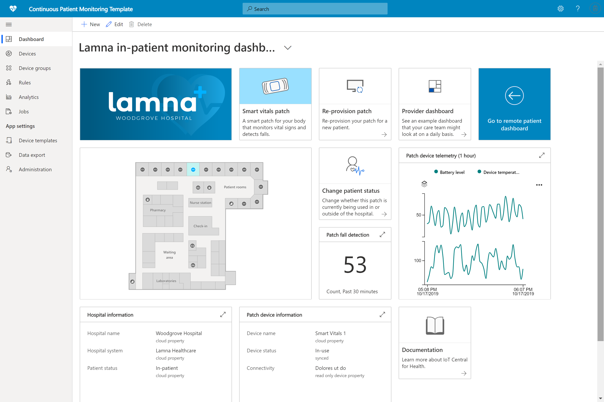

# Building healthcare solutions with Azure IoT Central 

Learn to build healthcare solutions with Azure IoT Central using application templates.

## What is continuous patient monitoring template?

In the healthcare IoT space, Continuous Patient Monitoring is one of the key enablers of reducing the risk of readmissions, managing chronic diseases more effectively, and improving patient outcomes. Continuous Patient Monitoring can be split into two major categories:

1. **In-patient monitoring**: Using medical wearables and other devices in the hospital, care teams can monitor patient vital signs and medical conditions without having to send a nurse to check up on a patient multiple times a day. Care teams can understand the moment that a patient needs critical attention through notifications and prioritizes their time effectively.
1. **Remote patient monitoring**: By using medical wearables and patient reported outcomes (PROs) to monitor patients outside of the hospital, the risk of readmission can be lowered. Data from chronic disease patients and rehabilitation patients can be collected to ensure that patients are adhering to care plans and that alerts of patient deterioration can be surfaced to care teams before they become critical.

This application template can be used to build solutions for both categories of Continuous Patient Monitoring. The benefits include:

* Seamlessly connect different kinds of medical wearables to an IoT Central instance.
* Monitor and manage the devices to ensure they remain healthy.
* Create custom rules around device data to trigger appropriate alerts.
* Export your patient health data to the Azure API for FHIR, a compliant data store.
* Export the aggregated insights into existing or new business applications.

>[!div class="mx-imgBorder"] 
>

## Next steps

To get started building a Continuous Patient monitoring solution:

* [Deploy the application template](tutorial-continuous-patient-monitoring.md)
* [See an example architecture](concept-continuous-patient-monitoring-architecture.md)