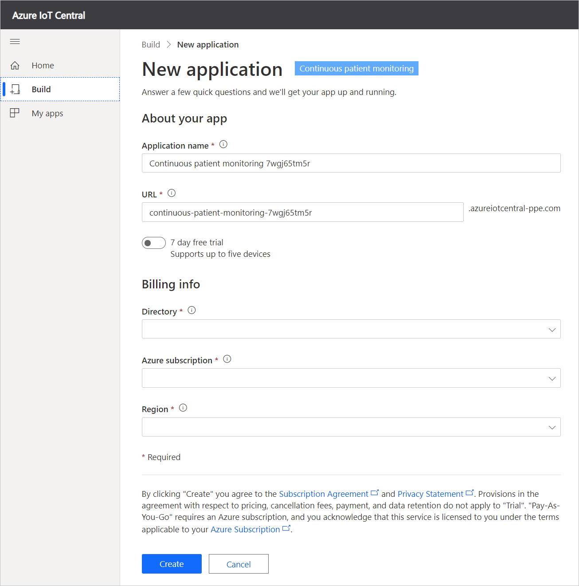
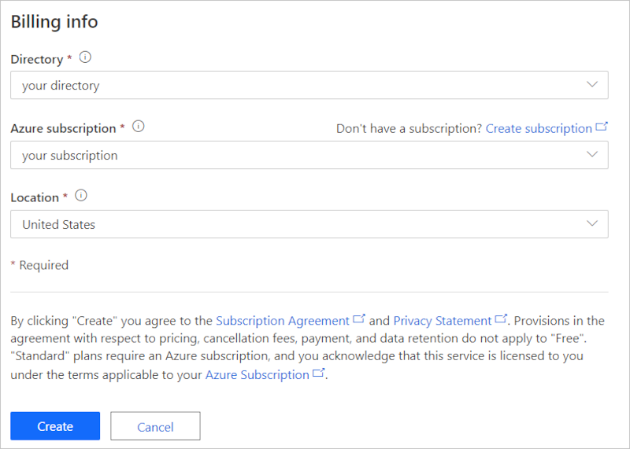

# Tutorial: Deploy and walkthrough a continuous patient monitoring app template

This tutorial shows you how to get started by deploying an IoT Central continuous patient monitoring application template. You learn how to deploy and use the template.

In this tutorial, you learn how to:

> [!div class="checklist"]
> * Create an application template
> * Walk through the application template

## Prerequisites

An Azure subscription is recommended. Alternatively, you can use a free, 7-day trial. If you don't have an Azure subscription, you can create one on the [Azure sign-up page](https://aka.ms/createazuresubscription).

## Create an application template

Navigate to the [Azure IoT Central application manager website](https://apps.azureiotcentral.com/). Select **Build** from the left-hand navigation bar and then select the **Healthcare** tab.

:::image type="content" source="media/app-manager-health.png" alt-text="Healthcre app template":::

Select the **Create app** button to begin creating your application and then sign in with a Microsoft personal, work, or school account. It will take you to the **New application** page.

To create your application:

1. Azure IoT Central automatically suggests an application name based on the template you've selected. You can accept this name or enter your own friendly application name, such as **Continuous Patient Monitoring**. Azure IoT Central also generates a unique URL prefix for you based on the application name. You're free to change this URL prefix to something more memorable if you'd like.

2. You can select whether you would like to create the application using the *free* pricing plan or one of the *standard* pricing plans. Applications you create using the free plan are free for seven days before they expire and allow up to five free devices. You can move an application from the free plan to a standard pricing plan at any time before it expires. If you choose the free plan, you need to enter your contact information and choose whether to receive information and tips from Microsoft. Applications you create using a standard plan support up to two free devices and require you to enter your Azure subscription information for billing.

3. Select **Create** at the bottom of the page to deploy your application.

## Walk through the application template

### Dashboards

After deploying the app template, you'll first land on the **Lamna in-patient monitoring dashboard**. Lamna Healthcare is a fictitious hospital system that contains two hospitals: Woodgrove Hospital and Burkville Hospital. On the Woodgrove Hospital operator dashboard, you can:

* See device telemetry and properties such as the **battery level** of your device or its **connectivity** status.

* View the **floor plan** and location of the Smart Vitals Patch device.

* **Reprovision** the Smart Vitals Patch for a new patient.

* See an example of a **provider dashboard** that a hospital care team might see to track their patients.

* Change the **patient status** of your device to indicate if the device is being used for an in-patient or remote scenario.

:::image type="content" source="media/lamna-in-patient.png" alt-text="In-patient status":::

You can also select **Go to remote patient dashboard** to see the Burkville Hospital operator dashboard. This dashboard contains a similar set of actions, telemetry, and information. You can also see multiple devices in use and choose to **update the firmware** on each.

:::image type="content" source="media/lamna-remote.png" alt-text="Remote operator dashboard":::

### Device templates

If you select **Device templates**, you see the two device types in the template:

* **Smart Vitals Patch**: This device represents a patch that measures various vital signs. It's used for monitoring patients in and outside the hospital. If you select the template, you see that the patch sends both device data such as battery level and device temperature, and patient health data such as respiratory rate and blood pressure.

* **Smart Knee Brace**: This device represents a knee brace that patients use when recovering from a knee replacement surgery. If you select this template, you see capabilities such as device data, range of motion, and acceleration.

:::image type="content" source="media/smart-vitals-device-template.png" alt-text="Smart patch template":::

### Device groups

Use device groups to logically group a set of devices and then run bulk queries or operations on them.

If you select the device groups tab, you see a default device group for each device template in the application. There are also created two additional sample device groups called **Provision devices** and **Devices with outdated firmware**. You can use these sample device groups as inputs to run some of the [Jobs](#jobs) in the application.

### Rules

If you select **Rules**, you see the three rules in the template:

* **Brace temperature high**: This rule triggers when the device temperature of the smart knee brace is greater than 95&deg;F over a 5-minute window. Use this rule to alert the patient and care team, and cool the device down remotely.

* **Fall detected**: This rule is triggers if a patient fall is detected. Use this rule to configure an action to deploy an operational team to assist the patient who has fallen.

* **Patch battery low**: This rule is triggers when the battery level on the device goes below 10%. Use this rule to trigger a notification to the patient to charge their device.

:::image type="content" source="media/brace-temp-rule.png" alt-text="Rules":::

### Jobs

Jobs let you run bulk operations on a set of devices, using [device groups](#device-groups) as the input. The application template has two sample jobs that an operator can run:

* **Update knee brace firmware**: This job finds devices in the device group **Devices with outdated firmware** and runs a command to update those devices to the latest firmware version. This sample job assumes that the devices can handle an **update** command and then fetch the firmware files from the cloud.  

* **Re-provision devices**: You have a set of devices that have recently been returned to the hospital. This job finds devices in the device group **Provision devices** and runs a command to re-provision them for the next set of patients.

### Devices

Select the **Devices** tab and then select an instance of the **Smart Knee Brace**. There are three views to explore information about the particular device that you've selected. These views are created and published when you build the device template for your device. therefore, these views are consistent across all the devices that you connect or simulate.

The **Dashboard** view gives an overview of operator-oriented telemetry and properties from the device.

The **Properties** tab lets you edit cloud properties and read/write device properties.

The **Commands** tab lets you run commands on the device.

:::image type="content" source="media/knee-brace-dashboard.png" alt-text="Knee brace dashboard":::

### Data export

Data export lets you export your device data continuously to other Azure services, including the [Azure API for FHIR](concept-continuous-patient-monitoring-architecture.md#export-to-azure-api-for-fhir).

## Clean up resources

If you're not going to continue to use this application, delete the application by visiting **Administration > Application settings** and click **Delete**.

:::image type="content" source="media/admin-delete.png" alt-text="Tidy resources":::

## Next steps

Advance to the next article to learn how to create a provider dashboard that connects to your IoT Central application.

> [!div class="nextstepaction"]
> [Build a provider dashboard](tutorial-health-data-triage.md)