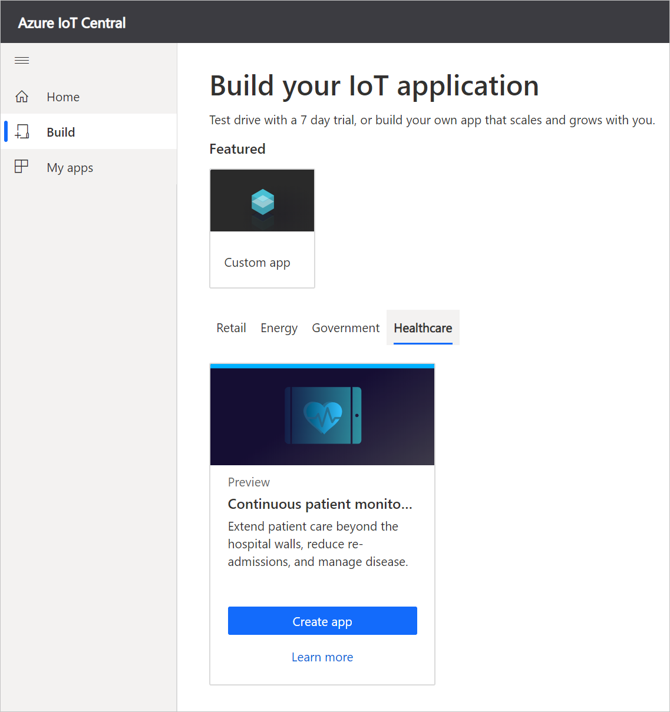
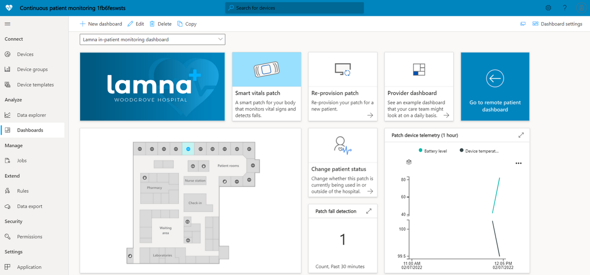
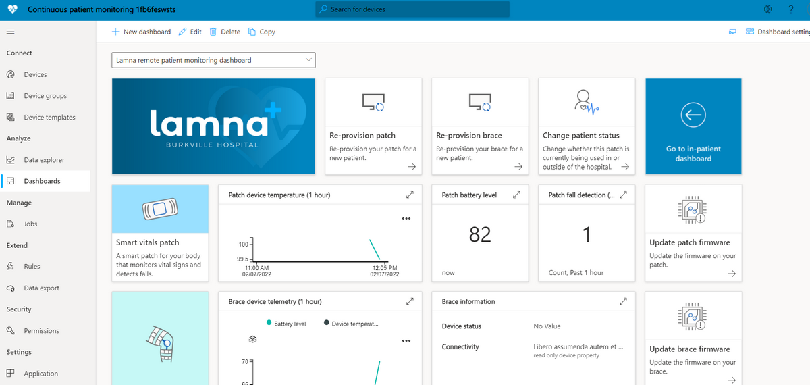
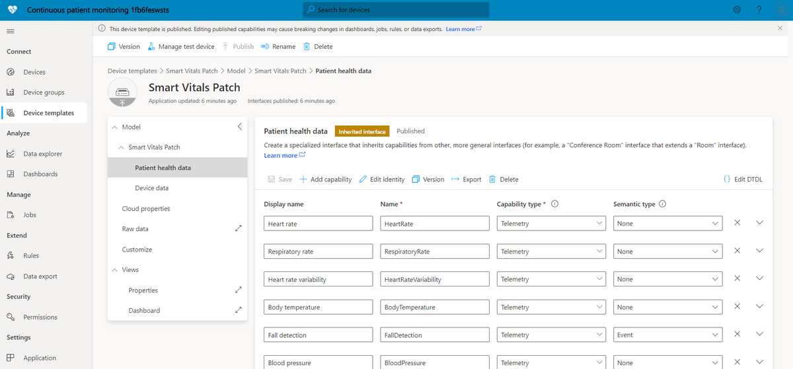
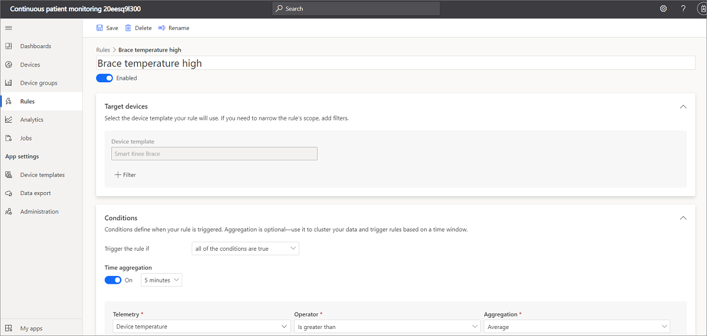
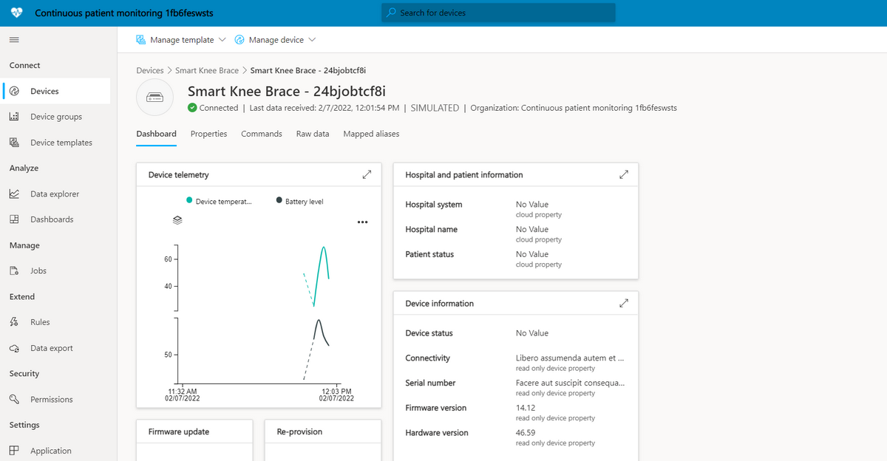
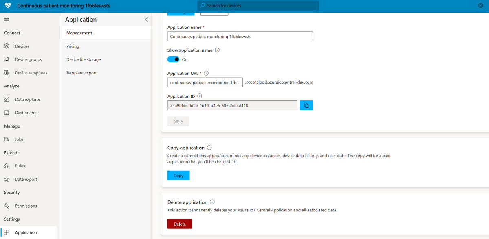

# Tutorial: Deploy and walkthrough a continuous patient monitoring app template

[!INCLUDE [iot-central-pnp-original](../../../includes/iot-central-pnp-original-note.md)]

This tutorial shows you, as a solution builder, how to get started by deploying an IoT Central continuous patient monitoring application template. You will learn how to deploy the template, what's included out of the box, and what you might want to do next.

In this tutorial, you learn how to:

> [!div class="checklist"]
> * Create an application template
> * Walk through the application template

## Create an application template

Navigate to the [Azure IoT Central application manager website](https://apps.azureiotcentral.com/). Select **Build** from the left-hand navigation bar and then click the **Healthcare** tab. 

>[!div class="mx-imgBorder"] 
>

Click the **Create app** button to begin creating your application and then sign in with a Microsoft personal, work, or school account. This takes you to the **New application** page.

>[!div class="mx-imgBorder"] 
>

To create your application:

1. Azure IoT Central automatically suggests an application name based on the template you've selected. You can accept this name or enter your own friendly application name, such as **Continuous Patient Monitoring**. Azure IoT Central also generates a unique URL prefix for you based on the application name. You're free to change this URL prefix to something more memorable if you'd like.

2. You can select whether you would like to create a **Trial** application or a **Pay-As-You-Go** application. **Trial** applications are free for seven days before they expire and allow up to five free devices. They can be converted to Pay-As-You-Go at any time before they expire. If you create a Trial application, you need to enter your contact information and choose whether to receive information and tips from Microsoft. **Pay-As-You-Go** applications support up to two free devices and require you to put in your Azure subscription information.

3. Select **Create** at the bottom of the page to deploy your application.

## Walk through the application template

### Dashboards

After deploying the app template, you will first land on the **Lamna in-patient monitoring dashboard**. Lamna Healthcare is a fictitious hospital system that contains two hospitals: Woodgrove Hospital and Burkville Hospital. On this operator dashboard for Woodgrove Hospital, you will see information and telemetry about the devices in this template along with a set of commands, jobs, and actions that you can take. From the dashboard you can:

* See device telemetry and properties such as the **battery level** of your device or its **connectivity** status.

* View the **floor plan** and location of the Smart Vitals Patch device.

* **Re-provision** the Smart Vitals Patch for a new patient.

* See an example of a **provider dashboard** that a hospital care team might see to track their patients.

* Change the **patient status** of your device to indicate if the device is being used for an in-patient or remote scenario.

>[!div class="mx-imgBorder"] 
>

You can also click on **Go to remote patient dashboard** to see the second operator dashboard used for Burkville Hospital. This dashboard contains a similar set of actions, telemetry, and information. In addition, you can see multiple devices being used and have the ability to **update the firmware** on each.

>[!div class="mx-imgBorder"] 
>

On both dashboards you can always link back to this documentation.

### Device templates

If you click on the **Device templates** tab, you will see that there are two different device types that are part of the template:

* **Smart Vitals Patch**: This device represents a patch that measures a variety of vitals signs that could be used for monitoring patients in and outside of the hospital. If you click on the template, you'll see that in addition to sending device data such as battery level and device temperature, the patch is also sending patient health data such as respiratory rate and blood pressure.

* **Smart Knee Brace**: This device represents a knee brace that patients might use when recovering from a knee replacement surgery. If you click on this template, you'll see capabilities such as range of motion and acceleration, in addition to device data.

>[!div class="mx-imgBorder"] 
>

If you click on the **Device groups** tab you will also see that these device templates automatically have device groups created for them.

### Rules

When jumping to the rules tab, you will see three rules that exist in the application template:

* **Brace temperature high**: This rule is triggered when the device temperature of the Smart Knee Brace is greater than 95&deg;F over a 5-minute window. You could use this rule to alert the patient and care team, and cool the device down remotely.

* **Fall detected**: This rule is triggered if a patient fall is detected. You could use this rule to configure an action to deploy an operational team to assist the patient who has fallen.

* **Patch battery low**: This rule is triggered when the battery level on the device goes below 10%. You could use this rule to trigger a notification to the patient to charge their device.

>[!div class="mx-imgBorder"] 
>

### Devices

Click on the **Devices** tab and then select an instance of the **Smart Knee Brace**. You will see that there are three views to be able to explore information about the particular device that you have selected. These views are created and published when building the device template for your device. This means they will be consistent across all devices that you connect or simulate.

The **Dashboard** view gives an overview of telemetry and properties that are coming from the device that are operator-oriented.

The **Properties** tab will allow you to edit cloud properties and read/write device properties.

The **Commands** tab will allow you to run commands that have been modeled as part of your device template.

>[!div class="mx-imgBorder"] 
>

## Clean up resources

If you're not going to continue to use this application, delete the application by visiting **Administration > Application settings** and click **Delete**.

>[!div class="mx-imgBorder"] 
>

## Next steps

Advance to the next article to learn how to create a provider dashboard that connects to your IoT Central application.

> [!div class="nextstepaction"]
> [Build a provider dashboard](howto-health-data-triage.md)