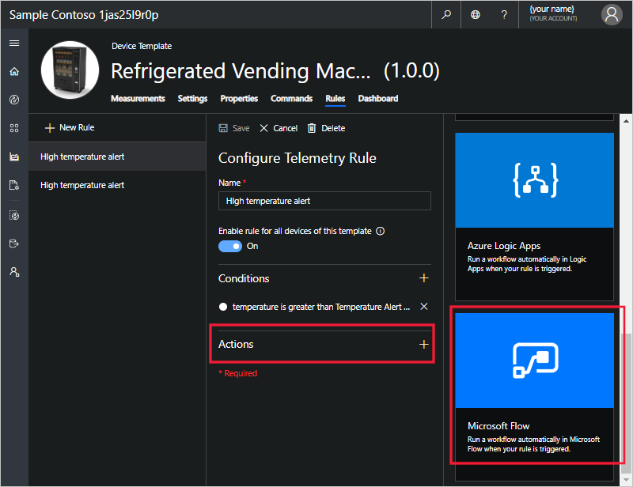
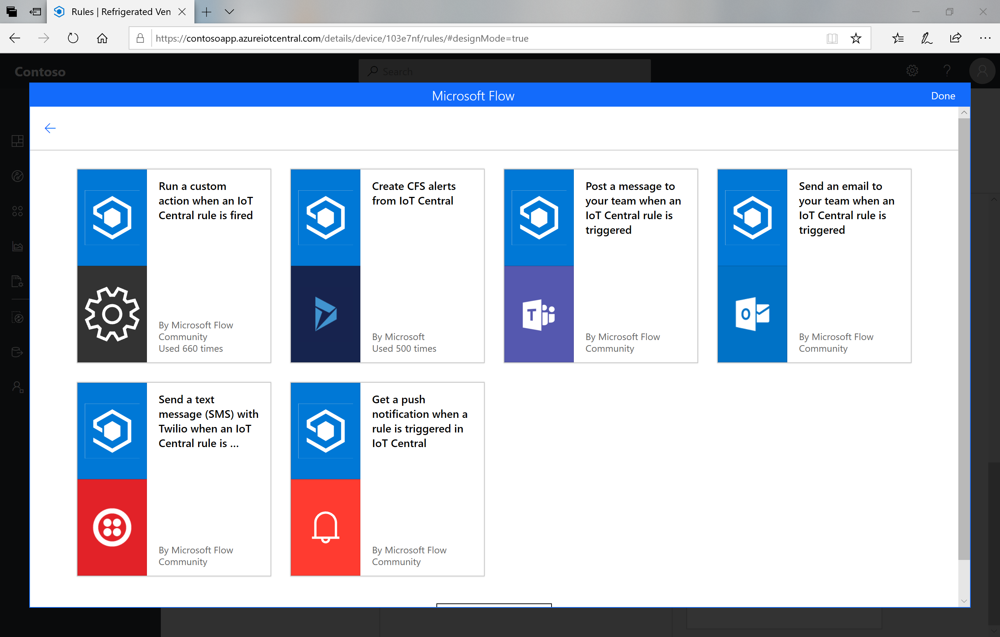
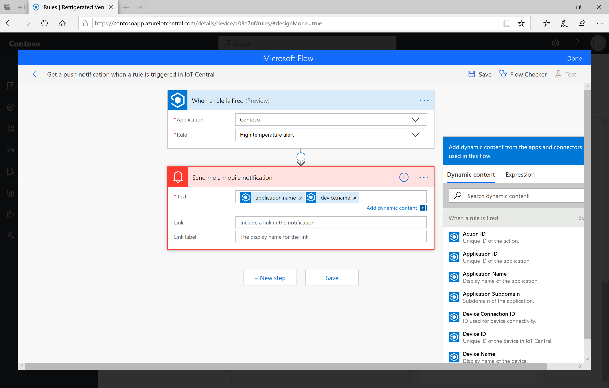
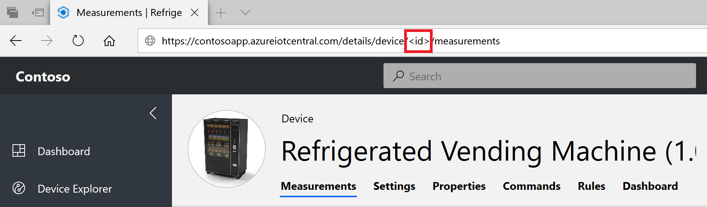
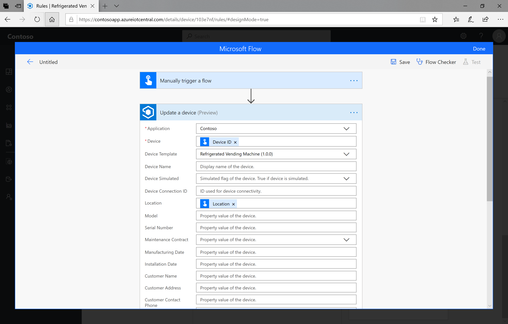
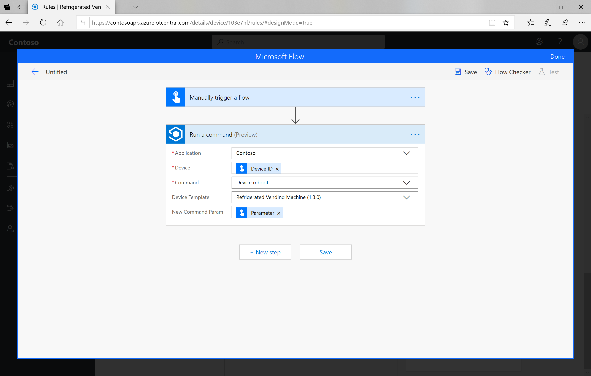

# Build workflows with the IoT Central connector in Microsoft Flow

*This topic applies to builders and administrators.*

Use Microsoft Flow to automate workflows across the many applications and services that business users rely on. Using the IoT Central connector in Microsoft Flow, you can trigger workflows when a rule is triggered in IoT Central. In a workflow triggered by IoT Central or any other application, you can use the actions in the IoT Central connector to:
- Create a device
- Get device information
- Update a device's properties and settings
- Run a command on a device
- Delete a device

Check out [these Microsoft Flow templates](https://aka.ms/iotcentralflowtemplates) that connect IoT Central to other services such as mobile notifications and Microsoft Teams.

## Prerequisites

- A Pay-As-You-Go application
- A Microsoft personal or work or school account to use Microsoft Flow ([learn more about Microsoft Flow plans](https://aka.ms/microsoftflowplans))
- A work or school account to use the Azure IoT Central connector

## Trigger a workflow

This section shows you how to trigger a mobile notification in the Flow mobile app when a rule triggers in IoT Central. You can build this entire workflow within your IoT Central app using the embedded Microsoft Flow designer.

1. Start by [creating a rule in IoT Central](howto-create-telemetry-rules.md). After you save the rule conditions, select the **Microsoft Flow action** as a new action. A dialog window will open for you to configure your workflow. The IoT Central user account you are signed into will be used to sign into Microsoft Flow.

    

1. You will see a list of workflows that you have access to and are attached to this IoT Central rule. Click **Explore templates** or **New > Create from template** and you can choose from any of the templates available. 

    

1. You will be prompted to sign into the connectors in the template you chose. 

    > [!NOTE]
    > To use the Azure IoT Central connector, you must sign in using an Azure Active Directory account (work or school account). A personal account such as abc@outlook.com or abc@live.com are not supported by the Azure IoT Central connector.

    Once you have signed into the connectors, you will land in designer to build your workflow. The workflow has an IoT Central trigger that has your Application and Rule already filled in.

1. You can customize the workflow by customizing the information passed to the action and adding new actions. In this example, the action is **Notifications - Send me a mobile notification**. You can include *Dynamic content* from your IoT Central rule, passing along important information such as device name and timestamp to your notification.

    > [!NOTE]
    > Select the **See more** text in the Dynamic content window to get measurement and property values that triggered the rule.

    

1. When you are done editing your action, select **Save**. You'll be directed to your workflow's overview page. Here you can see the run history and share it with other colleagues.

    > [!NOTE]
    > If you want other users in your IoT Central app to edit this rule, you must share it with them in Microsoft Flow. Add their Microsoft Flow accounts as owners in your workflow.

1. If you go back to your IoT Central app, you'll see this rule has a Microsoft Flow action in the Actions area.

You can also build workflows using the IoT Central connector directly from Microsoft Flow. You can then choose which IoT Central app to connect to.

## Create a device in a workflow

This section shows you how to create a new device in IoT Central at the push of a button on a mobile device using the Microsoft Flow mobile app. You can use this action in Flow to integrate ERP systems like Dynamics with IoT Central by creating a new device when a device is added elsewhere.

1. Start by creating a blank workflow in Microsoft Flow.

1. Search for **Flow button for mobile** as a trigger.

1. In this trigger, add a text input called **Device name**. Change the description text to be **Enter the device name of your new device**.

1. Add a new action. Search for the **Azure IoT Central - Create a device** action.

1. Pick your application, and choose a device template to create a device from in the dropdowns. You'll see the action expand to show all the properties and settings of the device.

1. Select the Device Name field. From the dynamic content pane, choose **Device Name**. This value is passed from the input the user enters through the mobile app, and is the name of your new device in IoT Central. In this example, the only required field is the device name, indicated by the red asterisk. Another device template may have multiple required fields that need to be filled in to create a new device.

    

1. (Optional) Fill in other fields as you see fit for your creating new devices.

1. Finally, save your workflow.

1. Try your workflow in the Microsoft Flow mobile app. Go to the **Buttons** tab in the app. You should see your Button -> Create a new device workflow. Enter the name of your new device, and watch it show up in IoT Central!

    

## Update a device in a workflow

This section shows you how to update device settings and properties in IoT Central at the push of a button on a mobile device using the Microsoft Flow mobile app.

1. Start by creating a blank workflow in Microsoft Flow.

1. Search for **Flow button for mobile** as a trigger.

1. In this trigger, add an input like a **Location** text input that corresponds to a setting or property you want to change. Change the description text.

1. Add a new action. Search for the **Azure IoT Central - Update a device** action.

1. Pick your application from the dropdown. Now you'll need an ID of the existing device you want to update. 

    > [!NOTE] 
    > **You must use the ID found in the URL** on the device details page of the device you want to update. The device ID found in the device explorer's list of devices is not the right one to use in Microsoft Flow.

    

1. You can update the device name. To update any of the device's properties and settings, you must select the device template of the device you want to update in the **Device Template** dropdown. The action tile expands to show all the properties and settings you can update.

    

1. Select each of the properties and settings you want to update. From the dynamic content pane, choose the corresponding input from the trigger. In this example, the Location value is propagated down to update the device's Location property.

1. Finally, save your workflow.

1. Try your workflow in the Microsoft Flow mobile app. Go to the **Buttons** tab in the app. You should see your Button -> Update a device workflow. Enter the inputs, and see the device get updated in IoT Central!

## Get device information in a workflow

You can get device information by its ID using the **Azure IoT Central - Get a device** action. 
> [!NOTE] 
> **You must use the ID found in the URL** on the device details page of the device you want to update. The device ID found in the device explorer's list of devices is not the right one to use in Microsoft Flow.

You can get information such as device name, device template name, property values, and settings values to pass to later actions in your workflow. Here is an example workflow that passes along the Customer Name property value from a device to Microsoft Teams.

   


## Run a command on a device in a workflow
You can run a command on a device specified by its ID using the **Azure IoT Central - Run a command** action. 

> [!NOTE] 
> **You must use the ID found in the URL** on the device details page of the device you want to update. The device ID found in the device explorer's list of devices is not the right one to use in Microsoft Flow.
    
You can pick the command to run and pass in the parameters of the command through this action. Here is an example workflow that runs a device reboot command from a button in the Microsoft Flow mobile app.

   

## Delete a device in a workflow

You can delete a device by its ID using the **Azure IoT Central - Delete a device** action. 
> [!NOTE] 
> **You must use the ID found in the URL** on the device details page of the device you want to update. The device ID found in the device explorer's list of devices is not the right one to use in Microsoft Flow.

Here is an example workflow that deletes a device at the push of a button in the Microsoft Flow mobile app.

   

## Troubleshooting

If you are having trouble creating a connection to the Azure IoT Central connector, here are some tips to help you.

1. Microsoft personal accounts (such as @hotmail.com, @live.com, @outlook.com domains) are not supported at this time. You must use an Azure Active Directory (AD) work or school account.

2. To use the IoT Central connector in Microsoft Flow, you must have signed into the IoT Central application at least once. Otherwise the application won't appear in the Application dropdowns.

3. If you are receiving an error while using an Azure AD account, try opening Windows PowerShell and run the following commandlets as an administrator.

    ``` PowerShell
    Install-Module AzureAD
    Connect-AzureAD
    New-AzureADServicePrincipal -AppId 9edfcdd9-0bc5-4bd4-b287-c3afc716aac7 -DisplayName "Azure IoT Central"
    ```

## Next steps

Now that you've learned how to use Microsoft Flow to build workflows, the suggested next step is to [manage devices](howto-manage-devices.md).

