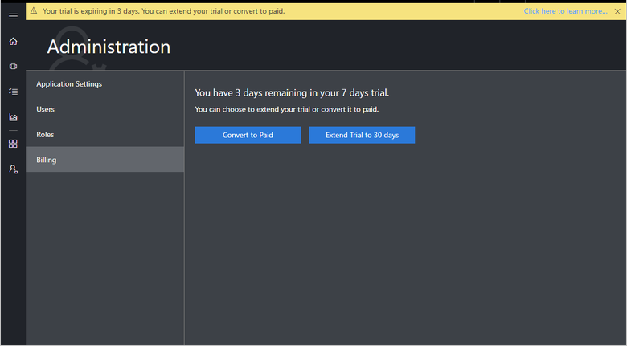
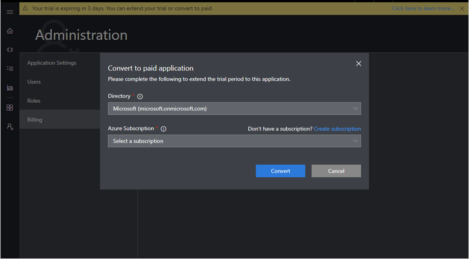

# Administer your IOT Central application

After you create a Microsoft Azure IoT Central application, you can use the **Administration** section of the Azure IoT Central user interface to administer it. To go to the **Administration** section, select **Administration** on the left navigation menu.

The **Administration** section enables you to:

- Manage users

- Manage roles

- View billing information

- Manage application settings

- Offer a free trial

In the **Administration** section, a secondary navigation menu has links to the various administration tasks.

To access and use the **Administration** section, you must be in the **Administrator** role for an Azure IoT Central application. If you create an Azure IoT Central application, you're automatically assigned to the **Administrator** role for that application. The *Managing Users* section in this article explains more about how to assign the **Administrator** role to other users.

## Change application name

To change the name of your application, use the secondary navigation menu to go to the **Application Settings** page in the **Administration** section.

On the **Application Settings** page, enter a name of your choice in the **Application Name** field. Then select **Save**.

## Change the application URL

To change the URL for your application, use the secondary navigation menu to navigate to the **Application Settings** page in the **Administration** section.

On the **Application Settings** page, enter the URL of your choice in the **URL** field, and then select **Save**. Your URL can be at most 200 characters in length. If the URL isn't available, you see a validation error.

> [!Note]
> If you change your URL, your old URL can be taken by another Azure IoT Central customer. If that happens, it is no longer available for you to use. When you change your URL, the old URL no longer works, and you need to notify your users about the new URL to use.

## Change the application image

For more information about using images in an Azure IoT Central application, see [Prepare and upload images to your Azure IoT Central application](howto-prepare-images.md).

## Copy an application

You can create a copy of any application, minus any device instances, device data history, and user data. The copy will be a paid application that you're charged for. You can't create a trial application by copying another application.

To copy an application, go to the **Application Settings** page. Then select the **Copy** button.

Selecting the **Copy** button opens a dialog box in which you can select a name, URL, Azure AD directory, subscription, and Azure region for the new application that will be created by copying your application. Select values for each of those fields. Then select the **Copy** button to confirm that you want to proceed. You can learn more about what to enter for those values in this article about [how to create an application](howto-create-application.md).

After the app copy operation succeeds, you  can go to the new application that was created by copying your application. To go to the app, select the link that appears on the **Application Settings** page.

> [!Note]
> Copying an application also copies the definition of rules or actions. But because users who have access to your original app aren't copied to the copied app, you have to manually add users to actions such as email for which users are a pre-requisite.

## Delete an application

To delete your application, use the secondary navigation menu to navigate to the **Application Settings** page in the **Administration** section.

Choose **Delete**.

> [!Note]
> Deleting an application permanently deletes all data that's associated with that application.  To delete an application, you must also have permissions to delete resources in the Azure subscription you chose when you created the application. To learn more, see [Use role-based access control to manage access to your Azure subscription resources](https://docs.microsoft.com/azure/active-directory/role-based-access-control-configure).

## Roles in Azure IoT Central

Roles enable you to control who within your organization can perform various Azure IoT Central tasks. Azure IoT Central has three roles you can assign to users of your application. Roles are assigned by each application. The same user can have different roles in different applications. You can assign the same user to multiple roles within an application.

### Administrator

Users in the **Administrator** role have access to all functionality in an Azure IoT Central application.

The user who creates an application is automatically assigned to the **Administrator** role. There must always be at least one user in the **Administrator** role.

### Application Builder

Users in the **Application Builder** role can do everything in an Azure IoT Central application except administer the application.

### Application Operator

Users in the **Application Operator** role don't have access to the **Application Builder** page. They can't administer the application.

## Manage users

Application administrators can assign users to the roles in the application.

### Add users

Every user must have a user account before they can sign in and access an Azure IoT Central application. Microsoft Accounts (MSAs) and Azure Active Directory (Azure AD) accounts are supported in Azure IoT Central. Azure Active Directory groups aren't currently supported in Azure IoT Central.

For more information, see [Microsoft account help](https://support.microsoft.com/products/microsoft-account?category=manage-account) and  [Quickstart: Add new users to Azure Active Directory](https://docs.microsoft.com/azure/active-directory/add-users-azure-active-directory).

1. To add a user account to an Azure IoT Central application, use the secondary navigation menu to go to the **Users** page in the **Administration** section.

    

1. To add a user, on the **Users** page, choose **+ Add user**.

    

1. Choose a role for the user from the **Role** drop-down menu. Learn more about roles in the *Roles in Azure IoT Central* section of this article.

    

    > [!NOTE]
    >  To add users in bulk, enter the user IDs of all the users you'd like to add separated by semi-colons. Choose a role from the **Role** drop-down menu. Then select **Save**.

1. After you add a user, an entry appears for that user on the **Users** page.

    

### Edit the roles that are assigned to users

Roles can't be changed after they are assigned. To change the role that's assigned to a user, delete the user, and then add the user again with a different role.

### Delete users

To delete users, select one or more check boxes on the **Users** page. Then select **Delete**.

## View your bill

To view your bill, go to the **Billing** page in the **Administration** section. Then select **Billing**. The Azure billing page opens in a new tab, where you can see the bill for each of your Azure IoT Central applications.

## Convert your trial to a paid application

After you've evaluated IoT Central, you can convert your trial to a paid application. To complete this self-service process, follow these steps:

1. Use the secondary navigation menu to go to the **Billing** page in the **Administration** section. If you haven't extended your trial, the page looks like the following screenshot:

    

2. Select **Convert to Paid**. If you haven't extended your trial, the pop-up window looks like the following screenshot:

    

3. In the pop-up window, select the appropriate Azure Active Directory tenant, and then the Azure subscription to use for your IoT Central application.

3. After you select **Convert**, your trial coverts to a paid application and you start getting billed.

## Extend your free trial

By default, all free trials are available for seven days. If you'd like to increase your trial to 30 days, follow these steps:

1. Use the secondary navigation menu to go to the **Billing** page in the **Administration** section.

1. Select **Extend Trial**. In the pop-up window, select the appropriate Azure Active Directory tenant and then the Azure subscription to use for your IoT Central application.

1. Then select **Extend**. Your trial is now valid for 30 days.

## Use the Azure SDKs for control plane operations

IoT Central Azure Resource Manager SDK packages are available for Node, Python, C#, Ruby, Java, and Go. These libraries support control plane operations for IoT Central, which enable you to create, list, update, or delete IoT Central applications. They also provide helpers for dealing with authentication and error handling that is specific to each language. 

You can find examples of how to use the Azure Resource Manager SDKs at [https://github.com/emgarten/iotcentral-arm-sdk-examples](https://github.com/emgarten/iotcentral-arm-sdk-examples).

To learn more, take a look at these packages on GitHub.

| Language | Repository | Package |
| ---------| ---------- | ------- |
| Node | [https://github.com/Azure/azure-sdk-for-node](https://github.com/Azure/azure-sdk-for-node) | [https://www.npmjs.com/package/azure-arm-iotcentral](https://www.npmjs.com/package/azure-arm-iotcentral)
| Python |[https://github.com/Azure/azure-sdk-for-python](https://github.com/Azure/azure-sdk-for-python) | [https://pypi.org/project/azure-mgmt-iotcentral](https://pypi.org/project/azure-mgmt-iotcentral)
| C# | [https://github.com/Azure/azure-sdk-for-net](https://github.com/Azure/azure-sdk-for-net) | [https://www.nuget.org/packages/Microsoft.Azure.Management.IotCentral](https://www.nuget.org/packages/Microsoft.Azure.Management.IotCentral)
| Ruby | [https://github.com/Azure/azure-sdk-for-ruby](https://github.com/Azure/azure-sdk-for-ruby) | [https://rubygems.org/gems/azure_mgmt_iot_central](https://rubygems.org/gems/azure_mgmt_iot_central)
| Java | [https://github.com/Azure/azure-sdk-for-java](https://github.com/Azure/azure-sdk-for-java) | [https://search.maven.org/search?q=a:azure-mgmt-iotcentral](https://search.maven.org/search?q=a:azure-mgmt-iotcentral)
| Go | [https://github.com/Azure/azure-sdk-for-go](https://github.com/Azure/azure-sdk-for-go) | [https://github.com/Azure/azure-sdk-for-go](https://github.com/Azure/azure-sdk-for-go)

## Next steps

Now that you've learned how to administer your Azure IoT Central application, here is the suggested next step:

> [!div class="nextstepaction"]
> [Set up the device template](howto-set-up-template.md)
