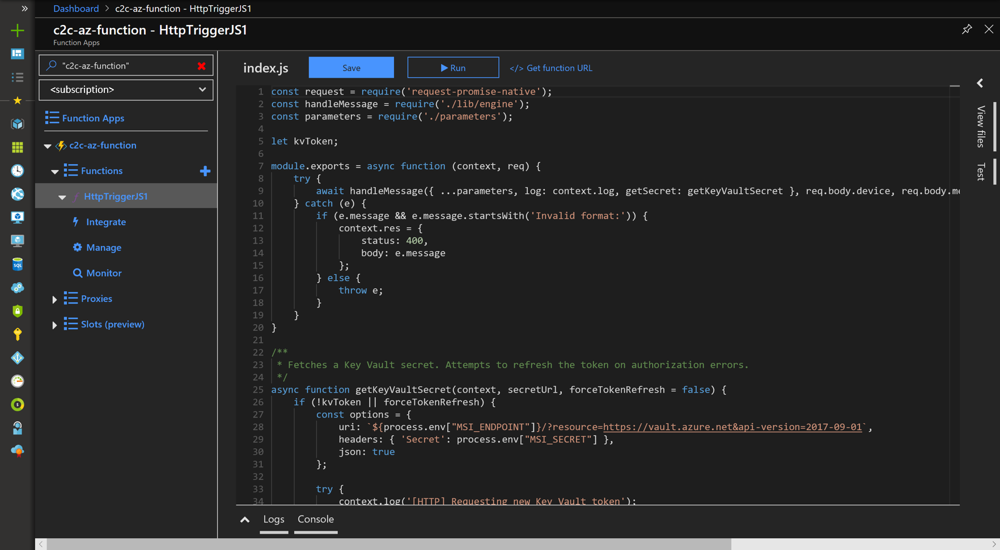

---
# Mandatory fields. See more on aka.ms/skyeye/meta.
title: Build the Azure IoT Central device bridge | Microsoft Docs
description: Build the IoT Central device bridge to connect other IoT clouds (Sigfox, Particle, The Things Network etc.) to your IoT Central app.
services: iot-central
ms.service: iot-central
author: viv-liu
ms.author: viviali
ms.date: 07/09/2019
ms.topic: conceptual
manager: peterpr
---

# Build the IoT Central device bridge to connect other IoT clouds to IoT Central

*This topic applies to administrators.*

The IoT Central device bridge is an open-source solution that connects your Sigfox, Particle, The Things Network, and other clouds to your IoT Central app. Whether you are using asset tracking devices connected to Sigfox’s Low-Power-Wide Area Network, or using air quality monitoring devices on the Particle Device Cloud, or using soil moisture monitoring devices on TTN, you can directly leverage the power of IoT Central using the IoT Central device bridge. The device bridge connects other IoT clouds with IoT Central by forwarding the data your devices send to the other clouds through to your IoT Central app. In your IoT Central app, you can build rules and run analytics on that data, create workflows in Microsoft Flow and Azure Logic apps, export that data, and much more. Get the [IoT Central device bridge](https://aka.ms/iotcentralgithubdevicebridge) from GitHub

## What is it and how does it work?
The IoT Central device bridge is an open-source solution in GitHub. It is ready to go with a “Deploy to Azure” button that deploys a custom Azure Resource Manager template with several Azure resources into your Azure subscription. The resources include:
-	Azure Function app
-	Azure Storage Account
-	Consumption Plan
-	Azure Key Vault

The function app is the critical piece of the device bridge. It receives HTTP POST requests from other IoT platforms or any custom platforms via a simple webhook integration. We have provided examples that show how to connect to Sigfox, Particle, and TTN clouds. You can easily extend this solution to connect to your custom IoT cloud if your platform can send HTTP POST requests to your function app.
The Function app transforms the data into a format accepted by IoT Central and forwards it along via DPS APIs.

If your IoT Central app recognizes the device by device ID in the forwarded message, a new measurement will appear for that device. If the device ID has never been seen by your IoT Central app, your function app will attempt to register a new device with that device ID, and it will appear as an “Unassociated device” in your IoT Central app. 

## How do I set it up?
The instructions are listed in detail in the README file in the GitHub repo. 

## Pricing
The Azure resources will be hosted in your Azure subscription. You can learn more about pricing in the [README file](https://aka.ms/iotcentralgithubdevicebridge).

## Next steps
Now that you've learned how to build the IoT Central device bridge, here is the suggested next step:

> [!div class="nextstepaction"]
> [Manage your devices](howto-manage-devices.md)
