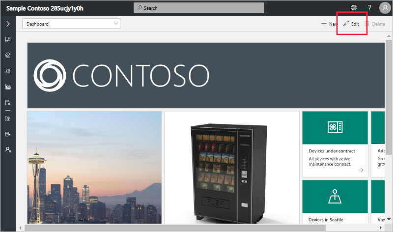
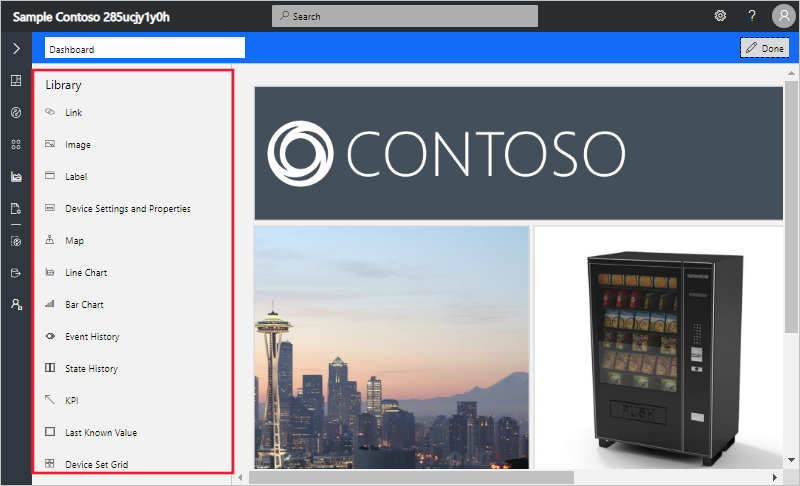

# Configure the application dashboard

The **Dashboard** is the page that loads when users who have access to the application navigate to the application's URL. If you selected either the **Sample Contoso** or **Sample Devkits** application template to create your application, your application has a pre-defined dashboard. If you chose the **Custom Application** application template, your dashboard is blank.

> [!NOTE]
> Users can also [create their own personal dashboards](howto-personalize-dashboard.md) to use instead of the default application dashboard.

## Add tiles

The following screenshot shows the dashboard in an application created from the **Sample Contoso** template. To customize the default dashboard for your application, select **Edit** at the top right of the page.

Selecting **Edit**, opens the dashboard library panel. The library contains the tiles and dashboard primitives you can use to customize the dashboard.

For example, you can add a **Device Settings and Properties** tile to show a selection of the current settings and properties values for a device. To do so, first select a **Device Template** then select a **Device Instance**. After that give the tile a title and select a **Setting** or a **Property** to display. The following screenshot shows settings and properties selected to add to the tile. Select **Done** to save the change to the dashboard.

Now when an operator views the default application dashboard, they see the new tile with the **Set Temperature** setting for the device:

You can explore other tile types in the library to discover how to further customize the default application dashboard.

To learn more about how to use tiles in Azure IoT Central, see [Use dashboard tiles](howto-use-tiles.md).

## Next steps

Now that you've learned how to configure your Azure IoT Central default application dashboard, you can:

> [!div class="nextstepaction"]
> [Learn how to prepare and upload images](howto-prepare-images.md)
