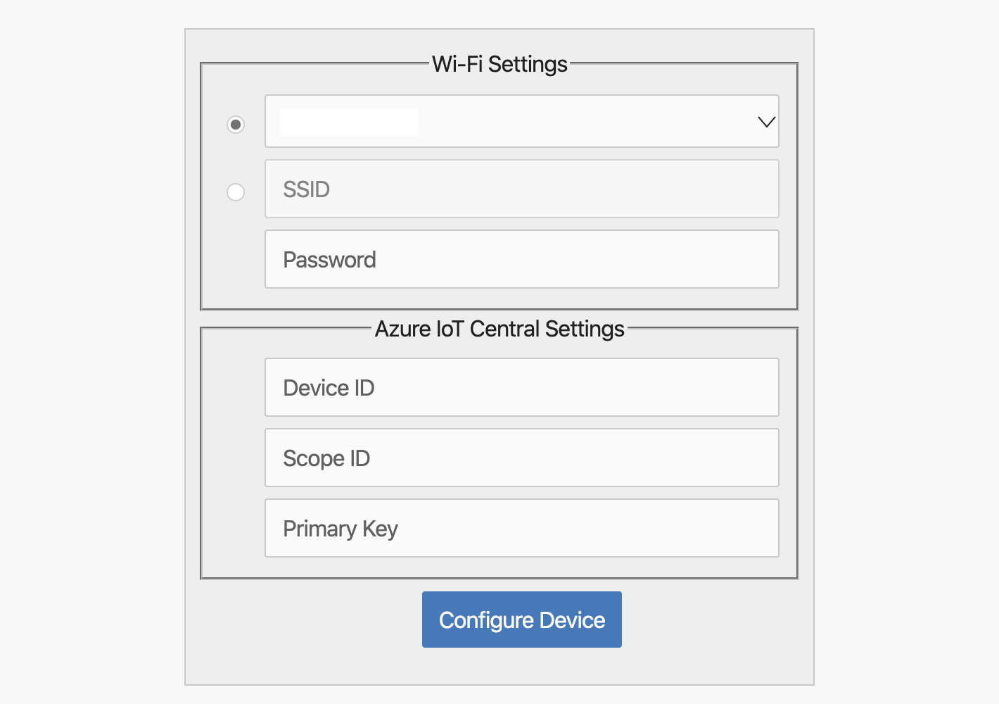

# Connect an MXChip IoT DevKit device to your Azure IoT Central application via IoT Plug and Play

This article describes how to connect MXChip IoT DevKit as a certified IoT Plug and Play device to Azure IoT Central.

## What you learn

- Add and configure a real device in Azure IoT Central application.
- Prepare the device and connect to Azure IoT Central.
- View the telemetry and properties from the device, write properties (settings) and send commands to the device.

## What you need

To complete the steps in this article, you need the following resources:

1. An MXChip IoT DevKit. [Get it now](https://aka.ms/iot-devkit-purchase).
1. An IoT Central application created from the **Preview application**. You can follow the steps in [Create an IoT Plug and Play application](https://docs.microsoft.com/azure/iot-central/quick-deploy-iot-central-pnp).

## Get group device connection details

In your Azure IoT Central application, select **Administration** tab, choose **Device Connection**. Make a note of the **Scope ID** and **Primary key**.

## Prepare the DevKit device

1. Download the latest [pre-built Azure IoT Central Plug and Play firmware](https://github.com/MXCHIP/IoTDevKit/raw/master/pnp/iotc_devkit/bin/iotc_devkit.bin) for the MXChip from GitHub.

1. Connect the DevKit device to your development machine using a USB cable. In Windows, a file explorer window opens on a drive mapped to the storage on the DevKit device. For example, the drive might be called **AZ3166 (D:)**.

1. Drag the **iotc_devkit.bin** file onto the drive window. When the copying is complete, the device reboots with the new firmware.

    > [!NOTE]
    > If you see errors on the screen such as **No Wi-Fi**, this is because the DevKit has not yet been connected to WiFi.

1. On the DevKit, hold down **button B**, push and release the **Reset** button, and then release **button B**. The device is now in access point (AP) mode. To confirm, the screen displays "IoT DevKit - AP" and configuration portal IP address.

1. On your computer or tablet connect to the WiFi network name shown on the screen of the device. The WiFi network starts with **AZ-** followed by the MAC address. When you connect to this network, you don't have internet access. This state is expected, and you're only connected to this network for a short time while you configure the device.

1. Open your web browser and navigate to [http://192.168.0.1/](http://192.168.0.1/). The following web page displays:

    

    On the web page, enter:

    - The name of your WiFi network (SSID)
    - Your WiFi network password
    - The connection details **Device ID** which you can specify by yourself, and **Scope ID**, and **Group SAS Primary Key** of your device (you should have already saved this following the steps)

    > [!NOTE]
    > Currently, the IoT DevKit only can connect to 2.4 GHz Wi-Fi, 5 GHz is not supported due to hardware restrictions.

1. Choose **Configure Device**, the DevKit will reboot and runs the application.

    

    You can see on the DevKit screen for confirm the success running of the application.

    

The DevKit first registers a new device in IoT Central application and then starts sending data.

## View the telemetry in IoT Central

In this step, you view the telemetry and reported property values, and send commands in Azure IoT Central.

1. In your IoT Central application, select **Devices** tab, select the device you added. In the **Overview** tab, you can see the telemetry coming from the DevKit.

   

1. In the **About** tab, you can view the properties reported by the DevKit.

   

1. In the **Commands** page, you can call the commands to execute actions on the DevKit. For example, you run **turnOnLED** command.

   

## Troubleshooting

You can open a serial monitor to see the device output log.

1. Download a serial client such as [Tera Term](https://tera-term.en.lo4d.com/windows).

1. Connect the DevKit to your computer by USB.

1. Open Tera Term, select **serial**, and then expand the port. The device should appear as an STMicroelectronics device. Choose **STMicroelectronics STLink Virtual COM Port**. Click OK.

   

1. Click **Setup** on the menu bar, select **serial port**, and configure the connection speed to **115200** baud. Then choose **OK** to open the serial monitor.

   

1. You can see the output log in the Window.

    

## Review the code

If you want to review the code and customize by modifying and compiling it, go to the [Github repository](https://github.com/MXCHIP/IoTDevKit/tree/master/pnp) to learn the details.

## Next steps

Now that you've learned how to connect a MXChip IoT DevKit to your Azure IoT Central application via IoT Plug and Play, the suggested next step is to learn how to [set up a custom device template](https://docs.microsoft.com/azure/iot-central/howto-set-up-template) for your own IoT device.
