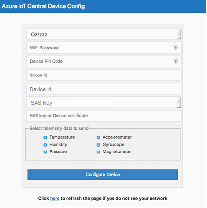
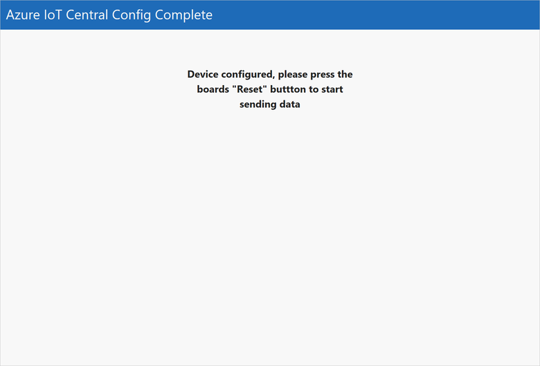
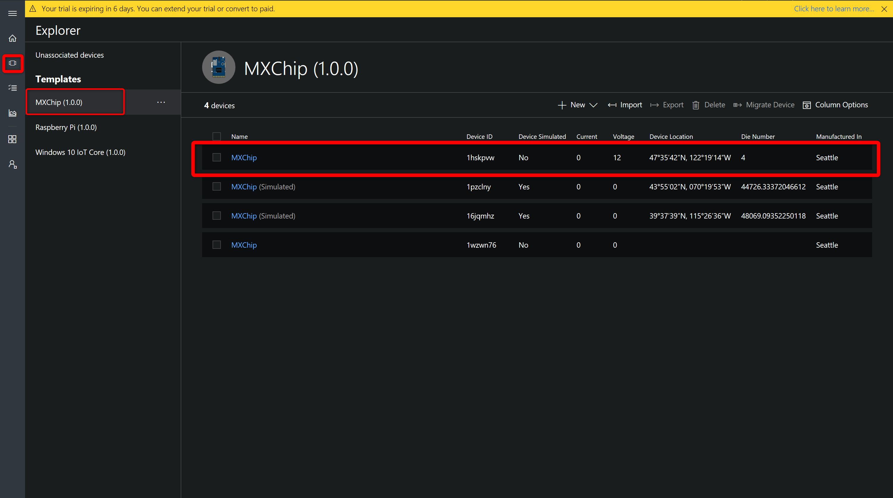
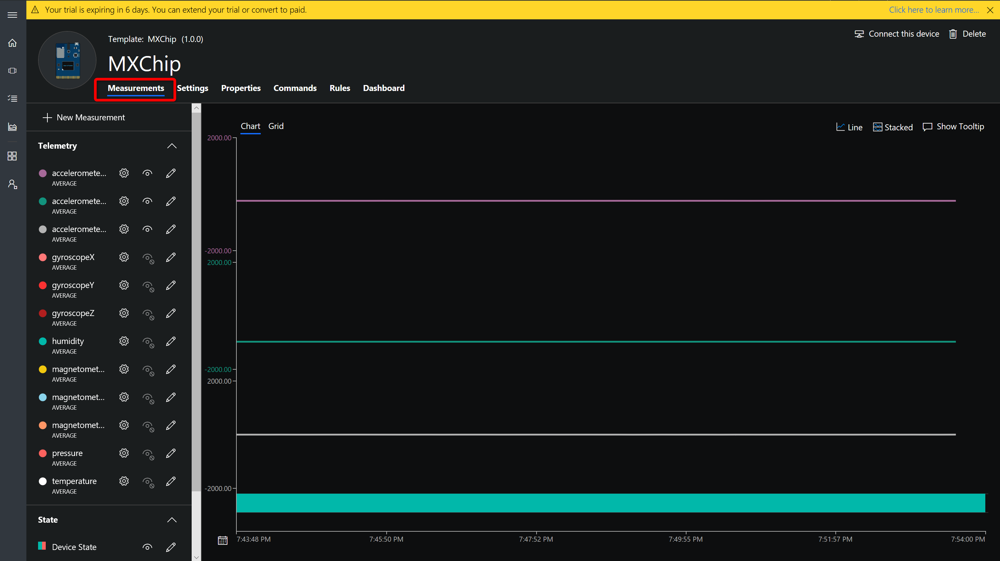
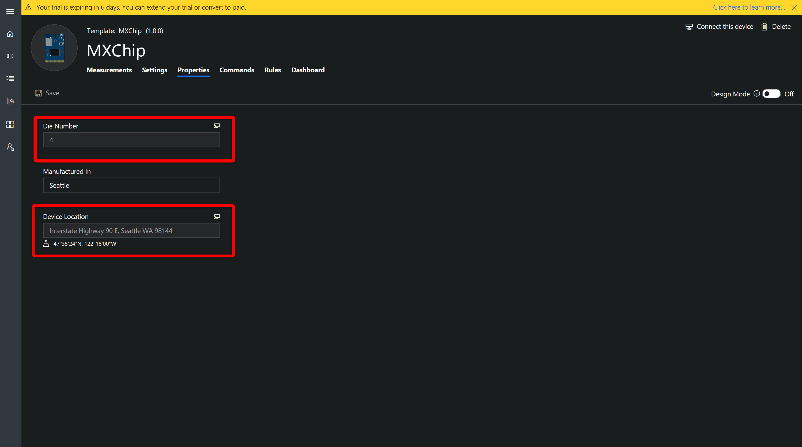
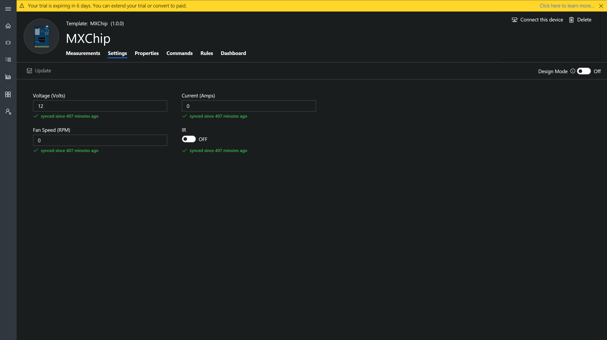
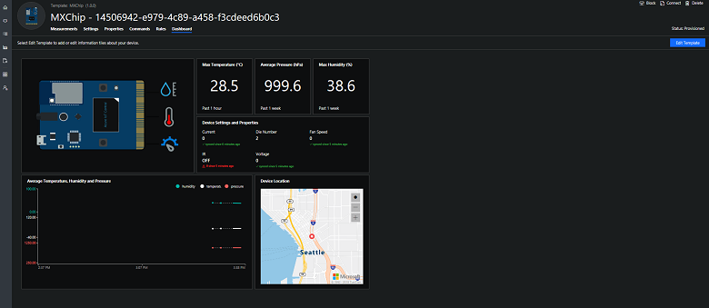
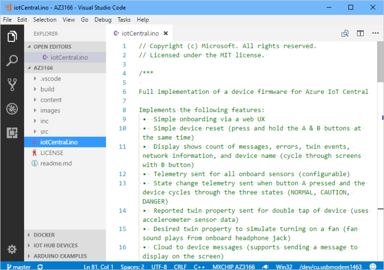

# Connect an MXChip IoT DevKit device to your Azure IoT Central application

This article describes how, as a device developer, to connect a MXChip IoT DevKit (DevKit) device to your Microsoft Azure IoT Central application.

## Before you begin

To complete the steps in this article, you need the following:

1. An Azure IoT Central application created from the **Sample Devkits** application template. For more information, see [Create your Azure IoT Central Application](howto-create-application.md).
1. A DevKit device. To purchase a DevKit device, visit [MXChip IoT DevKit](http://mxchip.com/az3166).


## **Sample Devkits** application

An application created from the **Sample Devkits** application template includes a **MXChip** device template with the following characteristics: 

- Telemetry which contains the measurements for the device **Humidity**, **Temperature**, **Pressure**, **Magnometer** (measured along X, Y, Z axis), **Accelorometer** (measured along X, Y, Z axis) and **Gyroscope** (measured along X, Y, Z axis).
- State which contains an example measurement for **Device State**.
- Event measurement with a **Button B Pressed** event. 
- Settings showing **Voltage**, **Current**, **Fan Speed**, and an **IR** toggle.
- Properties containing device property **die number** and **Device Location** which is a location property as well as in a **Manufactured In** cloud property. 


For full details on the configuration refer to [MXChip Device template details](howto-connect-devkit.md#mxchip-device-template-details)


## Add a real device

In your Azure IoT Central application, add a real device from the **MXChip** device template and make a note of the device connection details (**Scope ID, Device ID, and Primary key**).

1. Add a **real device** from Device Explorer, click on **+New > Real** to add a real device.
    * Enter the Device Id **<span style="color:Red">(should be lower case)</span>** or use the suggested Device Id.
    * Enter the Device Name or use the suggested name
    
    


1. Get connection details such as **Scope ID, Device ID, and Primary key** for the added device by clicking **Connect** on the device page.
 
    

3. Make sure to save these details, as you will temporaritly get disconnected from the internet as you prepare the DevKit device. 


### Prepare the DevKit device

> [!NOTE]
> If you have previously used the device and have wifi credentials stored and would like to reconfigure the device to use a different WiFi network, connection string, or telemetry measurement, press both the **A** and **B** buttons on the board simultaneously. If it doesn't work, press **reset** button and try again.


#### To prepare the DevKit device:


1. Download the latest pre-built Azure IoT Central firmware for the MXChip from the [releases](http://aka.ms/iotcentral-docs-MXChip-releases) page on GitHub.
1. Connect the DevKit device to your development machine using a USB cable. In Windows, a file explorer window opens on a drive mapped to the storage on the DevKit device. For example, the drive might be called **AZ3166 (D:)**.
1. Drag the **iotCentral.bin** file onto the drive window. When the copying is complete, the device reboots with the new firmware.

1. When the DevKit device restarts, the following screen displays:

    ```
    Connect HotSpot:
    AZ3166_??????
    go-> 192.168.0.1 
    PIN CODE xxxxx
    ```

    > [!NOTE]
    > If the screen displays anything else, reset the device and press the **A**  and **B** buttons on the device at the same time to reboot the device. 

1. The device is now in access point (AP) mode. You can connect to this WiFi access point from your computer or mobile device.

1. On your computer, phone, or tablet connect to the WiFi network name shown on the screen of the device. When you connect to this network, you do not have internet access. This state is expected, and you are only connected to this network for a short time while you configure the device.

1. Open your web browser and navigate to [http://192.168.0.1/start](http://192.168.0.1/start). The following web page displays:

    

    In the web page: 
    - add the name of your WiFi network 
    - your WiFi network password
    - PIN CODE shown on the device LCD 
    - the connection details **Scope Id, Device Id, and Primary key** of your device (you should have already saved this following the steps)      
    - Select all the available telemetry measurements! 

1. After you choose **Configure Device**, you see this page:

    

1. Press the **Reset** button on your device.


## View the telemetry

When the DevKit device restarts, the screen on the device shows:

* The number of telemetry messages sent.
* The number of failures.
* The number of desired properties received and the number of reported properties sent.

> [!NOTE]
> If the device appears to be looping during connect check if the device is *Blocked* in IoT Central, and *Unblock* the device so it can connect to the app.

Shake the device increment the number of reported properties sent. The device sends a random number as the **Die number** device property.

You can view the telemetry measurements and reported property values, and configure settings in Azure IoT Central:

1. Use **Device Explorer** to navigate to the **Measurements** page for the real MXChip device you added:

    

1. On the **Measurements** page, you can see the telemetry coming from the MXChip device:

    

1. On the **Properties** page, you can view the last die number and the device location reported by the device:

    

1. On the **Settings** page, you can update the settings on the MXChip device:

    

1. On the **Dashboard** page, you can see the location map

    


## Download the source code

If you want to explore and modify the device code, you can download it from GitHub. If you plan to modify the code, you should follow these instructions to [prepare the development environment](https://microsoft.github.io/azure-iot-developer-kit/docs/get-started/#step-5-prepare-the-development-environment) for your desktop operating system.

To download the source code, run the following command on your desktop machine:

```cmd/sh
git clone https://github.com/Azure/iot-central-firmware
```

The previous command downloads the source code to a folder called `iot-central-firmware`. 

> [!NOTE]
> If **git** is not installed in your development environment, you can download it from [https://git-scm.com/download](https://git-scm.com/download).

## Review the code

Use Visual Studio Code, which was installed when you prepared your development environment, to open the `AZ3166` folder in the `iot-central-firmware` folder: 



To see how the telemetry is sent to the Azure IoT Central application, open the **main_telemetry.cpp** file in the source folder.

The function `buildTelemetryPayload` creates the JSON telemetry payload using data from the sensors on the device.

The function `sendTelemetryPayload` calls `sendTelemetry` in the **iotHubClient.cpp** to send the JSON payload to the IoT Hub your Azure IoT Central application uses.

To see how property values are reported to the Azure IoT Central application, open the **main_telemetry.cpp** file in the source folder.

The function `telemetryLoop` sends the **doubleTap** reported property when the accelerometer detects a double tap. It uses the `sendReportedProperty` function in the **iotHubClient.cpp** source file.

The code in the **iotHubClient.cpp** source file uses functions from the [
Microsoft Azure IoT SDKs and libraries for C](https://github.com/Azure/azure-iot-sdk-c) to interact with IoT Hub.

For information about how to modify, build, and upload the sample code to your device, see the **readme.md** file in the `AZ3166` folder.

## MXChip Device template details 

An application created from the Sample Devkits application template includes a MXChip device template with the following characteristics:

### Measurements

#### Telemetry 

| Field name     | Units  | Minimum | Maximum | Decimal places |
| -------------- | ------ | ------- | ------- | -------------- |
| humidity       | %      | 0       | 100     | 0              |
| temp           | °C     | -40     | 120     | 0              |
| pressure       | hPa    | 260     | 1260    | 0              |
| magnetometerX  | mgauss | -1000   | 1000    | 0              |
| magnetometerY  | mgauss | -1000   | 1000    | 0              |
| magnetometerZ  | mgauss | -1000   | 1000    | 0              |
| accelerometerX | mg     | -2000   | 2000    | 0              |
| accelerometerY | mg     | -2000   | 2000    | 0              |
| accelerometerZ | mg     | -2000   | 2000    | 0              |
| gyroscopeX     | mdps   | -2000   | 2000    | 0              |
| gyroscopeY     | mdps   | -2000   | 2000    | 0              |
| gyroscopeZ     | mdps   | -2000   | 2000    | 0              |


#### States 
| Name          | Display name   | NORMAL | CAUTION | DANGER | 
| ------------- | -------------- | ------ | ------- | ------ | 
| DeviceState   | Device State   | Green  | Orange  | Red    | 

#### Events 
| Name             | Display name      | 
| ---------------- | ----------------- | 
| ButtonBPressed   | Button B Pressed  | 

### Settings

Numeric settings

| Display name | Field name | Units | Decimal places | Minimum | Maximum | Initial |
| ------------ | ---------- | ----- | -------------- | ------- | ------- | ------- |
| Voltage      | setVoltage | Volts | 0              | 0       | 240     | 0       |
| Current      | setCurrent | Amps  | 0              | 0       | 100     | 0       |
| Fan Speed    | fanSpeed   | RPM   | 0              | 0       | 1000    | 0       |

Toggle settings

| Display name | Field name | On text | Off text | Initial |
| ------------ | ---------- | ------- | -------- | ------- |
| IR           | activateIR | ON      | OFF      | Off     |

### Properties

| Type            | Display name | Field name | Data type |
| --------------- | ------------ | ---------- | --------- |
| Device property | Die number   | dieNumber  | number    |
| Device property | Device Location   | location  | location    |
| Text            | Manufactured In     | manufacturedIn   | N/A       |


## Next steps

Now that you have learned how to connect a DevKit device to your Azure IoT Central application, here are the suggested next steps:

* [Prepare and connect a Raspberry Pi](howto-connect-raspberry-pi-python.md)
