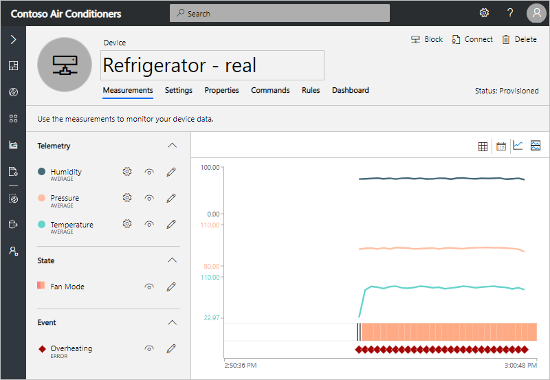
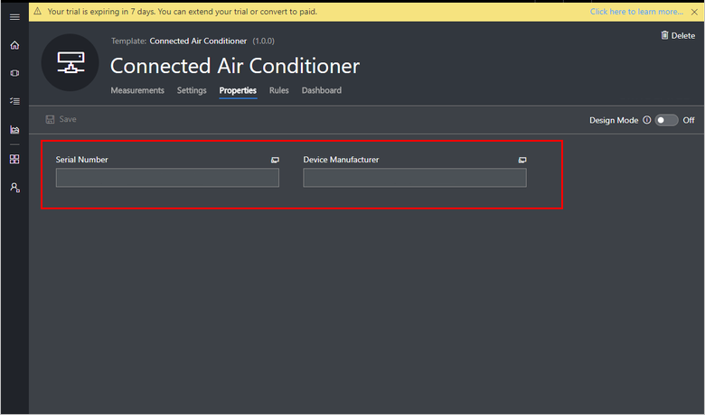
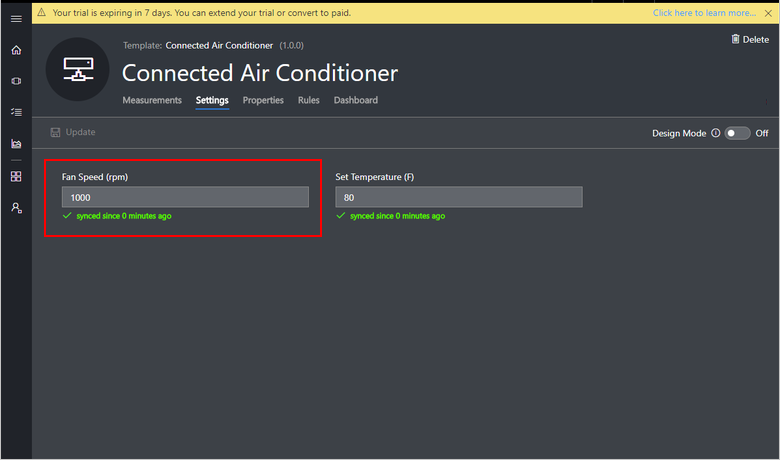
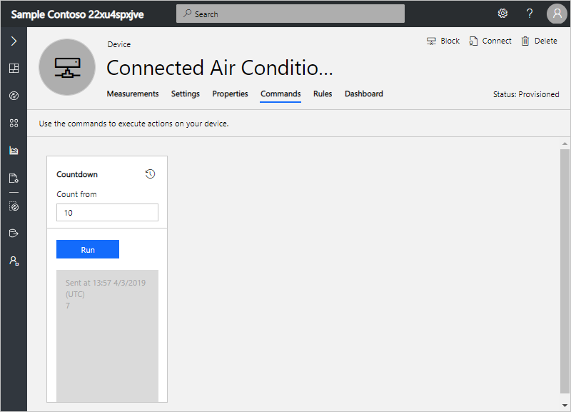

# Connect a generic client application to your Azure IoT Central application (Node.js)

This article describes how, as a device developer, to connect a generic Node.js application representing a real device to your Microsoft Azure IoT Central application.

## Before you begin

To complete the steps in this article, you need the following:

1. An Azure IoT Central application. For more information, see the [create an application quickstart](quick-deploy-iot-central.md).
1. A development machine with [Node.js](https://nodejs.org/) version 4.0.0 or later installed. You can run `node --version` in the command line to check your version. Node.js is available for a wide variety of operating systems.

## Create a Device Template

In your Azure IoT Central application, you need a device template with the following measurements, device properties, settings, and commands:

### Telemetry measurements

Add the following telemetry on the **Measurements** page:

| Display Name | Field Name  | Units | Min | Max | Decimal Places |
| ------------ | ----------- | ----- | --- | --- | -------------- |
| Temperature  | temperature | F     | 60  | 110 | 0              |
| Humidity     | humidity    | %     | 0   | 100 | 0              |
| Pressure     | pressure    | kPa   | 80  | 110 | 0              |

> [!NOTE]
> The data type of the telemetry measurement is a floating point number.

Enter field names exactly as shown in the table into the device template. If the field names don't match the property names in the corresponding device code, the telemetry can't be displayed in the application.

### State measurements

Add the following state on the **Measurements** page:

| Display Name | Field Name  | Value 1 | Display Name | Value 2 | Display Name |
| ------------ | ----------- | --------| ------------ | ------- | ------------ | 
| Fan Mode     | fanmode     | 1       | Running      | 0       | Stopped      |

> [!NOTE]
> The data type of the State measurement is string.

Enter field names exactly as shown in the table into the device template. If the field names don't match the property names in the corresponding device code, the state can't be displayed in the application.

### Event measurements

Add the following event on the **Measurements** page:

| Display Name | Field Name  | Severity |
| ------------ | ----------- | -------- |
| Overheating  | overheat    | Error    |

> [!NOTE]
> The data type of the Event measurement is string.

### Location measurements

Add the following location measurement on the **Measurements** page:

| Display Name | Field Name  |
| ------------ | ----------- |
| Location     | location    |

The location measurement data type is made up of two floating point numbers for longitude and latitude, and an optional floating point number for altitude.

Enter field names exactly as shown in the table into the device template. If the field names don't match the property names in the corresponding device code, the location can't be displayed in the application.

### Device properties

Add the following device properties on the **Properties** page:

| Display Name        | Field Name        | Data type |
| ------------------- | ----------------- | --------- |
| Serial Number       | serialNumber      | text      |
| Device Manufacturer | manufacturer      | text      |

Enter the field names exactly as shown in the table into the device template. If the field names don't match the property names in the corresponding device code, the properties can't be displayed in the application.

### Settings

Add the following **number** settings on the **Settings** page:

| Display Name    | Field Name     | Units | Decimals | Min | Max  | Initial |
| --------------- | -------------- | ----- | -------- | --- | ---- | ------- |
| Fan Speed       | fanSpeed       | rpm   | 0        | 0   | 3000 | 0       |
| Set Temperature | setTemperature | F     | 0        | 20  | 200  | 80      |

Enter field name exactly as shown in the table into the device template. If the field names don't match the property names in the corresponding device code, the device can't receive the setting value.

### Commands

Add the following command on the **Commands** page:

| Display Name    | Field Name     | Default Timeout | Data Type |
| --------------- | -------------- | --------------- | --------- |
| Countdown       | countdown      | 30              | number    |

Add the following input field to the Countdown command:

| Display Name    | Field Name     | Data Type | Value |
| --------------- | -------------- | --------- | ----- |
| Count from      | countFrom      | number    | 10    |

Enter field names exactly as shown in the tables into the device template. If the field names don't match the property names in the corresponding device code, the device can't process the command.

## Add a real device

In your Azure IoT Central application, add a real device to the device template you created in the previous section.

Then follow the instructions in the "Add a device" tutorial to [generate a connection string for the real device](tutorial-add-device.md#generate-connection-string). You use this connection string in the following section:

### Create a Node.js application

The following steps show how to create a client application that implements the real device you added to the application. Here the Node.js application represents the real device. 

1. Create a folder called `connected-air-conditioner-adv` on your machine. Navigate to that folder in your command-line environment.

1. To initialize your Node.js project, run the following commands:

    ```cmd/sh
    npm init
    npm install azure-iot-device azure-iot-device-mqtt --save
    ```

1. Create a file called **connectedAirConditionerAdv.js** in the `connected-air-conditioner-adv` folder.

1. Add the following `require` statements at the start of the **connectedAirConditionerAdv.js** file:

    ```javascript
    "use strict";

    // Use the Azure IoT device SDK for devices that connect to Azure IoT Central.
    var clientFromConnectionString = require('azure-iot-device-mqtt').clientFromConnectionString;
    var Message = require('azure-iot-device').Message;
    var ConnectionString = require('azure-iot-device').ConnectionString;
    ```

1. Add the following variable declarations to the file:

    ```javascript
    var connectionString = '{your device connection string}';
    var targetTemperature = 0;
    var locLong = -122.1215;
    var locLat = 47.6740;
    var client = clientFromConnectionString(connectionString);
    ```

    Update the placeholder `{your device connection string}` with the [device connection string](tutorial-add-device.md#generate-connection-string). In this sample, you initialize `targetTemperature` to zero, you could use the current reading from the device or a value from the device twin.

1. To send telemetry, state, event, and location measurements to your Azure IoT Central application, add the following function to the file:

    ```javascript
    // Send device measurements.
    function sendTelemetry() {
      var temperature = targetTemperature + (Math.random() * 15);
      var humidity = 70 + (Math.random() * 10);
      var pressure = 90 + (Math.random() * 5);
      var fanmode = 0;
      var locationLong = locLong - (Math.random() / 100);
      var locationLat = locLat - (Math.random() / 100);
      var data = JSON.stringify({
        temperature: temperature,
        humidity: humidity,
        pressure: pressure,
        fanmode: (temperature > 25) ? "1" : "0",
        overheat: (temperature > 35) ? "ER123" : undefined,
        location: {
            lon: locationLong,
            lat: locationLat }
        });
      var message = new Message(data);
      client.sendEvent(message, (err, res) => console.log(`Sent message: ${message.getData()}` +
        (err ? `; error: ${err.toString()}` : '') +
        (res ? `; status: ${res.constructor.name}` : '')));
    }
    ```

1. To send device properties to your Azure IoT Central application, add the following function to your file:

    ```javascript
    // Send device reported properties.
    function sendDeviceProperties(twin, properties) {
      twin.properties.reported.update(properties, (err) => console.log(`Sent device properties: ${JSON.stringify(properties)}; ` +
        (err ? `error: ${err.toString()}` : `status: success`)));
    }
    ```

1. To define the settings your device responds to, add the following definition:

    ```javascript
    // Add any settings your device supports,
    // mapped to a function that is called when the setting is changed.
    var settings = {
      'fanSpeed': (newValue, callback) => {
          // Simulate it taking 1 second to set the fan speed.
          setTimeout(() => {
            callback(newValue, 'completed');
          }, 1000);
      },
      'setTemperature': (newValue, callback) => {
        // Simulate the temperature setting taking two steps.
        setTimeout(() => {
          targetTemperature = targetTemperature + (newValue - targetTemperature) / 2;
          callback(targetTemperature, 'pending');
          setTimeout(() => {
            targetTemperature = newValue;
            callback(targetTemperature, 'completed');
          }, 5000);
        }, 5000);
      }
    };
    ```

1. To handle updated settings from your Azure IoT Central application, add the following to the file:

    ```javascript
    // Handle settings changes that come from Azure IoT Central via the device twin.
    function handleSettings(twin) {
      twin.on('properties.desired', function (desiredChange) {
        for (let setting in desiredChange) {
          if (settings[setting]) {
            console.log(`Received setting: ${setting}: ${desiredChange[setting].value}`);
            settings[setting](desiredChange[setting].value, (newValue, status, message) => {
              var patch = {
                [setting]: {
                  value: newValue,
                  status: status,
                  desiredVersion: desiredChange.$version,
                  message: message
                }
              }
              twin.properties.reported.update(patch, (err) => console.log(`Sent setting update for ${setting}; ` +
                (err ? `error: ${err.toString()}` : `status: success`)));
            });
          }
        }
      });
    }
    ```

1. Add the following code to handle a countdown command sent from the IoT Central application:

    ```javascript
    // Handle countdown command
    function onCountdown(request, response) {
      console.log('Received call to countdown');

      var countFrom = (typeof(request.payload.countFrom) === 'number' && request.payload.countFrom < 100) ? request.payload.countFrom : 10;

      response.send(200, (err) => {
        if (err) {
          console.error('Unable to send method response: ' + err.toString());
        } else {
          client.getTwin((err, twin) => {
            function doCountdown(){
              if ( countFrom >= 0 ) {
                var patch = {
                  countdown:{
                    value: countFrom
                  }
                };
                sendDeviceProperties(twin, patch);
                countFrom--;
                setTimeout(doCountdown, 2000 );
              }
            }

            doCountdown();
          });
        }
      });
    }
    ```

1. Add the following code to complete the connection to Azure IoT Central and hook up the functions in the client code:

    ```javascript
    // Handle device connection to Azure IoT Central.
    var connectCallback = (err) => {
      if (err) {
        console.log(`Device could not connect to Azure IoT Central: ${err.toString()}`);
      } else {
        console.log('Device successfully connected to Azure IoT Central');

        // Create handler for countdown command
        client.onDeviceMethod('countdown', onCountdown);

        // Send telemetry measurements to Azure IoT Central every 1 second.
        setInterval(sendTelemetry, 1000);

        // Get device twin from Azure IoT Central.
        client.getTwin((err, twin) => {
          if (err) {
            console.log(`Error getting device twin: ${err.toString()}`);
          } else {
            // Send device properties once on device start up.
            var properties = {
              serialNumber: '123-ABC',
              manufacturer: 'Contoso'
            };
            sendDeviceProperties(twin, properties);

            // Apply device settings and handle changes to device settings.
            handleSettings(twin);
          }
        });
      }
    };

    // Start the device (connect it to Azure IoT Central).
    client.open(connectCallback);
    ```

## Run your Node.js application

Run the following command in your command-line environment:

```cmd/sh
node connectedAirConditionerAdv.js
```

As an operator in your Azure IoT Central application, for your real device you can:

* View the telemetry on the **Measurements** page:

    

* View the location on the **Measurements** page:

    

* View the device property values sent from your device on the **Properties** page. The device property tiles update when the device connects:

    

* Set the fan speed and target temperature from the **Settings** page:

    

* Call the countdown command from the **Commands** page:

    

## Next steps

Now that you've learned how to connect a generic Node.js client to your Azure IoT Central application, the suggested next step is to learn how to [set up a custom device template](howto-set-up-template.md) for your own IoT device.
