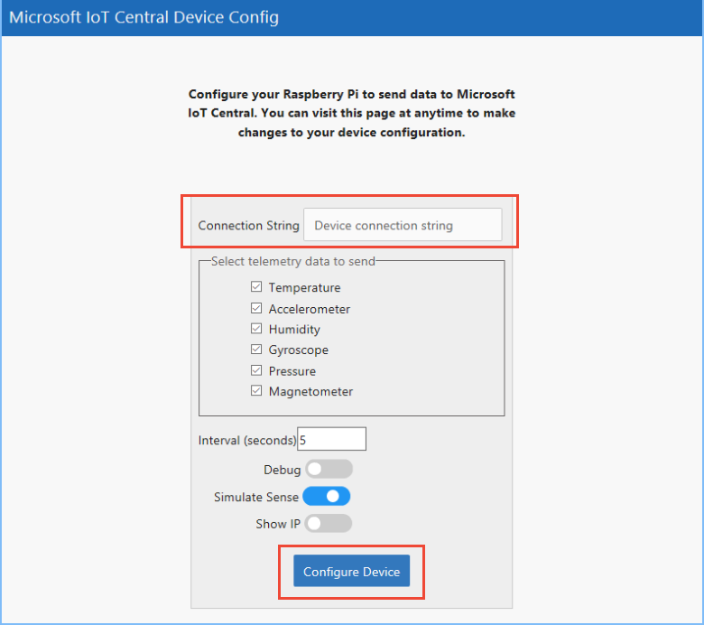

# Connect a Raspberry Pi to your Azure IoT Central application (Python)

[!INCLUDE [howto-raspberrypi-selector](../../includes/iot-central-howto-raspberrypi-selector.md)]

This article describes how, as a device developer, to connect a Raspberry Pi to your Microsoft Azure IoT Central application using the Python programming language.

## Before you begin

To complete the steps in this article, you need the following:

* An Azure IoT Central application created from the **Sample Devkits** application template. For more information, see [Create your Azure IoT Central Application](howto-create-application.md).
* A Raspberry Pi device running the Raspbian operating system. You need a monitor, keyboard, and mouse connected to your Raspberry Pi to access the GUI environment. The Raspberry Pi must be able to [connect to the internet](https://www.raspberrypi.org/learning/software-guide/wifi/).
* Optionally, a [Sense Hat](https://www.raspberrypi.org/products/sense-hat/) add-on board for the Raspberry Pi. This board collects telemetry data from various sensors to send to your Azure IoT Central application. If you don't have a **Sense Hat** board, you can use an emulator instead.

## **Sample Devkits** application

An application created from the **Sample Devkits** application template includes a **Raspberry Pi** device template with the following characteristics: 

- Telemetry which contains the measurements for the device **Humidity**, **Temperature**, **Pressure**, **Magnometer** (measured along X, Y, Z axis), **Accelorometer** (measured along X, Y, Z axis) and **Gyroscope** (measured along X, Y, Z axis).
- Settings showing **Voltage**, **Current**,**Fan Speed** and an **IR** toggle.
- Properties containing device property **die number** and **location** cloud property.

For full details on the configuration of the device template refer to [Raspberry PI Device template details](howto-connect-raspberry-pi-python.md#raspberry-pi-device-template-details)
    

## Add a real device

In your Azure IoT Central application, add a real device from the **Raspberry Pi** device template and make a note of the device connection string. For more information, see [Add a real device to your Azure IoT Central application](tutorial-add-device.md).

### Configure the Raspberry Pi

The following steps describe how to download and configure the sample Python application from GitHub. This sample application:

* Sends telemetry and property values to Azure IoT Central.
* Responds to setting changes made in Azure IoT Central.

> [!NOTE]
> For more information about the Raspberry Pi Python sample, see the [Readme](https://github.com/Azure/iot-central-firmware/blob/master/RaspberryPi/README.md) file on GitHub.

1. Use the Web browser in the Raspberry Pi desktop to navigate to the [Azure IoT Central firmware releases](https://github.com/Azure/iot-central-firmware/releases) page.

1. Download the zip file that contains the most recent firmware to your home folder on the Raspberry Pi. The file name looks like `RaspberryPi-IoTCentral-X.X.X.zip`.

1. To unzip the firmware file, use the **File Manager** in the Raspberry Pi desktop. Right-click the zip file and choose **Extract here**. This operation creates a folder called `RaspberryPi-IoTCentral-X.X.X` in your home folder.

1. If you don't have a **Sense Hat** board attached to your Raspberry Pi, you need to enable the emulator:
    1. In **File Manager**, in the `RaspberryPi-IoTCentral-X.X.X` folder, right-click the **config.iot** file and choose **Text Editor**.
    1. Change the line `"simulateSenseHat": false,` to `"simulateSenseHat": true,`.
    1. Save the changes and close **Text Editor**.

1. Start a **Terminal** session and use the `cd` command to navigate to the folder you created in the previous step.

1. To start the sample application running, type `./start.sh` in the **Terminal** window. If you are using the **Sense HAT Emulator**, its GUI displays. You can use the GUI to change the telemetry values sent to your Azure IoT Central application.

1. The **Terminal** window displays a message that looks like `Device information being served at http://192.168.0.60:8080`. The URL may be different in your environment. Copy the URL and use the Web browser  to navigate to the configuration page:

    

1. Enter the device connection string you made a note of when you added a real device to your Azure IoT Central application. Then choose **Configure Device**. You see a message **Device configured, your device should start sending data to Azure IoT Central momentarily**.

1. In your Azure IoT Central application, you see how the code running on the Raspberry Pi interacts with the application:

    * On the **Measurements** page for your real device, you can see the telemetry sent from the Raspberry Pi. If you are using the **Sense HAT Emulator**, you can modify the telemetry values in the GUI on the Raspberry Pi.
    * On the **Properties** page, you can see the value of the reported **Die Number** property.
    * On the **Settings** page, you can change various settings on the Raspberry Pi such as voltage and fan speed. When the Raspberry Pi acknowledges the change, the setting shows as **synced** in Azure IoT Central.

## Raspberry PI Device template details

An application created from the **Sample Devkits** application template includes a **Raspberry Pi** device template with the following characteristics:

### Telemetry measurements

| Field name     | Units  | Minimum | Maximum | Decimal places |
| -------------- | ------ | ------- | ------- | -------------- |
| humidity       | %      | 0       | 100     | 0              |
| temp           | °C     | -40     | 120     | 0              |
| pressure       | hPa    | 260     | 1260    | 0              |
| magnetometerX  | mgauss | -1000   | 1000    | 0              |
| magnetometerY  | mgauss | -1000   | 1000    | 0              |
| magnetometerZ  | mgauss | -1000   | 1000    | 0              |
| accelerometerX | mg     | -2000   | 2000    | 0              |
| accelerometerY | mg     | -2000   | 2000    | 0              |
| accelerometerZ | mg     | -2000   | 2000    | 0              |
| gyroscopeX     | mdps   | -2000   | 2000    | 0              |
| gyroscopeY     | mdps   | -2000   | 2000    | 0              |
| gyroscopeZ     | mdps   | -2000   | 2000    | 0              |

### Settings

Numeric settings

| Display name | Field name | Units | Decimal places | Minimum | Maximum | Initial |
| ------------ | ---------- | ----- | -------------- | ------- | ------- | ------- |
| Voltage      | setVoltage | Volts | 0              | 0       | 240     | 0       |
| Current      | setCurrent | Amps  | 0              | 0       | 100     | 0       |
| Fan Speed    | fanSpeed   | RPM   | 0              | 0       | 1000    | 0       |

Toggle settings

| Display name | Field name | On text | Off text | Initial |
| ------------ | ---------- | ------- | -------- | ------- |
| IR           | activateIR | ON      | OFF      | Off     |

### Properties

| Type            | Display name | Field name | Data type |
| --------------- | ------------ | ---------- | --------- |
| Device property | Die number   | dieNumber  | number    |
| Text            | Location     | location   | N/A       |

## Next steps

Now that you have learned how to connect a Raspberry Pi to your Azure IoT Central application, here are the suggested next steps:

* [Connect a generic Node.js client application to Azure IoT Central](howto-connect-nodejs.md)
