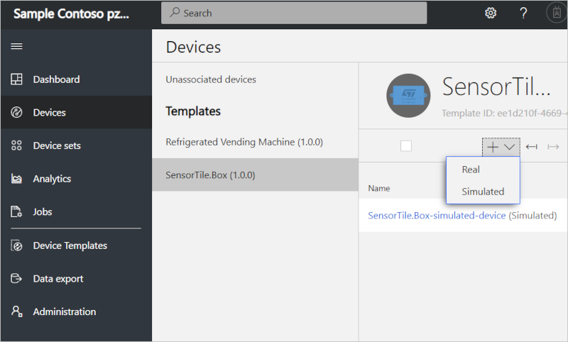
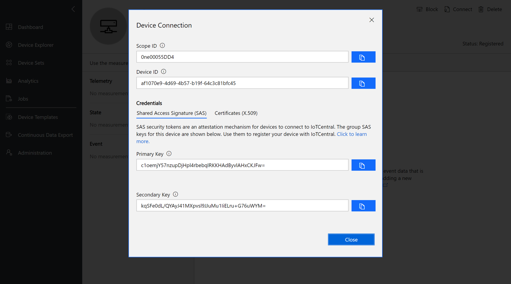
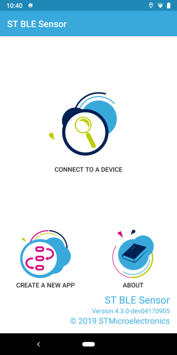
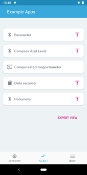
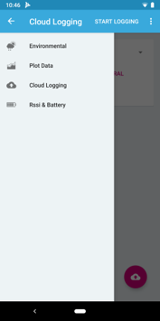
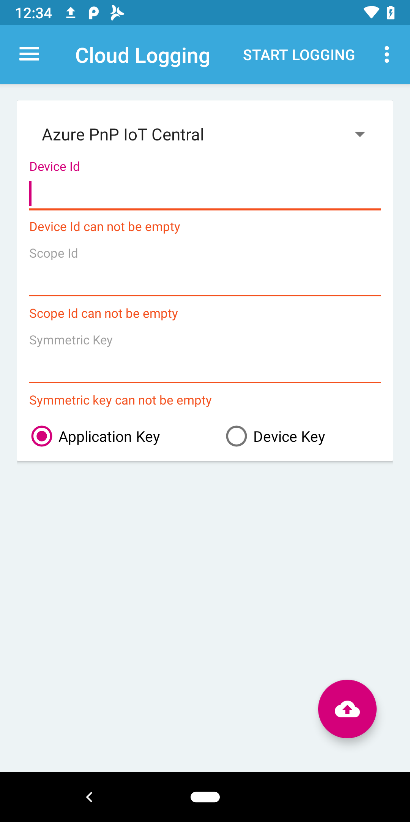

# Connect SensorTile.box device to your Azure IoT Central application

This article describes how, as a device developer, to connect a SensorTile.box device to your Microsoft Azure IoT Central application.

## Before you begin

To complete the steps in this article, you need the following resources:

* A SensorTile.box device. For more information, see [SensorTile.box](https://www.st.com/content/st_com/en/products/evaluation-tools/product-evaluation-tools/mems-motion-sensor-eval-boards/steval-mksbox1v1.html).
* The ST BLE Sensor app installed on your Android device, you can [download it from here](https://play.google.com/store/apps/details?id=com.st.bluems). For more information visit: [ST BLE Sensor](https://www.st.com/stblesensor)
* An Azure IoT Central application created from the **DevKits** application template. For more information, see the [create an application quickstart](quick-deploy-iot-central.md).
* Add the **SensorTile.box** device template into your IoT Central application by visiting the **Device Templates** page, clicking **+ New**, and selecting the **SensorTile.box** template.

### Get your device connection details

In your Azure IoT Central application, add a real device from the **SensorTile.box** device template and make a note of the device connection details: **Scope ID**, **Device ID**, and **Primary key**:

1. Add a device from Device Explorer. Select **+ New > Real** to add a real device.

    * Enter a lowercase **Device ID**, or use the suggested **Device ID**.
    * Enter a **Device Name**, or use the suggested name

    

1. To get the device connection details, **Scope ID**, **Device ID**, and **Primary key**, select **Connect** on the device page.

    

1. Make a note of the connection details. You're temporarily disconnected from the internet when you prepare your DevKit device in the next step.

## Set up the SensorTile.box with the mobile application

In this section, you learn how to push the application firmware onto the device. You then how to send the device data to IoT Central through the ST BLE Sensor mobile app using Bluetooth Low Energy (BLE) connectivity.

1. Open the ST BLE Sensor app and press the **Create a new app** button.

    

1. Select the **Barometer** application.
1. Press the upload button.

    

1. Press the play button associated with your SensorTile.box.
1. When the process is complete, the SensorTile.box streams the temperature, pressure, and humidity over BLE.

## Connect the SensorTile.box to the cloud

In this section you learn how to connect the SensorTile.box to the mobile application, and connect the mobile application to the cloud.

1. Using the left menu, select the **Cloud Logging** button.

    

1. Select **Azure IoT Central** as the cloud provider.
1. Insert the Device ID and Scope ID that were previously noted.

    

1. Select the **Application Key** radio button.
1. Click **Connect** and select the telemetry data you want to upload.
1. After few seconds, the data appears on the IoT Central application dashboard.

## SensorTile.box device template details

An application created from the SensorTile.box device template with the following characteristics:

### Telemetry

| Field name     | Units  | Minimum | Maximum | Decimal places |
| -------------- | ------ | ------- | ------- | -------------- |
| humidity       | %      | 30       | 90     | 1              |
| temp           | °C     | 0     | 40     | 1              |
| pressure       | mbar    | 900     | 1100    | 2              |
| magnetometerX  | mgauss | -1000   | 1000    | 0              |
| magnetometerY  | mgauss | -1000   | 1000    | 0              |
| magnetometerZ  | mgauss | -1000   | 1000    | 0              |
| accelerometerX | mg     | -2000   | 2000    | 0              |
| accelerometerY | mg     | -2000   | 2000    | 0              |
| accelerometerZ | mg     | -2000   | 2000    | 0              |
| gyroscopeX     | dps   | -3276   | 3276    | 1              |
| gyroscopeY     | dps   | -3276   | 3276    | 1              |
| gyroscopeZ     | dps   | -3276   | 3276    | 1              |
| FFT_X     |    |    |     |               |
| FFT_Y     |    |    |     |               |
| FFT_Z     |    |    |     |               |

## Next steps

Now that you've learned how to connect a SensorTile.box to your Azure IoT Central application, the suggested next step is to learn [how to set up a custom device template](howto-set-up-template.md) for your own IoT device.
