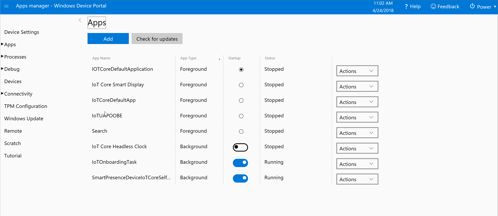
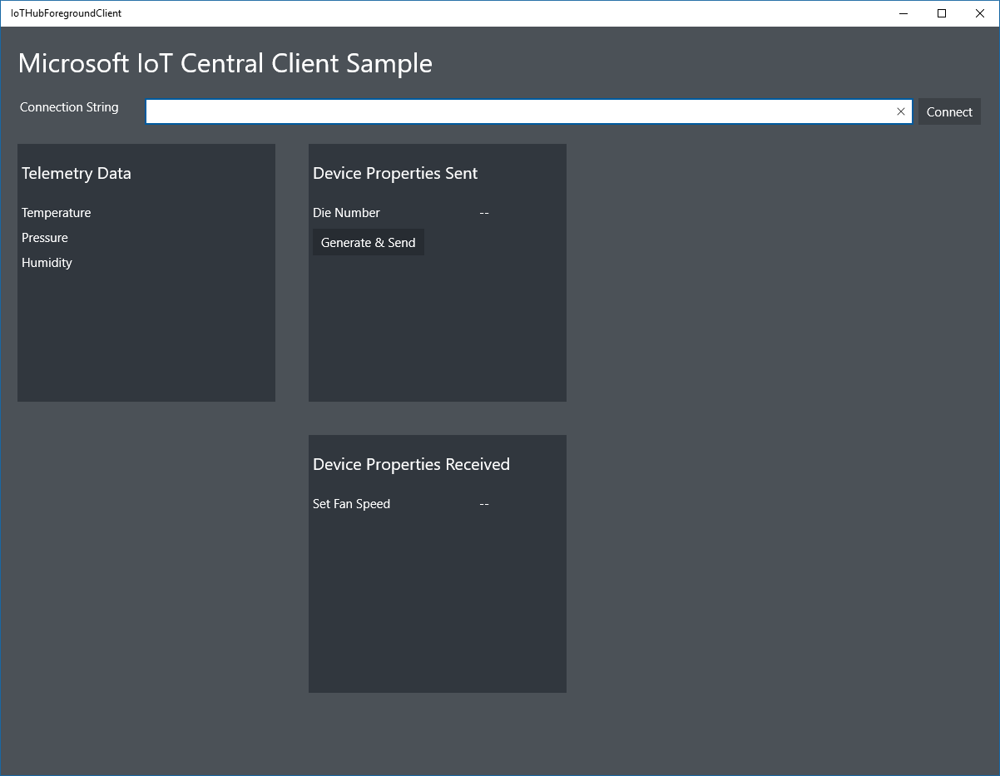

# Connect a Windows IoT Core device to your Azure IoT Central application

This article describes how, as a device developer, to connect a Windows IoT Core device to your Microsoft Azure IoT Central application.

## Before you begin

To complete the steps in this article, you need the following:

1. An Azure IoT Central application created from the **Sample Devkits** application template. For more information, see [Create your Azure IoT Central Application](howto-create-application.md).
2. A device running the Windows 10 IoT Core operating system. For this walkthrough, we will use a Raspberry Pi.

## **Sample Devkits** application

An application created from the **Sample Devkits** application template includes a **Windows IoT Core** device template with the following characteristics: 

- Telemetry which contains the measurements for the device **Humidity**, **Temperature** and **Pressure**. 
- Settings showing **Fan Speed**.
- Properties containing device property **die number** and **location** cloud property.

For full details on the configuration of the device template refer to [Windows IoT Core Device template details](howto-connect-windowsiotcore.md#windows-iot-core-device-template-details)

## Add a real device

In your Azure IoT Central application, add a real device from the **Windows IoT Core** device template and make a note of the device connection string. For more information, see [Add a real device to your Azure IoT Central application](tutorial-add-device.md).

### Prepare the Windows IoT Core device

To set up a Windows IoT Core device please follow the step by step guide at [Set up a Windows IoT Core device] (https://github.com/Azure/iot-central-firmware/tree/master/WindowsIoT#setup-a-physical-device).

### Add a real device

In your Azure IoT Central application, add a real device from the **Windows IoT Core** device template and make a note of the device connection details(**Scope ID, Device ID, Primary key**). For more information, see [Add a real device to your Azure IoT Central application](tutorial-add-device.md).

 > [!NOTE]
   > Azure IoT Central has transitioned to using Azure IoT Hub Device Provisioning service (DPS) for all device connections, follow these instrustions to [get the device connection string](concepts-connectivity.md#getting-device-connection-string) and continue with the rest of the tutorial.

## Prepare the Windows 10 IoT Core device

### What you'll need

To set up a physical Windows 10 IoT Core device, you will need to first have a device running Windows 10 IoT Core. Learn how to set up a Windows 10 IoT Core device [here](https://developer.microsoft.com/en-us/windows/iot/getstarted/prototype/setupdevice).

You will also need a client application that can communicate with Azure IoT Central. You can either build your own custom application using the Azure SDK and deploy it to your device using Visual Studio, or you can download a [pre-built sample](https://developer.microsoft.com/en-us/windows/iot/samples) and simply deploy and run it on the device. 

### Deploying the sample client application

To deploy the client application from the previous step to your Windows 10 IoT device in order to prepare it:

**Ensure the connection string is stored on the device for the client application to use**
* On the desktop, save the connection string in a text file named connection.string.iothub.
* Copy the text file to the device’s document folder: 
`[device-IP-address]\C$\Data\Users\DefaultAccount\Documents\connection.string.iothub`

Once you've done that, you'll need to open the [Windows Device Portal](https://docs.microsoft.com/windows/iot-core/manage-your-device/deviceportal) by typing in http://[device-IP-address]:8080 into any browser.

From there and, as shown in the if below, you'll want to:
1. Expand the "Apps" node on the left.
2. Click "Quick-run samples".
3. Click "Azure IoT Hub Client".
4. Click "Deploy and run".

When successful, the application will launch on the device and look like this:

In Azure IoT Central, you can see how the code running on the Raspberry Pi interacts with the application:

* On the **Measurements** page for your real device, you can see the telemetry.
* On the **Properties** page, you can see the value of the reported Die Number property.
* On the **Settings** page, you can change various settings on the Raspberry Pi such as voltage and fan speed.

## Download the source code

If you want to explore and modify the source code for the client application, you can download it from GitHub [here](https://github.com/Microsoft/Windows-iotcore-samples/tree/develop/Samples/Azure/IoTHubClients). If you plan to modify the code, you should follow these instructions in the readme file [here](https://github.com/Microsoft/Windows-iotcore-samples) for your desktop operating system.

> [!NOTE]
> If **git** is not installed in your development environment, you can download it from [https://git-scm.com/download](https://git-scm.com/download).

## Windows IoT Core Device template details

An application created from the **Sample Devkits** application template includes a **Windows IoT Core** device template with the following characteristics:

### Telemetry measurements

| Field name     | Units  | Minimum | Maximum | Decimal places |
| -------------- | ------ | ------- | ------- | -------------- |
| humidity       | %      | 0       | 100     | 0              |
| temp           | °C     | -40     | 120     | 0              |
| pressure       | hPa    | 260     | 1260    | 0              |

### Settings

Numeric settings

| Display name | Field name | Units | Decimal places | Minimum | Maximum | Initial |
| ------------ | ---------- | ----- | -------------- | ------- | ------- | ------- |
| Fan Speed    | fanSpeed   | RPM   | 0              | 0       | 1000    | 0       |

### Properties

| Type            | Display name | Field name | Data type |
| --------------- | ------------ | ---------- | --------- |
| Device property | Die number   | dieNumber  | number    |
| Text            | Location     | location   | N/A       |
