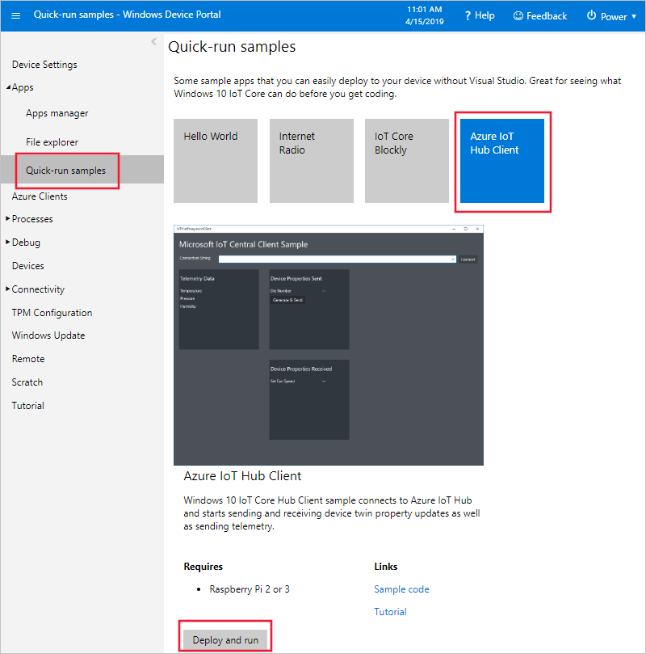

# Connect a Windows IoT Core device to your Azure IoT Central application

This article describes how, as a device developer, to connect a Windows IoT Core device to your Microsoft Azure IoT Central application.

## Before you begin

To complete the steps in this article, you need the following:

- An Azure IoT Central application created from the **Sample Devkits** application template. For more information, see the [create an application quickstart](quick-deploy-iot-central.md).

- A device running the Windows 10 IoT Core operating system. For more information, see [Setting up your Windows 10 IoT Core device](https://docs.microsoft.com/windows/iot-core/tutorials/quickstarter/devicesetup).

- A development machine with [Node.js](https://nodejs.org/) version 8.0.0 or later installed. You can run `node --version` in the command line to check your version. Node.js is available for a wide variety of operating systems.

## The Sample Devkits application

An application created from the **Sample Devkits** application template includes a **Windows IoT Core** device template with the following characteristics:

- Telemetry measurements for the device: **Humidity**, **Temperature**, and **Pressure**.
- Setting to control **Fan Speed**.
- A device property **Die number** and a cloud property **Location**.

For full details on the configuration of the device template, see [Windows IoT Core Device template details](#device-template-details).

## Add a real device

In your Azure IoT Central application, use the **Device Explorer** page to add a real device from the **Windows 10 IoT Core** device template. Make a note of the device connection details (**Scope ID**, **Device ID**, and **Primary key**). For more information, see [get connection information](howto-generate-connection-string.md#get-connection-information).

## Prepare the device

For the device to connect to IoT Central, it needs a connection string.

[!INCLUDE [iot-central-howto-connection-string](../../includes/iot-central-howto-connection-string.md)]

For the device code to access the connection string, save it in a file called **connection.string.iothub** in the folder `C:\Data\Users\DefaultAccount\Documents\` on your Windows 10 IoT Core device.

To copy the **connection.string.iothub** file from your desktop machine to the `C:\Data\Users\DefaultAccount\Documents\` folder on your device, you can use the [Windows Device Portal](https://docs.microsoft.com/windows/iot-core/manage-your-device/deviceportal):

1. Use your web browser to navigate to the Windows Device Portal on your device.
1. To browse the files on your device, choose **Apps > File explorer**.
1. Navigate to **User Folders\Documents**. Then upload the **connection.string.iothub** file:

    

## Deploy and run

To deploy and run the sample application on your device, you can use the [Windows Device Portal](https://docs.microsoft.com/windows/iot-core/manage-your-device/deviceportal):

1. Use your web browser to navigate to the Windows Device Portal on your device.
1. To deploy and run the **Azure IoT Hub Client** application, choose **Apps > Quick-run samples**. Then choose **Azure IoT Hub Client**.
1. Then choose **Deploy and run**.

    

After a couple of minutes, you can view the telemetry from your device in your IoT Central application.

The [Windows Device Portal](https://docs.microsoft.com/windows/iot-core/manage-your-device/deviceportal) includes tools that you can use to troubleshoot your device:

- The **Apps manager** page lets you control the apps running on your device.
- If you don't have a monitor connected to your device, you can use the **Device Settings** page to capture screenshots from your device. For example:

    

## Download the source code

If you want to explore and modify the source code for the client application, you can download it from the [Windows-iotcore-samples GitHub repository](https://github.com/Microsoft/Windows-iotcore-samples/blob/master/Samples/Azure/IoTHubClients).

## Device template details

An application created from the **Sample Devkits** application template includes a **Windows IoT Core** device template with the following characteristics:

### Telemetry measurements

| Field name     | Units  | Minimum | Maximum | Decimal places |
| -------------- | ------ | ------- | ------- | -------------- |
| humidity       | %      | 0       | 100     | 0              |
| temp           | °C     | -40     | 120     | 0              |
| pressure       | hPa    | 260     | 1260    | 0              |

### Settings

Numeric settings

| Display name | Field name | Units | Decimal places | Minimum | Maximum | Initial |
| ------------ | ---------- | ----- | -------------- | ------- | ------- | ------- |
| Fan Speed    | fanSpeed   | RPM   | 0              | 0       | 1000    | 0       |

### Properties

| Type            | Display name | Field name | Data type |
| --------------- | ------------ | ---------- | --------- |
| Device property | Die number   | dieNumber  | number    |
| Text            | Location     | location   | N/A       |

## Next steps

Now that you've learned how to connect a Windows IoT Core device to your Azure IoT Central application, the suggested next step is to learn how to [set up a custom device template](howto-set-up-template.md) for your own IoT device.
