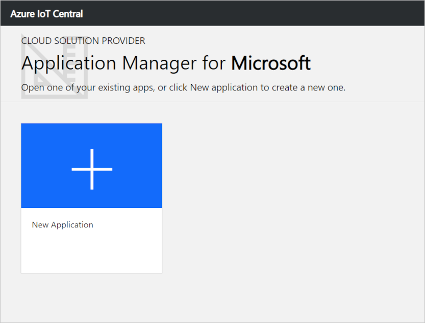
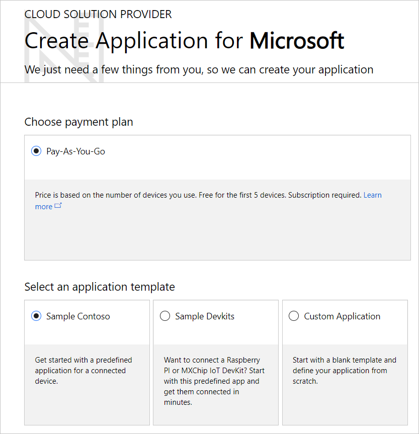
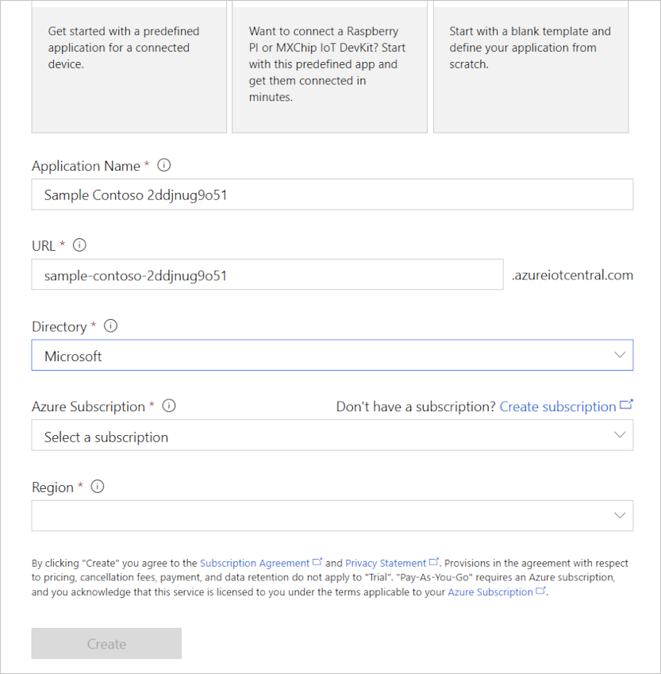

---
# Mandatory fields. See more on aka.ms/skyeye/meta.
title: Create and manage Azure IoT Central applications as a CSP | Microsoft Docs
description: As a CSP, how to create an Azure IoT Central application on behalf of your customer.
services: iot-central
ms.service: iot-central
author: dominicbetts
ms.author: dobett
ms.date: 04/03/2019
ms.topic: conceptual
manager: philmea
---

# As a CSP, create and manage an Azure IoT Central Application on behalf of your customer 

The Microsoft Cloud Solution Provider (CSP) program is a Microsoft Reseller program. Its intent is to provide our channel partners with a one-stop program to resell all Microsoft Commercial Online Services. Learn more about the [Cloud Solution Provider program](https://partner.microsoft.com/cloud-solution-provider).

As a CSP, you can create and manage Microsoft Azure IoT Central applications on behalf of your customers through the [Microsoft Partner Center](https://partnercenter.microsoft.com/partner/home). When Azure IoT Central applications are created on behalf of customers by CSPs, just like with other CSP managed Azure services, CSPs manage billing for customers. A charge for Azure IoT Central will appear in your total bill in the Microsoft Partner Center.

To get started, sign-in to your account on the Microsoft Partner Portal and select a customer for whom you want to create an Azure IoT Central application. Navigate to Service management for the customer from the left nav.

Azure IoT Central is listed as a service available to administer. Select the Azure IoT Central link on the page to create new applications or manage existing applications for this customer.

You land on the Azure IoT Central Application Manager page. Azure IoT Central keeps context that you came from the Microsoft Partner Center and that you came to manage that particular customer. You see this acknowledged in the header of the Application Manager page. From here, you can either navigate to an existing application you had created earlier for this customer to manage or create a new application for the customer.

To create an Azure IoT Central application, select the **New Application** tile. This will load the Application Creation page. You must complete all the fields on this page and then choose **Create**. You find more information about each of the fields below.

## Payment plan

You can only create Pay-As-You-Go applications as a CSP. To showcase Azure IoT Central to your customer, you can create a trial application separately. Learn more about Trial and Pay-As-You-Go applications on the [Azure IoT Central pricing page](https://azure.microsoft.com/pricing/details/iot-central/).

## Application Name

The name of your application is displayed on the **Application Manager** page and within each Azure IoT Central application. You can choose any name for your Azure IoT Central application. Choose a name that makes sense to you and to others in your organization.

## Application URL

The application URL is the link to your application. You can save a bookmark to it in your browser or share it with others.

When you enter the name for your application, your application URL is autogenerated. If you prefer, you can choose a different URL for your application. Each Azure IoT Central URL must be unique within Azure IoT Central. You see an error message if the URL you choose has already been taken.

## Directory

Since Azure IoT Central has context that you came to manage the customer you selected in the Microsoft Partner Portal, you see just the Azure Active Directory tenant for that customer in the Directory field. 

An Azure Active Directory tenant contains user identities, credentials, and other organizational information. Multiple Azure subscriptions can be associated with a single Azure Active Directory tenant.

To learn more, see [Azure Active Directory](https://docs.microsoft.com/azure/active-directory/).

## Azure subscription

An Azure subscription enables you to create instances of Azure services. Azure IoT Central automatically finds all Azure Subscriptions of the customer to which you have access, and displays them in a dropdown on the **Create Application** page. Choose an Azure subscription to create a new Azure IoT Central Application.

If you don’t have an Azure subscription, you can create one in the Microsoft Partner Center. After you create the Azure subscription, navigate back to the **Create Application** page. Your new subscription appears in the **Azure Subscription** drop-down.

To learn more, see [Azure subscriptions](https://docs.microsoft.com/azure/guides/developer/azure-developer-guide#understanding-accounts-subscriptions-and-billing).

## Region

Choose the region where you’d like to create your Azure IoT Central Application. Typically, you should choose the region that is closest physically to your devices to get optimal performance.

To learn more, see [Azure regions](https://docs.microsoft.com/azure/guides/developer/azure-developer-guide#azure-regions).

You can see the regions in which Azure IoT Central is available on the [Products available by region](https://azure.microsoft.com/regions/services/) page.

> [!Note]
> Once you choose a region, you cannot later move your application to a different region.

## Application template

You can choose one of the available application templates for your new Azure IoT Central application. An application template can contain predefined items such as device templates and dashboards to help you get started.

| Application template | Description |
| -------------------- | ----------- |
| Custom application   | Creates an empty application for you to populate with your own device templates and devices. |
| Sample Contoso       | Creates an application that includes a device template for a simple connected device. Use this template to get started exploring Azure IoT Central. |
| Sample Devkits       | Creates an application with device templates ready for you to connect an MXChip or Raspberry Pi device. Use this template if you are a device developer experimenting with code on one of these devices. |

## Next steps

Now that you have learned how to create an Azure IoT Central application as a CSP, here is the suggested next step:

> [!div class="nextstepaction"]
> [Administer your application](howto-administer.md)