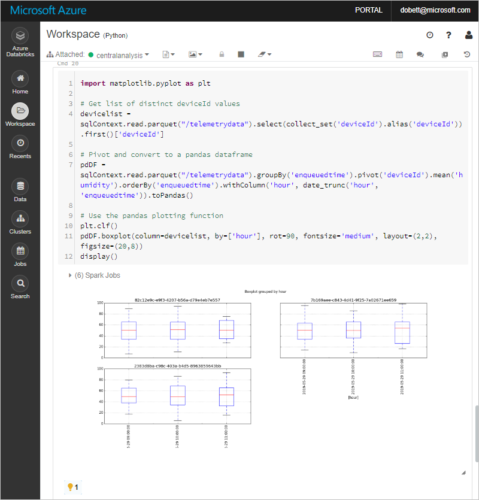

# Extend Azure IoT Central with custom analytics

This how-to guide shows you, as a solution developer, how to extend your IoT Central application with custom analytics and visualizations. The example uses an [Azure Databricks](https://docs.microsoft.com/azure/azure-databricks/) workspace to analyze the IoT Central telemetry stream and to generate visualizations such as [box plots](https://wikipedia.org/wiki/Box_plot).

This how-to guide shows you how to extend IoT Central beyond what it can already do with the [built-in analytics tools](howto-create-analytics.md).

In this how-to guide, you learn how to:

* Stream telemetry from an IoT Central application using *continuous data export*.
* Create an Azure Databricks environment to analyze and plot device telemetry.

## Prerequisites

To complete the steps in this how-to guide, you need an active Azure subscription.

If you don't have an Azure subscription, create a [free account](https://azure.microsoft.com/free/?WT.mc_id=A261C142F) before you begin.

### IoT Central application

Create an IoT Central application from the [Azure IoT Central - My applications](https://aka.ms/iotcentral) page with the following settings:

| Setting | Value |
| ------- | ----- |
| Payment plan | Pay-As-You-Go |
| Application template | Sample Contoso |
| Application name | Accept the default or choose your own name |
| URL | Accept the default or choose your own unique URL prefix |
| Directory | Your Azure Active Directory tenant |
| Azure subscription | Your Azure subscription |
| Region | East US |

The examples and screenshots in this article use the **East US** region. Choose a location close to you and make sure you create all your resources in the same region.

### Resource group

Use the [Azure portal to create a resource group](https://portal.azure.com/#create/Microsoft.ResourceGroup) called **IoTCentralAnalysis** to contain the other resources you create. Create your Azure resources in the same location as your IoT Central application.

### Event Hubs namespace

Use the [Azure portal to create an Event Hubs namespace](https://portal.azure.com/#create/Microsoft.EventHub) with the following settings:

| Setting | Value |
| ------- | ----- |
| Name    | Choose your namespace name |
| Pricing tier | Basic |
| Subscription | Your subscription |
| Resource group | IoTCentralAnalysis |
| Location | East US |
| Throughput Units | 1 |

### Azure Databricks workspace

Use the [Azure portal to create an Azure Databricks Service](https://portal.azure.com/#create/Microsoft.Databricks) with the following settings:

| Setting | Value |
| ------- | ----- |
| Workspace name    | Choose your workspace name |
| Subscription | Your subscription |
| Resource group | IoTCentralAnalysis |
| Location | East US |
| Pricing Tier | Standard |

When you've created the required resources, your **IoTCentralAnalysis** resource group looks like the following screenshot:


## Create an event hub

You can configure an IoT Central application to continuously export telemetry to an event hub. In this section, you create an event hub to receive telemetry from your IoT Central application. The event hub delivers the telemetry to your Stream Analytics job for processing.

1. In the Azure portal, navigate to your Event Hubs namespace and select **+ Event Hub**.
1. Name your event hub **centralexport**, and select **Create**.
1. In the list of event hubs in your namespace, select **centralexport**. Then choose **Shared access policies**.
1. Select **+ Add**. Create a policy named **Listen** with the **Listen** claim.
1. When the policy is ready, select it in the list, and then copy the **Connection string-primary key** value.
1. Make a note of this connection string, you use it later when you configure your Databricks notebook to read from the event hub.

Your Event Hubs namespace looks like the following screenshot:


## Configure export in IoT Central

Navigate to the [IoT Central application](https://aka.ms/iotcentral) you created from the Contoso template. In this section, you configure the application to stream the telemetry from its simulated devices to your event hub. To configure the export:

1. Navigate to the **Continuous Data Export** page, select **+ New**, and then **Azure Event Hubs**.
1. Use the following settings to configure the export, then select **Save**:

    | Setting | Value |
    | ------- | ----- |
    | Display Name | Export to Event Hubs |
    | Enabled | On |
    | Event Hubs namespace | Your Event Hubs namespace name |
    | Event hub | centralexport |
    | Measurements | On |
    | Devices | Off |
    | Device Templates | Off |


Wait until the export status is **Running** before you continue.

## Configure Databricks workspace

In the Azure portal, navigate to your Azure Databricks service and select **Launch Workspace**. A new tab opens in your browser and signs you in to your workspace.

### Create a cluster

On the **Azure Databricks** page, under the list of common tasks, select **New Cluster**.

Use the information in the following table to create your cluster:

| Setting | Value |
| ------- | ----- |
| Cluster Name | centralanalysis |
| Cluster Mode | Standard |
| Databricks Runtime Version | 5.3 (Scala 2.11, Spark 2.4.0) |
| Python Version | 3 |
| Enable Autoscaling | No |
| Terminate after minutes of inactivity | 30 |
| Worker Type | Standard_DS3_v2 |
| Workers | 1 |
| Driver Type | Same as worker |

Creating a cluster may take several minutes, wait for the cluster creation to complete before you continue.

### Install libraries

On the **Clusters** page, wait until the cluster state is **Running**.

The following steps show you how to import the library your sample needs into the cluster:

1. On the **Clusters** page, wait until the state of the **centralanalysis** interactive cluster is **Running**.

1. Select the cluster and then choose the **Libraries** tab.

1. On the **Libraries** tab, choose **Install New**.

1. On the **Install Library** page, choose **Maven** as the library source.

1. In the **Coordinates** textbox, enter the following value: `com.microsoft.azure:azure-eventhubs-spark_2.11:2.3.10`

1. Choose **Install** to install the library on the cluster.

1. The library status is now **Installed**:

    

### Import a Databricks notebook

Use the following steps to import a Databricks notebook that contains the Python code to analyze and visualize your IoT Central telemetry:

1. Navigate to the **Workspace** page in your Databricks environment. Select the dropdown next to your account name and then choose **Import**.

1. Choose to import from a URL and enter the following address: [https://github.com/Azure-Samples/iot-central-docs-samples/blob/master/databricks/IoT%20Central%20Analysis.dbc?raw=true](https://github.com/Azure-Samples/iot-central-docs-samples/blob/master/databricks/IoT%20Central%20Analysis.dbc?raw=true)

1. To import the notebook, choose **Import**.

1. Select the **Workspace** to view the imported notebook:

    

1. Edit the code in the first Python cell to add the Event Hubs connection string you saved previously:

    ```python
    from pyspark.sql.functions import *
    from pyspark.sql.types import *

    ###### Event Hub Connection strings ######
    telementryEventHubConfig = {
      'eventhubs.connectionString' : '{your Event Hubs connection string}'
    }
    ```

## Run analysis

To run the analysis, you must attach the notebook to the cluster:

1. Select **Detached** and then select the **centralanalysis** cluster.
1. If the cluster isn't running, start it.
1. To start the notebook, select the run button.

You may see an error in the last cell. If so, check the previous cells are running, wait a minute for some data to be written to storage, and then run the last cell again.

### View smoothed data

In the notebook, scroll down to cell 14 to see a plot of the rolling average humidity by device type. This plot continuously updates as streaming telemetry arrives:


You can resize the chart in the notebook.

### View box plots

In the notebook, scroll down to cell 20 to see the [box plots](https://en.wikipedia.org/wiki/Box_plot). The box plots are based on static data so to update them you must rerun the cell:



You can resize the plots in the notebook.

## Tidy up

To tidy up after this how-to and avoid unnecessary costs, delete the **IoTCentralAnalysis** resource group in the Azure portal.

You can delete the IoT Central application from the **Management** page within the application.

## Next steps

In this how-to guide, you learned how to:

* Stream telemetry from an IoT Central application using *continuous data export*.
* Create an Azure Databricks environment to analyze and plot telemetry data.

Now that you know how to create custom analytics, the suggested next step is to learn how to [Visualize and analyze your Azure IoT Central data in a Power BI dashboard](howto-connect-powerbi.md).
