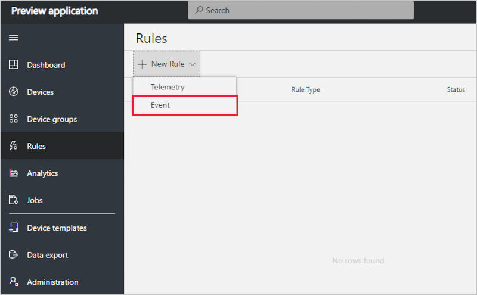
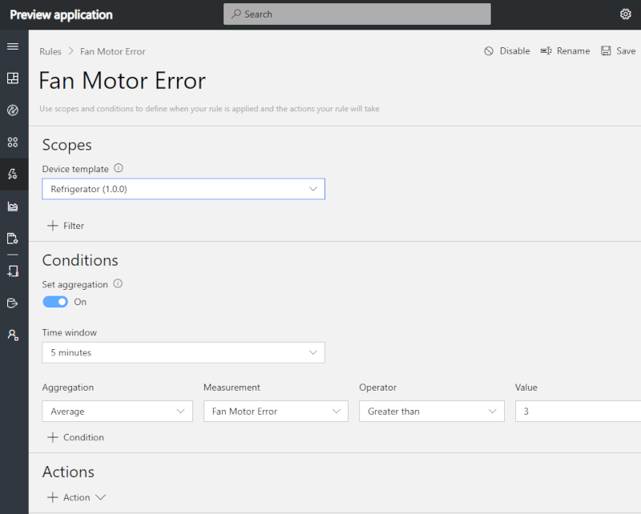
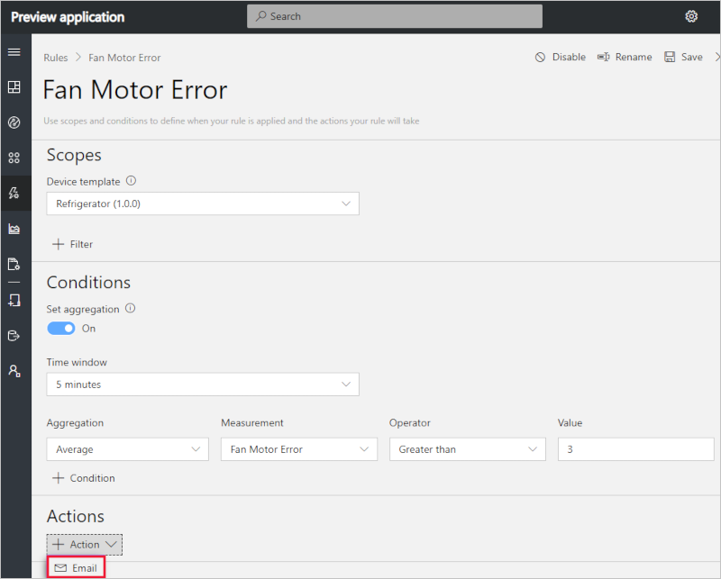
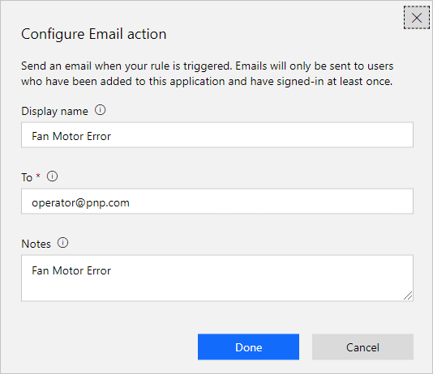

# Create an Event rule and set up notifications in your Azure IoT Central application (preview features)

*This article applies to operators, builders, and administrators.*

[!INCLUDE [iot-central-pnp-original](../../includes/iot-central-pnp-original-note.md)]

You can use Azure IoT Central to remotely monitor your connected devices. Azure IoT Central rules enable you to monitor your devices in near real time and automatically invoke actions, such as send an email. In just a few clicks, you can define the condition for which to monitor your device data and configure the corresponding action. This article explains how to create rules to monitor events sent by the device.

Devices can use event measurement to send important or informational device events. An event rule triggers when the selected device event is reported by the device.

## Create an event rule

To create an event rule, the device template must have at least one event measurement defined. This example uses a refrigerated vending machine device that reports a fan motor error event. The rule monitors the event reported by the device and sends an email whenever the event is reported.

1. Navigate to the **Rules** page.

1. If you haven’t created any rules yet, you see the following screen:

   

1. Select **+ New Rule** to see the types of rules you can create.

1. Choose **Event** to create an event monitoring rule.

   

1. Enter a name that helps you to identify the rule and press Enter.

1. Select the device definition to scope this rule to in the **Scopes** section. This screen is also where you can filter down the devices the rule applies to by using **+ Filter**. The rule automatically applies to all the devices under the device template. To disable the rule, select the **Disable** button in the header.

### Configure the rule conditions

Condition defines the criteria that is monitored by the rule.

1. Select whether you want to **Set aggregation** as on or off.

   - Without aggregation, the rule triggers for each event data point that meets the condition. For example, if you configure the rule's condition to trigger when a **Fan Motor Error** event occurs then the rule triggers almost immediately when the device reports that event.
   - If **Count** is used as an aggregate function, then you have to  provide a **Value** and a **Time window** over which the condition needs to be evaluated. In this case, the count of events is aggregated and the rule triggers only if the aggregated event count matches the value.

1. Choose the event that you want to monitor from the **Measurement** dropdown. In this example, **Fan Motor Error** event has been selected.

1. Optionally, you can also set **Count** as **Aggregation** and provide the value at which the rule will trigger.

     For example, if you want to alert when there are more than three device events within 5 minutes, then select the event and set the aggregate function as **Count**,  operator as **greater than**, and **Value** as 3. Set **Time window** as **5 minutes**. The rule triggers when more than three events are sent by the device within 5 minutes. The rule evaluation frequency is the same as the **Time window**, which means, in this example, the rule is evaluated once every 5 minutes.

 

> [!NOTE]
> More than one event measurement can be added under **Condition**. When multiple conditions are specified, all the conditions must be met for the rule to trigger. Each condition gets joined by an 'AND' clause implicitly. When using aggregate, every measurement must be aggregated.

### Configure actions

This section shows you how to set up actions to take when the rule is fired. Actions get invoked when all the conditions specified in the rule evaluate to true.

1. Click the **+ Action** in the **Action** sections. Here you see the list of available actions.  

   

1. Choose the **Email** action, enter a display name for the action, a valid email address in the **To** field, and provide a note to appear in the body of the email when the rule triggers.

   > [!NOTE]
   > Emails are only sent to the users that have been added to the application and have logged in at least once. Learn more about [user management](howto-administer-pnp.md?toc=/azure/iot-central-pnp/toc.json&bc=/azure/iot-central-pnp/breadcrumb/toc.json) in Azure IoT Central.

   

1. To save the action, choose **Done**.

1. To save the rule, choose **Save**. The rule goes live within a few minutes and starts monitoring events being sent to your application. When the condition specified in the rule is met, the rule triggers the configured email action.

## Parameterize the rule

Rules can derive certain vales from **Device Properties** as parameters. Using parameters is helpful in scenarios where event thresholds vary for different devices. When you create the rule, choose a device property that specifies the threshold, such as **Maximum Ideal Threshold**, instead of providing an absolute value, such as 3 events. When the rule executes, it matches the device events with the value set in the device property.

Using parameters is an effective way to reduce the number of rules to manage.

Actions can also be configured using **Device Property** as a parameter. If an email address is stored as a device property, then it can be used when you define the **To** address.

## Delete a rule

If you no longer need a rule, delete it by opening the rule and choosing **Delete**. Deleting the rule removes it from the device template and all the associated devices.

## Enable or disable a rule

Choose the rule you want to enable or disable. Toggle the **Enable** or **Disable** button in the rule to enable or disable the rule for all devices that are in scope for the rule.

## Enable or disable a rule for a device

Choose the rule you want to enable or disable. Add a filter in the **Scopes** section to include or exclude a certain device in the device template.

## Next steps

Now that you have learned how to create rules in your Azure IoT Central application, the suggested next step is to learn [How to manage your devices](howto-manage-devices-pnp.md?toc=/azure/iot-central-pnp/toc.json&bc=/azure/iot-central-pnp/breadcrumb/toc.json)
