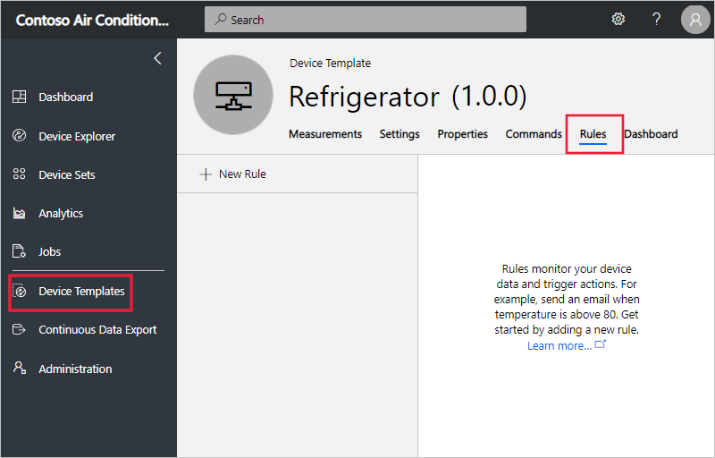
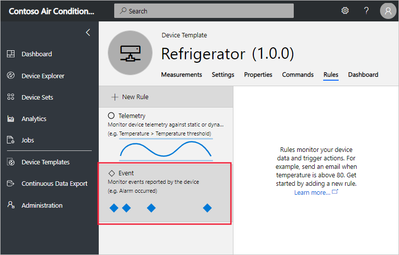
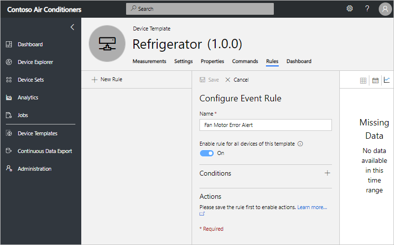
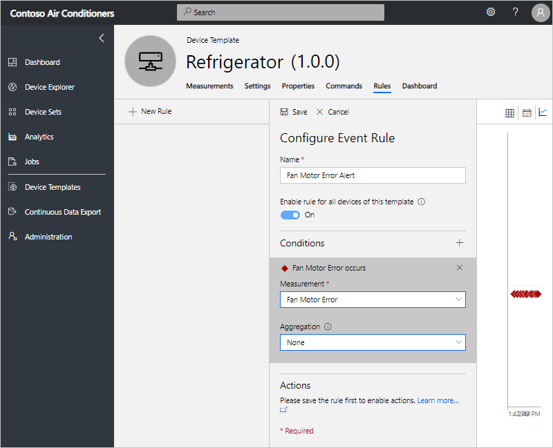
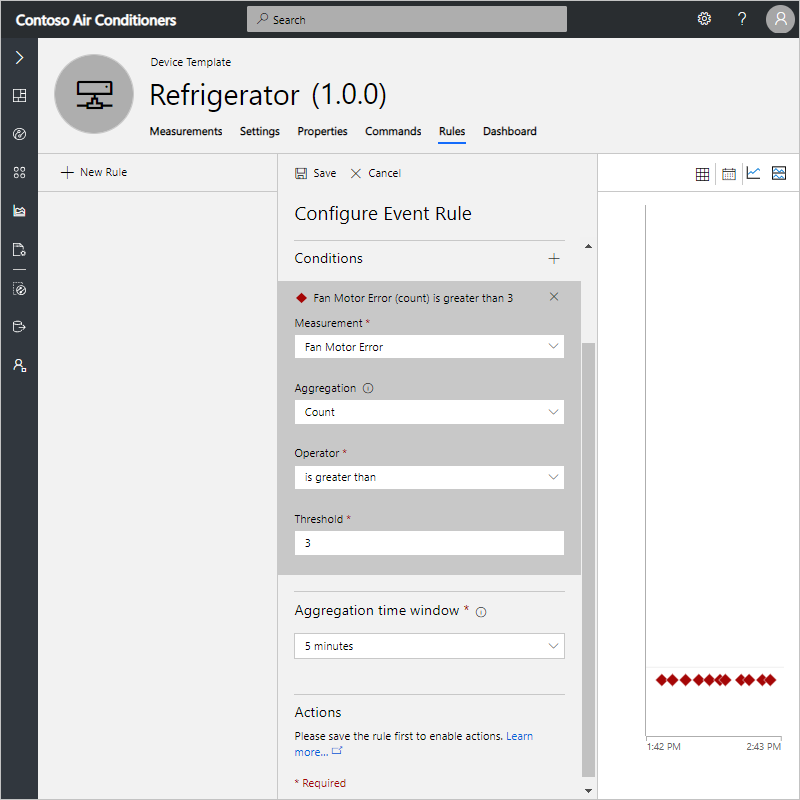

# Create an Event rule and set up notifications in your Azure IoT Central application

*This article applies to operators, builders, and administrators.*

You can use Azure IoT Central to remotely monitor your connected devices. Azure IoT Central rules enable you to monitor your devices in near real time and automatically invoke actions, such as send an email or trigger Microsoft Flow. In just a few clicks, you can define the condition for which to monitor your device data and configure the corresponding action. This article explains how to create rules to monitor events sent by the device.

Devices can use event measurement to send important or informational device events. An event rule triggers when the selected device event is reported by the device.

## Create an event rule

To create an event rule, the device template must have at least one event measurement defined. This example uses a refrigerated vending machine device that reports a fan motor error event. The rule monitors the event reported by the device and sends an email whenever the event is reported.

1. Using the **Device Templates** page, navigate to the device template for which you are adding the rule for.

1. If you haven’t created any rules yet, you see the following screen:

    

1. On the **Rules** tab, select **+ New Rule** to see the types of rules you can create.

1. Choose the **Event** tile to create an event monitoring rule.

    

1. Enter a name that helps you to identify the rule in this device template.

1. To immediately enable the rule for all the devices created from this template, toggle **Enable rule for all devices of this template**.

    

    The rule automatically applies to all the devices under the device template.

### Configure the rule conditions

Condition defines the criteria that is monitored by the rule.

1. Choose the **+** next to **Conditions** to add a new condition.

1. Choose the event that you want to monitor from the Measurement dropdown. In this example, **Fan Motor Error** event has been selected.

   

1. Optionally, you can also set **Count** as **Aggregation** and provide the corresponding threshold.

   - Without aggregation, the rule triggers for each event data point that meets the condition. For example, if you configure the rule's condition to trigger when a **Fan Motor Error** event occurs then the rule triggers almost immediately when the device reports that event.
   - If Count is used as an aggregate function, then you have to  provide a **Threshold** and an **Aggregate time window** over which the condition needs to be evaluated. In this case, the count of events is aggregated and the rule triggers only if the aggregated event count matches the threshold.

     For example, if you want to alert when there are more than three device events within 5 minutes, then select the event and set the aggregate function as "count",  operator as "greater than", and "threshold" as 3. Set "Aggregation time period" as "5 minutes". The rule triggers when more than three events are sent by the device within 5 minutes. The rule evaluation frequency is the same as the **Aggregate time window**, which means, in this example, the rule is  evaluated once every 5 minutes.

     

     >[!NOTE]
     >More than one event measurement can be added under **Condition**. When multiple conditions are specified, all the conditions must be met for the rule to trigger. Each condition gets joined by an 'AND' clause implicitly. When using aggregate, every measurement must be aggregated.

### Configure actions

This section shows you how to set up actions to take when the rule is fired. Actions get invoked when all the conditions specified in the rule evaluate to true.

1. Choose the **+** next to **Actions**. Here you see the list of available actions.

    

1. Choose the **Email** action, enter a valid email address in the **To** field, and provide a note to appear in the body of the email when the rule triggers.

    > [!NOTE]
    > Emails are only sent to the users that have been added to the application and have logged in at least once. Learn more about [user management](howto-administer.md) in Azure IoT Central.

   

1. To save the rule, choose **Save**. The rule goes live within a few minutes and starts monitoring the events being sent to your application. When the condition specified in the rule matches, the rule triggers the configured email action.

You can add other actions to the rule such as Microsoft Flow and webhooks. You can add up to 5 actions per rule.

- [Microsoft Flow action](howto-add-microsoft-flow.md) to kick off a workflow in Microsoft Flow when a rule is triggered 
- [Webhook action](howto-create-webhooks.md) to notify other services when a rule is triggered

## Parameterize the rule

Actions can also be configured using **Device Property** as a parameter. If an email address is stored as a device property, then it can be used when you define the **To** address.

## Delete a rule

If you no longer need a rule, delete it by opening the rule and choosing **Delete**. Deleting the rule removes it from the device template and all the associated devices.

## Enable or disable a rule for a device template

Navigate to the device and choose the rule you want to enable or disable. Toggle the **Enable rule for all devices of this template** button to enable or disable the rule for all devices that are associated with the device template.

## Enable or disable a rule for a device

Navigate to the device and choose the rule you want to enable or disable. Toggle the **Enable rule for this device** button to either enable or disable the rule for that device.

## Next steps

Now that you have learned how to create rules in your Azure IoT Central application, here are some next step:

- [Add Microsoft Flow action in rules](howto-add-microsoft-flow.md)
- [Add Webhook action in rules](howto-create-webhooks.md)
- [Group multiple actions to run from one or more rules](howto-use-action-groups.md)
- [How to manage your devices](howto-manage-devices.md)
