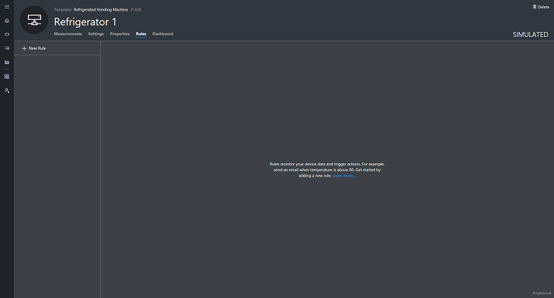
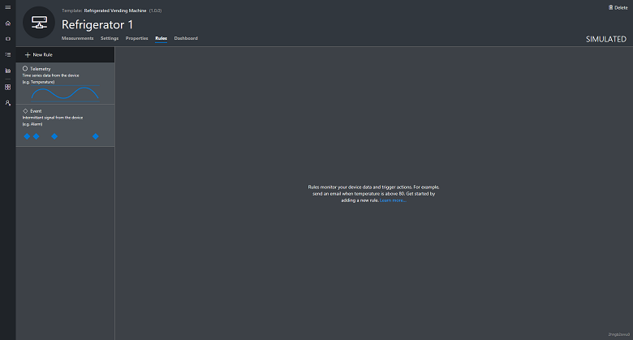
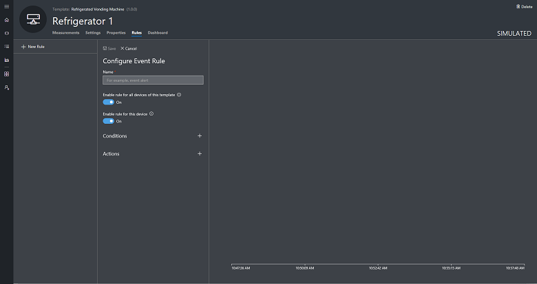
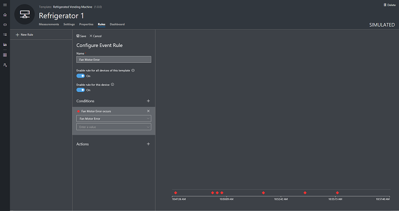
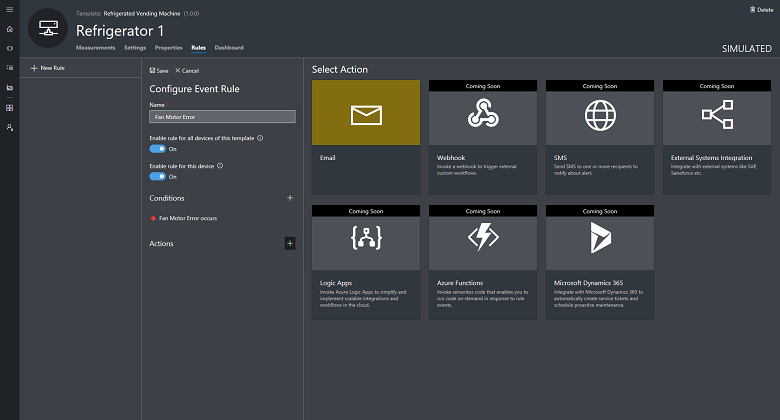
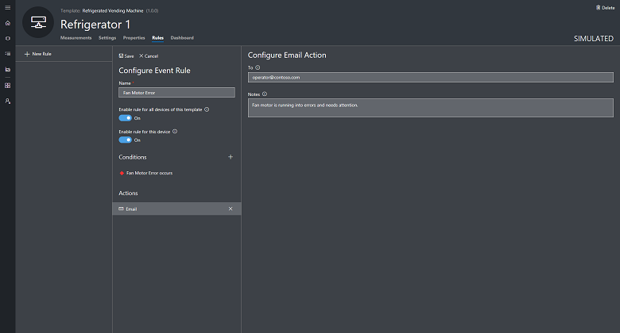

---
# Mandatory fields. See more on aka.ms/skyeye/meta.
title: Create and manage event rules in your Azure IoT Central application | Microsoft Docs
description: Azure IoT Central event rules enable you to monitor your devices in near real time and to automatically invoke actions, such as sending an email, when the rule triggers.
services: iot-central
author: ankitgupta
ms.author: ankitgup
ms.date: 04/29/2018
ms.topic: article
# Use only one of the following. Use ms.service for services, ms.prod for on-prem. Remove the # before the relevant field.
ms.prod: microsoft-iot-central
# product-name-from-white-list

# Optional fields. Don't forget to remove # if you need a field.
# ms.custom: can-be-multiple-comma-separated
# ms.devlang:devlang-from-white-list
# ms.suite: 
# ms.tgt_pltfrm:
# ms.reviewer:
manager: timlt
---

# Create an event rule and set up an action in your Azure IoT Central application

You can use Microsoft Azure IoT Central to remotely monitor your connected devices. Azure IoT Central rules enable you to monitor your devices in near real time and to automatically invoke actions such as sending an email, or triggering workflow in Microsoft Flow when the rule conditions are met. In just a few clicks, you can define the condition to monitor your device data and configure the action to invoke. This article explains event monitoring rule in detail.

Azure IoT Central uses [event measurement](howto-set-up-template.md) to capture device data. Each type of measurement has key attributes that define the measurement. You can create rules to monitor each type of device measurement and generate alerts when the rule triggers. An event rule triggers when the selected device event is reported by the device.

## Create an event rule

This section shows you how to create an event rule. This example uses a refrigerated vending machine device that reports fan motor error event. The rule monitors the event reported by the device and sends an email whenever the event is reported.

1. Navigate to the device details page for the device you are adding the rule to.

1. If you haven’t created any rules yet, you see the following screen:

    

1. On the **Rules** tab, choose **+ New Rule** to see the types of rules you can create.

    

1. Click on **Event** to open the form to create the rule.

    

1. Choose a name that helps you to identify the rule in this device template.

1. To immediately enable the rule for all the devices created from this template, toggle **Enable rule**.

### Configure the rule condition

This section shows you how to add a condition to monitor the Fan motor error event measurement.

1. Choose the **+** next to **Condition**.

1. Choose the event measurement from the dropdown that you want to monitor. In this example **Fan Motor Error** event has been selected.

1. Optionally you can also provide a value in case you want to monitor a specific value of the event being reported by the device. For instance, if the device reports the same event with different error codes then providing the error code as a value in the rule's condition will ensure that the rule triggers only when the device sends that specific value as the event payload. Leaving this blank will mean that the rule will trigger whenever the device sends the event regardless of the event value.

    

    > [!NOTE]
    > You must select at least one event measurement when defining an event rule condition.

1. Click **Save** to save your rule. The rule goes live within a few minutes and starts monitoring events being sent to your application.

### Add an action

Tis example shows you how to add an action to a rule. This shows how to add the email action, but you can also add other actions:
-  [Microsoft Flow action](howto-add-microsoft-flow.md) to kick off a workflow in Microsoft Flow when a rule is triggered
- [Webhook action](howto-create-webhooks.md) to notify other services when a rule is triggered

> [!NOTE]
> Only 1 action can be associated to a single rule at this time.

1. Choose the **+** next to **Actions**. Here you see the list of available actions.

    

1. Choose the **Email** action, enter a valid email address in the **To** field, and provide a note to appear in the body of the email when the rule triggers.

    > [!NOTE]
    > Emails are only sent to the users that have been added to the application and have logged in at least once. Learn more about [user management](howto-administer.md) in Azure IoT Central.

   

1. Click **Save**. The rule goes live within a few minutes and starts monitoring the events being sent to your application. When the condition specified in the rule matches, the rule triggers the configured email action.

## Parameterize the rule

Actions can also be configured using **Device Property** as a parameter. If an email address is stored as a device property, then it can be used when you define the **To** address.

## Delete a rule

If you no longer need a rule, delete it by opening the rule and choosing **Delete**. Deleting the rule removes it from the device template and all the associated devices.

## Enable or disable a rule for a device template

Navigate to the device and choose the rule you want to enable or disable. Toggling the **Enable rule for all devices of this template** button in the rule enables or disables the rule for all devices associated with the device template.

## Enable or disable a rule for a device

Navigate to the device and choose the rule you want to enable or disable. Toggle the **Enable rule for this device** button to either enable or disable the rule for that device.

## Next steps

Now that you have learned how to create rules in your Azure IoT Central application, here is the suggested next step:

> [!div class="nextstepaction"]
> [How to add a Microsoft Flow action to a rule](howto-add-microsoft-flow.md)
> [How to manage your devices](howto-manage-devices.md).
