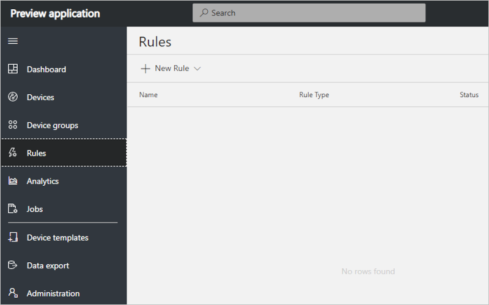
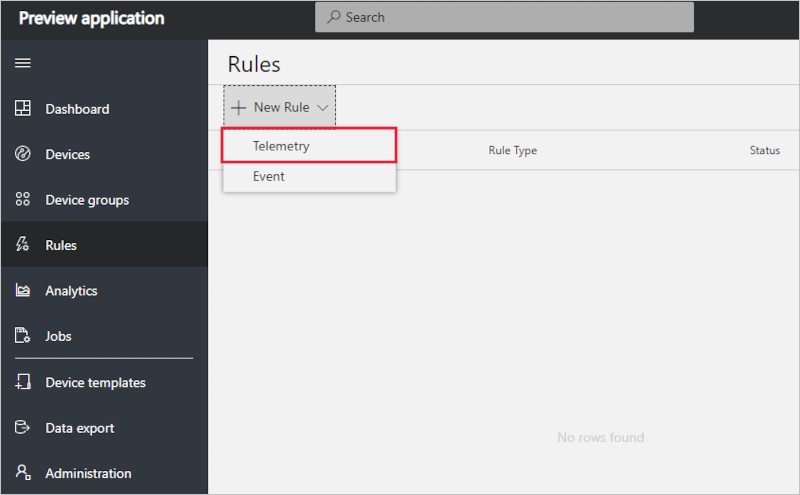
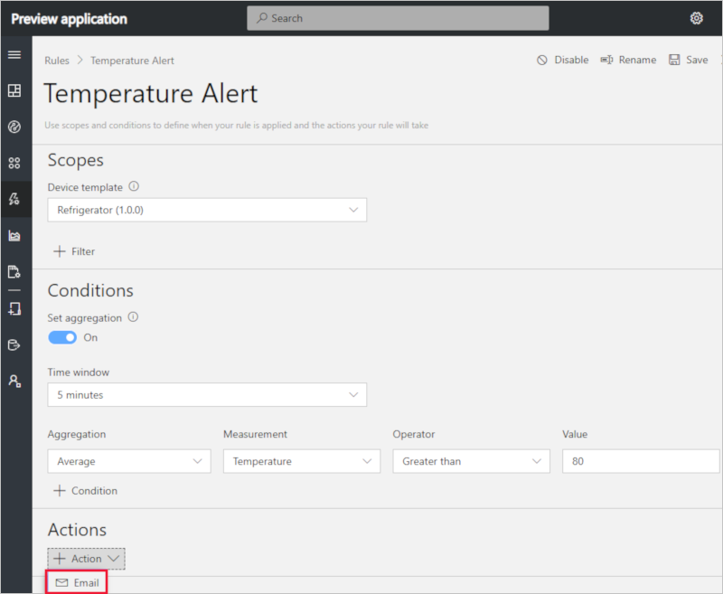
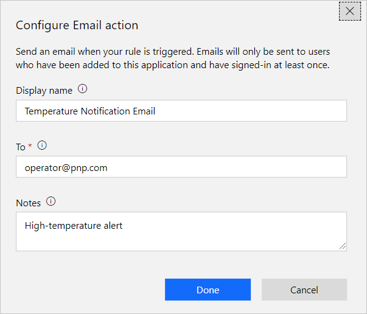

# Create a telemetry rule and set up notifications in your Azure IoT Central application (preview features)

*This article applies to operators, builders, and administrators.*

[!INCLUDE [iot-central-pnp-original](../../includes/iot-central-pnp-original-note.md)]

You can use Azure IoT Central to remotely monitor your connected devices. Azure IoT Central rules enable you to monitor your devices in near real time and automatically invoke actions, such as send an email or trigger Microsoft Flow. In just a few clicks, you can define the condition for which to monitor your device data and configure the corresponding action. This article explains how to create rules to monitor telemetry sent by the device.

Devices can use telemetry measurement to send numerical data from the device. A telemetry rule triggers when the selected device telemetry crosses a specified threshold.

## Create a telemetry rule

To create a telemetry rule, the device definition must have at least one telemetry measurement defined. This example uses a refrigerated vending machine device that sends temperature and humidity telemetry. The rule monitors the temperature reported by the device and sends an email when it goes above 80 degrees.

1. Navigate to the **Rules** page.

1. If you haven't created any rules yet, you see the following screen:

    

1. Select **+ New Rule** to see the types of rules you can create.

1. Select **Telemetry** to create a rule to monitor device telemetry.

    

1. Enter a name that helps you to identify the rule and hit Enter.

1. Select the device definition that you wish to scope this rule to in the Scopes section. This screen is also where you can filter down the devices the rule applies to by using **+ Filter**. The rule automatically applies to all the devices under the device template. To disable the rule, select the **Disable** button in the header.

### Configure the rule conditions

Condition defines the criteria that is monitored by the rule.

1. Select whether you want to **Set aggregation** as on or off.

      - Aggregation is optional. Without aggregation, the rule triggers for each telemetry data point that meets the condition. For example, if the rule is configured to trigger when temperature is above 80 then the rule triggers almost instantly when the device reports temperature > 80.
      - If an aggregate function such as average, min, max, count is chosen, then the user must provide a **Time window** over which the condition needs to be evaluated. For example, if you set the period as "5 minutes" and your rule looks for Average temperature above 80, the rule triggers when the average temperature is above 80 for at least 5 minutes. The rule evaluation frequency is the same as the **Time window**, which means, in this example, the rule is evaluated once every 5 minutes.

1. Select the telemetry you want to monitor from the **Measurement** dropdown.

1. Next, choose an **Operator** and provide a **Value**.

     

>[!NOTE]
>More than one telemetry measurement can be added by selecting **+ Condition**. When multiple conditions are specified, all the conditions must be met for the rule to trigger. Each condition gets joined by an 'AND' clause implicitly. When using aggregate, every measurement must be aggregated.

### Configure actions

This section shows you how to set up actions to take when the rule is fired. Actions get invoked when all the conditions specified in the rule evaluate to true.

1. Click the **+ Action** in the **Action** sections. Here you see the list of available actions.  

    

1. Choose the **Email** action, enter a display name for the action, a valid email address in the **To** field, and provide a note to appear in the body of the email when the rule triggers.

    > [!NOTE]
    > Emails are only sent to the users that have been added to the application and have logged in at least once. Learn more about [user management](howto-administer-pnp.md?toc=/azure/iot-central-pnp/toc.json&bc=/azure/iot-central-pnp/breadcrumb/toc.json) in Azure IoT Central.

   

1. To save the action, choose **Done**.

1. To save the rule, choose **Save**. The rule goes live within a few minutes and starts monitoring telemetry being sent to your application. When the condition specified in the rule is met, the rule triggers the configured email action.

## Parameterize the rule

Rules can derive certain vales from **Device Properties** as parameters. Using parameters is helpful in scenarios where telemetry thresholds vary for different devices. While creating the rule, choose a device property that specifies the threshold, such as **Maximum Ideal Threshold**, instead of providing an absolute value, such as 80 degrees. When the rule executes, it matches the device telemetry with the value set in the device property.

Using parameters is an effective way to reduce the number of rules to manage.

Actions can also be configured using **Device Property** as a parameter. If an email address is stored as a property, then it can be used when you define the **To** address.

## Delete a rule

If you no longer need a rule, delete it by opening the rule and choosing **Delete**. Deleting the rule removes it from the device template and all the associated devices.

## Enable or disable a rule

Choose the rule you want to enable or disable. Toggle the **Enable** or **Disable** button in the rule to enable or disable the rule for all devices that are scoped in the rule.

## Enable or disable a rule for a device

Choose the rule you want to enable or disable. Add a filter in the **Scopes** section to include or exclude a certain device in the device template.

## Next steps

Now that you have learned how to create rules in your Azure IoT Central application, the suggested next step is to learn [How to manage your devices](howto-manage-devices-pnp.md?toc=/azure/iot-central-pnp/toc.json&bc=/azure/iot-central-pnp/breadcrumb/toc.json)
