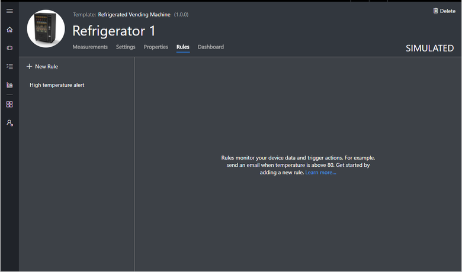
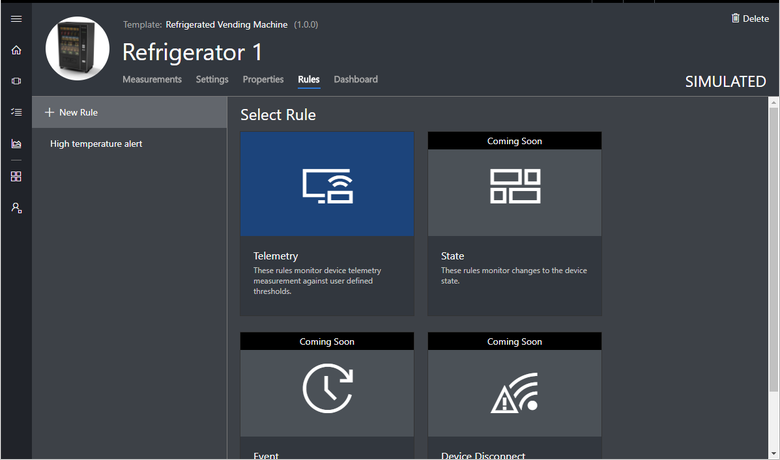
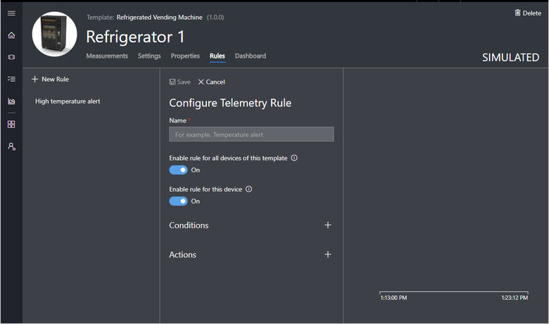
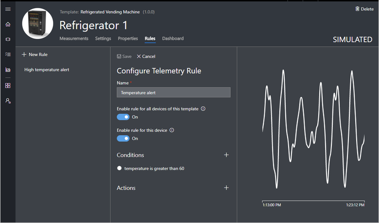
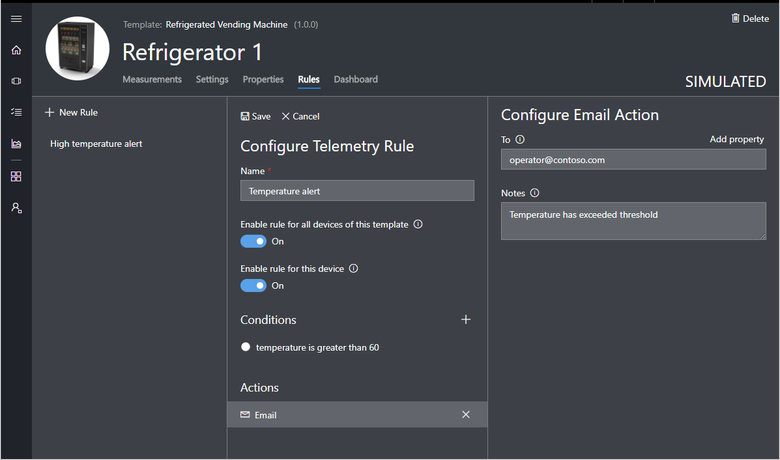

---
# Mandatory fields. See more on aka.ms/skyeye/meta.
title: Create and manage telemetry rules in your Azure IoT Central application | Microsoft Docs
description: Azure IoT Central telemetry rules enable you to monitor your devices in near real time and to automatically invoke actions, such as sending an email, when the rule triggers.
services: iot-central
author: tanmaybhagwat
ms.author: tanmayb
ms.date: 04/16/2018
ms.topic: article
# Use only one of the following. Use ms.service for services, ms.prod for on-prem. Remove the # before the relevant field.
ms.prod: microsoft-iot-central
# product-name-from-white-list

# Optional fields. Don't forget to remove # if you need a field.
# ms.custom: can-be-multiple-comma-separated
# ms.devlang:devlang-from-white-list
# ms.suite: 
# ms.tgt_pltfrm:
# ms.reviewer:
manager: timlt
---

# Create a telemetry rule and set up an action in your Azure IoT Central application

You can use Microsoft Azure IoT Central to remotely monitor your connected devices. Azure IoT Central rules enable you to monitor your devices in near real time and to automatically invoke actions such as sending an email, or triggering workflow in Microsoft Flow when the rule conditions are met. In just a few clicks, you can define the conditions to monitor your device data and configure the action to invoke. This article explains the telemetry rule in detail.

Azure IoT Central uses [telemetry measurements](howto-set-up-template.md) to capture device data. Each type of measurement has key attributes that define the measurement. You can create rules to monitor each type of device measurement and generate alerts when the rule triggers. A telemetry rule triggers when the selected device telemetry crosses a specified threshold.

## Create a telemetry rule

This section shows you how to create a telemetry rule. This example uses a connected air conditioner device that sends temperature and humidity telemetry. The rule monitors the temperature reported by the device and sends an email when it goes above 80 degrees.

1. Navigate to the device details page for the device you are adding the rule to.

1. If you haven’t created any rules yet, you see the following screen:

    

1. On the **Rules** tab, choose **+ New Rule** to see the types of rules you can create.

    

1. Choose the **Telemetry** tile to open the form to create the rule.

    

1. Choose a name that helps you to identify the rule in this device template.

1. To immediately enable the rule for all the devices created from this template, toggle **Enable rule**.

### Configure the rule condition

This section shows you how to add a condition to monitor the temperature telemetry.

1. Choose the **+** next to **Condition**.

1. Choose the **Temperature** telemetry type from the dropdown. Then choose the operator and provide a threshold value. You can add multiple telemetry conditions. When multiple conditions are specified, all the conditions must be met for the rule to trigger.

    

    > [!NOTE]
    > Select at least one telemetry measurement when you define a telemetry rule condition.

1. Click **Save** to save your rule. The rule goes live within a few minutes and starts monitoring telemetry being sent to your application.

### Add an action

This example shows you how to add an action to a rule. This shows how to add the email action, but you can also add other actions:
-  [Microsoft Flow action](howto-add-microsoft-flow.md) to kick off a workflow in Microsoft Flow when a rule is triggered
- [Webhook action](howto-create-webhooks.md) to notify other services when a rule is triggered

> [!NOTE]
> Only 1 action can be associated to a single rule at this time.

1. Choose the **+** next to **Actions**. Here you see the list of available actions.

    

1. Choose the **Email** action, enter a valid email address in the **To** field, and provide a note to appear in the body of the email when the rule triggers.

    > [!NOTE]
    > Emails are only sent to the users that have been added to the application and have logged in at least once. Learn more about [user management](howto-administer.md) in Azure IoT Central.

   

1. Click **Save**. The rule goes live within a few minutes and starts monitoring telemetry being sent to your application. When the condition specified in the rule matches, the rule triggers the configured email action.

## Parameterize the rule

Rules can derive certain vales from **Device Properties** as parameters. Using parameters is helpful in scenarios where telemetry thresholds vary for different devices. When you create the rule, choose a device property that specifies the threshold, such as **Maximum Ideal Threshold**, instead of providing an absolute value, such as 80 degrees. When the rule executes, it matches the device telemetry with the value provided in the device property.

Using parameters is an effective way to reduce the number of rules to manage per device template.

Actions can also be configured using **Device Property** as a parameter. If an email address is stored as a device property, then it can be used when you define the **To** address.

## Delete a rule

If you no longer need a rule, delete it by opening the rule and choosing **Delete**. Deleting the rule removes it from the device template and all the associated devices.

## Enable or disable a rule for a device template

Navigate to the device and choose the rule you want to enable or disable. Toggling the **Enable rule for all devices of this template** button in the rule enables or disables the rule for all devices associated with the device template.

## Enable or disable a rule for a device

Navigate to the device and choose the rule you want to enable or disable. Toggle the **Enable rule for this device** button to either enable or disable the rule for that device.

## Next steps

Now that you have learned how to edit rules in your Azure IoT Central application, here are suggested next steps:

> [!div class="nextstepaction"]
> [How to add a Microsoft Flow action to a rule](howto-add-microsoft-flow.md)
> [How to manage your devices](howto-manage-devices.md)
