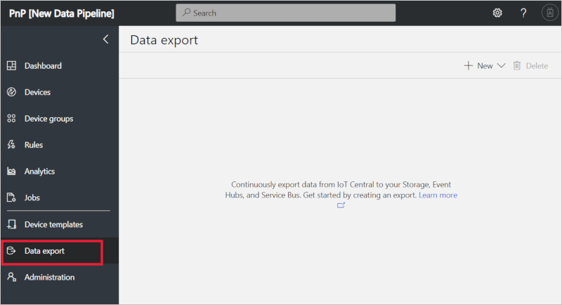
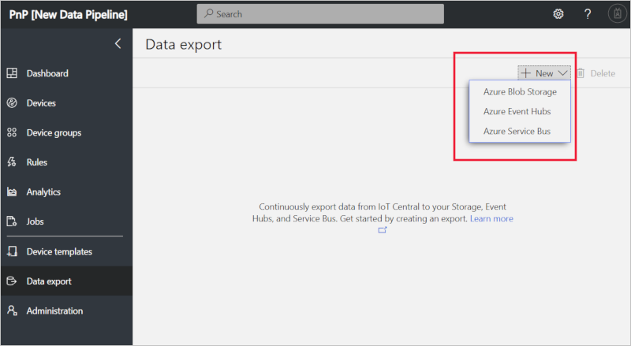
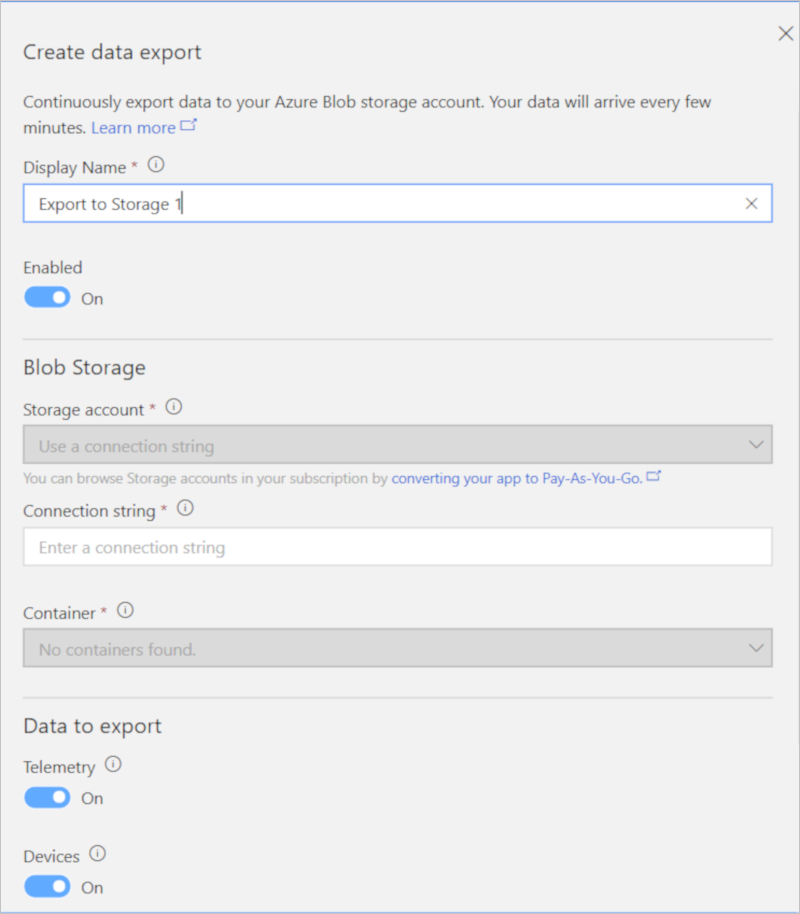
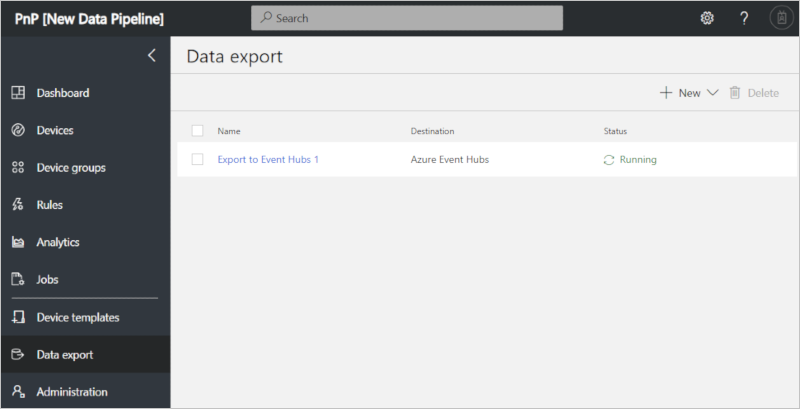

# Export your data to Azure Blob Storage

[!INCLUDE [iot-central-original-pnp](../../includes/iot-central-original-pnp-note.md)]

*This topic applies to administrators.*

This article describes how to use the continuous data export feature in Azure IoT Central to periodically export data to your **Azure Blob storage account**. You can export **telemetry**, **devices**, and **device templates** to files in JSON or Apache Avro format. The exported data can be used for cold path analytics like training models in Azure Machine Learning or long-term trend analysis in Microsoft Power BI.

> [!Note]
> When you turn on continuous data export, you get only the data from that moment onward. Currently, data can't be retrieved for a time when continuous data export was off. To retain more historical data, turn on continuous data export early.


## Prerequisites

- You must be an administrator in your IoT Central application

## Create storage account
If you don't have an existing Storage to export to, follow these steps:

1. Create a [new storage account in the Azure portal](https://ms.portal.azure.com/#create/Microsoft.StorageAccount-ARM). You can learn more in [Azure Storage docs](https://aka.ms/blobdocscreatestorageaccount).
2. Choose a subscription. 

    > [!Note] 
    > You can export data to storage accounts in subscriptions different than the one for your Pay-As-You-Go IoT Central application. You will connect using a connection string in this case.

3. Create a container in your storage account. Go to your storage account. Under **Blob Service**, select **Browse Blobs**. Select **+ Container** at the top to create a new container.


## Set up continuous data export

Now that you have a Storage destination to export data to, follow these steps to set up continuous data export. 

1. Sign in to your IoT Central application.

2. In the left menu, select **Continuous Data Export**.

    > [!Note]
    > If you don't see Continuous Data Export in the left menu, you are not an administrator in your app. Talk to an administrator to set up data export.

    

3. Select the **+ New** button in the top right. Choose **Azure Blob Storage** as the destination of your export. 

    > [!NOTE] 
    > The maximum number of exports per app is five. 

    

4. In the drop-down list box, select your **Storage Account namespace**. You can also pick the last option in the list which is **Enter a connection string**. 

    > [!NOTE] 
    > You will only see Storage Accounts namespaces in the **same subscription as your IoT Central app**. If you want to export to a destination outside of this subscription, choose **Enter a connection string** and see step 5.

    > [!NOTE] 
    > For 7 day trial apps, the only way to configure continuous data export is through a connection string. This is because 7 day trial apps do not have an associated Azure subscription.

    

5. (Optional) If you chose **Enter a connection string**, a new box appears for you to paste your connection string. To get the connection string for your:
    - Storage account, go to the Storage account in the Azure portal.
        - Under **Settings**, select **Access keys**
        - Copy either the key1 Connection string or the key2 Connection string
 
6. Choose a Container from the drop-down list box.

7. (Optional) The default **Data format** is JSON. You can also export your data in [Apache Avro](https://avro.apache.org/docs/current/index.html) format, which is a data serialization system that represents the JSON data in a compact binary format.

8.  Under **Data to export**, specify each type of data to export by setting the type to **On**.

9. To turn on continuous data export, make sure **Data export** is **On**. Select **Save**.

   

10. After a few minutes, your data will appear in your storage account.


## Path structure

Telemetry, devices, and device templates data are exported to your storage account once per minute, with each file containing the batch of changes since the last exported file. The exported data will be in three folders, in either JSON or Avro format. The default paths in your storage account are:
- Telemetry: {container}/{app-id}/telemetry/{YYYY}/{MM}/{dd}/{hh}/{mm}/{filename}
- Devices: {container}/{app-id}/devices/{YYYY}/{MM}/{dd}/{hh}/{mm}/{filename}
- Device templates: {container}/{app-id}/deviceTemplates/{YYYY}/{MM}/{dd}/{hh}/{mm}/{filename}

You can browse the exported files in the Azure Portal by navigating to the file and choosing the **Edit blob** tab.

### Telemetry

The exported telemetry data has all the new messages received by IoT Central from all devices during that time. The exported files use the same format as the message files exported by [IoT Hub message routing](https://docs.microsoft.com/azure/iot-hub/iot-hub-csharp-csharp-process-d2c) to Blob storage.

> [!NOTE]
> The devices that send the telemetry are represented by device IDs (see the following sections). To get the names of the devices, export the device snapshots. Correlate each message record by using the **connectionDeviceId** that matches the **deviceId** of the device record.

The following example shows a record in JSON format.

```json
{
    "EnqueuedTimeUtc": "2019-09-26T17:46:09.8870000Z",
    "Properties": {},
    "SystemProperties": {
        "connectionDeviceId": "123",
        "connectionAuthMethod": "{\"scope\":\"device\",\"type\":\"sas\",\"issuer\":\"iothub\",\"acceptingIpFilterRule\":null}",
        "connectionDeviceGenerationId": "637051167384630591",
        "contentType": "application/json",
        "contentEncoding": "utf-8",
        "enqueuedTime": "2019-09-26T17:46:09.8870000Z"
    },
    "Body": {
        "temp": 49.91322758395974,
        "humid": 49.61214852573155,
        "pm25": 25.87332214661367
    }
}
```

### Devices

When continuous data export is first turned on, a single snapshot with all devices is exported. Each device includes:
- `id` of the device in IoT Central
- `name` of the device
- `deviceId` from [Device Provisioning Service](https://aka.ms/iotcentraldocsdps)
- Device template information
- Property values
- Setting values

A new snapshot is written once per minute. The snapshot includes:

- New devices added since the last snapshot.
- Devices with changed property and setting values since the last snapshot.

> [!NOTE]
> Devices deleted since the last snapshot aren't exported. Currently, the snapshots don't have indicators for deleted devices.
>
> The device template that each device belongs to is represented by a device template ID. To get the name of the device template, export the device template snapshots.

The following example shows a record in JSON format.

```json
{
    "@id": "<id-value>",
    "@type": "Device",
    "displayName": "Airbox",
    "data": {
        "$cloudProperties": {},
        "EnvironmentalSensor": {
            "thsensormodel": {
                "reported": {
                    "value": "Neque quia et voluptatem veritatis assumenda consequuntur quod.",
                    "$lastUpdatedTimestamp": "2019-09-26T17:56:34.7507554Z"
                }
            },
            "pm25sensormodel": {
                "reported": {
                    "value": "Aut alias odio.",
                    "$lastUpdatedTimestamp": "2019-09-26T17:56:34.7507554Z"
                }
            }
        },
        "urn_azureiot_DeviceManagement_DeviceInformation": {
            "totalStorage": {
                "reported": {
                    "value": 27900.9730905171,
                    "$lastUpdatedTimestamp": "2019-09-26T17:56:34.7507554Z"
                }
            },
            "totalMemory": {
                "reported": {
                    "value": 4667.82916715811,
                    "$lastUpdatedTimestamp": "2019-09-26T17:56:34.7507554Z"
                }
            }
        }
    },
    "instanceOf": "<template-id>",
    "deviceId": "<device-id>",
    "simulated": true
}
```

### Device templates

When continuous data export is first turned on, a single snapshot with all device templates is exported. Each device template includes:
- `id` of the device template
- `name` of the device template
- `version` of the device template
- Measurement data types and min/max values.
- Property data types and default values.
- Setting data types and default values.

A new snapshot is written once per minute. The snapshot includes:

- New device templates added since the last snapshot.
- Device templates with changed telemetry, property, and setting definitions since the last snapshot.

> [!NOTE]
> Device templates deleted since the last snapshot aren't exported. Currently, the snapshots don't have indicators for deleted device templates.

The following example shows a record in JSON format.

```json
{
    "@id": "<id>",
    "@type": "DeviceModelDefinition",
    "displayName": "Airbox",
    "capabilityModel": {
        "@id": "<id>",
        "@type": "CapabilityModel",
        "implements": [{
            "@id": "<id>",
            "@type": "InterfaceInstance",
            "name": "EnvironmentalSensor",
            "schema": {
                "@id": "<id>",
                "@type": "Interface",
                "comment": "Requires temperature and humidity sensors.",
                "description": "Provides functionality to report temperature, humidity. Provides telemetry, commands and read-write properties",
                "displayName": "Environmental Sensor",
                "contents": [{
                    "@id": "urn:aaeon:AAEONAirbox52Sensor:temp:1",
                    "@type": "Telemetry",
                    "description": "Current temperature on the device",
                    "displayName": "Temperature",
                    "name": "temp",
                    "schema": "double"
                }, {
                    "@id": "urn:aaeon:AAEONAirbox52Sensor:humid:1",
                    "@type": "Telemetry",
                    "description": "Current humidity on the device",
                    "displayName": "Humidity",
                    "name": "humid",
                    "schema": "integer"
                }, {
                    "@id": "urn:aaeon:AAEONAirbox52Sensor:pm25:1",
                    "@type": "Telemetry",
                    "description": "Current PM2.5 on the device",
                    "displayName": "PM2.5",
                    "name": "pm25",
                    "schema": "integer"
                }, {
                    "@id": "urn:aaeon:AAEONAirbox52Sensor:thsensormodel:1",
                    "@type": "Property",
                    "description": "T&H Sensor Model Name",
                    "displayName": "T&H Sensor Model",
                    "name": "thsensormodel",
                    "schema": "string"
                }, {
                    "@id": "urn:aaeon:AAEONAirbox52Sensor:pm25sensormodel:1",
                    "@type": "Property",
                    "description": "PM2.5 Sensor Model Name",
                    "displayName": "PM2.5 Sensor Model",
                    "name": "pm25sensormodel",
                    "schema": "string"
                }]
            }
        }, {
            "@id": "<id>",
            "@type": "InterfaceInstance",
            "name": "urn_azureiot_DeviceManagement_DeviceInformation",
            "schema": {
                "@id": "<id>",
                "@type": "Interface",
                "displayName": "Device information",
                "contents": [{
                    "@id": "<id>",
                    "@type": "Property",
                    "comment": "Total available storage on the device in kilobytes. Ex. 20480000 kilobytes.",
                    "displayName": "Total storage",
                    "name": "totalStorage",
                    "displayUnit": "kilobytes",
                    "schema": "long"
                }, {
                    "@id": "<id>",
                    "@type": "Property",
                    "comment": "Total available memory on the device in kilobytes. Ex. 256000 kilobytes.",
                    "displayName": "Total memory",
                    "name": "totalMemory",
                    "displayUnit": "kilobytes",
                    "schema": "long"
                }]
            }
        }],
        "displayName": "AAEONAirbox52"
    },
    "solutionModel": {
        "@id": "<id>",
        "@type": "SolutionModel"
    }
}
```

## Read exported Avro files

Avro is a binary format, so the files can't be read in their raw state. The files can be decoded to JSON format. The following examples show how to parse the telemetry, devices, and device templates Avro files. The examples correspond to the examples described in the previous section.

### Read Avro files by using Python

#### Install pandas and the pandavro package

```python
pip install pandas
pip install pandavro
```

#### Parse a telemetry Avro file

```python
import json
import pandavro as pdx
import pandas as pd


def parse(filePath):
    # Pandavro loads the Avro file into a pandas DataFrame
    # where each record is a single row.
    telemetry = pdx.from_avro(filePath)

    # This example creates a new DataFrame and loads a series
    # for each column that's mapped into a column in our new DataFrame.
    transformed = pd.DataFrame()

    # The SystemProperties column contains a dictionary
    # with the device ID located under the connectionDeviceId key.
    transformed["device_id"] = telemetry["SystemProperties"].apply(
        lambda x: x["connectionDeviceId"])

    # The Body column is a series of UTF-8 bytes that is stringified
    # and parsed as JSON. This example pulls the humidity property
    # from each column to get the humidity field.
    transformed["humidity"] = telemetry["Body"].apply(
        lambda x: json.loads(bytes(x).decode('utf-8'))["humidity"])

    # Finally, print the new DataFrame with our device IDs and humidities.
    print(transformed)
```

#### Parse a devices Avro file

```python
import json
import pandavro as pdx
import pandas as pd


def parse(filePath):
    # Pandavro loads the Avro file into a pandas DataFrame
    # where each record is a single row.
    devices = pdx.from_avro(filePath)

    # This example creates a new DataFrame and loads a series
    # for each column that's mapped into a column in our new DataFrame.
    transformed = pd.DataFrame()

    # The device ID is available in the id column.
    transformed["device_id"] = devices["deviceId"]

    # The template ID and version are present in a dictionary under
    # the deviceTemplate column.
    transformed["template_id"] = devices["deviceTemplate"].apply(
        lambda x: x["id"])
    transformed["template_version"] = devices["deviceTemplate"].apply(
        lambda x: x["version"])

    # The fanSpeed setting value is located in a nested dictionary
    # under the settings column.
    transformed["fan_speed"] = devices["settings"].apply(
        lambda x: x["device"]["fanSpeed"])

    # Finally, print the new DataFrame with our device and template
    # information, along with the value of the fan speed.
    print(transformed)
```

#### Parse a device templates Avro file

```python
import json
import pandavro as pdx
import pandas as pd


def parse(filePath):
    # Pandavro loads the Avro file into a pandas DataFrame
    # where each record is a single row.
    templates = pdx.from_avro(filePath)

    # This example creates a new DataFrame and loads a series
    # for each column that's mapped into a column in our new DataFrame.
    transformed = pd.DataFrame()

    # The template and version are available in the id and version columns.
    transformed["template_id"] = templates["id"]
    transformed["template_version"] = templates["version"]

    # The fanSpeed setting value is located in a nested dictionary
    # under the settings column.
    transformed["fan_speed"] = templates["settings"].apply(
        lambda x: x["device"]["fanSpeed"])

    # Finally, print the new DataFrame with our device and template
    # information, along with the value of the fan speed.
    print(transformed)
```

### Read Avro files by using C#

#### Install the Microsoft.Hadoop.Avro package

```csharp
Install-Package Microsoft.Hadoop.Avro -Version 1.5.6
```

#### Parse a telemetry Avro file

```csharp
using Microsoft.Hadoop.Avro;
using Microsoft.Hadoop.Avro.Container;
using Newtonsoft.Json;

public static async Task Run(string filePath)
{
    using (var fileStream = File.OpenRead(filePath))
    {
        using (var reader = AvroContainer.CreateGenericReader(fileStream))
        {
            // For one Avro container, where a container can contain multiple blocks,
            // loop through each block in the container.
            while (reader.MoveNext())
            {
                // Loop through the Avro records in the block and extract the fields.
                foreach (AvroRecord record in reader.Current.Objects)
                {
                    var systemProperties = record.GetField<IDictionary<string, object>>("SystemProperties");
                    var deviceId = systemProperties["connectionDeviceId"] as string;
                    Console.WriteLine("Device ID: {0}", deviceId);

                    using (var stream = new MemoryStream(record.GetField<byte[]>("Body")))
                    {
                        using (var streamReader = new StreamReader(stream, Encoding.UTF8))
                        {
                            var body = JsonSerializer.Create().Deserialize(streamReader, typeof(IDictionary<string, dynamic>)) as IDictionary<string, dynamic>;
                            var humidity = body["humidity"];
                            Console.WriteLine("Humidity: {0}", humidity);
                        }
                    }
                }
            }
        }
    }
}
```

#### Parse a devices Avro file

```csharp
using Microsoft.Hadoop.Avro;
using Microsoft.Hadoop.Avro.Container;

public static async Task Run(string filePath)
{
    using (var fileStream = File.OpenRead(filePath))
    {
        using (var reader = AvroContainer.CreateGenericReader(fileStream))
        {
            // For one Avro container, where a container can contain multiple blocks,
            // loop through each block in the container.
            while (reader.MoveNext())
            {
                // Loop through the Avro records in the block and extract the fields.
                foreach (AvroRecord record in reader.Current.Objects)
                {
                    // Get the field value directly. You can also yield return
                    // records and make the function IEnumerable<AvroRecord>.
                    var deviceId = record.GetField<string>("deviceId");

                    // The device template information is stored in a sub-record
                    // under the deviceTemplate field.
                    var deviceTemplateRecord = record.GetField<AvroRecord>("deviceTemplate");
                    var templateId = deviceTemplateRecord.GetField<string>("id");
                    var templateVersion = deviceTemplateRecord.GetField<string>("version");

                    // The settings and properties are nested two levels deep.
                    // The first level indicates settings or properties.
                    // The second level indicates the type of setting or property.
                    var settingsRecord = record.GetField<AvroRecord>("settings");
                    var deviceSettingsRecord = settingsRecord.GetField<IDictionary<string, dynamic>>("device");
                    var fanSpeed = deviceSettingsRecord["fanSpeed"];
                    
                    Console.WriteLine(
                        "Device ID: {0}, Template ID: {1}, Template Version: {2}, Fan Speed: {3}",
                        deviceId,
                        templateId,
                        templateVersion,
                        fanSpeed
                    );
                }
            }
        }
    }
}

```

#### Parse a device templates Avro file

```csharp
using Microsoft.Hadoop.Avro;
using Microsoft.Hadoop.Avro.Container;

public static async Task Run(string filePath)
{
    using (var fileStream = File.OpenRead(filePath))
    {
        using (var reader = AvroContainer.CreateGenericReader(fileStream))
        {
            // For one Avro container, where a container can contain multiple blocks,
            // loop through each block in the container.
            while (reader.MoveNext())
            {
                // Loop through the Avro records in the block and extract the fields.
                foreach (AvroRecord record in reader.Current.Objects)
                {
                    // Get the field value directly. You can also yield return
                    // records and make the function IEnumerable<AvroRecord>.
                    var id = record.GetField<string>("id");
                    var version = record.GetField<string>("version");

                    // The settings and properties are nested two levels deep.
                    // The first level indicates settings or properties.
                    // The second level indicates the type of setting or property.
                    var settingsRecord = record.GetField<AvroRecord>("settings");
                    var deviceSettingsRecord = settingsRecord.GetField<IDictionary<string, dynamic>>("device");
                    var fanSpeed = deviceSettingsRecord["fanSpeed"];
                    
                    Console.WriteLine(
                        "ID: {1}, Version: {2}, Fan Speed: {3}",
                        id,
                        version,
                        fanSpeed
                    );
                }
            }
        }
    }
}
```

### Read Avro files by using Javascript

#### Install the avsc package

```javascript
npm install avsc
```

#### Parse a telemetry Avro file

```javascript
const avro = require('avsc');

// Read the Avro file. Parse the device ID and humidity from each record.
async function parse(filePath) {
    const records = await load(filePath);
    for (const record of records) {
        // Fetch the device ID from the system properties.
        const deviceId = record.SystemProperties.connectionDeviceId;

        // Convert the body from a buffer to a string and parse it.
        const body = JSON.parse(record.Body.toString());

        // Get the humidty property from the body.
        const humidity = body.humidity;

        // Log the retrieved device ID and humidity.
        console.log(`Device ID: ${deviceId}`);
        console.log(`Humidity: ${humidity}`);
    }
}

function load(filePath) {
    return new Promise((resolve, reject) => {
        // The file decoder emits each record as a data event on a stream.
        // Collect the records into an array and return them at the end.
        const records = [];
        avro.createFileDecoder(filePath)
            .on('data', record => { records.push(record); })
            .on('end', () => resolve(records))
            .on('error', reject);
    });
}
```

#### Parse a devices Avro file

```javascript
const avro = require('avsc');

// Read the Avro file. Parse the device and template identification
// information and the fanSpeed setting for each device record.
async function parse(filePath) {
    const records = await load(filePath);
    for (const record of records) {
        // Fetch the device ID from the deviceId property.
        const deviceId = record.deviceId;

        // Fetch the template ID and version from the deviceTemplate property.
        const deviceTemplateId = record.deviceTemplate.id;
        const deviceTemplateVersion = record.deviceTemplate.version;

        // Get the fanSpeed from the nested device settings property.
        const fanSpeed = record.settings.device.fanSpeed;

        // Log the retrieved device ID and humidity.
        console.log(`deviceID: ${deviceId}, Template ID: ${deviceTemplateId}, Template Version: ${deviceTemplateVersion}, Fan Speed: ${fanSpeed}`);
    }
}

function load(filePath) {
    return new Promise((resolve, reject) => {
        // The file decoder emits each record as a data event on a stream.
        // Collect the records into an array and return them at the end.
        const records = [];
        avro.createFileDecoder(filePath)
            .on('data', record => { records.push(record); })
            .on('end', () => resolve(records))
            .on('error', reject);
    });
}
```

#### Parse a device templates Avro file

```javascript
const avro = require('avsc');

// Read the Avro file. Parse the device and template identification
// information and the fanSpeed setting for each device record.
async function parse(filePath) {
    const records = await load(filePath);
    for (const record of records) {
        // Fetch the template ID and version from the id and verison properties.
        const templateId = record.id;
        const templateVersion = record.version;

        // Get the fanSpeed from the nested device settings property.
        const fanSpeed = record.settings.device.fanSpeed;

        // Log the retrieved device id and humidity.
        console.log(`Template ID: ${templateId}, Template Version: ${templateVersion}, Fan Speed: ${fanSpeed}`);
    }
}

function load(filePath) {
    return new Promise((resolve, reject) => {
        // The file decoder emits each record as a data event on a stream.
        // Collect the records into an array and return them at the end.
        const records = [];
        avro.createFileDecoder(filePath)
            .on('data', record => { records.push(record); })
            .on('end', () => resolve(records))
            .on('error', reject);
    });
}
```

## Next steps

Now that you know how to export your data, continue to the next step:

> [!div class="nextstepaction"]
> [How to visualize your data in Power BI](howto-connect-powerbi.md)
