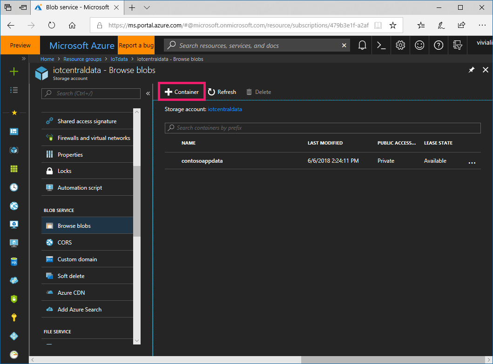
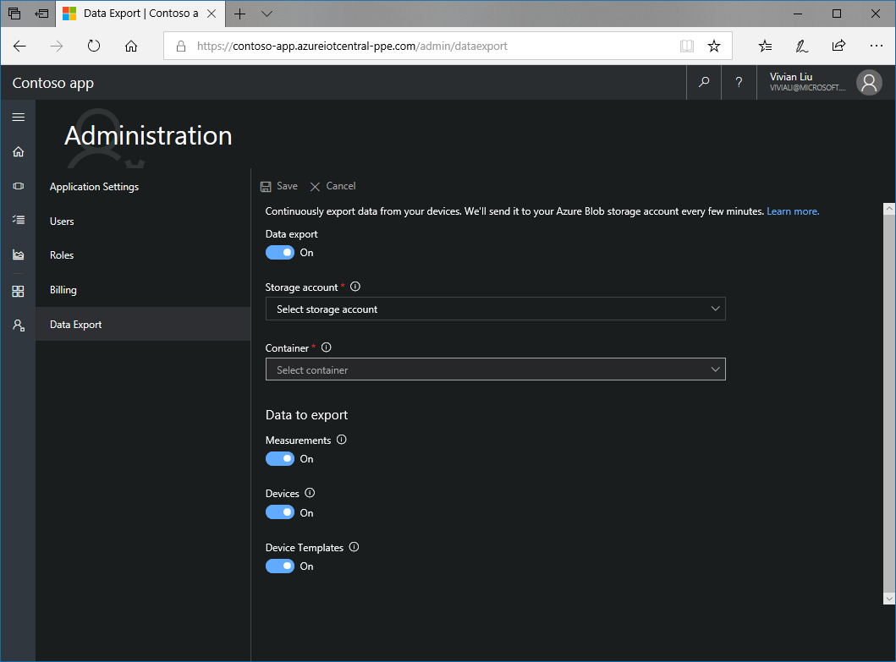

# Export your data in Azure IoT Central

*This topic applies to administrators.*

This article describes how to use the continuous data export feature in Azure IoT Central to periodically export data to your Azure Blob storage account. You can export **measurements**, **devices**, and **device templates** to files with the [Apache AVRO](https://avro.apache.org/docs/current/index.html) format. The exported data can be used for cold path analytics like training models in Azure Machine Learning or long-term trend analysis in Microsoft Power BI.

> [!Note]
> When you turn on continuous data export, you get only the data from that moment onward. Currently, data can't be retrieved for a time when continuous data export was off. To retain more historical data, turn on continuous data export early.

## Prerequisites

- An extended 30-day trial IoT Central application, or a paid application.
- An Azure account with an Azure subscription.
- The same Azure account is an administrator in your IoT Central application.
- The same Azure account has permissions to create a storage account or access an existing storage account in the same Azure subscription.

## Types of data to export

### Measurements

The measurements that devices send are exported to your storage account once per minute. The data has all the new messages received by IoT Central from all devices during that time. The exported AVRO files use the same format as the message files exported by [IoT Hub message routing](https://docs.microsoft.com/azure/iot-hub/iot-hub-csharp-csharp-process-d2c) to Blob storage.

> [!NOTE]
> The devices that send the measurements are represented by device IDs (see the following sections). To get the names of the devices, export the device snapshots. Correlate each message record by using the **connectionDeviceId** that matches the **deviceId** of the device record.

The following example shows a record in a decoded AVRO file:

```json
{
    "EnqueuedTimeUtc": "2018-06-11T00:00:08.2250000Z",
    "Properties": {},
    "SystemProperties": {
        "connectionDeviceId": "<connectionDeviceId>",
        "connectionAuthMethod": "{\"scope\":\"hub\",\"type\":\"sas\",\"issuer\":\"iothub\",\"acceptingIpFilterRule\":null}",
        "connectionDeviceGenerationId": "<generationId>",
        "enqueuedTime": "2018-06-11T00:00:08.2250000Z"
    },
    "Body": "{\"humidity\":80.59100954598546,\"magnetometerX\":0.29451796907056726,\"magnetometerY\":0.5550332126050068,\"magnetometerZ\":-0.04116681874733441,\"connectivity\":\"connected\",\"opened\":\"triggered\"}"
}
```

### Devices

When continuous data export is first turned on, a single snapshot with all devices is exported. Each device includes:
- `id` of the device in IoT Central
- `name` of the device
- `deviceId` from [Device Provisioning Service](https://aka.ms/iotcentraldocsdps)
- Device template information
- Property values
- Setting values

A new snapshot is written once per minute. The snapshot includes:

- New devices added since the last snapshot.
- Devices with changed property and setting values since the last snapshot.

> [!NOTE]
> Devices deleted since the last snapshot aren't exported. Currently, the snapshots don't have indicators for deleted devices.
>
> The device template that each device belongs to is represented by a device template ID. To get the name of the device template, export the device template snapshots.

A record in the decoded AVRO file can look like:

```json
{
    "id": "<id>",
    "name": "Refrigerator 2",
    "simulated": true,
    "deviceId": "<deviceId>",
    "deviceTemplate": {
        "id": "<template id>",
        "version": "1.0.0"
    },
    "properties": {
        "cloud": {
            "location": "New York",
            "maintCon": true,
            "tempThresh": 20
        },
        "device": {
            "lastReboot": "2018-02-09T22:22:47.156Z"
        }
    },
    "settings": {
        "device": {
            "fanSpeed": 0
        }
    }
}
```

### Device templates

When continuous data export is first turned on, a single snapshot with all device templates is exported. Each device template includes:
- `id` of the device template
- `name` of the device template
- `version` of the device template
- Measurement data types and min/max values.
- Property data types and default values.
- Setting data types and default values.

A new snapshot is written once per minute. The snapshot includes:

- New device templates added since the last snapshot.
- Device templates with changed measurements, property, and setting definitions since the last snapshot.

> [!NOTE]
> Device templates deleted since the last snapshot aren't exported. Currently, the snapshots don't have indicators for deleted device templates.

A record in the decoded AVRO file can look like this:

```json
{
    "id": "<id>",
    "name": "Refrigerated Vending Machine",
    "version": "1.0.0",
    "measurements": {
        "telemetry": {
            "humidity": {
                "dataType": "double",
                "name": "Humidity"
            },
            "magnetometerX": {
                "dataType": "double",
                "name": "Magnetometer X"
            },
            "magnetometerY": {
                "dataType": "double",
                "name": "Magnetometer Y"
            },
            "magnetometerZ": {
                "dataType": "double",
                "name": "Magnetometer Z"
            }
        },
        "states": {
            "connectivity": {
                "dataType": "enum",
                "name": "Connectivity"
            }
        },
        "events": {
            "opened": {
                "name": "Door Opened",
                "category": "informational"
            }
        }
    },
    "settings": {
        "device": {
            "fanSpeed": {
                "dataType": "double",
                "name": "Fan Speed",
                "initialValue": 0
            }
        }
    },
    "properties": {
        "cloud": {
            "location": {
                "dataType": "string",
                "name": "Location",
                "initialValue": "Seattle"
            },
            "maintCon": {
                "dataType": "boolean",
                "name": "Maintenance Contract",
                "initialValue": true
            },
            "tempThresh": {
                "dataType": "double",
                "name": "Temperature Alert Threshold",
                "initialValue": 30
            }
        },
        "device": {
            "lastReboot": {
                "dataType": "dateTime",
                "name": "Last Reboot"
            }
        }
    }
}
```

## Set up continuous data export

1. If you don't have an Azure storage account, [create a new storage account](https://ms.portal.azure.com/#create/Microsoft.StorageAccount-ARM) in the Azure portal. Create the storage account **in the Azure subscription that has your IoT Central application**.
    - For the account type, choose **General purpose** or **Blob storage**.
    - Select the subscription that has your IoT Central application. If you don't see the subscription, you might need to sign in to a different Azure account or request access to the subscription.
    - Choose an existing resource group or create a new one. Learn about [how to create a new storage account](https://aka.ms/blobdocscreatestorageaccount).

2. Create a container in your storage account to export your IoT Central data. Go to your storage account. Under **Blob Service**, select **Browse Blobs**. Select **Container** to create a new container.

   

3. Sign in to your IoT Central application by using the same Azure account.

4. Under **Administration**, select **Data Export**.

5. In the **Storage account** drop-down list box, select your storage account. In the **Container** drop-down list box, select your container. Under **Data to export**, specify each type of data to export by setting the type to **On**.

6. To turn on continuous data export, set **Data export** to **On**. Select **Save**.

  

7. After a few minutes, your data appears in your storage account. Browse to your storage account. Select **Browse blobs** > your container. You see three folders for the export data. The default paths for the AVRO files with the export data are:
    - Messages: {container}/measurements/{hubname}/{YYYY}/{MM}/{dd}/{hh}/{mm}/{filename}.avro
    - Devices: {container}/devices/{YYYY}/{MM}/{dd}/{hh}/{mm}/{filename}.avro
    - Device templates: {container}/deviceTemplates/{YYYY}/{MM}/{dd}/{hh}/{mm}/{filename}.avro

## Read exported AVRO files

AVRO is a binary format, so the files can't be read in their raw state. The files can be decoded to JSON format. The following examples show how to parse the measurements, devices, and device templates AVRO files. The examples correspond to the examples described in the previous section.

### Read AVRO files by using Python

#### Install pandas and the pandavro package

```python
pip install pandas
pip install pandavro
```

#### Parse a measurements AVRO file

```python
import json
import pandavro as pdx
import pandas as pd

def parse(filePath):
    # Pandavro loads the AVRO file into a pandas DataFrame
    # where each record is a single row.
    measurements = pdx.from_avro(filePath)

    # This example creates a new DataFrame and loads a series
    # for each column that's mapped into a column in our new DataFrame.
    transformed = pd.DataFrame()

    # The SystemProperties column contains a dictionary
    # with the device ID located under the connectionDeviceId key.
    transformed["device_id"] = measurements["SystemProperties"].apply(lambda x: x["connectionDeviceId"])

    # The Body column is a series of UTF-8 bytes that is stringified
    # and parsed as JSON. This example pulls the humidity property
    # from each column to get the humidity field.
    transformed["humidity"] = measurements["Body"].apply(lambda x: json.loads(bytes(x).decode('utf-8'))["humidity"])

    # Finally, print the new DataFrame with our device IDs and humidities.
    print(transformed)

```

#### Parse a devices AVRO file

```python
import json
import pandavro as pdx
import pandas as pd

def parse(filePath):
    # Pandavro loads the AVRO file into a pandas DataFrame
    # where each record is a single row.
    devices = pdx.from_avro(filePath)

    # This example creates a new DataFrame and loads a series
    # for each column that's mapped into a column in our new DataFrame.
    transformed = pd.DataFrame()

    # The device ID is available in the id column.
    transformed["device_id"] = devices["deviceId"]

    # The template ID and version are present in a dictionary under
    # the deviceTemplate column.
    transformed["template_id"] = devices["deviceTemplate"].apply(lambda x: x["id"])
    transformed["template_version"] = devices["deviceTemplate"].apply(lambda x: x["version"])

    # The fanSpeed setting value is located in a nested dictionary
    # under the settings column.
    transformed["fan_speed"] = devices["settings"].apply(lambda x: x["device"]["fanSpeed"])

    # Finally, print the new DataFrame with our device and template
    # information, along with the value of the fan speed.
    print(transformed)

```

#### Parse a device templates AVRO file

```python
import json
import pandavro as pdx
import pandas as pd

def parse(filePath):
    # Pandavro loads the AVRO file into a pandas DataFrame
    # where each record is a single row.
    templates = pdx.from_avro(filePath)

    # This example creates a new DataFrame and loads a series
    # for each column that's mapped into a column in our new DataFrame.
    transformed = pd.DataFrame()

    # The template and version are available in the id and version columns.
    transformed["template_id"] = templates["id"]
    transformed["template_version"] = templates["version"]

    # The fanSpeed setting value is located in a nested dictionary
    # under the settings column.
    transformed["fan_speed"] = templates["settings"].apply(lambda x: x["device"]["fanSpeed"])

    # Finally, print the new DataFrame with our device and template
    # information, along with the value of the fan speed.
    print(transformed)
```

### Read AVRO files by using C#

#### Install the Microsoft.Hadoop.Avro package

```csharp
Install-Package Microsoft.Hadoop.Avro -Version 1.5.6
```

#### Parse a measurements AVRO file

```csharp
using Microsoft.Hadoop.Avro;
using Microsoft.Hadoop.Avro.Container;
using Newtonsoft.Json;

public static async Task Run(string filePath)
{
    using (var fileStream = File.OpenRead(filePath))
    {
        using (var reader = AvroContainer.CreateGenericReader(fileStream))
        {
            // For one AVRO container, where a container can contain multiple blocks,
            // loop through each block in the container.
            while (reader.MoveNext())
            {
                // Loop through the AVRO records in the block and extract the fields.
                foreach (AvroRecord record in reader.Current.Objects)
                {
                    var systemProperties = record.GetField<IDictionary<string, object>>("SystemProperties");
                    var deviceId = systemProperties["connectionDeviceId"] as string;
                    Console.WriteLine("Device ID: {0}", deviceId);

                    using (var stream = new MemoryStream(record.GetField<byte[]>("Body")))
                    {
                        using (var streamReader = new StreamReader(stream, Encoding.UTF8))
                        {
                            var body = JsonSerializer.Create().Deserialize(streamReader, typeof(IDictionary<string, dynamic>)) as IDictionary<string, dynamic>;
                            var humidity = body["humidity"];
                            Console.WriteLine("Humidity: {0}", humidity);
                        }
                    }
                }
            }
        }
    }
}
```

#### Parse a devices AVRO file

```csharp
using Microsoft.Hadoop.Avro;
using Microsoft.Hadoop.Avro.Container;

public static async Task Run(string filePath)
{
    using (var fileStream = File.OpenRead(filePath))
    {
        using (var reader = AvroContainer.CreateGenericReader(fileStream))
        {
            // For one AVRO container, where a container can contain multiple blocks,
            // loop through each block in the container.
            while (reader.MoveNext())
            {
                // Loop through the AVRO records in the block and extract the fields.
                foreach (AvroRecord record in reader.Current.Objects)
                {
                    // Get the field value directly. You can also yield return
                    // records and make the function IEnumerable<AvroRecord>.
                    var deviceId = record.GetField<string>("deviceId");

                    // The device template information is stored in a sub-record
                    // under the deviceTemplate field.
                    var deviceTemplateRecord = record.GetField<AvroRecord>("deviceTemplate");
                    var templateId = deviceTemplateRecord.GetField<string>("id");
                    var templateVersion = deviceTemplateRecord.GetField<string>("version");

                    // The settings and properties are nested two levels deep.
                    // The first level indicates settings or properties.
                    // The second level indicates the type of setting or property.
                    var settingsRecord = record.GetField<AvroRecord>("settings");
                    var deviceSettingsRecord = settingsRecord.GetField<IDictionary<string, dynamic>>("device");
                    var fanSpeed = deviceSettingsRecord["fanSpeed"];
                    
                    Console.WriteLine(
                        "Device ID: {0}, Template ID: {1}, Template Version: {2}, Fan Speed: {3}",
                        deviceId,
                        templateId,
                        templateVersion,
                        fanSpeed
                    );
                }
            }
        }
    }
}

```

#### Parse a device templates AVRO file

```csharp
using Microsoft.Hadoop.Avro;
using Microsoft.Hadoop.Avro.Container;

public static async Task Run(string filePath)
{
    using (var fileStream = File.OpenRead(filePath))
    {
        using (var reader = AvroContainer.CreateGenericReader(fileStream))
        {
            // For one AVRO container, where a container can contain multiple blocks,
            // loop through each block in the container.
            while (reader.MoveNext())
            {
                // Loop through the AVRO records in the block and extract the fields.
                foreach (AvroRecord record in reader.Current.Objects)
                {
                    // Get the field value directly. You can also yield return
                    // records and make the function IEnumerable<AvroRecord>.
                    var id = record.GetField<string>("id");
                    var version = record.GetField<string>("version");

                    // The settings and properties are nested two levels deep.
                    // The first level indicates settings or properties.
                    // The second level indicates the type of setting or property.
                    var settingsRecord = record.GetField<AvroRecord>("settings");
                    var deviceSettingsRecord = settingsRecord.GetField<IDictionary<string, dynamic>>("device");
                    var fanSpeed = deviceSettingsRecord["fanSpeed"];
                    
                    Console.WriteLine(
                        "ID: {1}, Version: {2}, Fan Speed: {3}",
                        id,
                        version,
                        fanSpeed
                    );
                }
            }
        }
    }
}
```

### Read AVRO files by using Javascript

#### Install the avsc package

```javascript
npm install avsc
```

#### Parse a measurements AVRO file

```javascript
const avro = require('avsc');

// Read the AVRO file. Parse the device ID and humidity from each record.
async function parse(filePath) {
    const records = await load(filePath);
    for (const record of records) {
        // Fetch the device ID from the system properties.
        const deviceId = record.SystemProperties.connectionDeviceId;

        // Convert the body from a buffer to a string and parse it.
        const body = JSON.parse(record.Body.toString());

        // Get the humidty property from the body.
        const humidity = body.humidity;

        // Log the retrieved device ID and humidity.
        console.log(`Device ID: ${deviceId}`);
        console.log(`Humidity: ${humidity}`);
    }
}

function load(filePath) {
    return new Promise((resolve, reject) => {
        // The file decoder emits each record as a data event on a stream.
        // Collect the records into an array and return them at the end.
        const records = [];
        avro.createFileDecoder(filePath)
            .on('data', record => { records.push(record); })
            .on('end', () => resolve(records))
            .on('error', reject);
    });
}
```

#### Parse a devices AVRO file

```javascript
const avro = require('avsc');

// Read the AVRO file. Parse the device and template identification
// information and the fanSpeed setting for each device record.
async function parse(filePath) {
    const records = await load(filePath);
    for (const record of records) {
        // Fetch the device ID from the deviceId property.
        const deviceId = record.deviceId;

        // Fetch the template ID and version from the deviceTemplate property.
        const deviceTemplateId = record.deviceTemplate.id;
        const deviceTemplateVersion = record.deviceTemplate.version;

        // Get the fanSpeed from the nested device settings property.
        const fanSpeed = record.settings.device.fanSpeed;

        // Log the retrieved device ID and humidity.
        console.log(`deviceID: ${deviceId}, Template ID: ${deviceTemplateId}, Template Version: ${deviceTemplateVersion}, Fan Speed: ${fanSpeed}`);
    }
}

function load(filePath) {
    return new Promise((resolve, reject) => {
        // The file decoder emits each record as a data event on a stream.
        // Collect the records into an array and return them at the end.
        const records = [];
        avro.createFileDecoder(filePath)
            .on('data', record => { records.push(record); })
            .on('end', () => resolve(records))
            .on('error', reject);
    });
}
```

#### Parse a device templates AVRO file

```javascript
const avro = require('avsc');

// Read the AVRO file. Parse the device and template identification
// information and the fanSpeed setting for each device record.
async function parse(filePath) {
    const records = await load(filePath);
    for (const record of records) {
        // Fetch the template ID and version from the id and verison properties.
        const templateId = record.id;
        const templateVersion = record.version;

        // Get the fanSpeed from the nested device settings property.
        const fanSpeed = record.settings.device.fanSpeed;

        // Log the retrieved device id and humidity.
        console.log(`Template ID: ${templateId}, Template Version: ${templateVersion}, Fan Speed: ${fanSpeed}`);
    }
}

function load(filePath) {
    return new Promise((resolve, reject) => {
        // The file decoder emits each record as a data event on a stream.
        // Collect the records into an array and return them at the end.
        const records = [];
        avro.createFileDecoder(filePath)
            .on('data', record => { records.push(record); })
            .on('end', () => resolve(records))
            .on('error', reject);
    });
}
```

## Next steps

Now that you know how to export your data, continue to the next step:

> [!div class="nextstepaction"]
> [How to visualize your data in Power BI](howto-connect-powerbi.md)
