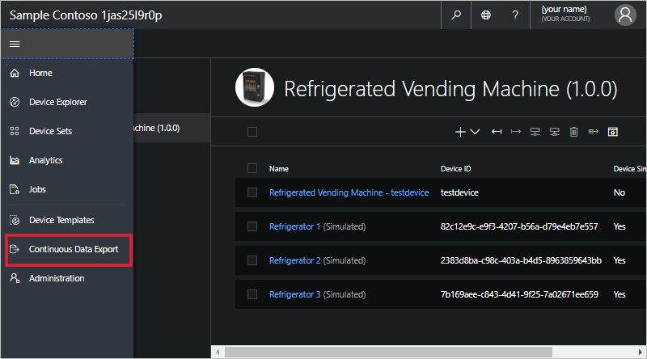
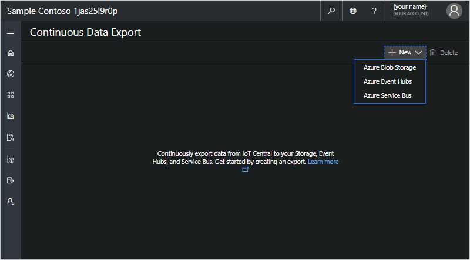
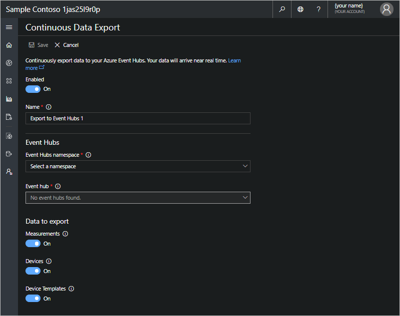
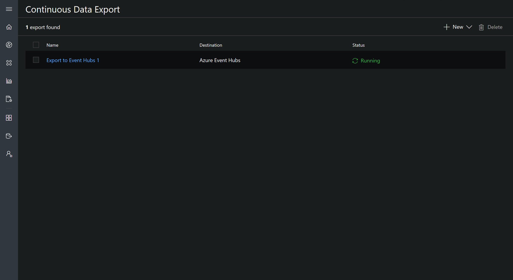

# Export your data in Azure IoT Central

*This topic applies to administrators.*

This article describes how to use the continuous data export feature in Azure IoT Central to export your data to your own **Azure Blob Storage**, **Azure Event Hubs**, and **Azure Service Bus** instances. You can export **measurements**, **devices**, and **device templates** to your own destination for warm path and cold path analytics. You can export data to Blob storage to run long-term trend analysis in Microsoft Power BI, or export data to Event Hubs and Service Bus to transform and augment your data in near-realtime with Azure Logic Apps or Azure Functions.

> [!Note]
> When you turn on continuous data export, you get only the data from that moment onward. Currently, data can't be retrieved for a time when continuous data export was off. To retain more historical data, turn on continuous data export early.

## Prerequisites

- You must be an administrator in your IoT Central application

## Export to Blob Storage

Measurements, devices, and device templates data are exported to your storage account once per minute, with each file containing the batch of changes since the last exported file. The exported data is in [Apache AVRO](https://avro.apache.org/docs/current/index.html) format.

Learn more about [exporting to Blob storage](howto-export-data-blob-storage.md).

## Export to Event Hubs and Service Bus

Measurements, devices, and device templates data are exported to your event hub or Service Bus queue or topic. Exported measurements data arrives in near realtime and contains the entirety of the message your devices sent to IoT Central, not just the values of the measurements themselves. Exported devices data arrives in batches once every minute, and contains changes to properties and settings of all devices, and exported device templates contains changes to all device templates.

Learn more about [exporting to Event Hubs and Service Bus](howto-export-data-event-hubs-service-bus.md).

## Set up export destination

If you don't have an existing Storage/Event Hubs/Service Bus to export to, follow these steps:

### Create Storage account

1. Create a [new storage account in the Azure portal](https://ms.portal.azure.com/#create/Microsoft.StorageAccount-ARM). You can learn more in [Azure Storage docs](https://aka.ms/blobdocscreatestorageaccount).
2. For the account type, choose **General purpose** or **Blob storage**.
3. Choose a subscription. 

    > [!Note] 
    > You can now export data to other subscriptions that are **not the same** as the one for your Pay-As-You-Go IoT Central application. You will connect using a connection string in this case.

4. Create a container in your storage account. Go to your storage account. Under **Blob Service**, select **Browse Blobs**. Select **+ Container** at the top to create a new container.

### Create Event Hubs namespace

1. Create a [new Event Hubs namespace in the Azure portal](https://ms.portal.azure.com/#create/Microsoft.EventHub). You can learn more in [Azure Event Hubs docs](https://docs.microsoft.com/azure/event-hubs/event-hubs-create).
2. Choose a subscription. 

    > [!Note] 
    > You can now export data to other subscriptions that are **not the same** as the one for your Pay-As-You-Go IoT Central application. You will connect using a connection string in this case.
3. Create an event hub in your Event Hubs namespace. Go to your namespace, and select **+ Event Hub** at the top to create an event hub instance.

### Create Service Bus namespace

1. Create a [new Service Bus namespace in the Azure portal](https://ms.portal.azure.com/#create/Microsoft.ServiceBus.1.0.5) . You can learn more in [Azure Service Bus docs](https://docs.microsoft.com/azure/service-bus-messaging/service-bus-create-namespace-portal).
2. Choose a subscription. 

    > [!Note] 
    > You can now export data to other subscriptions that are **not the same** as the one for your Pay-As-You-Go IoT Central application. You will connect using a connection string in this case.

3. Go to your Service Bus namespace, and select **+ Queue** or **+ Topic** at the top to create a queue or topic to export to.

## Set up continuous data export

Now that you have a Storage/Event Hubs/Service Bus destination to export data to, follow these steps to set up continuous data export. 

1. Sign in to your IoT Central application.

2. In the left menu, click **Continuous Data Export**.

    > [!Note]
    > If you don't see Continuous Data Export in the left menu, you are not an administrator in your app. Talk to an administrator to set up data export.

    

3. Click the **+ New** button in the top right. Choose one of **Azure Blob Storage**, **Azure Event Hubs**, or **Azure Service Bus** as the destination of your export. 

    > [!NOTE] 
    > The maximum number of exports per app is five. 

    

4. In the drop-down list box, select your **Storage Account/Event Hubs namespace/Service Bus namespace**. You can also pick the last option in the list which is **Enter a connection string**. 

    > [!NOTE] 
    > You will only see Storage Accounts/Event Hubs namespaces/Service Bus namespaces in the **same subscription as your IoT Central app**. If you want to export to a destination outside of this subscription, choose **Enter a connection string** and see step 5.

    > [!NOTE] 
    > For 7 day trial apps, the only way to configure continuous data export is through a connection string. This is because 7 day trial apps do not have an associated Azure subscription.

    

5. (Optional) If you chose **Enter a connection string**, a new box appears for you to paste your connection string. To get the connection string for your:
    - Storage account, go to the Storage account in the Azure Portal.
        - Under **Settings**, click **Access keys**
        - Copy either the key1 Connection string or the key2 Connection string
    - Event Hubs or Service Bus, go to the namespace in the Azure Portal.
        - Under **Settings**, click **Shared Access Policies**
        - Choose the default **RootManageSharedAccessKey** or create a new one
        - Copy either the primary or secondary connection string
 
6. Choose a Container/Event hub/Queue or Topic from the drop-down list box.

7. Under **Data to export**, specify each type of data to export by setting the type to **On**.

6. To turn on continuous data export, make sure **Data export** is **On**. Select **Save**.

  

7. After a few minutes, your data will appear in your chosen destination.

## Next steps

Now that you know how to export your data, continue to the next step:

> [!div class="nextstepaction"]
> [Export data to Azure Blob Storage](howto-export-data-blob-storage.md)

> [!div class="nextstepaction"]
> [Export data to Azure Event Hubs and Azure Service Bus](howto-export-data-event-hubs-service-bus.md)

> [!div class="nextstepaction"]
> [How to visualize your data in Power BI](howto-connect-powerbi.md)
