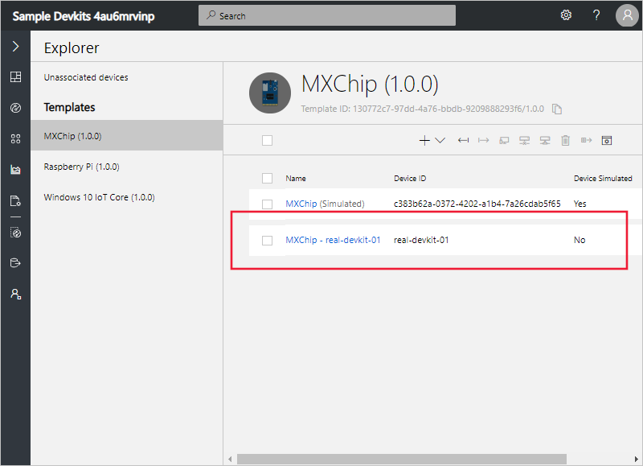
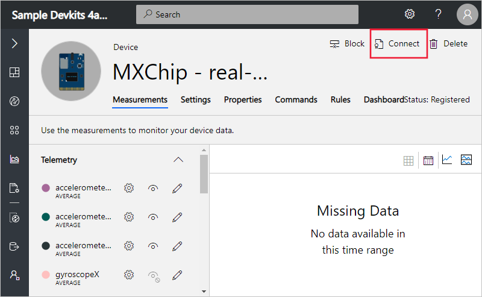

# Generate a device connection string to connect to an Azure IoT Central application

This article describes how, as a device developer, to generate a connection string for device that needs to connect to an IoT Central application. The procedure described in this article shows you how to quickly connect a single device using a shared access signature (SAS). This approach is useful when you're experimenting with IoT Central or testing devices. For alternative approaches to use in a production environment, see [Device connectivity in Azure IoT Central](concepts-connectivity.md).

## Prerequisites

To complete the steps in this article, you need the following:

- An Azure IoT Central application. For more information, see the [create an application quickstart](quick-deploy-iot-central.md).
- A development machine with [Node.js](https://nodejs.org/) version 8.0.0 or later installed. You can run `node --version` in the command line to check your version. Node.js is available for a wide variety of operating systems.

## Get connection information

The following steps describe how to get the information you need to generate a SAS connection string for a device:

1. In the **Device Explorer**, find the real device you want to connect to your application:

    

1. On the **Device** page, select **Connect**:

    

1. Make a note of the connection details, **Scope ID**, **Device ID**, and **Device Primary key**, to use in the following steps:

    

    You can copy the values from this page to save.

## Generate the connection string

[!INCLUDE [iot-central-howto-connection-string](../../includes/iot-central-howto-connection-string.md)]

## Next steps

Now that you've generated a connection string for a real device to connect to your Azure IoT Central application, here are the suggested next steps:

* [Prepare and connect a DevKit device (C)](howto-connect-devkit.md)
* [Prepare and connect a Raspberry Pi (Python)](howto-connect-raspberry-pi-python.md)
* [Prepare and connect a Raspberry Pi (C#)](howto-connect-raspberry-pi-csharp.md)
* [Prepare and connect a Windows 10 IoT core device (C#)](howto-connect-windowsiotcore.md)
* [Connect a generic Node.js client to your Azure IoT Central application](howto-connect-nodejs.md)