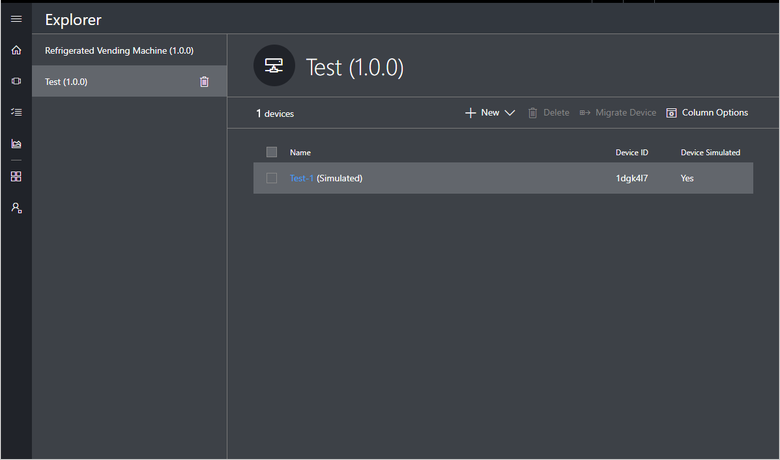
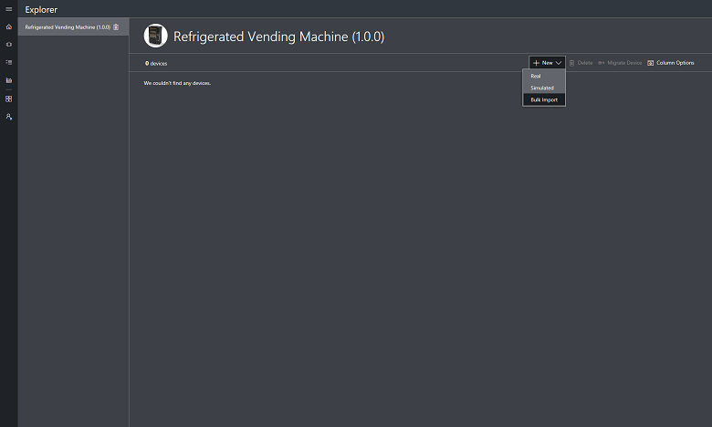
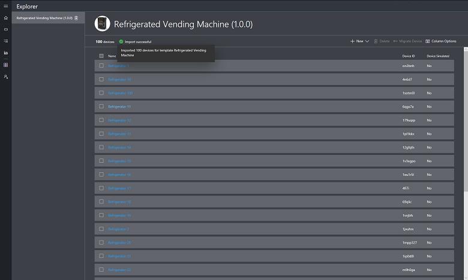
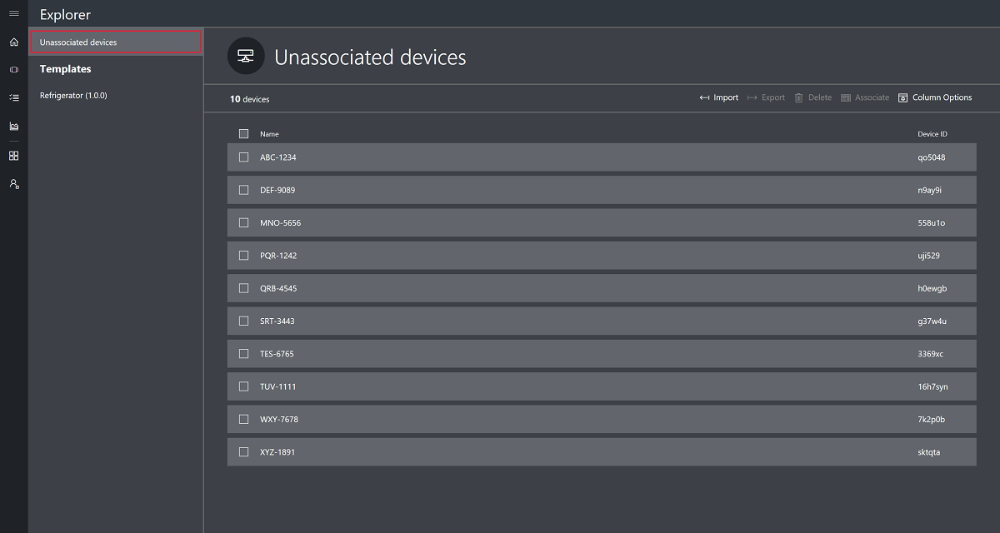
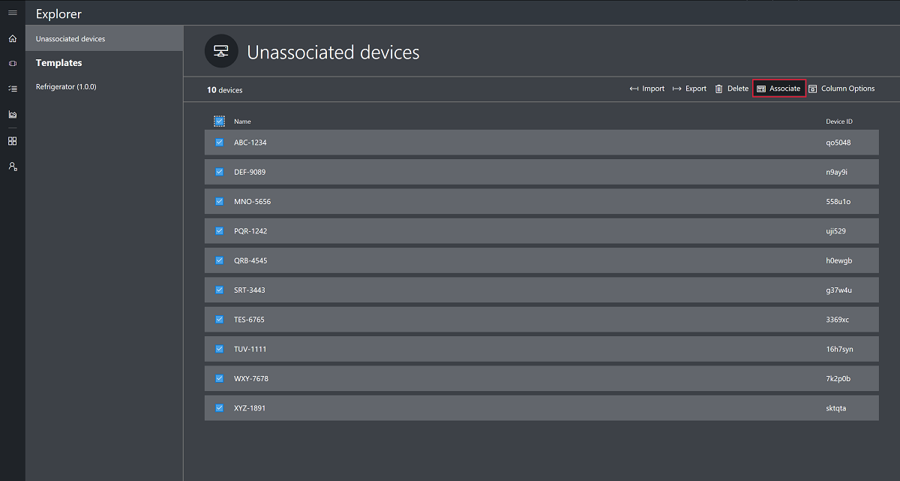
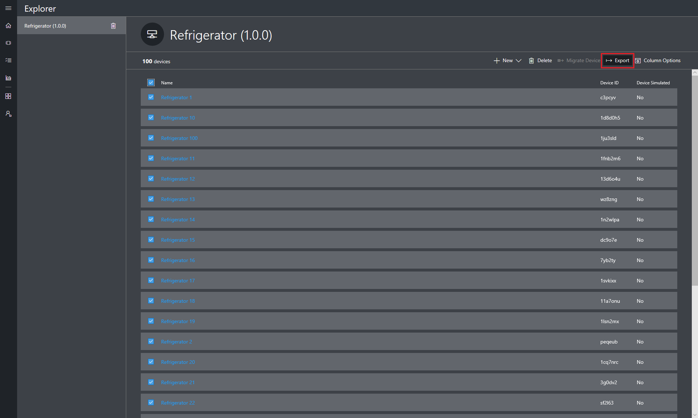
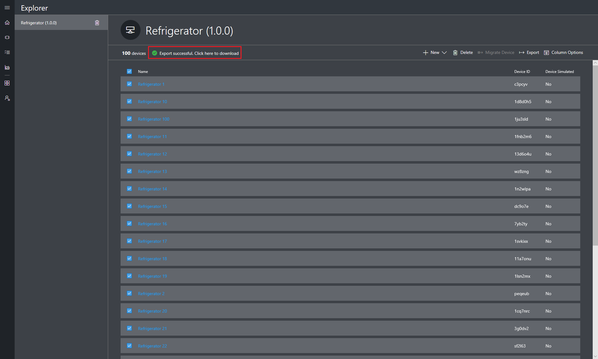

# Manage devices in your Azure IoT Central application

This article describes how, as an operator, to manage devices in your Microsoft Azure IoT Central application. As an operator, you can:

- Use the **Explorer** page to view, add, and delete devices connected to your Azure IoT Central application.
- Maintain an up-to-date inventory of your devices.
- Keep your device metadata up-to-date by changing the values stored in the device properties.
- Control the behavior of your devices by updating a setting on a specific device from the **Settings** page.

## View your devices

To view an individual device:

1. Choose **Explorer** on the left navigation menu. Here you see a list of your [device templates](howto-set-up-template.md).

1. Choose a **Device Template** in the left-hand pane.

1. In the right-hand pane, you see a list of devices created from that device template. Choose an individual device to see the **Device Details** page for that device:

    

## Add a device

To add a device to your Azure IoT Central application:

1. Choose **Explorer** on the left navigation menu.

1. Choose the device template from which you want to create a device.

1. Choose + **New**.

1. Choose **Real** or **Simulated**. A real device is for a physical device that you connect to your Azure IoT Central application. A simulated device has sample data generated for you by Azure IoT Central. This example uses a real device. Choose **Real** to navigate to the **Device Details** page for your new device.

## Import devices

To connect large number of devices to your application, Azure IoT Central offers bulk importing devices via a CSV file. The CSV file should have the following columns (and headers)
1.  IOTC_DeviceID **(should be lower case)**
1.  IOTC_DeviceName (Optional)

To bulk-register devices in your application:

1. Choose **Explorer** on the left navigation menu.

1. On the left panel, choose the device template for which you want to bulk create the devices.

 >   [!NOTE] 
    If you don’t have a device template yet then you can import devices under **Unassociated devices** and register them without any template. Once devices have been imported, you can then associate them with a template as a subsequent step.

1. Click **Import**.

    

1. Select the CSV file that has the list of Device IDs to be imported.

1. Device import starts once the file has been uploaded. You can track the import status at the top of the device grid.

1. Once the import completes, a success message is shown on the device grid.

    

If the device import operation fails, you will see an error message on the Device grid. A log file capturing all the errors is generated and can be downloaded by clicking the error message.

**Associating devices with a template**

If you register devices by starting the import under **Unassociated devices**, then the devices are created without any device template association. Device must be associated with a template to explore the data and other details about the device. Follow these steps to associate devices with a template:
1. Choose **Explorer** on the left navigation menu.
1. On the left panel, choose **Unassociated devices**.
    
1. Select the devices you want to associate with a template.
1. Click **Associate** option.
    
1. Choose the template from the list of available templates and click **Associate** button.
1. The selected devices will be moved under the respective device template.

 >   [!NOTE] 
    Once a device has been associated with a template it cannot be unassociated or associated with a different template.

## Export devices

To provision devices to connect to IoT Central, you will need the connection string of the device that is generated by IoT Central. You can use the Export feature to get the connection strings and other properties of the devices in bulk from your application. Export creates a CSV file with the Device Identity, Device Name, and Primary Connection String for all the selected devices.

To bulk export devices from your application:
1. Choose **Explorer** on the left navigation menu.

1. On the left panel, choose the device template for which you want to export the devices.

1. Select the devices that you want to export and then click the **Export** action.

    

1. Export process will start and you can track the status at the top of the grid. 

1. Once the export completes, a success message is shown along with a link to download the generated file.

1. Click on the **success message** to download the file to a local folder on the disk.

    

1. The exported CSV file will have the following columns information: **Device Id, Device Name, Device Priamry/Secondary Keys and Primary/Secondary certificate thumbrpints**
    *   IOTC_DEVICEID
    *   IOTC_DEVICENAME
    *   IOTC_SASKEY_PRIMARY
    *   IOTC_SASKEY_SECONDARY
    *   IOTC_X509THUMBPRINT_PRIMARY	
    *   IOTC_X509THUMBPRINT_SECONDARY

## Delete a device

To delete either a real or simulated device from your Azure IoT Central application:

1. Choose **Explorer** on the navigation menu.

1. Choose the device template of the device you want to delete.

1. Check the box next to the device to delete.

1. Choose **Delete**.

## Change a device setting

Settings control the behavior of a device. In other words, they enable you to provide inputs to your device. You can view and update device settings on the **Device Details** page.

1. Choose **Explorer** on the navigation menu.

1. Choose the device template of the device whose settings you want to change.

1. Choose the **Settings** tab. Here you see all the settings your device has and their current values. For each setting, you can see if the device is still syncing.

1. Modify the settings to your desired values. You can modify multiple settings at once and update them all at the same time.

1. Choose **Update**. The values are sent to your device. When the device acknowledges the setting change, the status of the setting goes back to **synced**.

## Change a property

Properties are the device metadata associated with the device, such as city and serial number. You can view and update properties on the **Device Details** page.

1. Choose **Explorer** on navigation menu.

1. Choose the device template of the device whose properties you want to change.

1. Choose the **Properties** tab, where you see all the properties.

1. Modify the properties to your desired values. You can modify multiple properties at once and update them all at the same time.

1. Choose **Update**.

> [!NOTE]
> You cannot change the value of _device properties_. Device properties are set by the device and are read-only within the Azure IoT Central application.

## Next steps

Now that you have learned how to manage devices in your Azure IoT Central application, here is the suggested next step:

> [!div class="nextstepaction"]
> [How to use device sets](howto-use-device-sets.md)

<!-- Next how-tos in the sequence -->
