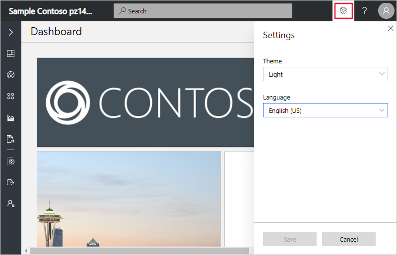

# Manage your application preferences

*This article applies to operators, builders, and administrators.*

IoT Central provides the flexibility to customize your applications to fit your need. We also provide some flexibility on a per-user basis to customize your own view. This article describes the various customization options that a user can apply to their profile.

## Changing language

IoT Central is supported in multiple languages. You can switch your preferred language by using the **language picker** on the settings icon on the top navigation bar. Once you've changed your language, IoT Central remembers your selection and applies it across all your applications. Customization within the application such dashboard images aren't localized.

## Changing theme

We have support for both dark theme and light theme. While the light theme is the default, you can change the theme by selecting the settings icon on the top navigation bar.

> [!NOTE]
> The option to choose between light and dark themes isn't available if your administrator has configured a custom theme for the application.

## Next steps

Now that you've learned how to manage your profile in Azure IoT Central, here is the suggested next step:

> [!div class="nextstepaction"]
> [Toggle live chat](howto-show-hide-chat.md)
