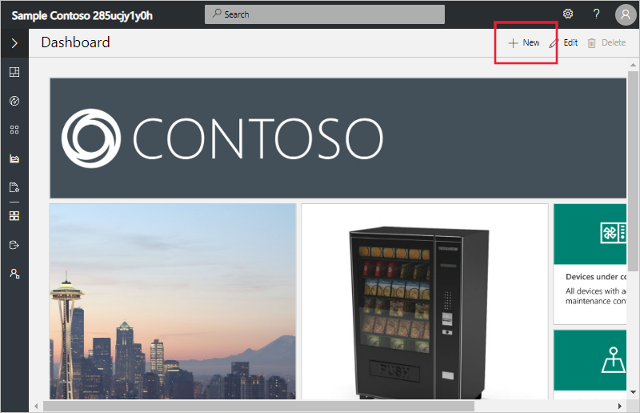
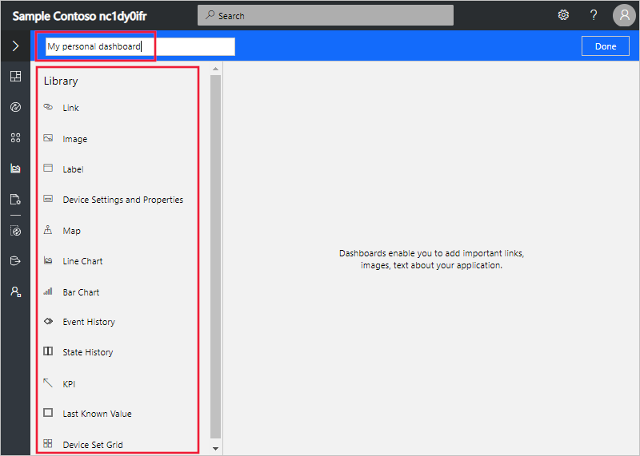
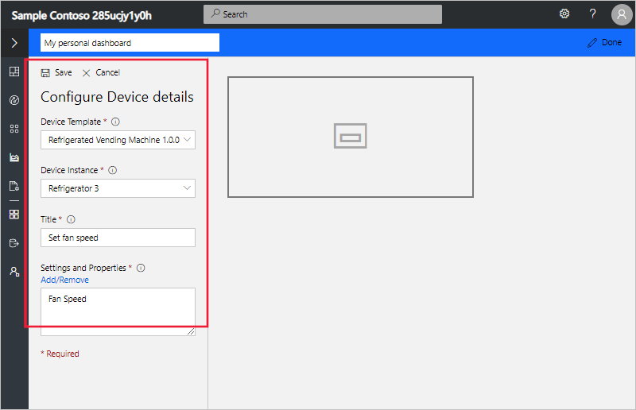
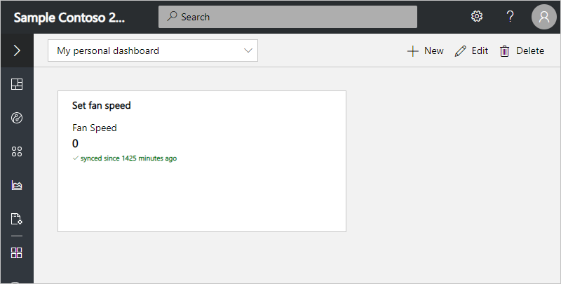
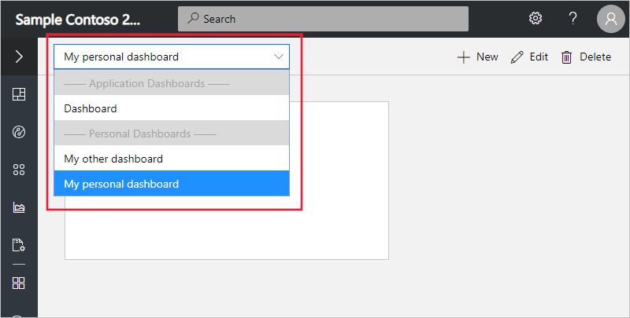
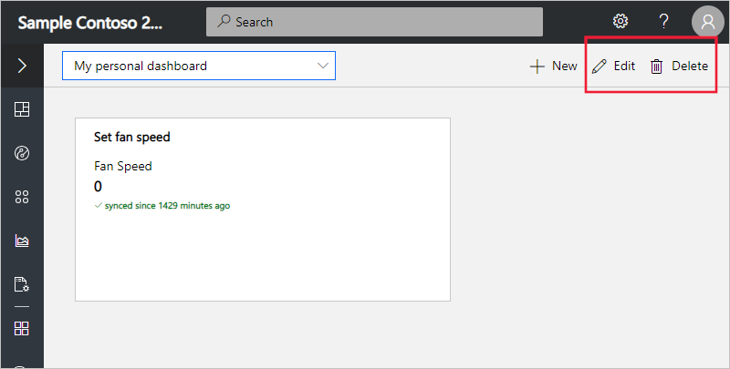

# Create and manage personal dashboards

The **Dashboard** is the page that loads when you first navigate to your application. A **builder** in your application defines the default application dashboard for all users. You can replace this default dashboard with your own, personalized application dashboard. You can have several dashboards that display different data and switch between them.

## Create dashboard

The following screenshot shows the dashboard in an application created from the **Sample Contoso** template. You can replace the default application dashboard with a personal dashboard. To do so, select **+ New** at the top right of the page.

Selecting **+ New**, opens the dashboard editor. In the editor, you can give your dashboard a name and chose items from the library. The library contains the tiles and dashboard primitives you can use to customize the dashboard.

For example, you can add a **Device Settings and Properties** tile to show settings and properties values for one of the devices you manage. To do so, first select a **Device Template** then select a **Device Instance**. Then give the tile a title and select a **Setting** or a **Property** to display. The following screenshot shows the **Fan speed** setting selected to add to the tile. Select **Done** to save the change to your dashboard.

Now when you view your personal dashboard, you see the new tile with the **Fan speed** setting for the device:

You can explore other tile types in the library to discover how to further customize your personal dashboards.

To learn more about how to use tiles in Azure IoT Central, see [Use dashboard tiles](howto-use-tiles.md).

## Manage dashboards

You can have several personal dashboards and switch between them or choose the default application dashboard:

You can edit your personal dashboards and delete those you no longer need:

## Next steps

Now that you've learned how to create and manage personal dashboards, you can:

> [!div class="nextstepaction"]
> [Learn how to manage your application preferences](howto-manage-preferences.md)
