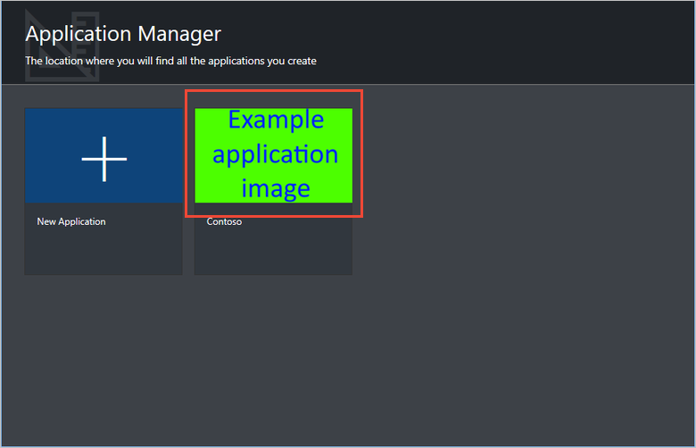
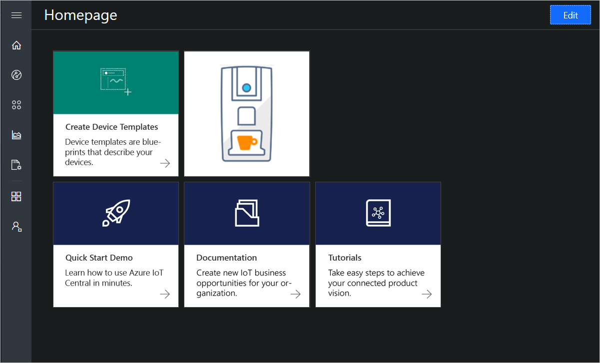
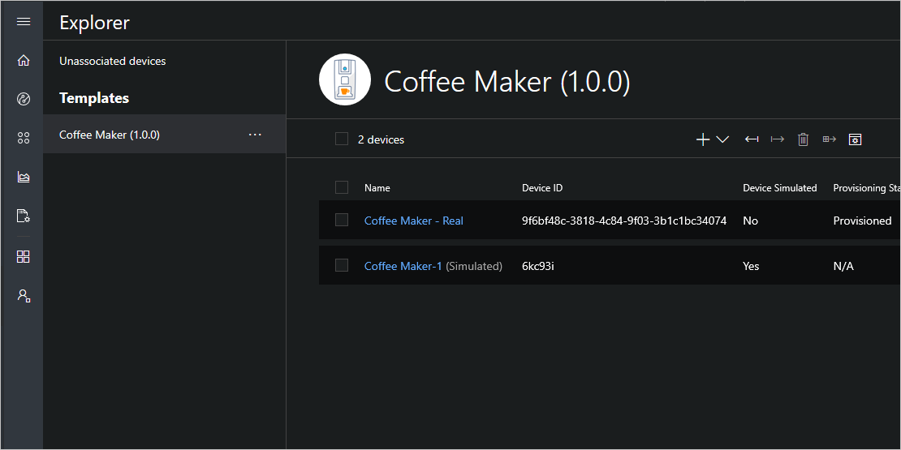
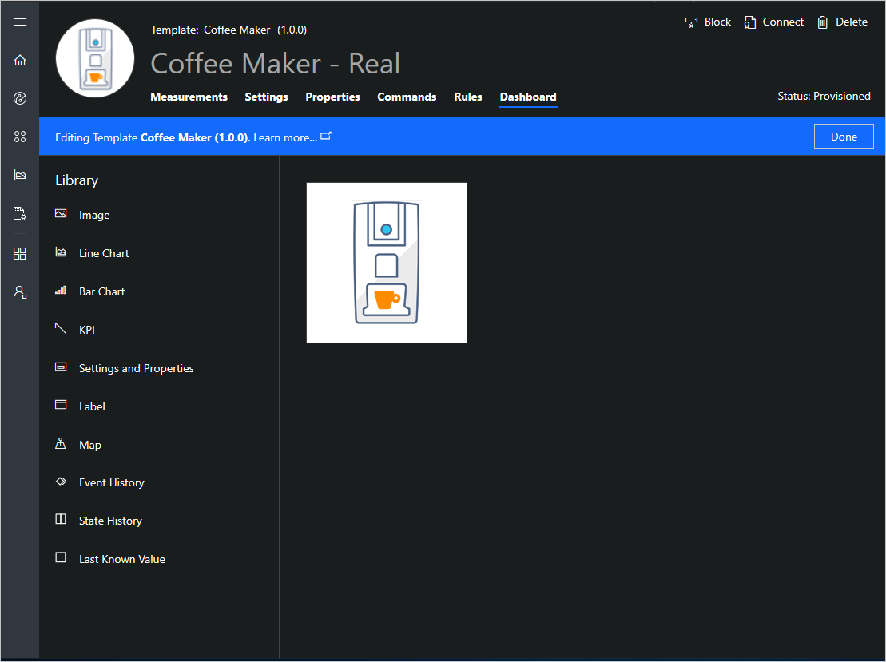
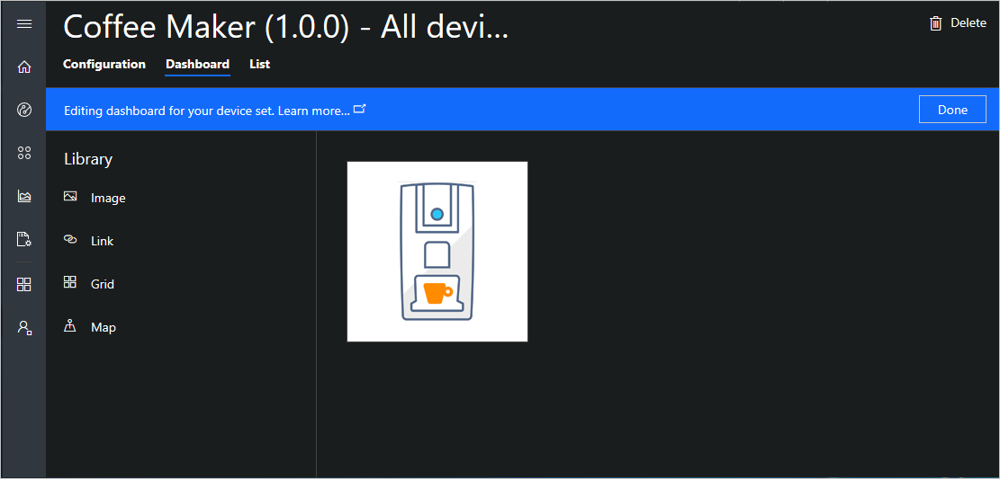
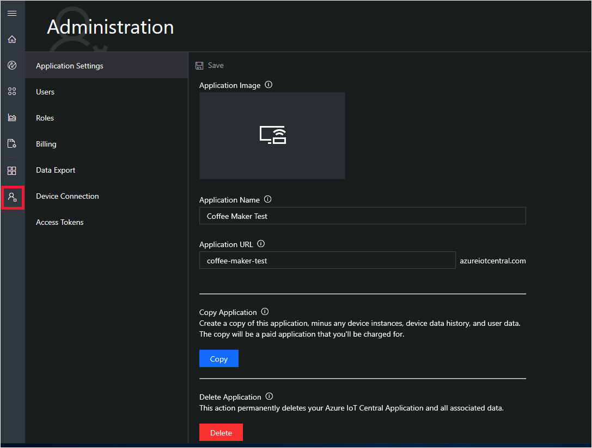
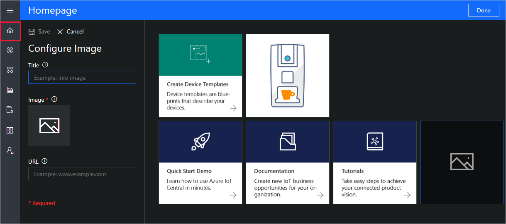
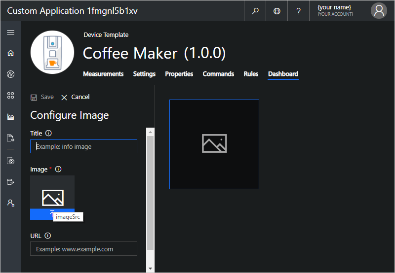
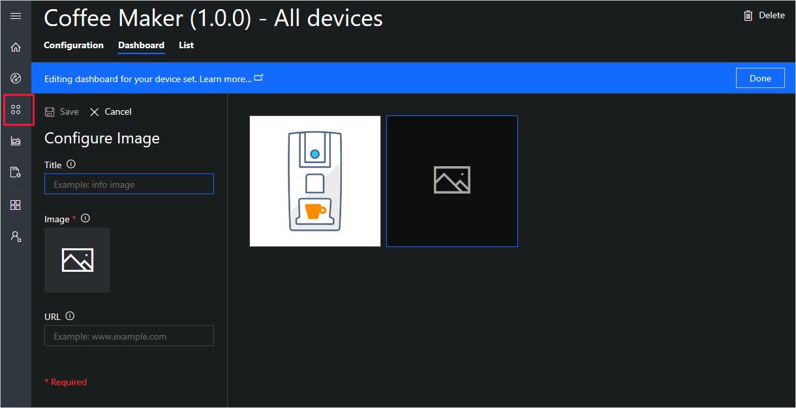

# Prepare and upload images to your Azure IoT Central application

This article describes how, as a builder, you can customize your Azure IoT Central application by uploading custom images. For example, you can customize a device dashboard with a picture of the device.

## Before you begin

To complete the steps in this article, you need the following:

1. An Azure IoT Central application. For more information, see the [create an application quickstart](quick-deploy-iot-central.md).
1. A tool for scaling and resizing images files.

## Choose where to use custom images

You can add custom images to the following locations in an Azure IoT Central application:

* The **Application Manager** page

    

* The home page

    

* A device template

    

* A tile on a device dashboard

    

* A tile on a device set dashboard

    

## Prepare the images

In all four locations, you can use either PNG, GIF, or JPEG images.

The following table summarizes the image sizes you can use:

| Location | Sizes |
| -------- | ------ |
| Application Manager | 268x160 px |
| Device template | 64x64 px |
| Home page and dashboard tiles | The smallest sized tile is 200x200 px, larger tiles can be either square or rectangular multiples of small tiles. For example 200x400 px, 400x200 px, or 400x400 px |

For the best display in the application, you should create images that match the dimensions shown in the previous table.

## Upload the images

The following sections describe how to upload the images in the different locations:

### Application manager

To upload an image on the **Application Manager**, navigate to the **Application Settings** page in the **Administration** section. You must be an administrator to complete this task:

Click on the Application Image tile to upload your prepared image (268x160 px) from your local machine.

### Home page

To upload an image on the home page, navigate to the **Homepage** of your application and click on **Edit**. You must be a builder to complete this task:

Under Configure Image, click on the Image tile to upload your prepared image from your local machine. The smallest sized tile is 200x200 px, larger tiles can be either square or rectangular multiples of small tiles. For example 200x400 px, 400x200 px, or 400x400 px.

**Save** the uploaded image. You can resize it while in the edit mode. Click **Done** when finished. 

### Device template

To upload an image on a device template, navigate to **Device Explorer**, choose the device template and then a device. You must be a builder to complete this task:

Click on the image tile to upload your prepared image (64x64 px) from your local machine. 

### Device dashboard

To upload an image on a device dashboard, navigate to **Device Explorer**, choose the device template, and then a device. Then choose the **Dashboard** page and click on **Edit Template**. You must be a builder to complete this task:

Under Configure Image, click on the Image tile, and then choose the file to upload from your local machine. The smallest sized tile is 200x200 px, larger tiles can be either square or rectangular multiples of small tiles. For example 200x400 px, 400x200 px, or 400x400 px.

**Save** the uploaded image. You can resize and reposition it while in the edit mode. Click **Done** when finished.

### Device set dashboard

To upload an image on a device set dashboard, navigate to **Device Sets** and choose the device set, and then a device. Then choose the **Dashboard** page and click on **Edit**:

Under Configure Image, click on the Image tile to upload your prepared image from your local machine. The smallest sized tile is 200x200 px, larger tiles can be either square or rectangular multiples of small tiles. For example 200x400 px, 400x200 px, or 400x400 px.

**Save** the uploaded image. You can resize and reposition it while in the edit mode. Click **Done** when finished.

## Next steps

Now that you have learned how to prepare and upload images to your Azure IoT Central application, here is the suggested next step:

> [!div class="nextstepaction"]
> [Manage devices in your Azure IoT Central application](howto-manage-devices.md)