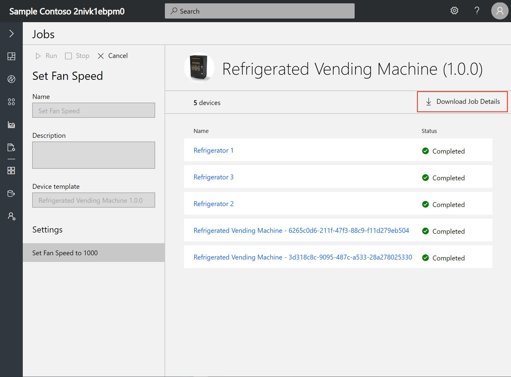
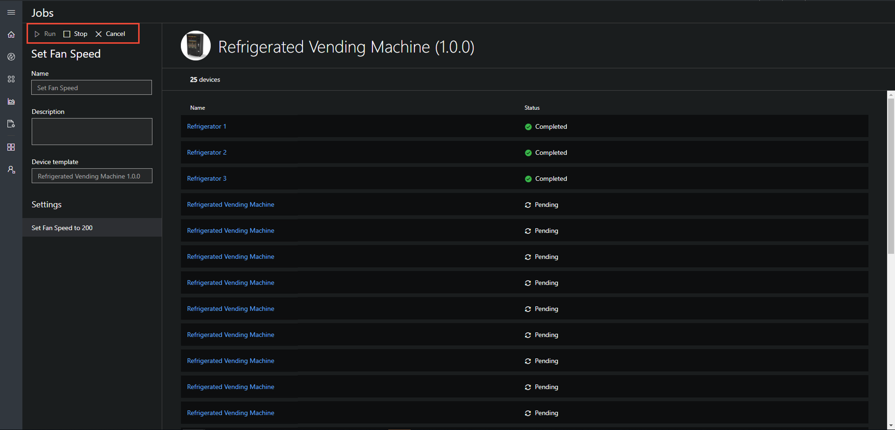
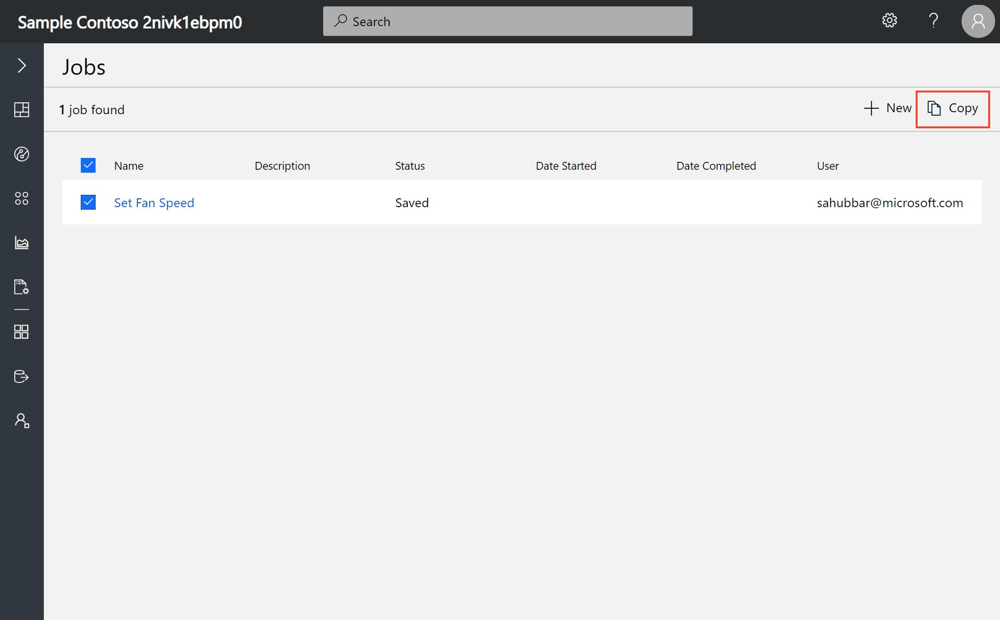

# Create and run a job in your Azure IoT Central Application

You can use Microsoft Azure IoT Central to manage your connected devices at scale using jobs. Jobs let you do bulk updates to device properties, settings, and commands. This article walks you through how to get started using jobs in your own application.

## Create and run a job

This section shows you how to create and run a job. It shows you how to increase the fan speed for multiple refrigerated vending machines.

1. Navigate to Jobs from the navigation pane.

1. Select **+ New** to create a new job.

    

1. Enter a name and description to identify the job you're creating.

1. Select the device set you want your job to apply to. After selecting the device set, you see the right-hand side populate with the devices in the device set. If you select a broken device set, no devices display and you see a message that your device set is broken.

1. Next, choose the type of job to define (a setting, property, or command). Select **+** next to the type of job selected and add your operations.

    

1. On the right-hand side, choose the devices you’d like to run the job on. By selecting the top check box, all devices are selected in the entire device set. By selecting the check box near **Name**, all devices on the current page are selected.

1. After selecting your devices, choose **Run** or **Save**. The job now appears on your main **Jobs** page. On this view, you can see your currently running job and the history of any previously run jobs. Your running job always shows up at the top of the list. Your saved job can be opened again at any time to continue editing or to run.

    

    > [!NOTE]
    > You can view the history of your previously run jobs for up to 30 days.

1. To get an overview of your job, select the job to view from the list. This overview contains the job details, devices, and device status values. From this overview, you can also select **Download Job Details** to download a .csv file of your job details, including the devices and their status values. This information can be useful for troubleshooting.

    

### Stop a running job

To stop a running job, select it and choose **Stop** on the panel. The job status changes to reflect the job is stopped.

   

### Run a stopped job

To run a job that's currently stopped, select the stopped job. Choose **Run** on the panel. The job status changes to reflect the job is now running again.

   

## Copy a job

To copy an existing job you've created, select it from the main jobs page and select **Copy**. A new copy of the job configuration opens for you to edit. You can save or run the new job. If any changes have been made to your selected device set, they're reflected in this copied job for you to edit.

   

## View the job status

After a job is created, the **Status** column updates with the latest status message of the job. The following table lists the possible status values:

| Status message       | Status meaning                                          |
| -------------------- | ------------------------------------------------------- |
| Completed            | This job has been executed on all devices.              |
| Failed               | This job has failed and not fully executed on devices.  |
| Pending              | This job hasn't yet begun executing on devices.         |
| Running              | This job is currently executing on devices.             |
| Stopped              | This job has been manually stopped by a user.           |

The status message is followed by an overview of the devices in the job. The following table lists the possible device status values:

| Status message       | Status meaning                                                     |
| -------------------- | ------------------------------------------------------------------ |
| Succeeded            | The number of devices that the job successfully executed on.       |
| Failed               | The number of devices that the job has failed to execute on.       |

### View the device status

To view the status of the job and all the affected devices, select the job. To download a .csv file that includes the job details, including the list of devices and their status values, select **Download job details**. Next to each device name, you see one of the following status messages:

| Status message       | Status meaning                                                                |
| -------------------- | ----------------------------------------------------------------------------- |
| Completed            | The job has been executed on this device.                                     |
| Failed               | The job has failed to execute on this device. The error message shows more information.  |
| Pending              | The job hasn't yet executed on this device.                                   |

> [!NOTE]
> If a device has been deleted, you can't select the device and it displays as deleted with the device ID.

## Next steps

Now that you've learned how to create jobs in your Azure IoT Central application, here are some next steps:

- [Use device sets](howto-use-device-sets.md)
- [Manage your devices](howto-manage-devices.md)
- [Version your device template](howto-version-device-template.md)
