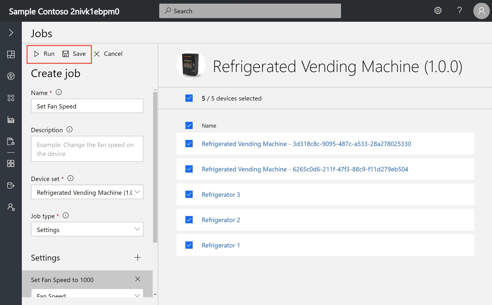
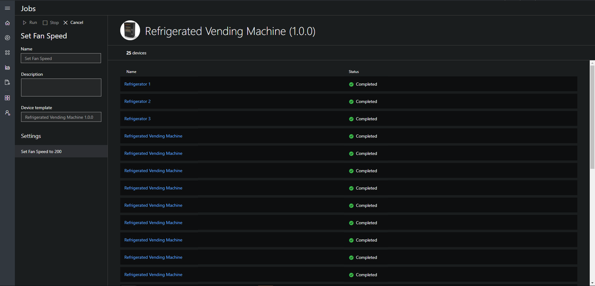
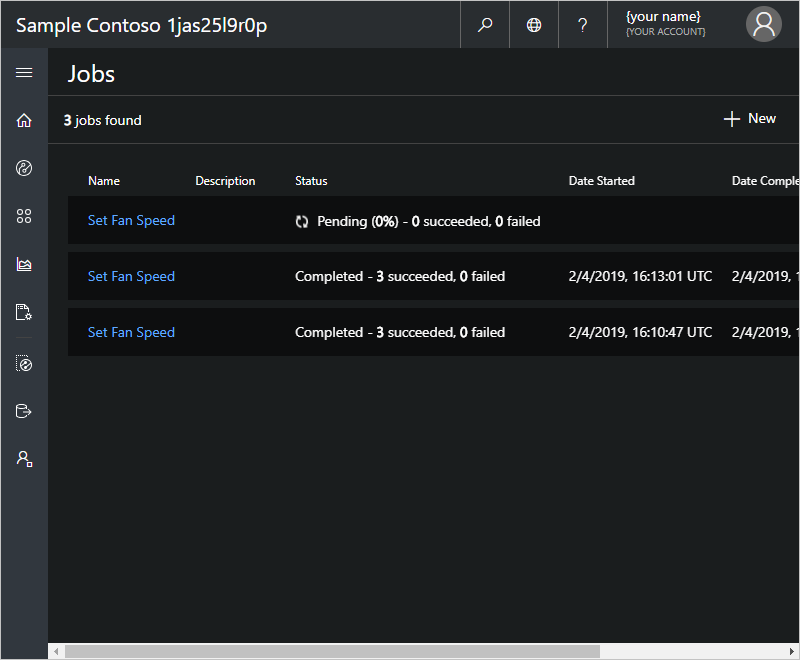
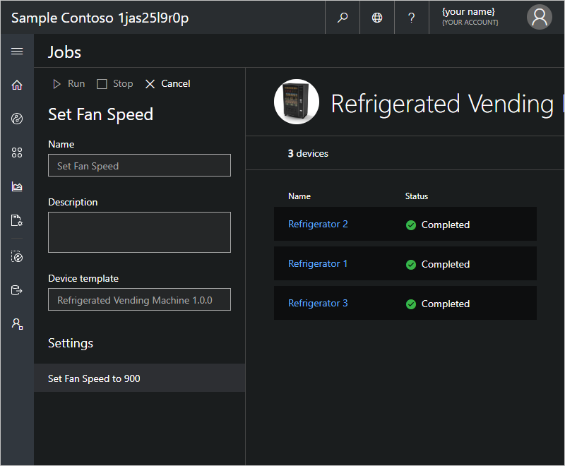

# Create and run a job in your Azure IoT Central Application

You can use Microsoft Azure IoT Central to manage your connected devices at scale using jobs. The jobs functionality enables you to perform bulk updates to device properties, settings, and commands. This article will walk you through how to get started using jobs in your own application.

## Create and run a job

This section shows you how to create and run a job. Each step goes through an example that demonstrates how to run a job for refrigerated vending machine devices that need to have their fan speed increased.

1. Navigate to Jobs from the navigation pane.

1. Click **+ New** in order to start creating a new job.

    

1. Enter a name and description that help you identify the job you are creating.

1. Select the device set you want your job to be applied to. After selecting the device set, you'll see the right-hand side populate with the devices within the selected device set. If you select a broken device set, no devices will display and you will see a message explaining that your device set is broken.

1. Next, choose the type of job that will be defined (a setting, property, or command). Click **+** next to the type of job selected and add your desired operations.

    

1. On the right-hand side, pick and choose the devices you’d like to run the job on. By clicking the top check box, all devices are selected in the entire device set. By clicking the check box near Name, all devices on the current page are selected.

1. Once your desired devices have been selected, choose **Run**. The job will now appear on your main **Jobs** page. On this view, you are able to see your currently running job and the history of any previously run jobs. Your running job will always show up at the top of the list.

    

    

    > [!NOTE]
    > You will be able to view the history of your previously run jobs for up to 30 days.

1. To get an overview of your job, click on the job name you wish to view from your list. This overview contains the job details, devices, and device statuses.

    

### Stop a running job

If you would like to stop a job that is currently running, click on the name of the running job that you would like to stop. Choose the **Stop** button on the panel. You’ll see the job status has changed to reflect that the job has been stopped.

> [!NOTE]
> Once a job has been stopped it cannot be restarted. You must create another job with the desired operations and devices.

## View the job status

Once a job has been created, the **Status** column will update with the latest status message of the job. The status messages mean the following:

| Status message       | Status meaning                                          |
| -------------------- | ------------------------------------------------------- |
| Completed            | This job has been executed on all devices.              |
| Failed               | This job has failed and not fully executed on devices.  |
| Pending              | This job has not yet begun executing on devices.        |
| Running              | This job is currently executing on devices.             |
| Stopped              | This job has been manually stopped by a user.           |

The status message is followed by an overview of the devices within the job. These device statuses mean the following:

| Status message       | Status meaning                                                     |
| -------------------- | ------------------------------------------------------------------ |
| Succeeded            | The number of devices which the job has successfully executed on.  |
| Failed               | The number of devices which the job has failed to execute on.      |

### View the device status

In order to view the status of each device in the job, click on the job name. Here you'll see the details of the job and all of the devices that were a part of this specific job. Next to each device name, you'll see one of the following status messages:

| Status message       | Status meaning                                                                |
| -------------------- | ----------------------------------------------------------------------------- |
| Completed            | The job has been executed on this device.                                     |
| Failed               | The job has failed to execute on this device. The accompanying error message will show more information.  |
| Pending              | The job has not yet executed on this device.                                  |

> [!NOTE]
> If a device has been deleted, you won't be able to select the device and it will display as deleted with the device ID.

## Next steps

Now that you have learned how to create jobs in your Azure IoT Central application, here are some next steps:

- [Use device sets](howto-use-device-sets.md)
- [Manage your devices](howto-manage-devices.md)
- [Version your device template](howto-version-devicetemplate.md)
