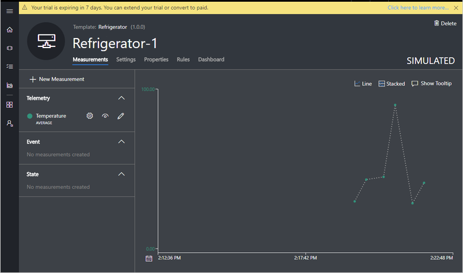
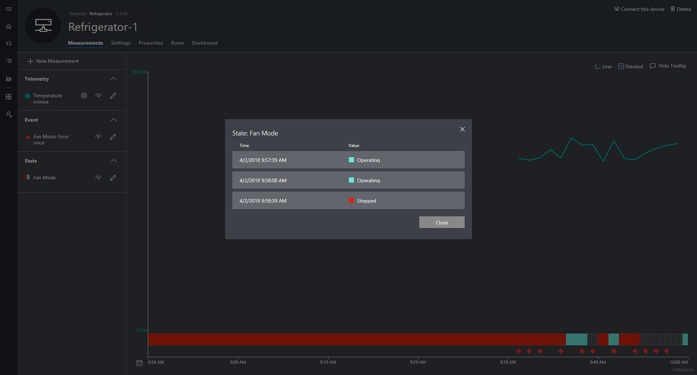
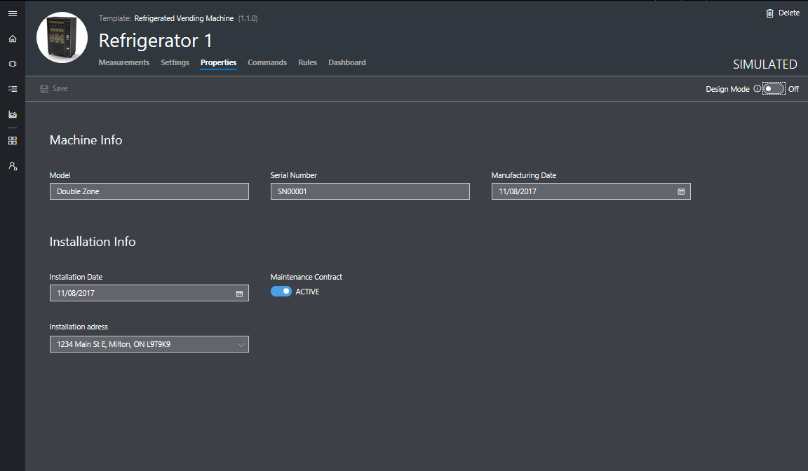
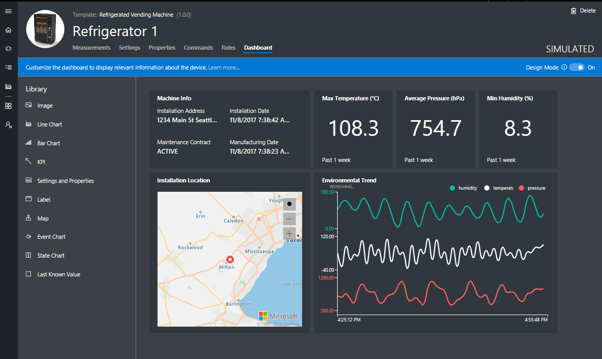

---
# Mandatory fields. See more on aka.ms/skyeye/meta.
title: Set up a device template in an Azure IoT Central application | Microsoft Docs
description: Learn how to set up a device template with measurements, settings, properties, rules, and dashboard.
author: viv-liu
ms.author: viviali
ms.date: 04/16/2018
ms.topic: conceptual
ms.service: iot-central
services: iot-central
manager: peterpr
---

# Set up a device template

A device template is a blueprint that defines the characteristics and behaviors of a type of device that connects to a Microsoft Azure IoT Central application.

For example, a builder can create a device template for an IoT connected fan that has:

- Temperature telemetry measurement

- Fan motor error event measurement

- Fan operating state measurement

- Fan speed setting

- Location property

- Rules that send alerts

- Dashboard that gives you an all up view about the device

From this device template, an operator can create and connect real fan devices with names such as **fan-1** and **fan-2**. All these fans have measurements, settings, and properties, rules, and a dashboard that users of your application can monitor and manage.

> [!NOTE]
Only builders and administrators can create, edit, and delete device templates. Any user can create devices in the **Device Explorer** page from existing device templates.

## Create a new device template

1. Navigate to the **Application Builder** page.

1. To create a blank template, choose **Create Device Template**, and then choose **Custom**.

1. Enter a name for your new device template and choose **Create**.

    

1. Now you’re on the **Device Details** page of a new simulated device. A simulated device is automatically created for you when you create a new device template. It reports data and can be controlled just like a real device.

Now look at each of the tabs on the **Device Details** page.

## Measurements

Measurements are the data coming from your device. You can add multiple measurements to your device template to match the capabilities of your device. Currently, telemetry and event are the types of supported measurements.

- **Telemetry** measurements are the numerical data points your device collects over time and are represented a continuous stream. For example, temperature.
- **Event** measurements are point-in-time data that represent something of significance on the device. Events have severity associated with them that represents the importance of the event. For example, fan motor error
- **State** measurements represent the state of the device or its components over a period of time. For example, fan mode that can be defined as having operating and stopped as the two possible states.

### Create a Telemetry measurement
To add a new telemetry measurement, click on **+ New Measurement** button that opens up a form with choices to select the measurement type. Select **Telemetry** and enter the details on the **Create Telemetry** form.

> [!NOTE]
> When a real device is connected, pay attention to the name of the measurement the device reports. The name must exactly match the **Field Name** of a measurement.

For example, you can add a new temperature telemetry measurement:

After you choose **Save**, the **Temperature** measurement appears in the list of measurements and an operator can see the visualization of the temperature data the device is collecting.

### Create an Event measurement
To add a new Event measurement, click on **+ New Measurement** button that opens up a form with choices to select the measurement type. Select **Event** and enter the details on the **Create Event** form.

On this form provide the **Display Name**, **Field Name**, and the **Severity** of the event. You can choose from the three available levels of severity - **Error**, **Warning**, and **Information**.  

For example, you can add a new 'Fan Motor Error' event.

After you choose **Save**, the **Fan Motor Error** measurement appears in the list of measurements and an operator can see the visualization of the event data the device is sending.

To view additional details about the event, click on the event icon on the chart:

### Create a State measurement
To add a new State measurement, click on **+ New Measurement** button that opens up a form with choices to select the measurement type. Select **State** and enter the details on the **Create State** form.

On this form provide the **Display Name**, **Field Name**, and the possible **values** of the state. Each **value** can also have a display name that will be used when showing the value on the charts and tables.

For example, you can add a new 'Fan Mode' state, which has two possible values that the device can send, **Operating** and **Stopped**.

After you choose **Save**, the **Fan Mode** state measurement appears in the list of measurements and the operator can see the visualization of the state data the device is sending.

In case, there are too many data points sent by the device within a small duration, the state measurement is shown with a different visual as shown below. If you click on the chart, then all the data points within that time period are displayed in a chronological order. You can also narrow down the time range to see the measurement plotted on the chart.

## Settings

Settings control a device. They enable operators of your application to provide inputs to the device. You can add multiple settings to your device template that appear as tiles on the **Settings** tab for operators to use. There are six types of settings you can add: number, text, date, toggle, pick list, and section label.

> [!NOTE]
> When a real device is connected, pay attention to the name of the setting the device reports. The name must exactly match the **Field Name** of a setting.

Settings can be in one of three states. These states are reported by the device.

- **Synced**: the device has changed to reflect the setting value.

- **Pending**: the device is currently changing to the setting value.

- **Error**: the device has returned an error.

For example, you can add a new fan speed setting:

After choosing **Save**, the **Fan speed** setting appears as a tile and is ready for to be used to change the fan speed of the device.

> [!NOTE]
> After you create a new tile, you can try out your new setting. First, switch off design mode at the top right of the screen:

## Properties

Properties are the device metadata associated with the device, such as device location and serial number. You can add multiple properties to your device template, which appear as tiles on the **Properties** tab. An operator can specify the values for properties when they create a new device, and they can edit these values at any time. There are six types of properties you can add: number, text, date, toggle, device property, and label.

There are two types of properties:

- **Device properties** are properties reported by the device.
- **Application properties** are properties stored purely in the application. The device has no knowledge of application properties.

> [!NOTE]
> For device properties, when a real device is connected, pay attention to the name of the property the device reports. The name must exactly match the **Field Name** of the property. For application properties, the field name can be anything you want, as long as the name is unique in the device template.

For example, you can add device location as a new property:

After choosing **Save**, device location appears as a tile:

> [!NOTE]
> After creating a new tile, you can change the property value. First, switch off design mode at the top right of the screen.

### Create a Location Property powered by Azure Maps
You can give geographic context to your location data in Azure IoT Central and map any latitude and longitude coordinates of a street address, or simply latitude and longitude coordinates. This capability In Azure IoT Central is powered by Azure Maps.

There are two types of location properties you can add:
- **Location as an Application property** which will be stored purely in the application. The device has no knowledge of application properties.
- **Location as a Device property** which will be reported by the device.

####Adding Location as an Application property 
You can create a location property as an Application property using Azure maps in your Azure IoT Central application. 
For example, you can add the device installation address. 

1. Navigate to the Device Property tab; Ensure Design Mode is turned On.

2. On the Property tab, click Location.
3. Configure Display Name, Field Name and the initial value of the location optionally. 

There are two supported formats to add a location:
- **Location as an address**
- **Location as coordinates** 

4. Click Save. 

Now an operator can update the location value in the location field form. 

####Adding Location as a Device property 

You can create a location property as a device property that is reported by the Device.
For example, you want to track the device location.

1.	Navigate to the Device Property tab; ensure Design Mode is turned On.
2.	Click Device Property from the Library.

3.	Configure display name, field name, and choose “location” as a data type. 

> [!NOTE]
The field name must exactly match to the name of the property the device reports. 

Now that you have configured your location property, you will be able to add a Map to visualize the location in the Device Dashboard. See how to [Add Location Azure Map in Dashboard](howto-set-up-template.md).

## Rules

Rules enable operators to monitor devices in near real time. Rules automatically invoke **Actions** such as sending an email when the rule triggers. There is one type of rule available today:

- **Telemetry rule:** A telemetry rule triggers when the selected device telemetry crosses a specified threshold. Learn more about [telemetry rules](howto-create-telemetry-rules.md).

## Dashboard

The dashboard is where an operator can go to see information about a device. As a builder, you can add tiles to this page that help operators understand how the device is behaving. You can add multiple dashboard tiles to your device template. There are six types of dashboard tiles you can add: image, line chart, bar chart, KPI, settings and properties, and label.

For example, you can add a **Settings and Properties** tile to show a selection of the current values of settings and properties:

Now when an operator views the dashboard, they can see this tile that displays the properties and settings of the device:

### Add Location Azure Map in Dashboard

If you have configured a location property as in the steps [Create a Location Property powered by Azure Maps]((howto-set-up-template.md), you will be able to visualize the location using a map right in your device dashboard.

1.	Navigate to the Device Dashboard tab; ensure Design Mode is turned On.
2.	On Device Dashboard, select Map from the Library. 

3.	Give a title and choose the location property you have previously configured as part of your Device Property.

4.	Save and you will see the map tile displaying the location you have selected. 

 

You will be able to resize the map to your desired size.

Now when an operator views the dashboard, they can see this all the Dashboard tiles you have configured including a location Map!

 

## Next steps

Now that you have learned how to set up a device template in your Azure IoT Central application, here is the suggested next step:

> [!div class="nextstepaction"]
> [Create a new device template version](howto-version-devicetemplate.md)
