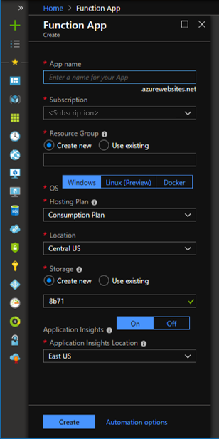
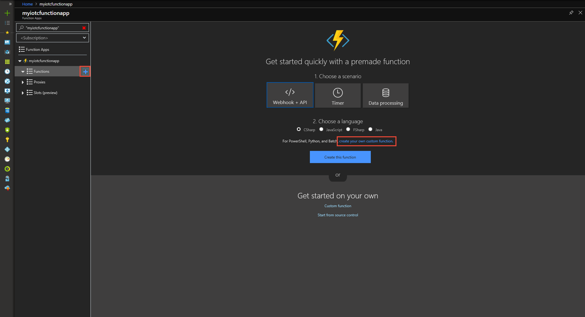
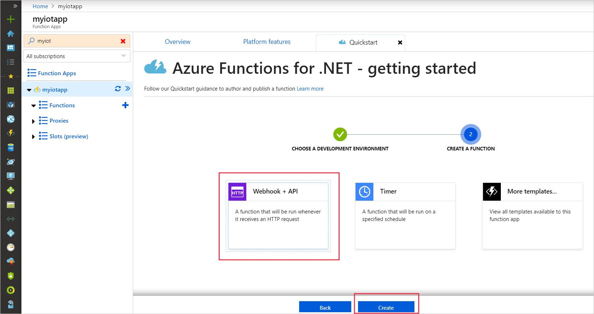
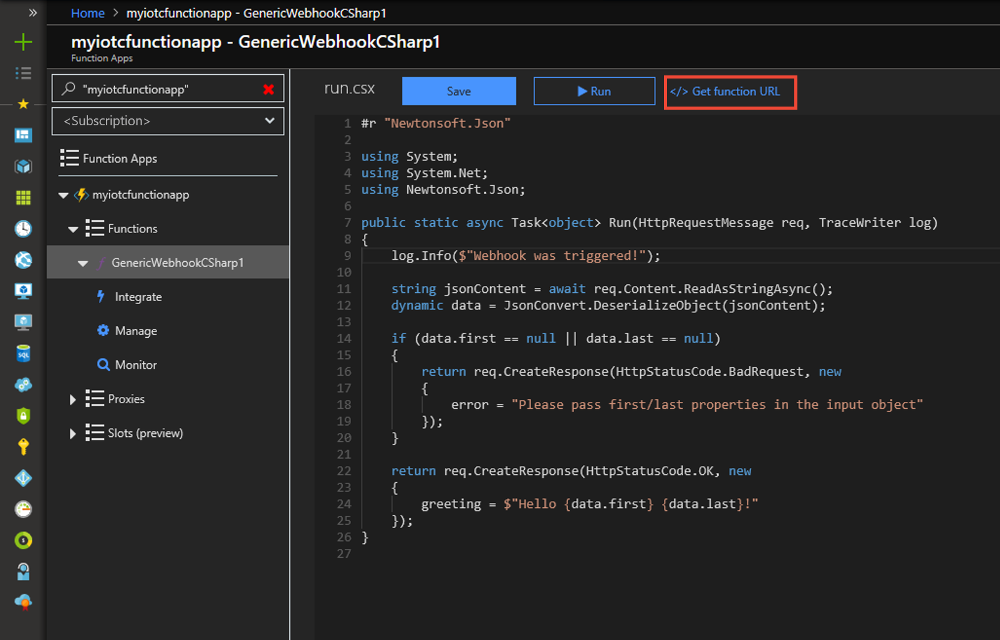

# Trigger Azure Functions using webhooks in Azure IoT Central

*This topic applies to builders and administrators.*

Use Azure Functions to run serverless code on the webhook output from IoT Central rules. You don't have to provision a VM or publish a web app to use Azure Functions, but instead you can run this code serverlessly. Use Azure Functions to transform the webhook payload before sending it to its final destination such as a SQL database or Event Grid. 

## Prerequisites
+ If you don't have an Azure subscription, create a [free account](https://azure.microsoft.com/free/?WT.mc_id=A261C142F) before you begin.

## How to connect Azure Functions

1. [Create a new function app in the Azure Portal.](https://ms.portal.azure.com/#create/Microsoft.FunctionApp​).

    

2. Expand your function app and click the **+ button** next to Functions. If this function is the first one in your function app, select **Custom function**. This displays the complete set of function templates.
    
    

3. In the search field, type **"generic"** and then choose your desired language for the generic webhook trigger template. This topic uses a C# function. 

    

4. In your new function, click **</> Get function URL**, then copy and save the value. You will use this value to configure the webhook. 

    
4. In IoT Central, navigate to the rule that you want to connect to your function app.

5. Add a webhook action. Enter a **Display name** and paste in the function URL you copied earlier into **Callback URL**.

    

6. Save the rule. Now when the rule is triggered, the webhook will invoke the function app to run. In your function app, you can click **Monitor** to see the function's invocation history. You can use App Insights or the classic view to look at the history.

    

For more information, visit the Azure Functions article about [creating a function triggered by a generic webhook](https://docs.microsoft.com/azure/azure-functions/functions-create-generic-webhook-triggered-function). 

## Next steps
Now that you have learned how to set up and use webhooks, the suggested next step is to explore [building workflows in Microsoft Flow](howto-add-microsoft-flow.md).
