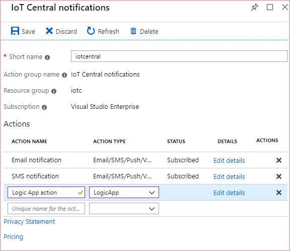
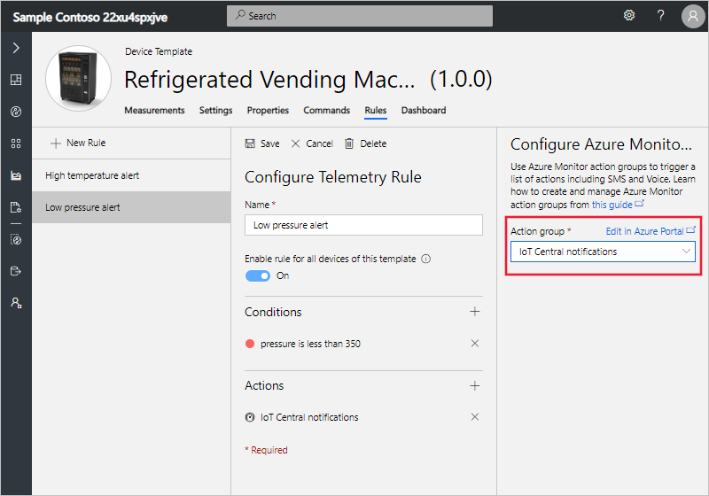
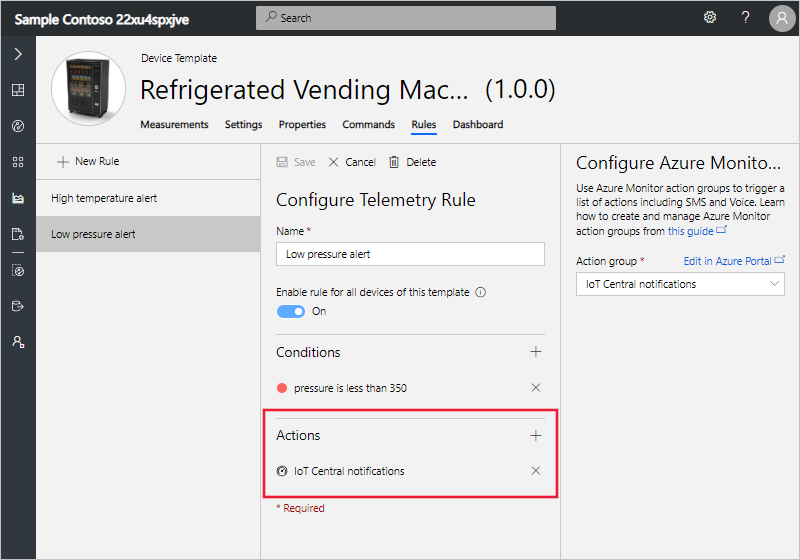

# Group multiple actions to run from one or more rules

*This article applies to builders and administrators.*

In Azure IoT Central, you create rules to run actions when a condition is met. Rules are based on device telemetry or events. For example, you can notify an operator when the temperature in a device exceeds a threshold. This article describes how to use [Azure Monitor](../azure-monitor/overview.md) *action groups* to attach multiple actions to an IoT Central rule. You can attach an action group to multiple rules. An [action group](../azure-monitor/platform/action-groups.md) is a collection of notification preferences defined by the owner of an Azure subscription.

## Prerequisites

- A Pay-As-You-Go application
- An Azure account and subscription to create and manage Azure Monitor action groups

## Create action groups

You can [create and manage action groups in the Azure portal](../azure-monitor/platform/action-groups.md) or with an [Azure Resource Manager template](../azure-monitor/platform/action-groups-create-resource-manager-template.md).

An action group can:

- Send notifications such as an email, an SMS, or make a voice call.
- Run an action such as calling a webhook.

The following screenshot shows an action group that sends email and SMS notifications and calls a webhook:



To use an action group in an IoT Central rule, the action group must be in the same Azure subscription as the IoT Central application.

## Use an action group

To use an action group in your IoT Central application, first create a telemetry or event rule. When you add an action to the rule, select **Azure Monitor Action Groups**:


Choose an action group from your Azure subscription:



Select **Save**. The action group now appears in the list of actions to run when the rule is triggered:



The following table summarizes the information sent to the supported action types:

| Action type | Output format |
| ----------- | -------------- |
| Email       | Standard IoT Central email template |
| SMS         | Azure IoT Central alert: ${applicationName} - "${ruleName}" triggered on "${deviceName}" at ${triggerDate} ${triggerTime} |
| Voice       | Azure I.O.T Central alert: rule "${ruleName}" triggered on device "${deviceName}" at ${triggerDate} ${triggerTime}, in application ${applicationName} |
| Webhook     | { "schemaId" : "AzureIoTCentralRuleWebhook", "data": {[regular webhook payload](#payload)} } |

The following text is an example SMS message from an action group:

`iotcentral: Azure IoT Central alert: Sample Contoso 22xu4spxjve - "Low pressure alert" triggered on "Refrigerator 2" at March 20, 2019 10:12 UTC`

<a id="payload"></a>
The following JSON shows an example webhook action payload:

```json
{
  "schemaId":"AzureIoTCentralRuleWebhook",
  "data":{
    "id":"97ae27c4-17c5-4e13-9248-65c7a2c57a1b",
    "timestamp":"2019-03-20T10:53:17.059Z",
    "rule":{
      "id":"031b660e-528d-47bb-b33d-f1158d7e31bf",
      "name":"Low pressure alert",
      "enabled":true,
      "deviceTemplate":{
        "id":"c318d580-39fc-4aca-b995-843719821049",
        "version":"1.0.0"
      }
    },
    "device":{
      "id":"2383d8ba-c98c-403a-b4d5-8963859643bb",
      "name":"Refrigerator 2",
      "simulated":true,
      "deviceId":"2383d8ba-c98c-403a-b4d5-8963859643bb",
      "deviceTemplate":{
        "id":"c318d580-39fc-4aca-b995-843719821049",
        "version":"1.0.0"
      },
      "measurements":{
        "telemetry":{
           "pressure":343.269190673549
        }
      }
    },
    "application":{
      "id":"8e70742b-0d5c-4a1d-84f1-4dfd42e61c7b",
      "name":"Sample Contoso",
      "subdomain":"sample-contoso"
    }
  }
}
```

## Next steps

Now that you've learned how to use action groups with rules, the suggested next step is to learn how to [manage your devices](howto-manage-devices.md).
