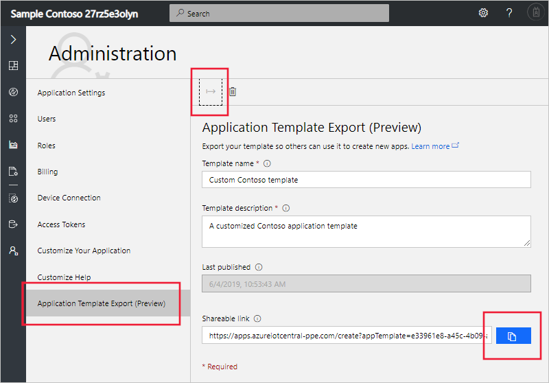

# Use application templates

This article describes how, as a solution manager, to create and use application templates.

When you create an Azure IoT Central application, you have a choice of built-in sample templates. You can also create your own application templates from existing IoT Central applications. You can then use your own application templates when you create new applications.

When you create an application template, it includes the following items from your existing application:

- The default application dashboard, including the dashboard layout and all the tiles you've defined.
- Device templates, including measurements, settings, properties, commands, and dashboard.
- Rules. All rule definitions are included. However actions, except for email actions, aren't included.
- Device sets, including their conditions and dashboards.

> [!WARNING]
> If a dashboard includes tiles that display information about specific devices, then those tiles show **The requested resource was not found** in the new application. You must reconfigure these tiles to display information about devices in your new application.

When you create an application template, it doesn't include the following items:

- Devices
- Users
- Job definitions
- Continuous data export definitions

Add these items manually to any applications created from an application template.

## Create an application template

To create an application template from an existing IoT Central application:

1. Go to the **Administration** section in your application.
1. Select **Application Template Export**.
1. On the **Application Template Export** page, enter a name and description for your template.
1. Select the **Export** button to create the application template. You can now copy the **Shareable Link** that enables someone to create a new application from the template:

## Use an application template

To use an application template to create a new IoT Central application, you need a previously created **Shareable Link**. Paste the **Shareable Link** into your browser's address bar. The **Create an application** page displays with your custom application template selected:

Select your payment plan and fill out the other fields on the form. Then select **Create** to create a new IoT Central application from the application template.

## Manage application templates

On the **Application Template Export** page, you can delete or update the application template.

If you delete an application template, you can no longer use the previously generated shareable link to create new applications.

To update your application template, change the template name or description on the **Application Template Export** page. Then select the **Export** button again. This action generates a new **Shareable link** and invalidates any previous **Shareable link** URL.

## Next steps

Now that you've learned how to use application templates, the suggested next step is to learn how to [Manage IoT Central from the Azure portal](howto-manage-iot-central-from-portal.md)
