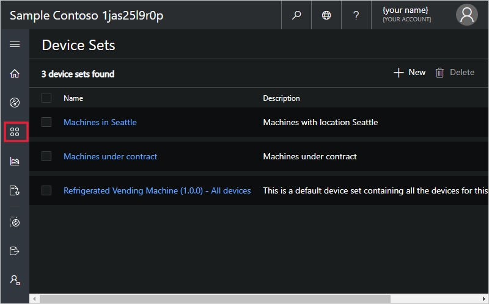
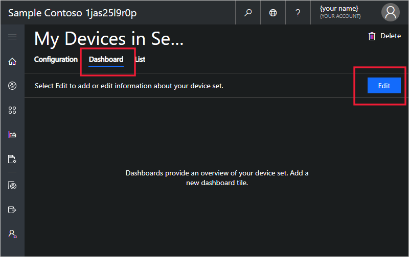
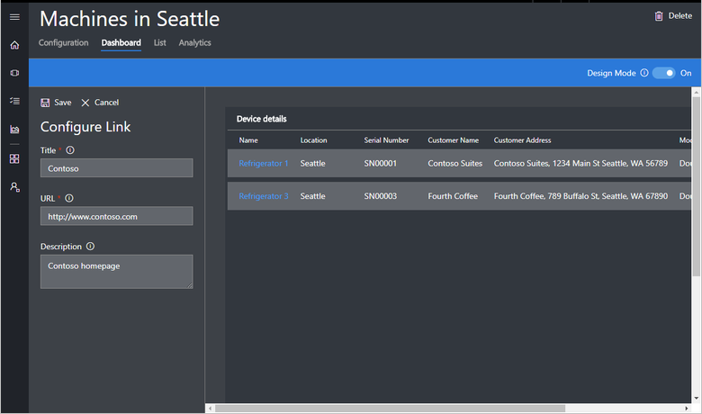
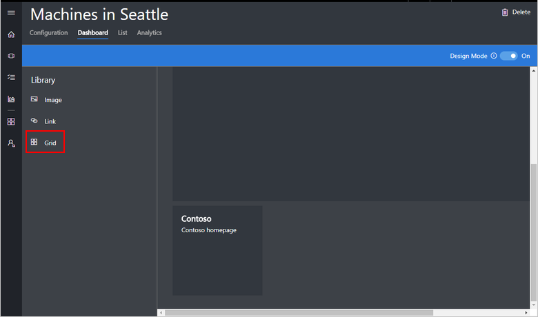
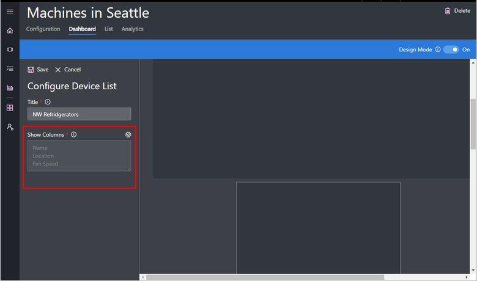
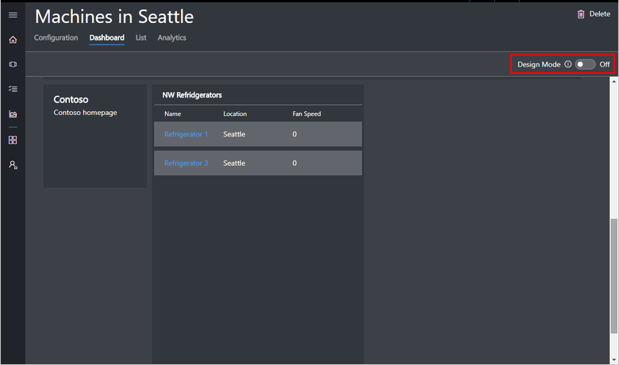
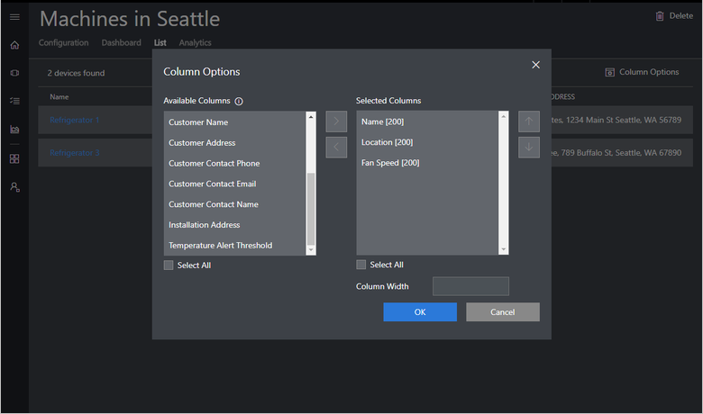

# Use device sets in your Azure IoT Central application

This article describes how, as an operator, to use device sets in your Microsoft Azure IoT Central application.

A device set is a list of devices that are grouped together because they all match some specified criteria. Device sets help you manage, visualize, and analyze devices at scale by grouping devices into smaller, logical groups. For example, you create a list of all the air conditioner devices in Seattle to enable the Seattle technician to find all the devices for which she is responsible. This article shows you how to create and configure device sets.

## Create a device set

To create a device set:

1. Choose **Device Sets** on the left navigation menu.

1. Click **+ New**.

    

1. Give your device set a name that is unique across the entire application. You can also add a description. A device set can only contain devices from a single device template. Choose the device template to use for this set.

1. Create the query to identify the devices for the device set by selecting a property, a comparison operator, and a value. You can add multiple queries and devices that meet **all** the criteria are placed in the device set. The device set you create is accessible to anyone who has access to the application, so anyone can view, modify, or delete the device set.

    

    > [!NOTE]
    > The device set is a dynamic query. Every time you view the list of devices, there may be different devices in the list. The list depends on which devices currently meet the criteria of the query.

1. Choose **Save**.

## Configure the Dashboard for your device set

After you create your device set, you can configure its **Dashboard**. The **Dashboard** is the homepage where you can place images and links. You can also add grids that list the devices in the device set.

1. Choose **Device Sets** on the left navigation menu.

1. Choose the **Dashboard** tab.

1. Click **Edit Template**.

    

1. For information about adding an image, see [Prepare and upload images to your Azure IoT Central application](howto-prepare-images.md).

1. Add a link tile:
    1. Choose **Link** on the right pane.
    1. Give your link a **Title**.
    1. Choose a URL to be opened when the link is clicked.
    1. Give your link a description that shows below the **Title**.
    1. Choose **Save**.

        

    1. You can move and resize the link tile on the **Dashboard**.

1. Add a grid. A grid is a table of devices in the device set with the columns you choose.
    1. Choose **Grid** on the right pane.

        

    1. Give your grid a **Title**.
    1. Select the columns to be shown by choosing the settings button. In the panel that pops up, choose the column you want shown and choose the right arrow to select it.
    1. Choose **OK**.
    1. Choose **Save**.

        

    1. Drag and drop the grid to place it on the **Dashboard**.

    > [!NOTE]
    > You can add multiple images, links, and grids.
  
    1. Click **Done**.

    

### Configuring Location Map in your device sets dashboard 
You can add a location map to visualize location of your devices sets in a Map.

In order to add a location map to you device sets dashboard you must have configured location property in your Device template, see [Create a Location Property powered by Azure Maps](howto-set-up-template.md).

1. On your Device Set Dashboard, select Map from the library.

    

2. Give a title and choose the location property you have previously configured as part of your Device Property.
3. Save and you will see the map tile displaying the location of your devices in the Device Set.
4. Now when an operator views the device sets dashboard, she can see all the tiles you have configured including the location Map to visualize all the devices location at a glance! 
    
[!NOTE] You will be able to resize the map to your desired size. Clicking on a pin in the map will display the device information, name and location. You can click on the pop-up to go to the device property page.  

## Configure the List for your device set

After you create your device set, you can configure the **List**. The **List** shows all the devices in the device set in a table with the columns you choose.

1. Choose **Device Sets** on the left navigation menu.

1. Choose the **List** tab.

1. Choose **Column Options**.

    

1. Choose the columns to be shown by selecting the column you want to show and choosing the right arrow to select it.

    

1. Choose **OK**.

## Analytics

The analytics in device sets is the same as the main analytics tab in the left navigation menu. You can learn more about analytics in the article on [how to create analytics](howto-create-analytics.md).

## Next steps

Now that you have learned how to use device sets in your Azure IoT Central application, here is the suggested next step:

> [!div class="nextstepaction"]
> [How to create telemetry rules](howto-create-telemetry-rules.md)
