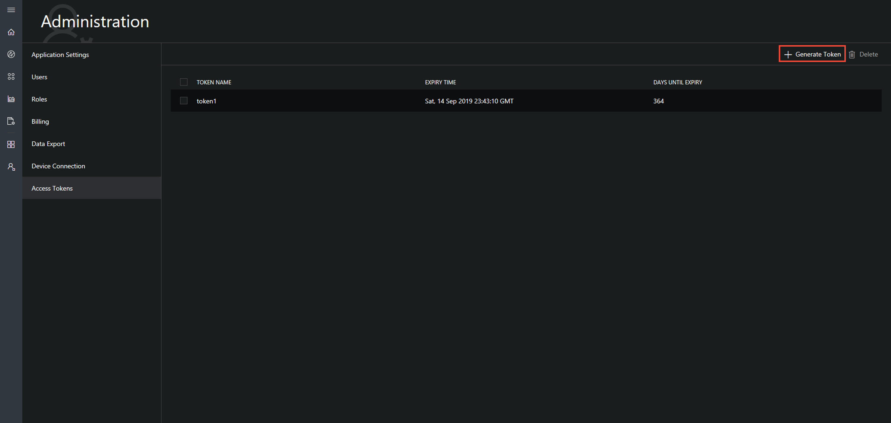
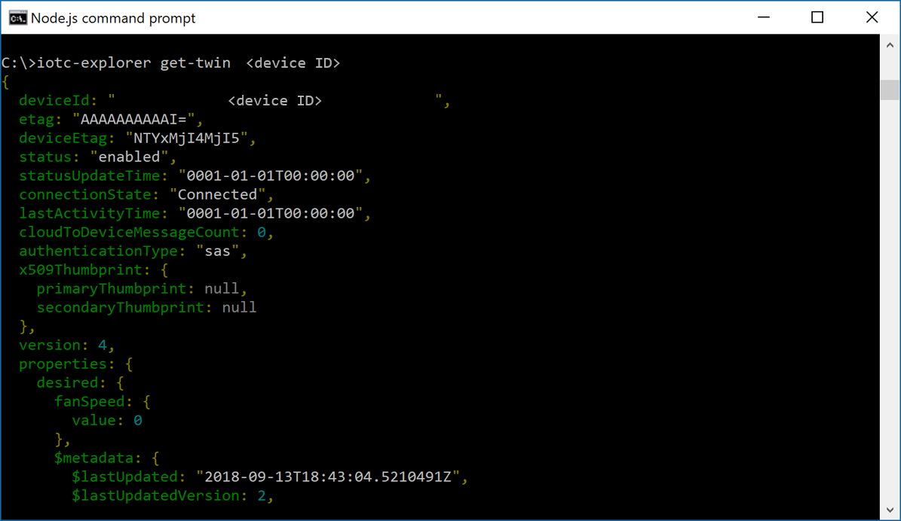

# Monitor device connectivity using the Azure IoT Central Explorer

*This topic applies to builders and administrators.*

Use the IoT Central Explorer CLI to see messages your devices are sending to IoT Central and observe changes in the IoT Hub twin. You can use this open-source tool to gain deeper insight into the state of device connectivity and diagnose issues of device messages not reaching the cloud or devices not responding to twin changes.

## [Visit the iotc-explorer repo in GitHub](https://aka.ms/iotciotcexplorercligithub)

## Prerequisites
+ Node.js version 8.x or higher - https://nodejs.org
+ You will need to get an administrator of your app to generate an access token for you to use in iotc-explorer

## Installing iotc-explorer

Run the following command from your command line to install:

```
npm install -g iotc-explorer
```

> [!NOTE]
> You will typically need to run the install command with `sudo` in Unix-like environments.

## Running iotc-explorer

Below are some commands and common options that you can run when using
`iotc-explorer`. To view the full set of commands and options, you can pass
`--help` to `iotc-explorer` or any of its subcommands.

### Login

Before you get going, you need to have an administrator of your IoT Central application to get an access token for you to use. The administrator takes the following steps:
1. Go to **Administration/Access Tokens**. 
1. Click **Generate**.


1. Enter a Token name, click **Next**, and **copy the Token value**.
    > [!NOTE]
    > The token value will only be shown once, so it must be copied before closing the dialog. After closing the dialog, it will never be shown again.

    

You can then use that token to log in to the CLI by running:

```sh
iotc-explorer login "<Token value>"
```

If you would rather not have the token persisted in your shell history, you can
leave the token out and instead provide it when prompted:

```
iotc-explorer login
```

### Monitor device messages

You can watch the messages coming from either a specific device or all devices
in your application using the `monitor-messages` command. This will start a
watcher that will continuously output new messages as they come in.

To watch all devices in your application, run the following command:

```
iotc-explorer monitor-messages
```
Output:


To watch a specific device, just add the Device ID to the end of the command:

```
iotc-explorer monitor-messages <your-device-id>
```

You can also have the command output a more machine-friendly format by adding
the `--raw` option to the command:

```
iotc-explorer monitor-messages --raw
```

### Get device twin

You can use the `get-twin` command to get the contents of the twin for an IoT
Central device. To do so, run the following command:

```
iotc-explorer get-twin <your-device-id>
```

Output:


As with `monitor-messages`, you can get a more machine-friendly output by
passing the `--raw` option:

```
iotc-explorer get-twin <your-device-id> --raw
```

## Next steps
Now that you have learned how to use the IoT Central Explorer, the suggested next step is to explore [managing devices IoT Central](howto-manage-devices.md).
