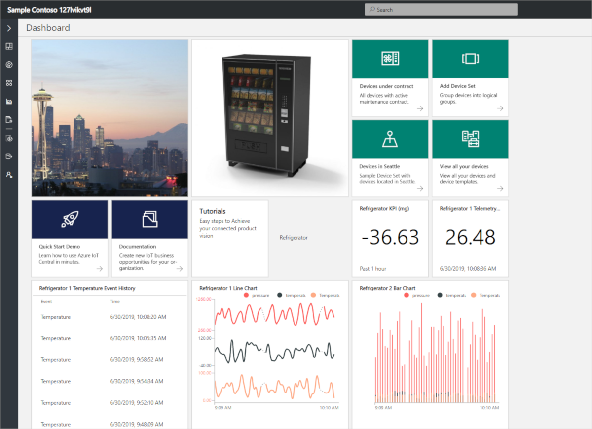

# How to use Tiles
You can use tiles to customize application dashboards, device dashboards, and device set dashboards. You can add multiple tiles to a dashboard and customize those tiles to show information relevant to your application. You can also resize tiles, and customize the layout on any dashboard. The below screenshot shows the application dashboard with different tiles.

The following table summarizes the usage of tiles in Azure IoT Central Application:

 
| Tile | Dashboard | Description
| ----------- | ------- | ------- |
| Link | Application and device set dashboards |Use a Link tile to display a link tile with description relevant to your application. |
| Image | Application and device set dashboards |Use an Image tile to display an image with url relevant to your application.|
| Label | Application dashboards |Use a label tile to display a label on the dashboard.|
| Map | Application and device set dashboards |Use a Map tile to display map with a Location Property, state measurement for a  device instance.|
| Line Chart | Application and device dashboards |Use a Line chart tile to display line chart of an aggregate measurements for a time period.|
| Bar Chart | Application and device dashboards |Use a bar chart tile to display bar chart of an aggregate measurements for a time period.|
| Event History | Application and device dashboards |Use an Event History tile to display the events occurred for a given measurement over a time period.|
| State History | Application and device dashboards |Use a State History tile to display the different states of a measurement for a time period.|
| KPI | Application and device dashboards |Use a KPI tile to display an aggregate telemetry or event measurement for a time period.|
| Last Known Value | Application and device dashboards |Use a Last known Value tile to display the last known value for a  telemetry or state measurement.|
| Device Set Grid | Application and Device set dashboards |Use a Device Set Grid tile to display information about the device set with selected fields.|

To learn more about how to configure dashboard in your Azure IoT Central application, see [Configure application dashboard](howto-configure-homepage.md).
