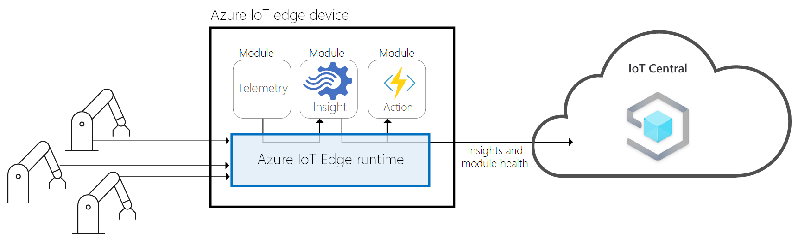

# What is Azure IoT Central Edge (preview features)?

[!INCLUDE [iot-central-pnp-original](../../includes/iot-central-pnp-original-note.md)]

> [!WARNING]
> The [IoT Plug and Play](../iot-pnp/overview-iot-plug-and-play.md) and IoT Edge capabilities in Azure IoT Central are currently in public preview. Don't use an IoT Plug and Play enabled IoT Central application for production workloads. For production environments use an IoT central application created from a current, generally available, application template.Edge capabilities in IoT Central are only available in public preview. 

Azure IoT Central is a fully managed IoT software-as-a-service solution that makes it easy to create products that connect the physical and digital worlds. IoT Central is expanding its portfolio by supporting Azure IoT Edge devices. 

Businesses can now run cloud intelligence directly on IoT devices at the edge managed by Azure IoT Central. This new feature helps businesses connect and manage Edge devices running Azure IoT Edge runtime, deploy edge software modules, publish insights, and take actions at-scale – all from within IoT Central. 

> [!div class="nextstepaction"]
> [Click here for Azure IoT Edge Overview](https://docs.microsoft.com/en-us/azure/iot-edge/about-iot-edge)

This article provides an overview of the edge and gateway features of Azure IoT Central:

- The typical personas associated with a project.
- Overview of IoT Edge capabilities in IoT Central
- How to create your application.
- How to connect your Azure IoT Edge runtime powered devices to your application.
- How to manage your application.

## Known issues

> [!Note]
> These known issues only apply to the IoT Central Preview application.

- Rules don't support all actions (only email).
- For complex types - rules, analytics, and device groups aren't supported.
- Continuous data export doesn't support the Avro format (incompatibility).
- Simulated devices don't support all complex types.
- GeoJSON isn't currently supported.
- Map tile isn't currently supported.
- Jobs don't support complex types.
- Array schema types aren't supported.
- Application template export and application copy aren't supported.
- Only the C device SDK and the Node.js device and service SDKs are supported.
- It's only available the north Europe and central US regions.
- Device capability models must have all the interfaces defined inline in the same file.
- Simulated Devices within IoT Central do not work for Edge templates

## Personas

The Azure IoT Central documentation refers to four personas who interact with an Azure IoT Central application:

- A _builder_ is responsible for defining the types of devices that connect to the application and customizing the application for the operator.
- An _operator_ manages the devices connected to the application.
- An _administrator_ is responsible for administrative tasks such as managing users and roles within the application.
- A _device/module developer_ creates the code/module that runs on a device connected to your application.

## Overview of IoT Edge capabilities in IoT Central

The Azure IoT Edge runtime enables custom and cloud logic on IoT Edge devices. IoT Edge device is powered by the runtime, and performs management and communication operations. 

Azure IoT Edge runtime performs following functions:

- Install and update workloads on the device.
- Maintain Azure IoT Edge security standards on the device.
- Ensure that IoT Edge modules are always running.
- Report module health to the cloud for remote monitoring.
- Manage communication between downstream leaf devices and an IoT Edge device, between modules on an IoT Edge device, and between an IoT Edge device and the cloud.

Azure IoT Central performs the following functions: 

- Azure IoT Edge device template support that describes the capabilities an edge device should implement such as 
  1. deployment manifest upload capability which will help manage a manifest for a fleet of devices
  2. modules which will run on the edge device, 
  3. telemetry each module sends, 
  4. properties each module reports and 
  5. command each module responds to
  6. Establish relationships between Azure IoT Edge gateway device capability model and downstream device capability model
  7. Cloud properties that are not stored on the edge device
  8. Customizations, dashboards, and forms that are part of your IoT Central application
  
    >  [!div class="nextstepaction"]
    > [Click here to Create Azure IoT Edge Device template](./tutorial-define-edge-as-leaf-device-type-pnp.md)
 
- Provisioning Azure IoT Edge devices at scale using Azure IoT device provisioning service
- Trigger rules and take actions on Azure IoT Edge devices
- Build dashboards and analytics 
- Continuous data export of telemetry flowing from Edge devices

## Azure IoT Edge Device Types in IoT Central

Azure IoT Central classifies Azure IoT Edge device types as follows:

- Azure IoT Edge device as a leaf device. Edge device could have downstream devices, but downstream devices are not provisioned in IoT Central
- Azure IoT Edge device as a gateway device with downstream devices. Both Edge gateway device and downstream devices are provisioned in IoT Central

You can quickly deploy a new Azure IoT Central application and then customize it to your specific requirements in your browser. As a builder, you use the web-based tools to create a _device template_ for the devices that connect to your application. A device template is the blueprint that defines the characteristics and behavior of a type of device such as the:

- Telemetry it sends.
- Business properties that an operator can modify.
- Device properties that are set by a device and are read-only in the application.
- Properties set by an operator that determine the behavior of the device.

This device template includes:

- A _device capability model_ that describes the capabilities a device should implement such as the telemetry it sends and the properties it reports.
- Cloud properties that are not stored on the device.
- Customizations, dashboards, and forms that are part of your IoT Central application.

### Create device templates

[IoT Plug and Play](../iot-pnp/overview-iot-plug-and-play.md) enables IoT Central to integrate devices without you writing any embedded device code. At the core of IoT Plug and Play is a device capability model schema that describes device capabilities. In an IoT Central Preview application, device templates use these IoT Plug and Play device capability models.

As a builder, you have several options for creating device templates:

- Design the device template in IoT Central and then implement its device capability model in your device code.
- Import a device capability model from the [Azure Certified for IoT device catalog](https://aka.ms/iotdevcat) and then add any cloud properties, customizations, and dashboards your IoT Central application needs.
- Create a device capability model using Visual Studio code. Implement your device code from the model, and connect your device to your IoT Central application. IoT Central finds the device capability model from a repository and creates a simple device template for you.
- Create a device capability model using Visual Studio code. Implement your device code from the model. Manually import the device capability model into your IoT Central application and then add any cloud properties, customizations, and dashboards your IoT Central application needs.

As a builder, you can use IoT Central to generate code for test devices to validate your device templates.

### Customize the UI

As a builder, you can also customize the Azure IoT Central application UI for the operators who are responsible for the day-to-day use of the application. Customizations that a builder can make include:

- Defining the layout of properties and settings on a device template.
- Configuring custom dashboards to help operators discover insights and resolve issues faster.
- Configuring custom analytics to explore time series data from your connected devices.

## Connect your devices

After the builder defines the types of devices that can connect to the application, a device developer creates the code to run on the devices. As a device developer, you use Microsoft's open-source [Azure IoT SDKs](https://github.com/Azure/azure-iot-sdks) to create your device code. These SDKs have broad language, platform, and protocol support to meet your needs to connect your devices to your Azure IoT Central application. The SDKs help you implement the following device capabilities:

- Create a secure connection.
- Send telemetry.
- Report status.
- Receive configuration updates.

For more information, see the blog post [Benefits of using the Azure IoT SDKs, and pitfalls to avoid if you don't](https://azure.microsoft.com/blog/benefits-of-using-the-azure-iot-sdks-in-your-azure-iot-solution/).

## Manage your application

Azure IoT Central applications are fully hosted by Microsoft, which reduces the administration overhead of managing your applications.

As an operator, you use the Azure IoT Central application to manage the devices in your Azure IoT Central solution. Operators do tasks such as:

- Monitoring the devices connected to the application.
- Troubleshooting and remediating issues with devices.
- Provisioning new devices.

As a builder, you can define custom rules and actions that operate over data streaming from connected devices. An operator can enable or disable these rules at the device level to control and automate tasks within the application.

Administrators manage access to your application with [user roles and permissions](howto-administer-pnp.md?toc=/azure/iot-central-pnp/toc.json&bc=/azure/iot-central-pnp/breadcrumb/toc.json).

## Next steps

Now that you have an overview of Azure IoT Central, here are suggested next steps:

- Understand the differences between [Azure IoT Central and Azure IoT solution accelerators](overview-iot-options.md?toc=/azure/iot-central-pnp/toc.json&bc=/azure/iot-central-pnp/breadcrumb/toc.json).
- Familiarize yourself with the [Azure IoT Central UI](overview-iot-central-tour-pnp.md?toc=/azure/iot-central-pnp/toc.json&bc=/azure/iot-central-pnp/breadcrumb/toc.json).
- Get started by [creating an Azure IoT Central application](quick-deploy-iot-central-pnp.md?toc=/azure/iot-central-pnp/toc.json&bc=/azure/iot-central-pnp/breadcrumb/toc.json).
- Follow a sequence of tutorials that show you how to:
  - [As a builder, to create a device template](tutorial-define-device-type-pnp.md?toc=/azure/iot-central-pnp/toc.json&bc=/azure/iot-central-pnp/breadcrumb/toc.json)
  - [As a builder, add rules to automate your solution](tutorial-configure-rules-pnp.md?toc=/azure/iot-central-pnp/toc.json&bc=/azure/iot-central-pnp/breadcrumb/toc.json)
  - [As an operator, monitor your devices](tutorial-monitor-devices-pnp.md?toc=/azure/iot-central-pnp/toc.json&bc=/azure/iot-central-pnp/breadcrumb/toc.json)
  - [As an operator, add a device to your solution](tutorial-add-device-pnp.md?toc=/azure/iot-central-pnp/toc.json&bc=/azure/iot-central-pnp/breadcrumb/toc.json)
- Learn more about [IoT Plug and Play](../iot-pnp/overview-iot-plug-and-play.md)
